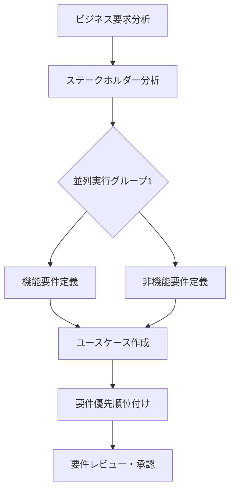

# 要件定義エージェント実行ガイド

このディレクトリには、Webアプリケーションの要件定義を行うための専門エージェントが含まれています。各エージェントは特定の要件定義領域を担当し、定められた順序で実行されます。

## 実行フロー図



## エージェント一覧と実行順序

### 1. ビジネス要求分析（実行順序: 1）

- **エージェント**: `business-requirements-analyzer`
- **依存関係**: なし（最初に実行）
- **役割**: ビジネス要件の抽出・分析・文書化を行い、後続の要件定義の基盤を確立

### 2. ステークホルダー分析（実行順序: 2）

- **エージェント**: `stakeholder-analysis`
- **依存関係**: `business-requirements-analyzer`
- **役割**: プロジェクトに関わるすべてのステークホルダーを特定・分析し、エンゲージメント戦略を策定

### 3. 並列実行グループ1（実行順序: 3）

以下の2つのエージェントは並列実行可能です。

#### 3.1 機能要件定義

- **エージェント**: `feature-requirements-definer`
- **依存関係**: `stakeholder-analysis`
- **役割**: 機能要件の詳細定義、受け入れ基準の作成、技術仕様の明確化

#### 3.2 非機能要件定義

- **エージェント**: `non-functional-requirements-definer`
- **依存関係**: `stakeholder-analysis`
- **役割**: パフォーマンス、セキュリティ、スケーラビリティなどの品質属性の定義

### 4. ユースケース作成（実行順序: 4）

- **エージェント**: `use-case-creator`
- **依存関係**:
  - `feature-requirements-definer`
  - `non-functional-requirements-definer`
- **役割**: 詳細なユースケース文書の作成、アクターとシナリオの定義

### 5. 要件優先順位付け（実行順序: 5）

- **エージェント**: `requirements-prioritizer`
- **依存関係**: `use-case-creator`
- **役割**: ビジネス価値と技術的複雑性に基づく要件の優先順位付け

### 6. 要件レビュー・承認（実行順序: 6）

- **エージェント**: `requirements-review-approval`
- **依存関係**: `requirements-prioritizer`
- **役割**: 全要件文書の品質チェック、整合性確認、承認プロセスの管理

## 実行方法

### 順次実行の例

```bash
# 1. ビジネス要求分析
Task tool --agent business-requirements-analyzer

# 2. ステークホルダー分析
Task tool --agent stakeholder-analysis

# 3. 並列実行グループ1（2つ同時実行）
Task tool --agent feature-requirements-definer &
Task tool --agent non-functional-requirements-definer &
wait

# 4. ユースケース作成
Task tool --agent use-case-creator

# 5. 要件優先順位付け
Task tool --agent requirements-prioritizer

# 6. 要件レビュー・承認
Task tool --agent requirements-review-approval
```

## 各エージェントの成果物

### 成果物ファイル命名規則

**重要**: 成果物のファイル名には必ず項番を付けてください。

- 形式: `[カテゴリ番号]-[連番]_[ファイル名].md`
- 例: `01-01_functional-requirements.md`

### 成果物一覧

1. **business-requirements-analyzer**
   - ビジネス要件分析レポート
   - ステークホルダーマップ
   - 受け入れ基準一覧

2. **stakeholder-analysis**
   - ステークホルダーレジスタ
   - 力/関心マトリックス
   - エンゲージメント計画

3. **feature-requirements-definer**
   - `01-01_functional-requirements.md` - 機能要件定義書
   - `01-02_user-stories.md` - ユーザーストーリー
   - `01-03_technical-specifications.md` - 技術仕様書

4. **non-functional-requirements-definer**
   - 非機能要件定義書
   - 品質属性マトリックス
   - パフォーマンス基準

5. **use-case-creator**
   - ユースケース仕様書
   - アクター定義
   - シナリオ詳細

6. **requirements-prioritizer**
   - `02-01_priority-matrix.md` - 優先度マトリックス
   - `02-02_implementation-roadmap.md` - 実装ロードマップ
   - `02-03_risk-register.md` - リスクレジスタ
   - `02-04_priority-summary.md` - 優先順位付けサマリー

7. **requirements-review-approval**
   - `03-01_PHASE1_FINAL_REVIEW_REPORT.md` - 統合レビューレポート
   - `03-02_APPROVAL_CHECKLIST.md` - 品質チェックリスト
   - `03-03_HANDOVER_TO_BASIC_DESIGN.md` - 承認文書

## 注意事項

- 各エージェントは前提となる成果物が完成してから実行してください。
- 並列実行グループ内のエージェントは同時実行可能ですが、グループ間では順序を守る必要があります。
- 要件レビュー・承認は必ず最後に実行し、全体の整合性を確認してください。
- 各エージェントの出力は後続のエージェントの入力となるため、確実に成果物を確認してから次に進んでください。

## トラブルシューティング

### 依存関係エラーが発生した場合

- 前提となるエージェントが正しく実行されているか確認
- 成果物が適切に生成されているか確認

### 並列実行でリソース競合が発生した場合

- 同時実行数を減らして順次実行に切り替える
- システムリソースを確認し、必要に応じて調整

### 最終レビューで不整合が発見された場合

- 該当するエージェントを再実行
- 必要に応じて依存するエージェントも再実行
- 要件変更が発生した場合は、影響範囲を確認して関連エージェントを再実行

## 次フェーズへの移行

要件レビュー・承認エージェントの完了により、要件定義フェーズが完了します。
次は基本設計フェーズ（02-Basic-Design）に移行してください。
