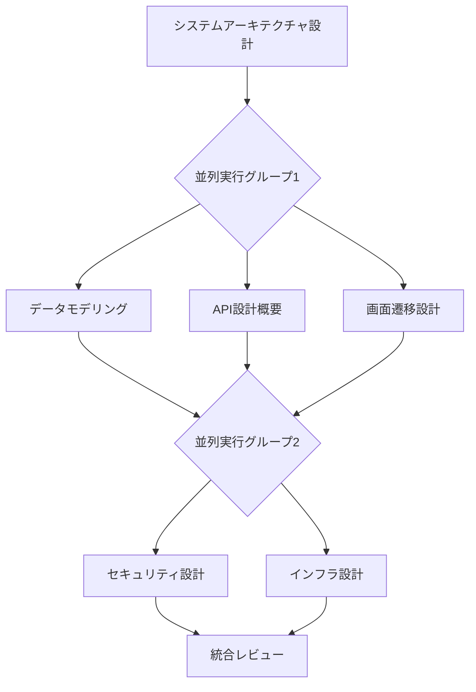

# 基本設計エージェント実行ガイド

このディレクトリには、Webアプリケーションの基本設計を行うための専門エージェントが含まれています。各エージェントは特定の設計領域を担当し、定められた順序で実行されます。

## 実行フロー図



## エージェント一覧と実行順序

### 1. システムアーキテクチャ設計（実行順序: 1）
- **エージェント**: `system-architecture-designer`
- **依存関係**: なし（最初に実行）
- **役割**: システム全体のアーキテクチャを設計し、後続の設計の基盤を確立

### 2. 並列実行グループ1（実行順序: 2）

以下の3つのエージェントは並列実行可能です。

#### 2.1 データモデリング
- **エージェント**: `data-modeling-architect`
- **依存関係**: `system-architecture-designer`
- **役割**: データベーススキーマとエンティティ関係の設計

#### 2.2 API設計
- **エージェント**: `api-design-architect`
- **依存関係**: `system-architecture-designer`
- **役割**: REST APIエンドポイントとリクエスト/レスポンススキーマの設計

#### 2.3 画面遷移設計
- **エージェント**: `screen-transition-designer`
- **依存関係**: `system-architecture-designer`
- **役割**: ユーザインターフェースのナビゲーションフローと画面遷移の設計

### 3. 並列実行グループ2（実行順序: 3）

以下の2つのエージェントは並列実行可能です。

#### 3.1 セキュリティ設計
- **エージェント**: `security-design-architect`
- **依存関係**: 
  - `data-modeling-architect`
  - `api-design-architect`
  - `screen-transition-designer`
- **役割**: 認証、認可、データ保護などのセキュリティアーキテクチャの設計

#### 3.2 インフラストラクチャ設計
- **エージェント**: `infrastructure-architect`
- **依存関係**: 
  - `data-modeling-architect`
  - `api-design-architect`
  - `screen-transition-designer`
- **役割**: クラウドインフラ、デプロイメント戦略、スケーリング設計

### 4. 統合レビュー（実行順序: 4）
- **エージェント**: `integration-review-specialist`
- **依存関係**: すべての設計エージェント
- **役割**: 全設計成果物の整合性と品質の統合的レビュー

## 実行方法

### 順次実行の例

```bash
# 1. システムアーキテクチャ設計
Task tool --agent system-architecture-designer

# 2. 並列実行グループ1（3つ同時実行）
Task tool --agent data-modeling-architect &
Task tool --agent api-design-architect &
Task tool --agent screen-transition-designer &
wait

# 3. 並列実行グループ2（2つ同時実行）
Task tool --agent security-design-architect &
Task tool --agent infrastructure-architect &
wait

# 4. 統合レビュー
Task tool --agent integration-review-specialist
```

## 各エージェントの成果物

1. **system-architecture-designer**
   - システムコンポーネント図
   - 技術スタック定義
   - アーキテクチャパターン

2. **data-modeling-architect**
   - ERD（エンティティ関係図）
   - データベーススキーマ
   - TypeScriptインターフェース

3. **api-design-architect**
   - APIエンドポイント仕様
   - リクエスト/レスポンススキーマ
   - OpenAPI仕様

4. **screen-transition-designer**
   - 画面遷移図
   - ナビゲーションフロー
   - UI状態管理仕様

5. **security-design-architect**
   - セキュリティアーキテクチャ図
   - 認証・認可フロー
   - 脅威モデル分析

6. **infrastructure-architect**
   - インフラアーキテクチャ図
   - デプロイメント設計
   - スケーリング戦略

7. **integration-review-specialist**
   - 統合レビューレポート
   - 改善提案リスト
   - 実装フェーズへの申し送り事項

## 注意事項

- 各エージェントは前提となる成果物が完成してから実行してください。
- 並列実行グループ内のエージェントは同時実行可能ですが、グループ間では順序を守る必要があります。
- 統合レビューは必ず最後に実行し、全体の整合性を確認してください。
- 各エージェントの出力は後続のエージェントの入力となるため、確実に成果物を確認してから次に進んでください。

## トラブルシューティング

### 依存関係エラーが発生した場合
- 前提となるエージェントが正しく実行されているか確認
- 成果物が適切に生成されているか確認

### 並列実行でリソース競合が発生した場合
- 同時実行数を減らして順次実行に切り替える
- システムリソースを確認し、必要に応じて調整

### 統合レビューで不整合が発見された場合
- 該当するエージェントを再実行
- 必要に応じて依存するエージェントも再実行