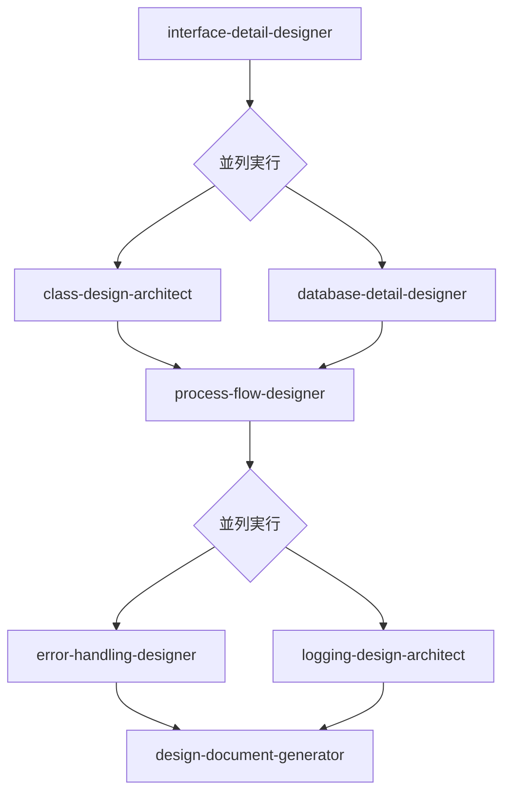

# 詳細設計エージェント実行順序ガイド

このディレクトリには、詳細設計フェーズで使用する7つのエージェントが含まれています。
以下のフローチャートに従って実行してください。

## 実行フローチャート



## 実行順序詳細

### 成果物ファイル命名規則
**重要**: 成果物のファイル名には必ず項番を付けてください。
- 形式: `[カテゴリ番号]-[連番]_[ファイル名].md`
- 例: `11-01_interface-detail.md`

### 1. インターフェース詳細設計（interface-detail-designer）

- **実行タイミング**: 最初に実行
- **前提条件**: 要件定義、ビジネス要求仕様の完了
- **成果物**: 
  - `11-01_api-specification.md` - API仕様
  - `11-02_data-exchange-format.md` - データ交換フォーマット
  - `11-03_external-system-integration.md` - 外部システム連携仕様

### 2. 並列実行フェーズ1

以下の2つのエージェントは並列で実行可能です：

#### 2a. クラス設計（class-design-architect）

- **前提条件**: インターフェース詳細設計の完了
- **成果物**: 
  - `12-01_class-structure.md` - クラス構造
  - `12-02_business-logic.md` - ビジネスロジック定義
  - `12-03_design-patterns.md` - デザインパターン適用

#### 2b. データベース詳細設計（database-detail-designer）

- **前提条件**: インターフェース詳細設計の完了
- **成果物**: 
  - `13-01_database-schema.md` - データベーススキーマ
  - `13-02_index-strategy.md` - インデックス戦略
  - `13-03_access-patterns.md` - アクセスパターン

### 3. 処理フロー設計（process-flow-designer）

- **実行タイミング**: クラス設計とデータベース設計の両方が完了後
- **前提条件**: クラス設計とデータベース設計の成果物
- **成果物**: 
  - `14-01_process-flow.md` - 処理フロー図
  - `14-02_data-transformation.md` - データ変換定義
  - `14-03_state-transition.md` - 状態遷移図

### 4. 並列実行フェーズ2

以下の2つのエージェントは並列で実行可能です：

#### 4a. エラーハンドリング設計（error-handling-designer）

- **前提条件**: 処理フロー設計の完了
- **成果物**: 
  - `15-01_error-handling-strategy.md` - エラーハンドリング戦略
  - `15-02_error-code-system.md` - エラーコード体系
  - `15-03_recovery-mechanism.md` - 回復メカニズム

#### 4b. ロギング設計（logging-design-architect）

- **前提条件**: 処理フロー設計の完了
- **成果物**: 
  - `16-01_logging-strategy.md` - ロギング戦略
  - `16-02_log-format.md` - ログフォーマット
  - `16-03_monitoring-spec.md` - モニタリング仕様

### 5. 設計ドキュメント生成（design-document-generator）

- **実行タイミング**: すべての詳細設計の完了後
- **前提条件**: 上記すべてのエージェントの成果物
- **成果物**: 
  - `17-01_integrated-design-document.md` - 統合設計ドキュメント
  - `17-02_implementation-guide.md` - 実装ガイド
  - `17-03_design-review-checklist.md` - 設計レビューチェックリスト

## 使用例

**階層化アーキテクチャ準拠の詳細設計フロー**:

```bash
# 1. 階層型構造を意識したインターフェース詳細設計
claude "階層化アーキテクチャ構造でAPIインターフェースを設計してください"

# 2. 階層型設計のクラス設計とデータベース設計を並列実行
claude "階層別の責任分離を考慮してクラス構造を設計してください"
claude "階層型構造に対応するデータベーススキーマを設計してください"

# 3. 層間のデータフロー処理設計
claude "階層間依存関係ルールに従って処理フローを設計してください"

# 4. 全層でのエラーハンドリングとロギング設計
claude "階層別のエラーハンドリング戦略を設計してください"
claude "階層型構造全体でのロギング戦略を設計してください"

# 5. 統合設計ドキュメント生成
claude "階層化準拠の詳細設計を実装に向けて統合してください"
```

## 並列実行の利点

- **効率性**: 独立したタスクを同時に実行することで、全体の設計時間を短縮
- **リソース活用**: 複数の設計者が同時に作業可能
- **早期フィードバック**: 並列実行により、問題を早期に発見・修正可能

## 注意事項

1. 各エージェントの前提条件を必ず満たしてから実行してください
2. 並列実行可能なエージェントでも、リソースや優先度に応じて順次実行も可能です
3. 各エージェントの出力は次のエージェントの入力となるため、品質確認を行ってください
