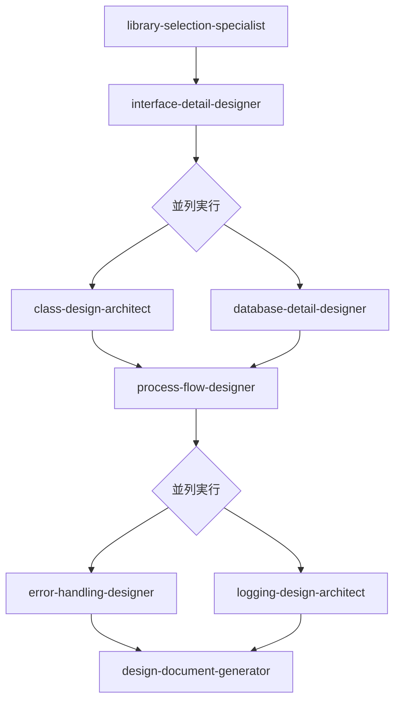

# 詳細設計エージェント実行順序ガイド

このディレクトリには、詳細設計フェーズで使用する8つのエージェントが含まれています。
以下のフローチャートに従って実行してください。

## 実行フローチャート



## 実行順序詳細

### 成果物ファイル命名規則
**重要**: 成果物のファイル名には必ず項番を付けてください。
- 形式: `[カテゴリ番号]-[連番]_[ファイル名].md`
- 例: `10-01_library-selection.md`

### 1. ライブラリ選定（library-selection-specialist）

- **実行タイミング**: 最初に実行
- **前提条件**: 基本設計の完了、技術要件の明確化
- **成果物**: 
  - `10-01_library-selection-report.md` - ライブラリ選定レポート
  - `10-02_technology-stack.md` - 技術スタック定義
  - `10-03_dependency-analysis.md` - 依存関係分析

### 2. インターフェース詳細設計（interface-detail-designer）

- **実行タイミング**: ライブラリ選定後
- **前提条件**: ライブラリ選定の完了、要件定義、ビジネス要求仕様の完了
- **成果物**: 
  - `11-01_api-specification.md` - API仕様
  - `11-02_data-exchange-format.md` - データ交換フォーマット
  - `11-03_external-system-integration.md` - 外部システム連携仕様

### 3. 並列実行フェーズ1

以下の2つのエージェントは並列で実行可能です：

#### 3a. クラス設計（class-design-architect）

- **前提条件**: インターフェース詳細設計の完了
- **成果物**: 
  - `12-01_class-structure.md` - クラス構造
  - `12-02_business-logic.md` - ビジネスロジック定義
  - `12-03_design-patterns.md` - デザインパターン適用

#### 3b. データベース詳細設計（database-detail-designer）

- **前提条件**: インターフェース詳細設計の完了
- **成果物**: 
  - `13-01_database-schema.md` - データベーススキーマ
  - `13-02_index-strategy.md` - インデックス戦略
  - `13-03_access-patterns.md` - アクセスパターン

### 4. 処理フロー設計（process-flow-designer）

- **実行タイミング**: クラス設計とデータベース設計の両方が完了後
- **前提条件**: クラス設計とデータベース設計の成果物
- **成果物**: 
  - `14-01_process-flow.md` - 処理フロー図
  - `14-02_data-transformation.md` - データ変換定義
  - `14-03_state-transition.md` - 状態遷移図

### 5. 並列実行フェーズ2

以下の2つのエージェントは並列で実行可能です：

#### 5a. エラーハンドリング設計（error-handling-designer）

- **前提条件**: 処理フロー設計の完了
- **成果物**: 
  - `15-01_error-handling-strategy.md` - エラーハンドリング戦略
  - `15-02_error-classification.md` - エラー分類体系
  - `15-03_monitoring-alerting.md` - モニタリング・アラート仕様

#### 5b. ロギング設計（logging-design-architect）

- **前提条件**: 処理フロー設計の完了
- **成果物**: 
  - `16-01_logging-strategy.md` - ロギング戦略
  - `16-02_structured-logging.md` - 構造化ログ仕様
  - `16-03_audit-logging.md` - 監査ログ仕様

### 6. 設計ドキュメント生成（design-document-generator）

- **実行タイミング**: すべての詳細設計の完了後
- **前提条件**: 上記すべてのエージェントの成果物
- **成果物**: 
  - `17-01_integrated-design-document.md` - 統合設計ドキュメント
  - `17-02_implementation-guide.md` - 実装ガイド
  - `17-03_design-review-checklist.md` - 設計レビューチェックリスト

## 使用例

**階層化アーキテクチャ準拠の詳細設計フロー**:

```bash
# 1. プロジェクトに適したライブラリとツールの選定
claude "プロジェクトの要件に基づいて適切なライブラリを選定してください"

# 2. 選定されたライブラリを考慮したインターフェース詳細設計
claude "選定されたライブラリを活用してAPIインターフェースを設計してください"

# 3. 階層型設計のクラス設計とデータベース設計を並列実行
claude "階層別の責任分離を考慮してクラス構造を設計してください"
claude "階層型構造に対応するデータベーススキーマを設計してください"

# 4. 層間のデータフロー処理設計
claude "階層間依存関係ルールに従って処理フローを設計してください"

# 5. 全層でのエラーハンドリングとロギング設計
claude "階層別のエラーハンドリング戦略を設計してください"
claude "階層型構造全体でのロギング戦略を設計してください"

# 6. 統合設計ドキュメント生成
claude "階層化準拠の詳細設計を実装に向けて統合してください"
```

## 並列実行の利点

- **効率性**: 独立したタスクを同時に実行することで、全体の設計時間を短縮
- **リソース活用**: 複数の設計者が同時に作業可能
- **早期フィードバック**: 並列実行により、問題を早期に発見・修正可能

## 注意事項

1. 各エージェントの前提条件を必ず満たしてから実行してください
2. 並列実行可能なエージェントでも、リソースや優先度に応じて順次実行も可能です
3. 各エージェントの出力は次のエージェントの入力となるため、品質確認を行ってください
