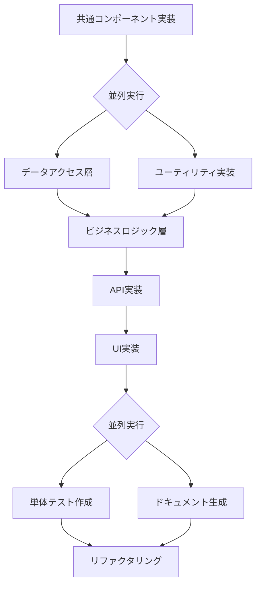

# 実装順序ガイド

このドキュメントは、Feature-Sliced Design (FSD) アーキテクチャに基づいたSvelteKitアプリケーションの実装順序とエージェントの使用方法を説明します。

## 実装フローチャート

## 実装フェーズと使用エージェント

### フェーズ1: 基盤構築
**目的**: プロジェクト全体で使用される共通要素を実装

1. **共通コンポーネント実装**
   - エージェント: `common-components-developer`
   - 実装内容: Button、Card、Form要素などの基本UIコンポーネント
   - 配置: `src/shared/ui/`

### フェーズ2: インフラストラクチャ層（並列実行可能）
**目的**: データ処理とユーティリティ機能の基盤を構築

2-A. **データアクセス層**
   - エージェント: `data-access-layer-developer`
   - 実装内容: Prismaスキーマ、リポジトリ、データベース接続
   - 配置: `src/lib/server/`, `prisma/`

2-B. **ユーティリティ実装**
   - エージェント: `utility-functions-developer`
   - 実装内容: 日付処理、フォーマッター、バリデーション関数
   - 配置: `src/shared/lib/`

### フェーズ3: ビジネスロジック層
**目的**: アプリケーションの中核となるビジネスルールを実装

3. **ビジネスロジック実装**
   - エージェント: `business-logic-developer`
   - 実装内容: 価格計算、在庫管理、ユーザー権限などのドメインロジック
   - 配置: `src/entities/*/model/`, `src/entities/*/lib/`
   - 前提条件: データアクセス層とユーティリティの完成

### フェーズ4: API層
**目的**: フロントエンドとバックエンドの通信インターフェースを構築

4. **API実装**
   - エージェント: `api-endpoint-developer`
   - 実装内容: SvelteKitのAPIルート（+server.ts）
   - 配置: `src/routes/api/`
   - 前提条件: ビジネスロジック層の完成

### フェーズ5: UI層
**目的**: ユーザーインターフェースを実装

5. **UI実装**
   - エージェント: `ui-component-developer`
   - 実装内容: ページ、機能別コンポーネント、ウィジェット
   - 配置: `src/features/`, `src/widgets/`, `src/routes/`
   - 前提条件: API層の完成

### フェーズ6: 品質保証（並列実行可能）
**目的**: コードの品質と保守性を確保

6-A. **単体テスト作成**
   - エージェント: `unit-test-writer`
   - 実装内容: Vitest、Testing Libraryを使用したテスト
   - 配置: `tests/unit/`

6-B. **ドキュメント生成**
   - エージェント: `documentation-writer`
   - 実装内容: API仕様、コンポーネントドキュメント、使用ガイド
   - 配置: `docs/`, コード内JSDoc

### フェーズ7: 最適化
**目的**: コードの品質向上と最適化

7. **リファクタリング**
   - エージェント: `code-refactoring-specialist`
   - 実装内容: コードの整理、パフォーマンス改善、重複削除

## 並列実行のガイドライン

### 並列実行可能な組み合わせ:
- データアクセス層 + ユーティリティ実装
- 単体テスト作成 + ドキュメント生成

### 並列実行の注意点:
- 同じファイルを編集する可能性がある作業は避ける
- 依存関係のない独立した機能から実装を開始
- Git ブランチを活用して並列作業を管理

## サポートエージェント

以下のエージェントは、全フェーズを通じて必要に応じて使用：

- **`build-config-specialist`**: ビルド設定の最適化
- **`dependency-manager`**: パッケージ管理と更新
- **`code-review-specialist`**: コードレビューとフィードバック
- **`code-generator`**: 汎用的なコード生成（特定のフェーズに特化していない場合）

## 実装のベストプラクティス

1. **TDDアプローチ**: 可能な限りテストを先に書く
2. **段階的な実装**: 小さな単位で実装し、頻繁にコミット
3. **早期統合**: 各フェーズ完了後、速やかに統合テストを実施
4. **継続的なレビュー**: 各フェーズでcode-review-specialistを活用
5. **依存関係の管理**: dependency-managerで定期的にチェック

## チェックリスト

各フェーズ完了時に確認：

- [ ] コードがプロジェクトの規約に従っている
- [ ] 適切なエラーハンドリングが実装されている
- [ ] 必要なテストが作成されている
- [ ] ドキュメントが更新されている
- [ ] `npm run lint` が成功する
- [ ] `npm run format` が実行されている
- [ ] `npm run check` でTypeScriptエラーがない
- [ ] レビューエージェントによるチェックが完了している