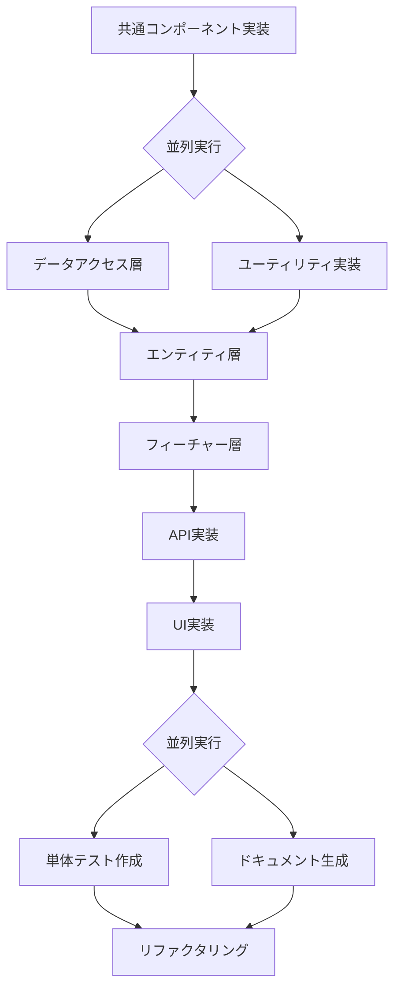

# 実装順序ガイド

このドキュメントは、Feature-Sliced Design (FSD) アーキテクチャに基づいたSvelteKitアプリケーションの実装順序とエージェントの使用方法を説明します。

## 実装フローチャート



## 実装フェーズと使用エージェント

### フェーズ1: 基盤構築

**目的**: プロジェクト全体で使用される共通要素を実装

1. **共通コンポーネント実装**
   - エージェント: `common-components-developer`
   - 実装内容: Button、Card、Form要素などの基本UIコンポーネント
   - 配置:
      - UI: `src/shared/components/ui/`
      - Model: `src/shared/components/model/`

### フェーズ2: インフラストラクチャ層（並列実行可能）

**目的**: データ処理とユーティリティ機能の基盤を構築

2-A. **データアクセス層**

- エージェント: `data-access-layer-developer`
- 実装内容: Prismaスキーマ、リポジトリ、データベース接続
- 配置: `src/shared/server/`, `prisma/`

2-B. **ユーティリティ実装**

- エージェント: `utility-functions-developer`
- 実装内容: 日付処理、フォーマッター、バリデーション関数
- 配置: `src/shared/utils/`

### フェーズ3: エンティティ層

**目的**: ビジネスドメインに特化したUIコンポーネントを実装（ビジネスロジックは含まない）

3. **エンティティ実装**
   - エージェント: `common-components-developer`
   - 実装内容: shared/components/uiの集合体で構成されるビジネス専用UI
   - 配置: `src/entities/*/`
     - UI: `src/entities/*/ui/` - ビジネス専用のUIコンポーネント
     - API: `src/entities/*/api/` - API呼び出し（単純なデータ取得ロジック）
     - Model: `src/entities/*/model/` - 型定義とデータ構造
   - 前提条件: 共通コンポーネント（shared）の完成

### フェーズ4: フィーチャー層

**目的**: ビジネスロジック付きの機能を実装

4. **フィーチャー実装**
   - エージェント: `business-logic-developer`
   - 実装内容: entitiesの集合体 + ビジネスロジックを組み合わせた機能
   - 配置: `src/features/*/`
     - UI: `src/features/*/ui/` - ビジネスロジック付きのUIコンポーネント
     - API: `src/features/*/api/` - 複雑なAPI呼び出し（複数APIの統合、ビジネスロジック付き）
     - Composable: `src/features/*/composable/` - ユースケース単位で作成されるビジネスロジック
     - Model: `src/features/*/model/` - フィーチャー固有の型定義
   - 前提条件: エンティティ層の完成

### フェーズ5: API層（SvelteKit）

**目的**: SvelteKitのAPIルートを実装

5. **API実装**
   - エージェント: `api-endpoint-developer`
   - 実装内容: SvelteKitのAPIルート（+server.ts）
   - 配置: `src/routes/api/`
   - 前提条件: フィーチャー層の完成

### フェーズ6: UI層（ページ・ウィジェット）

**目的**: ページレベルのUIとウィジェットを実装

6. **UI実装**
   - エージェント: `ui-component-developer`
   - 実装内容: 
     - ページ（`+page.svelte`）: featuresのUIコンポーネントを組み合わせてページを構成
     - ウィジェット: 複数のfeaturesを統合した大きなUI単位
   - 配置: 
     - Pages: `src/routes/*/+page.svelte` - featuresの組み合わせでページ構成
     - Widgets: `src/widgets/` - 複数featuresの統合UI
   - 前提条件: API層とフィーチャー層の完成

### フェーズ7: 品質保証（並列実行可能）

**目的**: コードの品質と保守性を確保

7-A. **単体テスト作成**

- エージェント: `unit-test-writer`
- 実装内容: Vitest、Testing Libraryを使用したテスト
- 配置: `tests/unit/`

7-B. **ドキュメント生成**

- エージェント: `documentation-writer`
- 実装内容: API仕様、コンポーネントドキュメント、使用ガイド
- 配置: `docs/`, コード内JSDoc

### フェーズ8: 最適化

**目的**: コードの品質向上と最適化

8. **リファクタリング**
   - エージェント: `code-refactoring-specialist`
   - 実装内容: コードの整理、パフォーマンス改善、重複削除

## 並列実行のガイドライン

### 並列実行可能な組み合わせ:

- データアクセス層 + ユーティリティ実装
- 単体テスト作成 + ドキュメント生成

### 並列実行の注意点:

- 同じファイルを編集する可能性がある作業は避ける
- 依存関係のない独立した機能から実装を開始
- Git ブランチを活用して並列作業を管理

## サポートエージェント

以下のエージェントは、全フェーズを通じて必要に応じて使用：

- **`build-config-specialist`**: ビルド設定の最適化
- **`dependency-manager`**: パッケージ管理と更新
- **`code-review-specialist`**: コードレビューとフィードバック
- **`code-generator`**: 汎用的なコード生成（特定のフェーズに特化していない場合）

## FSDアーキテクチャの実装例

### ページ構成の例
```typescript
// src/routes/salary/+page.svelte
import { SalaryCalculationFeature } from '$features/salary-calculation';
import { StockPortfolioFeature } from '$features/stock-portfolio';

// featuresを組み合わせてページを構成
```

### 層の依存関係
- **Shared**: 汎用的な基本コンポーネント（独立）
- **Entities**: Sharedを使用してビジネス専用UI構築
- **Features**: Entitiesを使用してビジネスロジック付き機能構築  
- **Widgets**: Featuresを組み合わせて大きなUI単位構築
- **Pages**: FeaturesやWidgetsを組み合わせてページ構成

## 実装のベストプラクティス

1. **TDDアプローチ**: 可能な限りテストを先に書く
2. **段階的な実装**: 小さな単位で実装し、頻繁にコミット
3. **早期統合**: 各フェーズ完了後、速やかに統合テストを実施
4. **継続的なレビュー**: 各フェーズでcode-review-specialistを活用
5. **依存関係の管理**: dependency-managerで定期的にチェック
6. **FSD原則の遵守**: 下位層は上位層に依存しない、上位層のみ下位層を使用

## チェックリスト

各フェーズ完了時に確認：

- [ ] コードがプロジェクトの規約に従っている
- [ ] 適切なエラーハンドリングが実装されている
- [ ] 必要なテストが作成されている
- [ ] ドキュメントが更新されている
- [ ] `npm run lint` が成功する
- [ ] `npm run format` が実行されている
- [ ] `npm run check` でTypeScriptエラーがない
- [ ] レビューエージェントによるチェックが完了している
