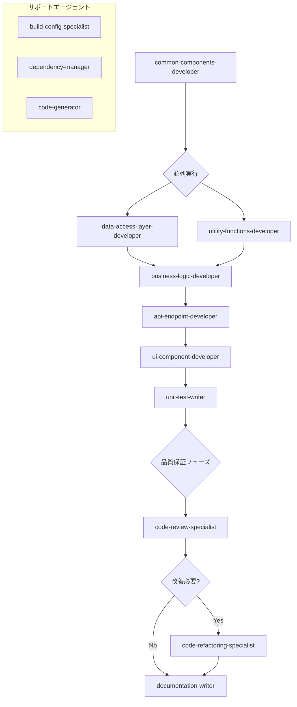

# 実装エージェント実行順序ガイド

このディレクトリには、実装フェーズで使用する13個のエージェントが含まれています。
以下のフローチャートに従って実行してください。

## 実行フローチャート



## 実行順序詳細

### 成果物ファイル命名規則

**重要**: 成果物のファイル名には必ず項番を付けてください。

- 形式: `[カテゴリ番号]-[連番]_[ファイル名].md`
- 例: `18-01_common-components.md`

### 1. 共通コンポーネント開発（common-components-developer）

- **実行タイミング**: 最初に実行
- **前提条件**: 詳細設計の完了、UIフレームワーク（Svelte 5）の環境設定
- **成果物**:
  - `18-01_common-components-implementation.md` - 共通コンポーネント実装
  - `18-02_component-catalog.md` - コンポーネントカタログ
  - `18-03_component-usage-guide.md` - 使用ガイド

### 2. 並列実行フェーズ1

以下の2つのエージェントは並列で実行可能です：

#### 2a. データアクセス層開発（data-access-layer-developer）

- **前提条件**: 共通コンポーネントの完了、データベース設計の完了
- **成果物**:
  - `19-01_data-access-layer-implementation.md` - DAL実装
  - `19-02_api-integration.md` - API統合仕様
  - `19-03_caching-strategy.md` - キャッシング戦略

#### 2b. ユーティリティ関数開発（utility-functions-developer）

- **前提条件**: 共通コンポーネントの完了
- **成果物**:
  - `20-01_utility-functions-implementation.md` - ユーティリティ関数
  - `20-02_validation-helpers.md` - バリデーションヘルパー
  - `20-03_formatting-functions.md` - フォーマット関数

### 3. ビジネスロジック開発（business-logic-developer）

- **実行タイミング**: データアクセス層とユーティリティ関数の両方が完了後
- **前提条件**: DALとユーティリティの成果物
- **成果物**:
  - `21-01_business-logic-implementation.md` - ビジネスロジック実装
  - `21-02_domain-models.md` - ドメインモデル
  - `21-03_business-rules.md` - ビジネスルール定義

### 4. APIエンドポイント開発（api-endpoint-developer）

- **実行タイミング**: ビジネスロジック完了後
- **前提条件**: ビジネスロジックの成果物、API設計仕様
- **成果物**:
  - `22-01_api-endpoints-implementation.md` - APIエンドポイント実装
  - `22-02_route-handlers.md` - ルートハンドラー
  - `22-03_middleware-implementation.md` - ミドルウェア実装

### 5. UIコンポーネント開発（ui-component-developer）

- **実行タイミング**: APIエンドポイント完了後
- **前提条件**: APIの成果物、画面設計仕様
- **成果物**:
  - `23-01_ui-components-implementation.md` - UIコンポーネント実装
  - `23-02_pages-implementation.md` - ページ実装
  - `23-03_state-management.md` - 状態管理実装

### 6. 単体テスト作成（unit-test-writer）

- **実行タイミング**: UIコンポーネント完了後（各実装後に段階的実行も推奨）
- **前提条件**: 各実装の成果物
- **成果物**:
  - `24-01_unit-tests-implementation.md` - 単体テスト実装
  - `24-02_component-tests.md` - コンポーネントテスト
  - `24-03_integration-tests.md` - 統合テスト

### 7. 品質保証フェーズ

#### 7a. コードレビュー（code-review-specialist）

- **前提条件**: テストの完了
- **成果物**:
  - `28-01_code-review-report.md` - レビューレポート
  - `28-02_security-review.md` - セキュリティレビュー
  - `28-03_performance-review.md` - パフォーマンスレビュー

#### 7b. リファクタリング（code-refactoring-specialist）※必要に応じて

- **前提条件**: コードレビューの完了、改善点の特定
- **成果物**:
  - `27-01_refactoring-report.md` - リファクタリングレポート
  - `27-02_code-quality-improvements.md` - コード品質改善
  - `27-03_technical-debt-resolution.md` - 技術的負債の解消

### 8. ドキュメント作成（documentation-writer）

- **実行タイミング**: 品質保証フェーズ完了後
- **前提条件**: すべての実装とレビューの完了
- **成果物**:
  - `30-01_technical-documentation.md` - 技術ドキュメント
  - `30-02_api-documentation.md` - APIドキュメント
  - `30-03_deployment-guide.md` - デプロイメントガイド

## サポートエージェント（必要に応じて使用）

### ビルド設定スペシャリスト（build-config-specialist）

- **使用タイミング**: ビルドエラー発生時、パフォーマンス最適化時
- **成果物**:
  - `25-01_build-configuration.md` - ビルド設定
  - `25-02_optimization-report.md` - 最適化レポート

### 依存関係管理者（dependency-manager）

- **使用タイミング**: パッケージ追加時、バージョン競合時
- **成果物**:
  - `29-01_dependency-management.md` - 依存関係管理
  - `29-02_vulnerability-report.md` - 脆弱性レポート

### コードジェネレーター（code-generator）

- **使用タイミング**: ボイラープレートコード生成時、型定義生成時
- **成果物**:
  - `26-01_generated-code-documentation.md` - 生成コードドキュメント
  - `26-02_generation-templates.md` - 生成テンプレート

## 使用例

**FSDアーキテクチャ準拠の実装フロー**:

```bash
# 1. 共通コンポーネントから開始
claude "FSDのshared層に配置する共通UIコンポーネントを実装してください"

# 2. データアクセス層とユーティリティを並列実装
claude "Prismaを使用したデータアクセス層を実装してください"
claude "日付処理とバリデーション用のユーティリティ関数を実装してください"

# 3. ビジネスロジックの実装
claude "給料計算と株式評価のビジネスロジックを実装してください"

# 4. APIエンドポイントの作成
claude "SvelteKitのAPIルートで給料データCRUD処理を実装してください"

# 5. UIコンポーネントとページの実装
claude "ダッシュボード画面のUIコンポーネントを実装してください"

# 6. テストの作成
claude "実装したコンポーネントと関数の単体テストを作成してください"

# 7. 品質保証
claude "実装したコードのセキュリティとパフォーマンスをレビューしてください"
claude "レビュー結果に基づいてリファクタリングを実行してください"

# 8. ドキュメント生成
claude "実装した機能の技術ドキュメントとAPIドキュメントを生成してください"
```

## 並列実行の利点

- **効率性**: 依存関係のないタスクを同時に実行することで、実装時間を短縮
- **リソース活用**: 複数の開発者が異なる層を同時に実装可能
- **早期フィードバック**: 並列実行により、統合時の問題を早期に発見

## 注意事項

1. 各エージェントの前提条件を必ず満たしてから実行してください
2. 並列実行可能なエージェントでも、リソースや優先度に応じて順次実行も可能です
3. 各エージェントの出力は次のエージェントの入力となるため、品質確認を行ってください
4. TDD（テスト駆動開発）の場合は、各実装の前に`unit-test-writer`を実行することも推奨されます
