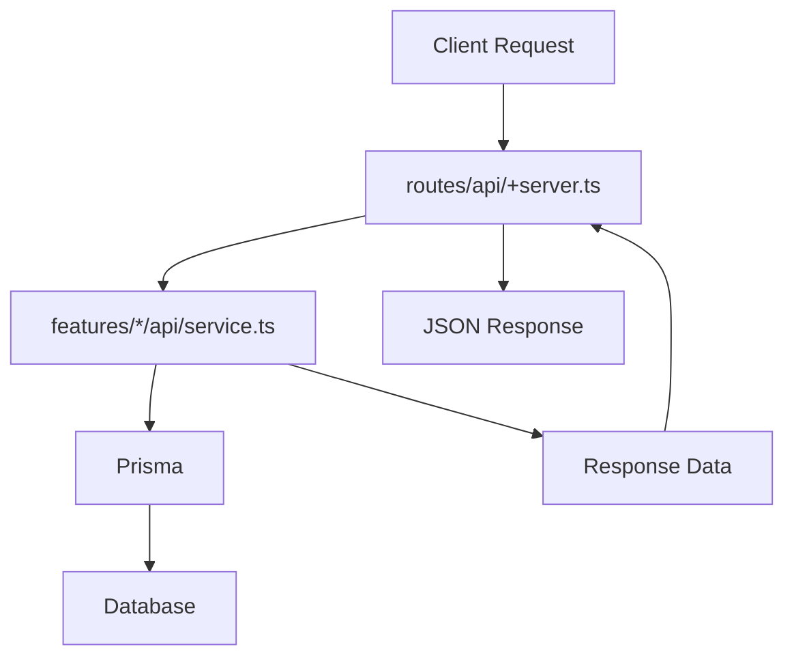

# 給料管理アプリケーション アーキテクチャ設計書

## 🎯 基本思想

Feature-Sliced Design (FSD) アーキテクチャを採用し、**責務分離**と**再利用性**を重視した設計。

### 核となる設計方針

```
entities  → ドメイン固有UI（業務特化のレゴブロック）
features  → ビジネスロジック + entities の組み合わせ（機能）
widgets   → アプリ全体で使う共通UI（ヘッダー、サイドバー等）
routes    → データの流し込みのみ（配管工事）
lib       → 完全汎用UI（基本的なレゴブロック）
```

## 📁 レイヤー別責務定義

### entities/

**ドメイン固有UIコンポーネント層**

- **責務**: 給料管理ドメインに特化した再利用可能なUI部品を提供
- **含むもの**:
  - 型定義 (model/types.ts)
  - データ変換処理 (api/converters.ts)
  - ドメイン固有UIコンポーネント (ui/)
- **含まないもの**: ビジネスロジック、特定画面固有の処理

**lib/ との使い分け**:

- lib: 完全汎用（Button, Card, Table等）
- entities: ドメイン固有（DashboardCard, StockTable等）

```typescript
// entities/dashboard/ui/DashboardCard.svelte
// ダッシュボード専用のカードコンポーネント
import Card from '$lib/components/card/ui/Card.svelte';
// entities/dashboard/ui/StockTable.svelte
// 株式情報専用のテーブルコンポーネント
import Table from '$lib/components/table/ui/Table.svelte';
```

### features/

**ビジネスロジック + 機能UI層**

- **責務**: 特定の機能に関するビジネスロジックとUI
- **含むもの**:
  - API サービス層 (api/) - **サーバーサイドのビジネスロジック・データ加工**
  - ビジネスロジック (model/)
  - 機能固有UI (ui/) - **クライアントサイドのUI・propsでデータ受け取り**
- **特徴**: entities を組み合わせて複雑な機能を構築

```typescript
// features/dashboard/api/dashboardService.ts
// サーバーサイド：ダッシュボード用のデータ取得・加工ロジック
// routes/api/dashboard/+server.ts から呼び出される

// features/dashboard/ui/DashboardView.svelte
// クライアントサイド：UIコンポーネント
// routes/+page.svelte からpropsでデータを受け取る
```

### routes/

**ルーティング層**

- **責務**: URLルーティングとHTTPエンドポイントの提供
- **含むもの**:
  - +page.ts (load関数でサーバーサイドデータ取得)
  - +page.svelte (features コンポーネントの利用とレイアウト)
  - api/\*/+server.ts (HTTPエンドポイント - features/api を呼び出し)
  - ルーティング設定
- **含まないもの**: ビジネスロジック、データ加工、直接的なDB操作ロジック

```typescript
// routes/+page.ts
export const load = async ({ fetch }) => {
	const response = await fetch('/api/dashboard');
	return { dashboardData: await response.json() };
};
```

```svelte
<!-- routes/+page.svelte -->
<script lang="ts">
	import DashboardView from '$features/dashboard/ui/DashboardView.svelte';

	let { data } = $props();
</script>

<DashboardView dashboardData={data.dashboardData} />
```

```typescript
// routes/api/dashboard/+server.ts
import { getDashboardData } from '$features/dashboard/api';

export const GET = async () => {
	const data = await getDashboardData();
	return json(data);
};
```

### widgets/

**アプリケーション共通UI層**

- **責務**: アプリケーション全体で使用される共通UIコンポーネント
- **含むもの**:
  - ヘッダー (header/)
  - サイドバー (sidebar/)
  - フッター (footer/)
  - グローバルナビゲーション
- **特徴**: ページレイアウトに関わる大きなUIパーツ

```svelte
<!-- widgets/header/ui/Header.svelte -->
<!-- アプリケーション共通のヘッダーコンポーネント -->
```

## 📊 データフロー設計

### サーバーサイドのデータフロー



**責務分担：**

- `routes/api/+server.ts`: HTTPリクエスト/レスポンス処理
- `features/*/api/service.ts`: ビジネスロジック・データ加工
- `Prisma`: データベースアクセス

### 🔄 正しいSvelteKit + FSDデータフロー

**完全なデータフロー（推奨パターン）:**

```mermaid
graph TD
    A[1. routes/+page.ts] --> B[fetch('/api/*')]
    B --> C[2. routes/api/+server.ts]
    C --> D[3. features/*/api/service.ts]
    D --> E[Database/Prisma]
    D --> F[4. JSON Response]
    F --> C
    C --> A
    A --> G[5. routes/+page.svelte]
    G --> H[6. features/*/ui/View.svelte]
    H --> I[7. entities/*/ui]
    I --> J[lib/components]
```

**ステップ別説明:**

1. **`routes/+page.ts`**: サーバーサイドでデータ取得（load関数）
2. **`routes/api/+server.ts`**: 薄いHTTPレイヤー
3. **`features/*/api/service.ts`**: ビジネスロジック・データ加工
4. **JSON Response**: 加工されたデータをレスポンス
5. **`routes/+page.svelte`**: UIコンポーネントにデータを渡す
6. **`features/*/ui/View.svelte`**: 機能UI（propsでデータ受け取り）
7. **`entities/*/ui`**: ドメイン固有UI（再利用可能）

**重要なポイント:**

- ✅ **fetchは+page.tsで実行**（UIコンポーネントではない）
- ✅ **UIコンポーネントはpropsでデータ受け取りのみ**
- ✅ **サーバーサイドレンダリング対応**
- ✅ **責務が明確に分離**

### 💻 実装例

**1. routes/+page.ts（データ取得）**

```typescript
import type { PageLoad } from './$types';

import type { DashboardResponse } from '$entities/dashboard/model';

export const load: PageLoad = async ({ fetch }) => {
	const response = await fetch('/api/dashboard');
	const dashboardData: DashboardResponse = await response.json();
	return { dashboardData };
};
```

**2. routes/api/dashboard/+server.ts（HTTPエンドポイント）**

```typescript
import { getDashboardData } from '$features/dashboard/api';
import { json } from '@sveltejs/kit';

export const GET = async () => {
	const data = await getDashboardData(); // ← ビジネスロジック呼び出し
	return json(data);
};
```

**3. features/dashboard/api/service.ts（ビジネスロジック）**

```typescript
import { prisma } from '$lib/utils/server/prisma';

import type { DashboardResponse } from '$entities/dashboard/model';

export async function getDashboardData(): Promise<DashboardResponse> {
	// 複雑なデータ加工・集計処理
	const [salary, stocks] = await Promise.all([
		prisma.salarySlip.findFirst({
			/* ... */
		}),
		prisma.stock.findMany({
			/* ... */
		})
	]);

	return {
		currentMonthSalary: salary?.netPay || 0,
		stocks: stocks.map(/* データ変換 */)
		// ...
	};
}
```

**4. routes/+page.svelte（UIレイアウト）**

```svelte
<script lang="ts">
	import type { PageData } from './$types';

	import DashboardView from '$features/dashboard/ui/DashboardView.svelte';

	let { data }: { data: PageData } = $props();
</script>

<DashboardView dashboardData={data.dashboardData} />
```

**5. features/dashboard/ui/DashboardView.svelte（機能UI）**

```svelte
<script lang="ts">
	import { DashboardCard } from '$entities/dashboard';
	import type { DashboardResponse } from '$entities/dashboard/model';

	let { dashboardData }: { dashboardData: DashboardResponse } = $props();
</script>

<DashboardCard title="総資産額" value={formatCurrency(dashboardData.totalAssets)} />
```

### レイヤー間の依存関係

```
クライアントサイド:
routes → features/ui → entities → lib
  ↓         ↓            ↓         ↓
ページ    機能UI      ドメインUI  汎用UI
  ↓
widgets → lib
  ↓        ↓
共通UI   汎用UI

サーバーサイド:
routes/api → features/api → prisma
    ↓            ↓            ↓
HTTPレイヤー  ビジネスロジック  DB
```

## 🏗️ 現在のディレクトリ構成

```
src/
├── entities/           # ドメイン固有UI層
│   ├── dashboard/
│   │   ├── model/      # 型定義
│   │   └── ui/         # DashboardCard, StockTable
│   └── salary-slip/
│       ├── api/        # データ変換
│       ├── model/      # 型定義
│       └── ui/         # ドメイン固有UI
├── features/           # ビジネスロジック層
│   ├── dashboard/
│   │   ├── api/        # ビジネスロジック
│   │   └── ui/         # DashboardView
│   └── salary-slip/
│       ├── api/        # ビジネスロジック
│       └── ui/         # 機能固有UI
├── widgets/            # アプリ共通UI層
│   └── header/
│       └── ui/         # Header
├── routes/             # ルーティング層
│   ├── api/           # HTTPエンドポイント（薄いレイヤー）
│   └── +page.svelte   # UIページ（features組み合わせ）
└── lib/                # 共通ライブラリ
    ├── components/     # 汎用UIコンポーネント
    │   ├── card/      # 汎用カード
    │   ├── table/     # 汎用テーブル
    │   └── toast/     # トースト通知
    ├── utils/          # ユーティリティ関数
    └── server/         # サーバー設定
```

## ✨ この設計のメリット

### 1. **再利用性** 💎

- entities は複数の features で使い回し可能
- features は複数の routes で利用可能
- コードの重複を最小限に抑制

### 2. **テスタビリティ** 🧪

- **entities**: UIのみのユニットテスト
- **features**: ビジネスロジックの独立テスト
- **routes**: データフローの統合テスト

### 3. **保守性** 🛠️

- 変更の影響範囲が明確
- 責務が分離されているため修正箇所を特定しやすい
- 新機能追加時の既存コードへの影響を最小化

### 4. **スケーラビリティ** 📈

- 新しい entities を追加しても既存機能に影響なし
- features の追加が容易
- チーム開発での並行作業が可能

### 5. **TypeScript 親和性** 🔷

- 各レイヤーで型安全性を保証
- entities の型定義を features で再利用
- コンパイル時エラー検出が充実

## 🚀 実装戦略

### Phase 1: API 統一化 ✅

- [x] +server.ts への集約完了
- [x] 重複コード削除
- [x] 統一されたAPI エンドポイント

### Phase 2: ビジネスロジック分離 (Next)

1. features/ にビジネスロジックを移動
2. entities/ の汎用コンポーネント充実
3. routes/ のシンプル化

### Phase 3: UI コンポーネント最適化

1. entities の再利用性向上
2. features での entities 組み合わせ最適化
3. デザインシステムとの統合

## 🔑 重要な設計ポイント

### features/api の役割

**features/api はサーバーサイドで実行される** ビジネスロジック層です：

- ✅ データベースからの取得データを加工
- ✅ 複雑な集計・計算処理
- ✅ 複数テーブルのデータを結合
- ❌ クライアントサイドでの実行は想定しない
- ❌ 直接HTTPリクエストは処理しない

### routes/api の役割

**routes/api は薄いHTTPレイヤー** として機能します：

- ✅ HTTPリクエスト/レスポンスの処理
- ✅ features/api のメソッドを呼び出し
- ✅ エラーハンドリング
- ❌ ビジネスロジックは書かない
- ❌ データ加工処理は書かない

## 🎯 期待される成果

- **開発速度向上**: 汎用部品の再利用で開発効率アップ
- **品質向上**: レイヤー別テストで品質保証
- **保守性向上**: 明確な責務分離で保守作業を効率化
- **拡張性確保**: 新機能追加が既存コードに与える影響を最小化
- **テスタビリティ**: ビジネスロジックが分離されているため単体テストが容易

---

> この設計思想に基づき、持続可能で拡張性の高い給料管理アプリケーションを構築する。
