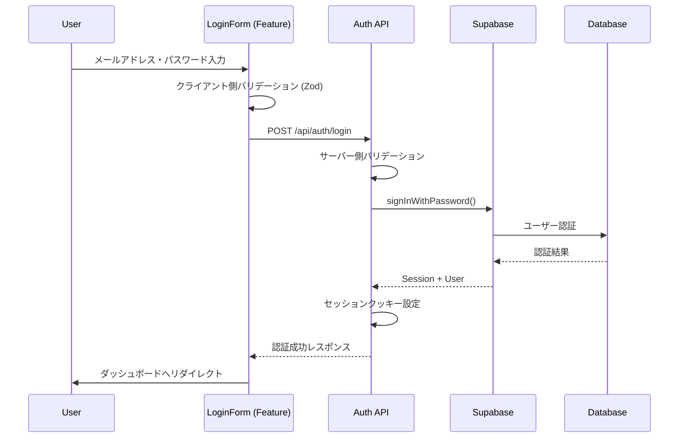

# 給料と資産管理アプリケーション - ログイン機能設計書

## 📋 目次

1. [概要](#概要)
2. [技術スタック](#技術スタック)
3. [要件定義](#要件定義)
4. [アーキテクチャ設計](#アーキテクチャ設計)
5. [詳細設計](#詳細設計)
6. [セキュリティ設計](#セキュリティ設計)
7. [実装計画](#実装計画)

---

## 概要

### プロジェクト概要

個人の給料と資産（株式）を一元管理するWebアプリケーションのログイン機能を、Feature-Sliced Design (FSD)アーキテクチャに基づいて設計・実装する。

### 主要機能

- メールアドレス/パスワードによる認証
- セッション管理
- パスワードリセット機能
- Remember Me機能
- 自動ログアウト機能

---

## 技術スタック

### 選定ライブラリ一覧

| カテゴリ           | ライブラリ    | バージョン | 選定理由                               |
| ------------------ | ------------- | ---------- | -------------------------------------- |
| **フレームワーク** | SvelteKit     | v2.22.0    | SSR対応、ファイルベースルーティング    |
| **UI Framework**   | Svelte 5      | v5.0.0     | Runes による最新のリアクティブシステム |
| **言語**           | TypeScript    | v5.0.0     | 型安全性の確保                         |
| **認証**           | Supabase Auth | v2.54.0    | 完全な認証ソリューション               |
| **ORM**            | Prisma        | v6.13.0    | 型安全なデータベースアクセス           |
| **UIライブラリ**   | Melt UI       | v0.86.6    | ヘッドレスUIコンポーネント             |
| **アイコン**       | Lucide Svelte | v0.539.0   | 軽量で美しいアイコンセット             |
| **バリデーション** | Zod           | v3.25.76   | スキーマベースバリデーション           |
| **フォーム**       | Formsnap      | v2.0.1     | Svelte 5対応フォーム管理               |

### アーキテクチャ

- **Feature-Sliced Design (FSD)** - レイヤードアーキテクチャ
- **依存関係の方向**: shared → entities → features → routes

---

## 要件定義

### ユーザーストーリー

1. 個人ユーザーとして、自分の給料と資産データを安全に管理したいので、セキュアなログイン機能が必要
2. リピートユーザーとして、毎回ログインするのは面倒なので、セッションを保持して自動ログインしたい
3. セキュリティ意識の高いユーザーとして、パスワードを忘れた時に安全にリセットできる機能が必要

### 機能要件

#### 認証機能

- メールアドレスとパスワードによる認証
- セッションベースの認証状態管理
- パスワードのハッシュ化保存（Supabase内でbcrypt使用）
- リフレッシュトークンによるセッション延長

#### セッション管理

- サーバーサイドセッション管理
- セッション有効期限（デフォルト7日間、Remember Me選択時30日間）
- アクティビティによる自動延長
- 複数デバイスでの同時ログイン対応

#### セキュリティ

- ブルートフォース攻撃対策（5回連続失敗で15分間ロック）
- CSRF保護
- XSS対策（入力値のサニタイズ）
- セキュアなCookie設定（httpOnly, secure, sameSite）

### 非機能要件

#### パフォーマンス

- ログイン処理は2秒以内に完了
- セッション検証は100ms以内
- 同時接続数1000ユーザーまで対応

#### ユーザビリティ

- フォームバリデーションのリアルタイム表示
- エラーメッセージの日本語対応
- レスポンシブデザイン対応
- キーボードナビゲーション対応

#### 信頼性

- 99.9%の可用性
- データベース障害時のフォールバック
- セッション復旧機能

### 受け入れ基準

| ID     | Given                                                        | When                                 | Then                                                                               |
| ------ | ------------------------------------------------------------ | ------------------------------------ | ---------------------------------------------------------------------------------- |
| AC-001 | 未ログインユーザーが保護されたページにアクセスしようとした時 | URLを直接入力してアクセスを試みる    | ログインページにリダイレクトされ、元のURLがreturnToパラメータに保存される          |
| AC-002 | ログインページでメールアドレスとパスワードを入力した時       | 正しい認証情報で送信ボタンをクリック | ダッシュボードまたはreturnToのページに遷移し、サーバーサイドセッションが作成される |
| AC-003 | ログインページで誤った認証情報を入力した時                   | 送信ボタンをクリック                 | エラーメッセージが表示され、パスワードフィールドがクリアされる                     |
| AC-004 | ログイン済みユーザーがブラウザを閉じて再度開いた時           | アプリケーションにアクセス           | セッションが有効期限内であればログイン状態が維持される                             |
| AC-005 | パスワードを忘れたユーザーがリセットリンクをクリックした時   | メールアドレスを入力して送信         | パスワードリセット用のメールが送信される                                           |
| AC-006 | ログイン試行が5回連続で失敗した時                            | 6回目のログインを試みる              | アカウントが一時的にロックされ、15分間ログインできなくなる                         |
| AC-007 | 新規ユーザーが初回ログインした時                             | 認証に成功                           | 初期設定画面が表示され、プロフィール情報の入力を促される                           |
| AC-008 | ログアウトボタンをクリックした時                             | 確認ダイアログで「はい」を選択       | セッションが削除され、ログインページにリダイレクトされる                           |

---

## アーキテクチャ設計

### FSDレイヤー構造

```
src/
├── shared/                # 共通レイヤー（最下層）
│   ├── components/        # 基本UIコンポーネント
│   ├── lib/              # ユーティリティ、設定
│   └── stores/           # グローバルストア
│
├── entities/             # エンティティレイヤー
│   ├── user/            # ユーザーエンティティ
│   └── auth/            # 認証エンティティ
│
├── features/             # フィーチャーレイヤー
│   └── auth/            # 認証フィーチャー
│
└── routes/               # ルートレイヤー（最上層）
    ├── login/           # ログインページ
    └── api/             # APIエンドポイント
```

### レイヤー間の依存関係ルール

#### 厳格な依存方向

```
shared → entities → features → routes
```

#### UIコンポーネント階層

1. **shared/components/ui/** - 基本UIコンポーネント（Button, Input, Card等）
2. **entities/[name]/ui/** - shared/componentsを組み合わせたビジネスUI
3. **features/[name]/ui/** - entities/uiを組み合わせた機能UI
4. **routes/+page.svelte** - features/uiをインポートして配置のみ

### データフロー



---

## 詳細設計

### ディレクトリ構造詳細

```
src/
├── shared/
│   ├── components/
│   │   ├── model/
│   │   │   └── types.ts              # 共通UIコンポーネントの型定義
│   │   └── ui/
│   │       ├── Button.svelte         # ボタンコンポーネント
│   │       ├── Input.svelte          # 入力フィールドコンポーネント
│   │       ├── Card.svelte           # カードコンポーネント
│   │       ├── Alert.svelte          # アラートコンポーネント
│   │       ├── LoadingSpinner.svelte # ローディングスピナー
│   │       └── FormField.svelte      # フォームフィールドラッパー
│   ├── consts/
│   │   ├── error-messages/
│   │   │   ├── api.ts                # API関連エラーメッセージ
│   │   │   ├── common.ts             # 共通エラーメッセージ
│   │   │   └── business.ts           # ビジネスロジックエラーメッセージ
│   │   └── index.ts                  # エラーメッセージのエクスポート
│   ├── utils/
│   │   ├── supabase.ts               # Supabaseクライアント初期化
│   │   ├── error-handler.ts          # エラーハンドリングユーティリティ
│   │   └── session.ts                # セッション管理ユーティリティ
│   ├── validation/
│   │   ├── auth.ts                   # 認証関連のZodスキーマ
│   │   └── common.ts                 # 共通バリデーションルール
│   └── stores/
│       └── toast.svelte.ts           # トースト通知ストア
│
├── entities/
│   ├── user/
│   │   ├── model/
│   │   │   └── types.ts              # User, UserProfile型定義
│   │   └── ui/
│   │       ├── UserAvatar.svelte    # ユーザーアバターコンポーネント
│   │       └── UserBadge.svelte     # ユーザーバッジコンポーネント
│   └── auth/
│       ├── model/
│       │   └── types.ts              # Session, AuthToken型定義
│       └── api/
│           └── constants.ts          # 認証関連の定数
│
├── features/
│   └── auth/
│       ├── composable/
│       │   ├── useAuth.svelte.ts     # 認証状態管理（Runes使用）
│       │   ├── useLoginForm.svelte.ts # ログインフォーム状態管理
│       │   └── useSession.svelte.ts  # セッション管理
│       ├── model/
│       │   └── types.ts              # ログイン関連の型定義
│       ├── ui/
│       │   ├── LoginForm.svelte      # ログインフォーム
│       │   ├── LoginCard.svelte      # ログインカード
│       │   └── RememberMeCheckbox.svelte # Remember Me機能
│       └── api/
│           └── auth-client.ts        # 認証APIクライアント
│
├── routes/
│   ├── login/
│   │   ├── +page.svelte              # ログインページ（LoginCardの配置のみ）
│   │   ├── +page.server.ts           # Form Actions
│   │   └── +layout.server.ts         # 認証チェック
│   ├── api/
│   │   └── auth/
│   │       ├── login/
│   │       │   └── +server.ts        # ログインAPIエンドポイント
│   │       ├── logout/
│   │       │   └── +server.ts        # ログアウトAPIエンドポイント
│   │       └── me/
│   │           └── +server.ts        # 現在のユーザー情報取得
│   ├── +layout.svelte                 # ルートレイアウト
│   ├── +layout.server.ts              # 認証状態の初期化
│   └── hooks.server.ts                # 認証ミドルウェア
│
└── app.d.ts                           # グローバル型定義
```

### エラーメッセージ定義

#### shared/consts/error-messages/api.ts

```typescript
export const API_ERROR_MESSAGES = {
	// HTTPステータス関連
	BAD_REQUEST: 'リクエストが不正です',
	UNAUTHORIZED: '認証が必要です',
	FORBIDDEN: 'アクセス権限がありません',
	NOT_FOUND: 'リソースが見つかりません',
	TOO_MANY_REQUESTS: 'リクエスト数が上限に達しました。しばらくお待ちください',
	INTERNAL_SERVER_ERROR: 'サーバーエラーが発生しました',
	SERVICE_UNAVAILABLE: 'サービスが一時的に利用できません',

	// ネットワーク関連
	NETWORK_ERROR: 'ネットワークエラーが発生しました。接続を確認してください',
	TIMEOUT: 'タイムアウトしました。もう一度お試しください',

	// API固有
	INVALID_RESPONSE: 'サーバーからの応答が不正です',
	API_KEY_INVALID: 'APIキーが無効です'
} as const;
```

#### shared/consts/error-messages/common.ts

```typescript
export const COMMON_ERROR_MESSAGES = {
	// 汎用
	UNKNOWN_ERROR: 'エラーが発生しました',
	TRY_AGAIN_LATER: 'しばらくしてから再度お試しください',
	CONTACT_SUPPORT: 'この問題が続く場合は、サポートにお問い合わせください',

	// バリデーション
	REQUIRED_FIELD: '必須項目です',
	INVALID_FORMAT: '形式が正しくありません',
	INVALID_EMAIL: '有効なメールアドレスを入力してください',
	INVALID_LENGTH: '文字数が正しくありません',

	// 操作関連
	SAVE_SUCCESS: '保存しました',
	DELETE_SUCCESS: '削除しました',
	UPDATE_SUCCESS: '更新しました',
	OPERATION_FAILED: '操作に失敗しました'
} as const;
```

#### shared/consts/error-messages/business.ts

```typescript
export const BUSINESS_ERROR_MESSAGES = {
	// 認証関連
	AUTH: {
		INVALID_CREDENTIALS: 'メールアドレスまたはパスワードが正しくありません',
		SESSION_EXPIRED: 'セッションの有効期限が切れました。再度ログインしてください',
		ACCOUNT_LOCKED: 'アカウントがロックされています。15分後に再試行してください',
		PASSWORD_TOO_WEAK: 'パスワードが弱すぎます。より強力なパスワードを設定してください',
		EMAIL_NOT_VERIFIED: 'メールアドレスの確認が完了していません',
		USER_NOT_FOUND: 'ユーザーが見つかりません',
		ALREADY_LOGGED_IN: '既にログインしています',
		LOGIN_REQUIRED: 'ログインが必要です'
	},

	// パスワード関連
	PASSWORD: {
		MIN_LENGTH: 'パスワードは8文字以上である必要があります',
		MAX_LENGTH: 'パスワードは100文字以内である必要があります',
		REQUIRE_UPPERCASE: '大文字を1文字以上含めてください',
		REQUIRE_LOWERCASE: '小文字を1文字以上含めてください',
		REQUIRE_NUMBER: '数字を1文字以上含めてください',
		REQUIRE_SPECIAL: '特殊文字を1文字以上含めてください',
		RESET_TOKEN_EXPIRED: 'パスワードリセットトークンの有効期限が切れました',
		RESET_EMAIL_SENT: 'パスワードリセット用のメールを送信しました'
	},

	// ユーザー関連
	USER: {
		EMAIL_ALREADY_EXISTS: 'このメールアドレスは既に登録されています',
		PROFILE_UPDATE_FAILED: 'プロフィールの更新に失敗しました',
		INVALID_USER_DATA: 'ユーザーデータが不正です'
	}
} as const;
```

#### shared/consts/error-messages/index.ts

```typescript
import { API_ERROR_MESSAGES } from './api';
import { COMMON_ERROR_MESSAGES } from './common';
import { BUSINESS_ERROR_MESSAGES } from './business';

export const ERROR_MESSAGES = {
	API: API_ERROR_MESSAGES,
	COMMON: COMMON_ERROR_MESSAGES,
	BUSINESS: BUSINESS_ERROR_MESSAGES
} as const;

export type ErrorMessageType = typeof ERROR_MESSAGES;
```

### API設計

#### ログインエンドポイント

```typescript
POST /api/auth/login
Request: {
  email: string;
  password: string;
  rememberMe?: boolean;
}
Response: {
  success: {
    user: {
      id: string;
      email: string;
      createdAt: string;
    };
    session: {
      accessToken: string;
      refreshToken: string;
      expiresAt: number;
    };
  };
  error: {
    400: { message: "Invalid credentials" };
    429: { message: "Too many attempts" };
    500: { message: "Internal server error" };
  };
}
```

#### ログアウトエンドポイント

```typescript
POST /api/auth/logout
Request: {}
Response: {
  success: { message: "Logged out successfully" };
  error: {
    401: { message: "Not authenticated" };
    500: { message: "Failed to logout" };
  };
}
```

#### ユーザー情報取得エンドポイント

```typescript
GET /api/auth/me
Request: {}
Response: {
  success: {
    user: {
      id: string;
      email: string;
      profile: {
        name?: string;
        avatarUrl?: string;
      };
    };
  };
  error: {
    401: { message: "Not authenticated" };
    500: { message: "Failed to fetch user" };
  };
}
```

### データモデル（Prisma Schema）

```prisma
model User {
  id            String   @id @default(uuid())
  email         String   @unique
  passwordHash  String?
  createdAt     DateTime @default(now())
  updatedAt     DateTime @updatedAt
  lastLoginAt   DateTime?
  loginAttempts Int      @default(0)
  lockedUntil   DateTime?
  profile       Profile?
  sessions      Session[]
  salaries      Salary[]
  stocks        Stock[]
}

model Profile {
  id        String   @id @default(uuid())
  userId    String   @unique
  user      User     @relation(fields: [userId], references: [id], onDelete: Cascade)
  name      String?
  avatarUrl String?
  createdAt DateTime @default(now())
  updatedAt DateTime @updatedAt
}

model Session {
  id           String   @id @default(uuid())
  userId       String
  user         User     @relation(fields: [userId], references: [id], onDelete: Cascade)
  token        String   @unique
  expiresAt    DateTime
  createdAt    DateTime @default(now())
  lastActivity DateTime @default(now())
  userAgent    String?
  ipAddress    String?
}
```

### Svelte 5 Runes活用

#### $state() - リアクティブな状態管理

```typescript
class AuthState {
	private _user = $state<User | null>(null);
	private _loading = $state(false);

	get user() {
		return this._user;
	}
	get loading() {
		return this._loading;
	}
}
```

#### $derived() - 派生状態の自動計算

```typescript
class AuthState {
	private _user = $state<User | null>(null);
	private _session = $state<Session | null>(null);

	get isAuthenticated() {
		return $derived(!!this._user && !!this._session);
	}

	get displayName() {
		return $derived(this._user?.name || this._user?.email?.split('@')[0] || 'ゲスト');
	}
}
```

#### $effect() - 副作用の管理

```typescript
class SessionManager {
	constructor() {
		$effect(() => {
			if (this._session) {
				const checkInterval = setInterval(() => {
					this.checkSessionExpiry();
				}, 60000); // 1分ごとにチェック

				return () => clearInterval(checkInterval);
			}
		});
	}
}
```

---

## セキュリティ設計

### CSRF保護

```typescript
// hooks.server.ts
export const handle: Handle = async ({ event, resolve }) => {
	if (!event.cookies.get('csrf_token')) {
		const token = randomBytes(32).toString('hex');
		event.cookies.set('csrf_token', token, {
			httpOnly: true,
			secure: true,
			sameSite: 'strict',
			path: '/'
		});
	}

	if (event.request.method === 'POST') {
		const token = event.cookies.get('csrf_token');
		const headerToken = event.request.headers.get('x-csrf-token');

		if (token !== headerToken) {
			return new Response('CSRF token mismatch', { status: 403 });
		}
	}

	return resolve(event);
};
```

### セッションセキュリティ

```typescript
cookies.set('session', token, {
	httpOnly: true, // XSS攻撃を防ぐ
	secure: true, // HTTPS必須
	sameSite: 'lax', // CSRF攻撃を緩和
	maxAge: 60 * 60 * 24, // 24時間
	path: '/'
});
```

### レート制限

```typescript
const loginLimiter = new RateLimiter({
	windowMs: 15 * 60 * 1000, // 15分
	max: 5, // 最大5回の試行
	message: 'ログイン試行回数が上限に達しました'
});
```

### パスワードポリシー

- 最低8文字
- 大文字・小文字・数字を含む
- 特殊文字を推奨
- Supabase Auth内でbcryptハッシュ化

---

## 実装計画

### フェーズ1: 基盤構築

1. **Shared層の実装**
   - 基本UIコンポーネント作成
   - Supabaseクライアント初期化
   - バリデーションスキーマ定義

2. **Entities層の実装**
   - 型定義の作成
   - ユーザー関連UIコンポーネント

### フェーズ2: 機能実装

3. **Features層の実装**
   - 認証composable作成
   - ログインフォーム実装
   - セッション管理機能

4. **Routes層の実装**
   - ログインページ作成
   - APIエンドポイント実装
   - 認証ミドルウェア設定

### フェーズ3: 品質保証

5. **テスト実装**
   - ユニットテスト
   - インテグレーションテスト
   - E2Eテスト

6. **セキュリティ強化**
   - セキュリティ監査
   - ペネトレーションテスト
   - パフォーマンス最適化

### タイムライン

- フェーズ1: 2日
- フェーズ2: 3日
- フェーズ3: 2日
- **合計: 7日**

---

## エラーハンドリング

### エラーシナリオと対応

| シナリオ               | アクション                               | メッセージ                                                 |
| ---------------------- | ---------------------------------------- | ---------------------------------------------------------- |
| メールアドレス形式不正 | クライアント側バリデーションでエラー表示 | 正しいメールアドレスを入力してください                     |
| パスワード不一致       | サーバー側で検証、エラーレスポンス返却   | メールアドレスまたはパスワードが正しくありません           |
| アカウントロック       | 429エラー返却、残り時間表示              | 連続してログインに失敗しました。15分後に再試行してください |
| ネットワークエラー     | リトライ機能提供、オフライン表示         | ネットワークエラーが発生しました。接続を確認してください   |
| セッション期限切れ     | 自動的にログインページへリダイレクト     | セッションの有効期限が切れました。再度ログインしてください |

---

## テスト計画

### ユニットテスト

- パスワードハッシュ化関数のテスト
- バリデーション関数のテスト
- セッション生成・検証ロジックのテスト

### インテグレーションテスト

- ログインAPIエンドポイントのテスト
- セッション管理のテスト
- 認証ミドルウェアのテスト

### E2Eテスト

- 正常なログインフローのテスト
- エラーケースのテスト
- セッション維持のテスト
- ログアウトフローのテスト
- パスワードリセットフローのテスト

### セキュリティテスト

- ブルートフォース攻撃のテスト
- CSRF攻撃のテスト
- XSS脆弱性のテスト
- SQLインジェクションのテスト

---

## 環境設定

### 必要な環境変数

```bash
# .env.example
PUBLIC_SUPABASE_URL=https://xxxxx.supabase.co
PUBLIC_SUPABASE_ANON_KEY=xxxxx
SUPABASE_SERVICE_KEY=xxxxx
SESSION_SECRET=xxxxx
CSRF_SECRET=xxxxx
```

### 本番環境チェックリスト

- [ ] HTTPS強制設定
- [ ] セキュアクッキー設定
- [ ] CSP（Content Security Policy）設定
- [ ] レート制限の実装
- [ ] ログ記録とモニタリング
- [ ] セッションタイムアウト設定
- [ ] パスワードポリシーの強制

---

## 今後の拡張計画

### 検討中の機能

- ソーシャルログイン（Google, GitHub等）
- 二要素認証（2FA）
- 生体認証（指紋、顔認証）
- 複数デバイス間でのセッション同期
- パスワードレス認証（マジックリンク）

---

## 変更履歴

| 日付       | バージョン | 変更内容 | 作成者      |
| ---------- | ---------- | -------- | ----------- |
| 2025-01-12 | 1.0.0      | 初版作成 | Claude Code |

---

## レビューチェックリスト

### アーキテクチャ

- [ ] FSDレイヤー構造に準拠しているか
- [ ] 依存関係の方向が正しいか
- [ ] UIコンポーネント階層が適切か

### セキュリティ

- [ ] 認証フローが安全か
- [ ] セッション管理が適切か
- [ ] エラーハンドリングが十分か

### 実装可能性

- [ ] 技術スタックが適切か
- [ ] タイムラインが現実的か
- [ ] テスト計画が十分か

### パフォーマンス

- [ ] レスポンス時間の要件を満たせるか
- [ ] スケーラビリティが考慮されているか
- [ ] キャッシング戦略が適切か

---

**このドキュメントは定期的にレビューされ、プロジェクトの進行に応じて更新されます。**
