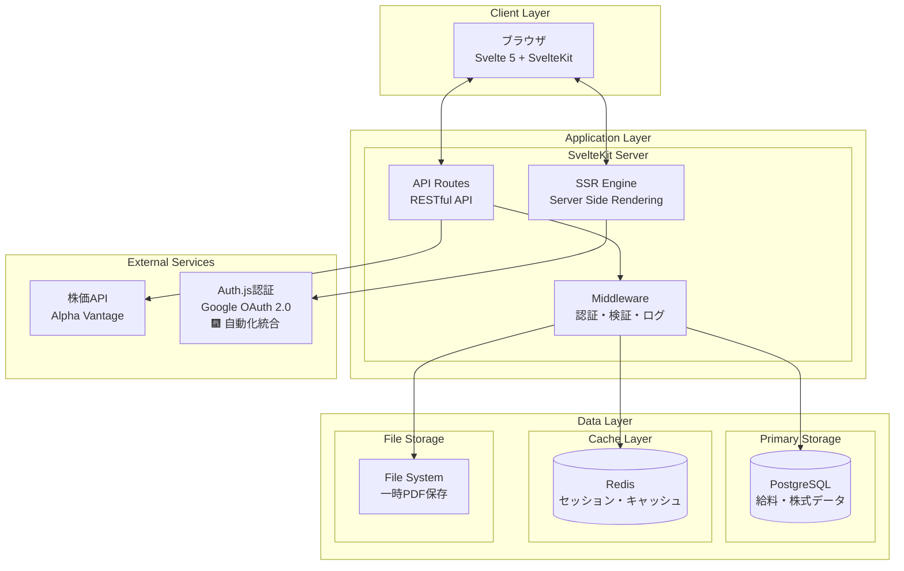
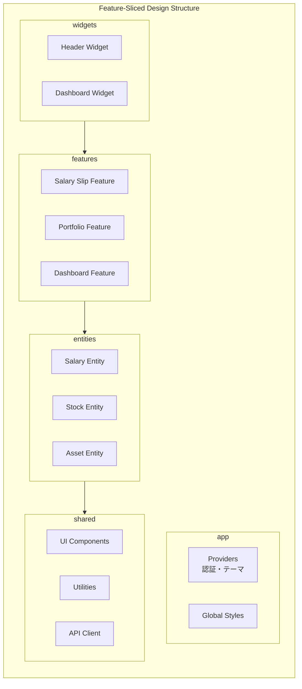
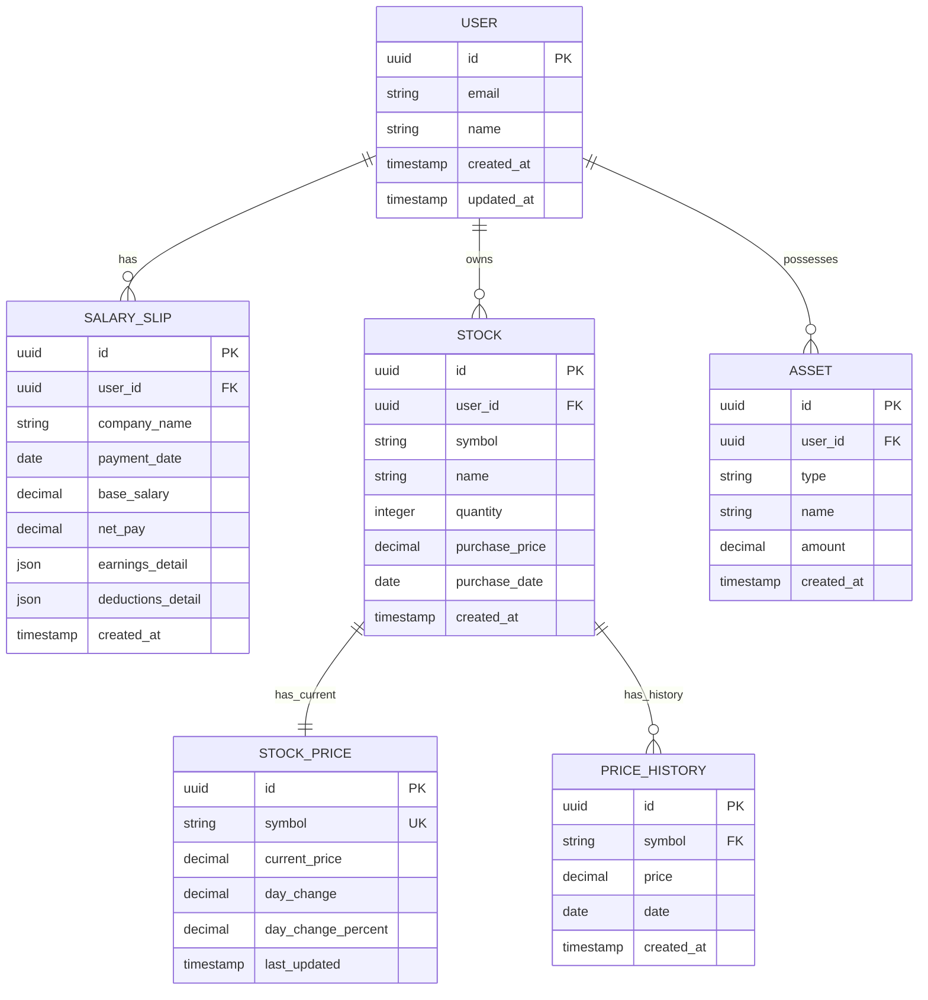
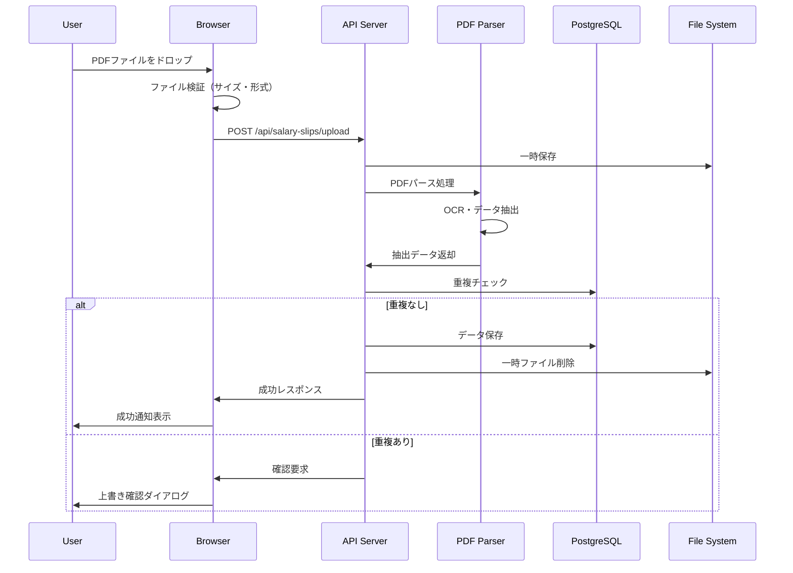
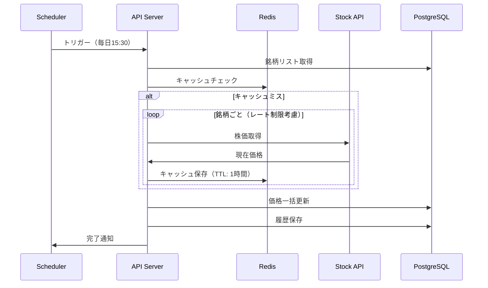
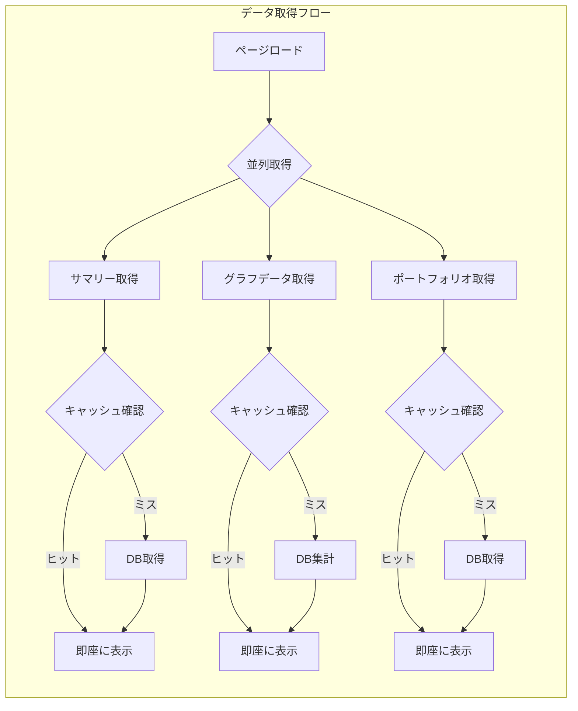
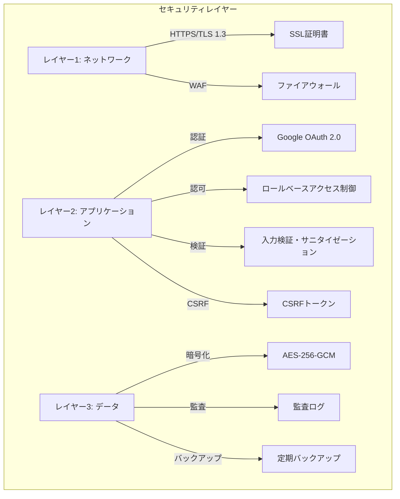
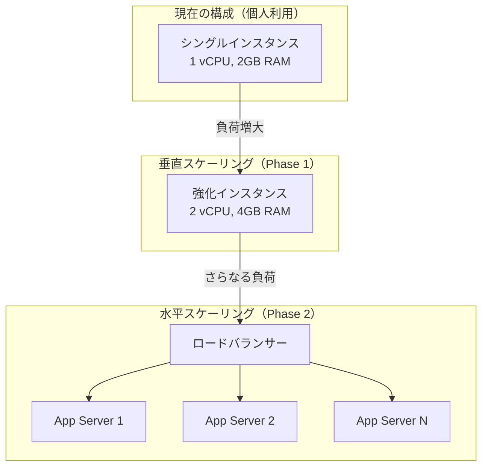
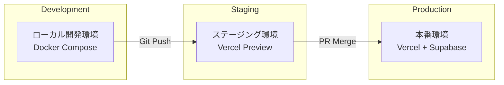
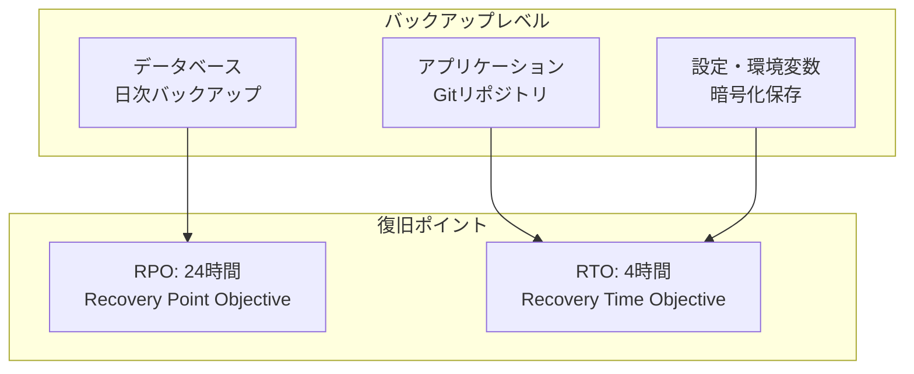

# システムアーキテクチャ設計書

## 文書情報
- **作成日**: 2025-08-10
- **作成者**: システムアーキテクチャ設計エージェント
- **バージョン**: 1.0.0
- **ステータス**: 初版

---

## 1. アーキテクチャ概要

### 1.1 システム全体像

個人の給料と資産管理システムは、**3層アーキテクチャ**と**Feature-Sliced Design**を組み合わせた、モダンでスケーラブルな設計を採用します。



### 1.2 アーキテクチャパターン

| パターン | 適用箇所 | 理由 |
|---------|---------|------|
| **Feature-Sliced Design** | フロントエンド構造 | 機能単位での開発・保守性向上 |
| **Repository Pattern** | データアクセス層 | データソースの抽象化 |
| **Service Layer Pattern** | ビジネスロジック層 | ロジックの集約と再利用 |
| **Adapter Pattern** | 外部API連携 | 外部依存の抽象化 |
| **Observer Pattern** | Svelte Store | リアクティブな状態管理 |

---

## 2. コンポーネント詳細設計

### 2.1 プレゼンテーション層



#### コンポーネント責任分担

| レイヤー | 責任 | 例 |
|---------|------|-----|
| **app** | グローバル設定・初期化 | 認証プロバイダー、テーマ設定 |
| **widgets** | 複数機能の統合UI | ダッシュボード全体、ヘッダー |
| **features** | ユーザー向け機能 | PDF取込、株式登録、グラフ表示 |
| **entities** | ビジネスエンティティ | 給料明細、株式、資産モデル |
| **shared** | 共通機能 | ボタン、フォーム、API通信 |

### 2.2 アプリケーション層

```typescript
// API層の構造
interface APIArchitecture {
  routes: {
    "/api/salary-slips": SalarySlipController;
    "/api/portfolio": PortfolioController;
    "/api/dashboard": DashboardController;
  };
  
  middleware: {
    authentication: AuthMiddleware;
    validation: ValidationMiddleware;
    errorHandling: ErrorMiddleware;
    logging: LoggingMiddleware;
    rateLimit: RateLimitMiddleware;
  };
  
  services: {
    salarySlipService: SalarySlipService;
    portfolioService: PortfolioService;
    dashboardService: DashboardService;
    pdfParserService: PDFParserService;
    stockPriceService: StockPriceService;
  };
  
  repositories: {
    salarySlipRepository: Repository<SalarySlip>;
    stockRepository: Repository<Stock>;
    assetRepository: Repository<Asset>;
  };
}
```

### 2.3 データ層



---

## 3. データフロー設計

### 3.1 給料明細PDF取込フロー



### 3.2 株価更新フロー



### 3.3 ダッシュボード表示フロー



---

## 4. 統合ポイント設計

### 4.1 内部API設計

```typescript
// RESTful API設計原則
interface APIDesignPrinciples {
  // リソース指向URL
  patterns: {
    collection: "/api/{resource}";
    item: "/api/{resource}/{id}";
    action: "/api/{resource}/{id}/{action}";
  };
  
  // HTTPメソッドの適切な使用
  methods: {
    GET: "リソース取得";
    POST: "リソース作成";
    PUT: "リソース全体更新";
    PATCH: "リソース部分更新";
    DELETE: "リソース削除";
  };
  
  // レスポンス形式
  response: {
    success: {
      status: 200 | 201 | 204;
      body: {
        data: any;
        meta?: {
          page?: number;
          totalPages?: number;
          total?: number;
        };
      };
    };
    error: {
      status: 400 | 401 | 403 | 404 | 500;
      body: {
        error: {
          code: string;
          message: string;
          details?: any;
        };
      };
    };
  };
}
```

### 4.2 外部サービス統合

```typescript
// アダプターパターンによる外部API抽象化
interface StockPriceAdapter {
  getPrice(symbol: string): Promise<StockPrice>;
  getBulkPrices(symbols: string[]): Promise<Map<string, StockPrice>>;
}

class AlphaVantageAdapter implements StockPriceAdapter {
  private rateLimiter: RateLimiter;
  private cache: Cache;
  
  async getPrice(symbol: string): Promise<StockPrice> {
    // キャッシュチェック
    const cached = await this.cache.get(`price:${symbol}`);
    if (cached) return cached;
    
    // レート制限チェック
    await this.rateLimiter.check();
    
    // API呼び出し
    const price = await this.fetchFromAPI(symbol);
    
    // キャッシュ保存
    await this.cache.set(`price:${symbol}`, price, 3600);
    
    return price;
  }
}

// フォールバック戦略
class StockPriceService {
  private adapters: StockPriceAdapter[] = [
    new AlphaVantageAdapter(),
    new YahooFinanceAdapter(), // フォールバック
  ];
  
  async getPrice(symbol: string): Promise<StockPrice> {
    for (const adapter of this.adapters) {
      try {
        return await adapter.getPrice(symbol);
      } catch (error) {
        console.error(`Adapter failed: ${error}`);
        continue;
      }
    }
    throw new Error("All adapters failed");
  }
}
```

---

## 5. セキュリティアーキテクチャ

### 5.1 多層防御戦略



### 5.2 セキュリティ実装

```typescript
// セキュリティミドルウェアスタック
interface SecurityStack {
  // 1. レート制限
  rateLimit: {
    windowMs: 15 * 60 * 1000; // 15分
    max: 100; // 最大リクエスト数
    skipSuccessfulRequests: false;
  };
  
  // 2. CORS設定
  cors: {
    origin: process.env.PUBLIC_APP_URL;
    credentials: true;
    methods: ['GET', 'POST', 'PUT', 'DELETE'];
  };
  
  // 3. ヘッダーセキュリティ
  headers: {
    'X-Content-Type-Options': 'nosniff';
    'X-Frame-Options': 'DENY';
    'X-XSS-Protection': '1; mode=block';
    'Strict-Transport-Security': 'max-age=31536000';
  };
  
  // 4. 入力検証
  validation: {
    sanitize: true;
    escape: true;
    trim: true;
    maxLength: 10000;
  };
  
  // 5. データ暗号化
  encryption: {
    algorithm: 'aes-256-gcm';
    keyDerivation: 'pbkdf2';
    iterations: 100000;
  };
}
```

---

## 6. スケーラビリティ戦略

### 6.1 垂直・水平スケーリング対応



### 6.2 パフォーマンス最適化

| 最適化項目 | 実装方法 | 期待効果 |
|-----------|---------|----------|
| **キャッシング** | Redis導入、ブラウザキャッシュ活用 | レスポンス時間50%削減 |
| **データベース最適化** | インデックス、クエリ最適化 | クエリ実行時間70%削減 |
| **遅延読み込み** | コード分割、動的インポート | 初期ロード時間40%削減 |
| **画像最適化** | WebP形式、レスポンシブ画像 | 帯域幅30%削減 |
| **CDN活用** | 静的アセットのCDN配信 | グローバル配信速度向上 |

---

## 7. デプロイメントアーキテクチャ

### 7.1 環境構成



### 7.2 インフラストラクチャ構成

```yaml
# インフラ構成定義
infrastructure:
  hosting:
    provider: Vercel
    region: ap-northeast-1 # 東京リージョン
    
  database:
    provider: Supabase
    type: PostgreSQL
    backup: 
      frequency: daily
      retention: 30 days
    
  cache:
    provider: Upstash Redis
    ttl: 3600 # 1時間
    
  monitoring:
    provider: Vercel Analytics
    alerts:
      - error_rate > 1%
      - response_time > 3s
      - availability < 99.9%
    
  ci_cd:
    provider: GitHub Actions
    pipeline:
      - lint
      - test
      - build
      - deploy
```

---

## 8. 監視・観測可能性

### 8.1 ログアーキテクチャ

```typescript
// 構造化ログ設計
interface LogArchitecture {
  levels: {
    ERROR: "エラー発生";
    WARN: "警告事項";
    INFO: "情報ログ";
    DEBUG: "デバッグ情報";
  };
  
  format: {
    timestamp: string;
    level: string;
    message: string;
    context: {
      userId?: string;
      requestId: string;
      action: string;
      duration?: number;
    };
    error?: {
      code: string;
      stack?: string;
    };
  };
  
  retention: {
    ERROR: "30 days";
    WARN: "14 days";
    INFO: "7 days";
    DEBUG: "1 day";
  };
}
```

### 8.2 メトリクス監視

| メトリクス | 閾値 | アラート |
|-----------|------|----------|
| **レスポンスタイム** | < 1秒 | > 3秒で警告 |
| **エラー率** | < 0.1% | > 1%で警告 |
| **CPU使用率** | < 70% | > 80%で警告 |
| **メモリ使用率** | < 80% | > 90%で警告 |
| **データベース接続** | < 80% | > 90%で警告 |

---

## 9. 災害復旧計画

### 9.1 バックアップ戦略



### 9.2 障害対応フロー

1. **検知**: 自動監視によるアラート
2. **評価**: 影響範囲と重要度の判定
3. **対応**: 事前定義された手順の実行
4. **復旧**: バックアップからのリストア
5. **検証**: システム正常性の確認
6. **報告**: インシデントレポート作成

---

## 10. アーキテクチャ決定記録（ADR）

### ADR-001: Feature-Sliced Design採用

**ステータス**: 承認済み

**コンテキスト**: フロントエンドアーキテクチャの選定が必要

**決定**: Feature-Sliced Designを採用

**理由**:
- 機能単位での独立した開発が可能
- 依存関係が明確で保守性が高い
- Svelteエコシステムとの親和性

**影響**:
- 学習コストが発生
- ディレクトリ構造が深くなる
- 長期的な保守性向上

### ADR-002: PostgreSQL + Prisma選定

**ステータス**: 承認済み

**コンテキスト**: データベースとORMの選定

**決定**: PostgreSQL + Prismaの組み合わせ

**理由**:
- 型安全性の確保
- マイグレーション管理の容易さ
- JSONデータ型の活用

**影響**:
- TypeScript統合が強力
- クエリパフォーマンスの最適化が必要

---

## 11. トレードオフ分析

| 側面 | 選択 | トレードオフ |
|------|------|-------------|
| **複雑性 vs シンプル性** | 適度な複雑性を許容 | 初期実装コスト増、長期保守性向上 |
| **パフォーマンス vs 開発速度** | 開発速度優先 | 後からの最適化が必要 |
| **セキュリティ vs 利便性** | セキュリティ優先 | UXに若干の制約 |
| **コスト vs 機能** | コスト最適化 | 一部機能の制限 |

---

## 12. 次のステップ

1. ✅ システムアーキテクチャ設計（本書）
2. → 技術スタック詳細定義
3. → アーキテクチャパターン詳細設計
4. → データモデル詳細設計
5. → API仕様書作成
6. → セキュリティ設計書作成

---

## 承認

| 役割 | 名前 | 日付 | 署名 |
|------|------|------|------|
| アーキテクト | システムアーキテクチャ設計エージェント | 2025-08-10 | ✅ |
| レビュアー | - | - | [ ] |
| 承認者 | - | - | [ ] |

---

**改訂履歴**

| バージョン | 日付 | 変更内容 | 作成者 |
|-----------|------|----------|---------|
| 1.0.0 | 2025-08-10 | 初版作成 | システムアーキテクチャ設計エージェント |