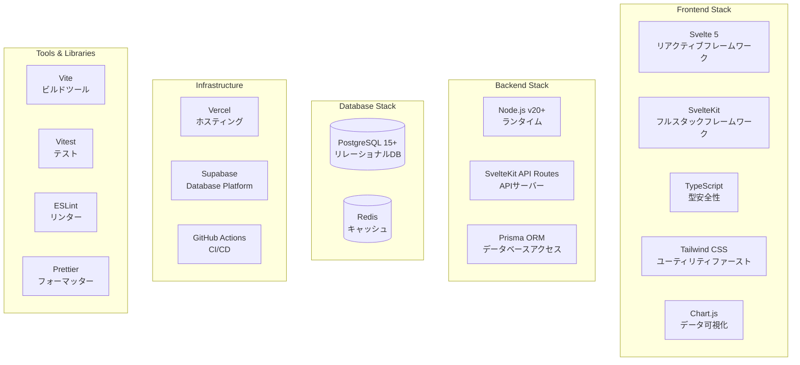

# 技術スタック詳細定義書

## 文書情報
- **作成日**: 2025-08-10
- **作成者**: システムアーキテクチャ設計エージェント
- **バージョン**: 1.0.0
- **ステータス**: 初版

---

## 1. 技術スタック全体像

### 1.1 技術選定マトリックス



### 1.2 技術選定基準

| 基準 | 重要度 | 説明 |
|------|--------|------|
| **型安全性** | ⭐⭐⭐⭐⭐ | TypeScriptによる完全な型サポート |
| **開発体験** | ⭐⭐⭐⭐⭐ | 高速なHMR、優れたDX |
| **パフォーマンス** | ⭐⭐⭐⭐ | 初期ロード3秒以内の実現 |
| **保守性** | ⭐⭐⭐⭐⭐ | 長期的な保守・拡張の容易さ |
| **学習曲線** | ⭐⭐⭐ | チーム習熟度とのバランス |
| **コスト** | ⭐⭐⭐⭐ | 個人利用に適したコスト |
| **エコシステム** | ⭐⭐⭐⭐ | 豊富なライブラリ・ツール |

---

## 2. フロントエンド技術スタック

### 2.1 Svelte 5

**バージョン**: 5.x (最新安定版)

**選定理由**:
- ✅ **コンパイル時最適化**: ランタイムなしで高速動作
- ✅ **リアクティビティ**: シンプルで直感的な状態管理
- ✅ **バンドルサイズ**: 極小のバンドルサイズ
- ✅ **学習曲線**: HTMLに近い記法で習得容易

**主要機能活用**:
```javascript
// Runes APIの活用
let count = $state(0);
let doubled = $derived(count * 2);

// Snippetsによるコンポーネント再利用
{#snippet button(text)}
  <button class="btn">{text}</button>
{/snippet}
```

### 2.2 SvelteKit

**バージョン**: 2.x (最新安定版)

**選定理由**:
- ✅ **フルスタック**: フロントエンドとバックエンドの統合
- ✅ **SSR/SSG**: SEOとパフォーマンスの両立
- ✅ **ファイルベースルーティング**: 直感的なルート管理
- ✅ **API Routes**: 統合されたAPIエンドポイント

**設定例**:
```javascript
// svelte.config.js
import adapter from '@sveltejs/adapter-vercel';

export default {
  kit: {
    adapter: adapter({
      runtime: 'nodejs20.x',
      regions: ['hnd1'], // 東京リージョン
    }),
    prerender: {
      handleHttpError: 'warn',
    },
    csrf: {
      checkOrigin: true,
    },
  },
};
```

### 2.3 TypeScript

**バージョン**: 5.3+

**選定理由**:
- ✅ **型安全性**: ランタイムエラーの事前検出
- ✅ **IDE支援**: 強力な自動補完とリファクタリング
- ✅ **ドキュメント**: 型定義がドキュメントとして機能
- ✅ **保守性**: 大規模プロジェクトでの保守性向上

**設定**:
```json
// tsconfig.json
{
  "extends": "./.svelte-kit/tsconfig.json",
  "compilerOptions": {
    "strict": true,
    "noUnusedLocals": true,
    "noUnusedParameters": true,
    "noImplicitReturns": true,
    "esModuleInterop": true,
    "skipLibCheck": true,
    "forceConsistentCasingInFileNames": true
  }
}
```

### 2.4 Tailwind CSS

**バージョン**: 3.4+

**選定理由**:
- ✅ **開発速度**: ユーティリティクラスで高速開発
- ✅ **一貫性**: デザインシステムの自動適用
- ✅ **パフォーマンス**: 未使用CSSの自動削除
- ✅ **カスタマイズ性**: 設定による柔軟なカスタマイズ

**カスタム設定**:
```javascript
// tailwind.config.js
export default {
  content: ['./src/**/*.{html,js,svelte,ts}'],
  theme: {
    extend: {
      colors: {
        primary: {
          50: '#eff6ff',
          500: '#3b82f6',
          900: '#1e3a8a',
        },
        success: '#10b981',
        warning: '#f59e0b',
        error: '#ef4444',
      },
      animation: {
        'fade-in': 'fadeIn 0.5s ease-in-out',
        'slide-up': 'slideUp 0.3s ease-out',
      },
    },
  },
  plugins: [
    require('@tailwindcss/forms'),
    require('@tailwindcss/typography'),
  ],
};
```

### 2.5 Chart.js

**バージョン**: 4.4+

**選定理由**:
- ✅ **豊富なチャート種類**: 必要な可視化をすべてカバー
- ✅ **レスポンシブ**: 自動的なレスポンシブ対応
- ✅ **カスタマイズ性**: 詳細なカスタマイズが可能
- ✅ **パフォーマンス**: Canvas描画で高速

**実装例**:
```typescript
// チャート設定プリセット
export const chartPresets = {
  salaryTrend: {
    type: 'line',
    options: {
      responsive: true,
      plugins: {
        legend: { position: 'top' },
        tooltip: { mode: 'index', intersect: false },
      },
      scales: {
        y: {
          beginAtZero: true,
          ticks: {
            callback: (value) => `¥${value.toLocaleString()}`,
          },
        },
      },
    },
  },
  portfolioComposition: {
    type: 'doughnut',
    options: {
      responsive: true,
      plugins: {
        legend: { position: 'right' },
        tooltip: {
          callbacks: {
            label: (context) => `${context.label}: ${context.parsed}%`,
          },
        },
      },
    },
  },
};
```

---

## 3. バックエンド技術スタック

### 3.1 Node.js

**バージョン**: 20.x LTS

**選定理由**:
- ✅ **JavaScript統一**: フロントエンドと同一言語
- ✅ **パフォーマンス**: V8エンジンの高速実行
- ✅ **エコシステム**: npmの豊富なパッケージ
- ✅ **非同期処理**: イベント駆動で効率的

### 3.2 SvelteKit API Routes

**選定理由**:
- ✅ **統合開発**: フロントエンドと同一プロジェクト
- ✅ **型共有**: TypeScript型の自動共有
- ✅ **ミドルウェア**: hooks.server.tsでの統一処理
- ✅ **デプロイ簡素化**: 単一デプロイメント

**実装パターン**:
```typescript
// src/routes/api/salary-slips/+server.ts
import type { RequestHandler } from './$types';
import { json } from '@sveltejs/kit';
import { z } from 'zod';

const querySchema = z.object({
  page: z.coerce.number().min(1).default(1),
  limit: z.coerce.number().min(1).max(100).default(20),
});

export const GET: RequestHandler = async ({ url, locals }) => {
  const params = querySchema.parse(Object.fromEntries(url.searchParams));
  
  const result = await locals.db.salarySlip.findMany({
    skip: (params.page - 1) * params.limit,
    take: params.limit,
    orderBy: { paymentDate: 'desc' },
  });
  
  return json({ data: result });
};
```

### 3.3 Prisma ORM

**バージョン**: 5.x

**選定理由**:
- ✅ **型安全性**: 完全な型付きクエリ
- ✅ **マイグレーション**: 自動マイグレーション生成
- ✅ **開発体験**: Prisma Studioでの可視化
- ✅ **パフォーマンス**: クエリ最適化

**スキーマ定義**:
```prisma
// prisma/schema.prisma
model SalarySlip {
  id                String   @id @default(cuid())
  companyName       String
  employeeName      String
  employeeId        String
  paymentDate       DateTime
  targetPeriodStart DateTime
  targetPeriodEnd   DateTime
  
  // JSON型で詳細データを保存
  earnings          Json
  deductions        Json
  attendance        Json
  
  baseSalary        Decimal  @db.Decimal(10, 2)
  netPay            Decimal  @db.Decimal(10, 2)
  
  createdAt         DateTime @default(now())
  updatedAt         DateTime @updatedAt
  
  @@index([paymentDate])
  @@index([employeeId])
}
```

---

## 4. データベース技術スタック

### 4.1 PostgreSQL

**バージョン**: 15+

**選定理由**:
- ✅ **信頼性**: ACID準拠の高信頼性
- ✅ **JSON対応**: JSONBデータ型の活用
- ✅ **拡張性**: 豊富な拡張機能
- ✅ **パフォーマンス**: 高度なクエリ最適化

**最適化設定**:
```sql
-- インデックス戦略
CREATE INDEX idx_salary_payment_date ON salary_slips(payment_date DESC);
CREATE INDEX idx_stock_symbol ON stocks(symbol);
CREATE INDEX idx_stock_user ON stocks(user_id);

-- パーティショニング（将来対応）
CREATE TABLE salary_slips_2025 PARTITION OF salary_slips
FOR VALUES FROM ('2025-01-01') TO ('2026-01-01');
```

### 4.2 Redis (キャッシュ層)

**バージョン**: 7.x

**選定理由**:
- ✅ **高速性**: インメモリでの超高速アクセス
- ✅ **データ構造**: 豊富なデータ構造サポート
- ✅ **TTL管理**: 自動期限切れ機能
- ✅ **Pub/Sub**: リアルタイム通信対応

**活用パターン**:
```typescript
// キャッシュ戦略
class CacheService {
  private redis: Redis;
  
  async get<T>(key: string): Promise<T | null> {
    const data = await this.redis.get(key);
    return data ? JSON.parse(data) : null;
  }
  
  async set<T>(key: string, value: T, ttl = 3600): Promise<void> {
    await this.redis.setex(key, ttl, JSON.stringify(value));
  }
  
  // キャッシュキー戦略
  keys = {
    stockPrice: (symbol: string) => `stock:price:${symbol}`,
    dashboard: (userId: string, period: string) => `dashboard:${userId}:${period}`,
    salaryList: (userId: string, page: number) => `salary:list:${userId}:${page}`,
  };
}
```

---

## 5. インフラストラクチャ

### 5.1 Vercel (ホスティング)

**選定理由**:
- ✅ **SvelteKit最適化**: ネイティブサポート
- ✅ **グローバルCDN**: エッジでの配信
- ✅ **自動スケーリング**: トラフィックに応じた自動調整
- ✅ **プレビュー環境**: PR毎の自動デプロイ

**設定**:
```json
// vercel.json
{
  "functions": {
    "src/routes/**/*.js": {
      "maxDuration": 30
    }
  },
  "regions": ["hnd1"],
  "env": {
    "NODE_ENV": "production"
  }
}
```

### 5.2 Supabase (Database Platform)

**選定理由**:
- ✅ **マネージドPostgreSQL**: 運用負荷軽減
- ✅ **リアルタイム**: Realtime機能
- ✅ **認証統合**: Auth機能の活用
- ✅ **自動バックアップ**: Point-in-timeリカバリ

### 5.3 GitHub Actions (CI/CD)

**選定理由**:
- ✅ **GitHub統合**: シームレスな統合
- ✅ **並列実行**: 高速なパイプライン
- ✅ **カスタマイズ性**: 柔軟なワークフロー
- ✅ **コスト**: 無料枠で十分

**ワークフロー設定**:
```yaml
# .github/workflows/ci.yml
name: CI/CD Pipeline

on:
  push:
    branches: [main]
  pull_request:
    branches: [main]

jobs:
  test:
    runs-on: ubuntu-latest
    steps:
      - uses: actions/checkout@v4
      - uses: actions/setup-node@v4
        with:
          node-version: '20'
          cache: 'npm'
      
      - run: npm ci
      - run: npm run lint
      - run: npm run check
      - run: npm run test
      - run: npm run build
      
  deploy:
    needs: test
    if: github.ref == 'refs/heads/main'
    runs-on: ubuntu-latest
    steps:
      - uses: actions/checkout@v4
      - uses: vercel/action@v1
        with:
          vercel-token: ${{ secrets.VERCEL_TOKEN }}
          vercel-org-id: ${{ secrets.VERCEL_ORG_ID }}
          vercel-project-id: ${{ secrets.VERCEL_PROJECT_ID }}
```

---

## 6. 開発ツール

### 6.1 ビルドツール

| ツール | バージョン | 用途 | 選定理由 |
|--------|-----------|------|----------|
| **Vite** | 5.x | ビルドツール | 高速HMR、ESM対応 |
| **esbuild** | 0.19+ | トランスパイラ | 超高速ビルド |
| **PostCSS** | 8.x | CSS処理 | Tailwind統合 |

### 6.2 品質管理ツール

| ツール | バージョン | 用途 | 設定 |
|--------|-----------|------|------|
| **ESLint** | 8.x | リンター | Svelte推奨設定 |
| **Prettier** | 3.x | フォーマッター | 自動整形 |
| **Husky** | 8.x | Git hooks | pre-commit検証 |
| **lint-staged** | 15.x | ステージングファイル検証 | 差分のみ検証 |

### 6.3 テストツール

| ツール | バージョン | 用途 | カバレッジ目標 |
|--------|-----------|------|----------------|
| **Vitest** | 1.x | ユニットテスト | 80% |
| **Playwright** | 1.40+ | E2Eテスト | 主要フロー |
| **MSW** | 2.x | APIモック | 開発環境 |

---

## 7. 外部サービス・API

### 7.1 株価API

**選定: Alpha Vantage**

| 項目 | 詳細 |
|------|------|
| **料金** | 無料プラン (5 req/min, 500 req/day) |
| **データ** | リアルタイム、日次、週次、月次 |
| **カバレッジ** | 東証全銘柄対応 |
| **信頼性** | 99.9% uptime |

**実装例**:
```typescript
class AlphaVantageClient {
  private readonly apiKey = process.env.ALPHA_VANTAGE_API_KEY;
  private readonly baseUrl = 'https://www.alphavantage.co/query';
  
  async getQuote(symbol: string): Promise<StockQuote> {
    const params = new URLSearchParams({
      function: 'GLOBAL_QUOTE',
      symbol: `${symbol}.T`, // 東証
      apikey: this.apiKey,
    });
    
    const response = await fetch(`${this.baseUrl}?${params}`);
    return this.parseResponse(await response.json());
  }
}
```

### 7.2 認証サービス

**選定: Auth.js (NextAuth.js) + Google OAuth 2.0**

| 項目 | 詳細 |
|------|------|
| **認証ライブラリ** | Auth.js (@auth/sveltekit) |
| **プロバイダー** | Google OAuth 2.0 |
| **料金** | 無料 |
| **ユーザー体験** | ワンクリックログイン |
| **セキュリティ** | 業界標準セキュリティベストプラクティス |
| **実装難易度** | 非常に簡単（数行の設定のみ） |
| **セッション管理** | JWT/Database両対応、自動ローテーション |
| **CSRF対策** | 自動対応 |
| **拡張性** | 50+プロバイダー対応、MFAサポート |

---

## 8. パッケージ依存関係

### 8.1 主要依存関係

```json
{
  "dependencies": {
    "@sveltejs/kit": "^2.0.0",
    "svelte": "^5.0.0",
    "@auth/sveltekit": "^1.0.0",
    "@prisma/client": "^5.0.0",
    "chart.js": "^4.4.0",
    "zod": "^3.22.0",
    "pdfjs-dist": "^3.11.0",
    "ioredis": "^5.3.0",
    
    "// 効率化ライブラリ群（新規追加）": "",
    "tesseract.js": "^5.0.0",
    "pdf-parse": "^1.1.1",
    "sveltekit-superforms": "^2.0.0",
    "@skeletonlabs/skeleton": "^2.0.0",
    "xlsx": "^0.18.5",
    "filepond": "^4.30.0",
    "filepond-plugin-image-preview": "^4.6.0",
    "date-fns": "^3.0.0",
    "@tanstack/svelte-query": "^5.0.0",
    "@sentry/sveltekit": "^7.0.0"
  },
  "devDependencies": {
    "@sveltejs/adapter-vercel": "^4.0.0",
    "@sveltejs/vite-plugin-svelte": "^3.0.0",
    "@types/node": "^20.0.0",
    "autoprefixer": "^10.4.0",
    "eslint": "^8.0.0",
    "postcss": "^8.4.0",
    "prettier": "^3.0.0",
    "prisma": "^5.0.0",
    "tailwindcss": "^3.4.0",
    "typescript": "^5.3.0",
    "vite": "^5.0.0",
    "vitest": "^1.0.0",
    "@playwright/test": "^1.40.0",
    "msw": "^2.0.0"
  }
}
```

### 8.2 バージョン管理戦略

| 戦略 | 説明 |
|------|------|
| **メジャーバージョン固定** | 破壊的変更の回避 |
| **マイナーアップデート許可** | セキュリティ・バグ修正 |
| **定期的な依存関係更新** | 月次でのアップデート検討 |
| **脆弱性スキャン** | GitHub Dependabotの活用 |

---

## 9. 技術的制約と考慮事項

### 9.1 制約事項

| 制約 | 影響 | 対策 |
|------|------|------|
| **ブラウザサポート** | モダンブラウザのみ | ポリフィル最小限 |
| **PDF処理** | クライアントサイド制限 | Web Worker活用 |
| **API制限** | レート制限あり | キャッシュ戦略 |
| **ファイルサイズ** | 10MB制限 | 分割アップロード |

### 9.2 将来の技術更新

| 技術 | 現在 | 将来 | 移行時期 |
|------|------|------|----------|
| **Svelte** | 5.x | 6.x | 安定版リリース後 |
| **Auth.js** | 1.x | 2.x | 安定版リリース後 |
| **Node.js** | 20.x | 22.x | LTS移行時 |
| **PostgreSQL** | 15 | 16 | 検証後 |

---

## 10. コスト分析

### 10.1 月額コスト試算（個人利用）

| サービス | プラン | 月額コスト |
|---------|--------|------------|
| **Vercel** | Hobby (無料) | ¥0 |
| **Supabase** | Free tier | ¥0 |
| **Upstash Redis** | Free tier | ¥0 |
| **Alpha Vantage** | Free tier | ¥0 |
| **GitHub** | Free | ¥0 |
| **合計** | - | **¥0** |

### 10.2 スケールアップ時のコスト

| ユーザー数 | 月額コスト | 主な変更点 |
|-----------|------------|-----------|
| 1-5人 | ¥0 | 無料枠内 |
| 5-20人 | ¥3,000 | Vercel Pro |
| 20-100人 | ¥10,000 | Supabase Pro追加 |
| 100人+ | ¥30,000+ | エンタープライズ |

---

## 11. 技術スタック成熟度評価

### 11.1 成熟度マトリックス

| 技術 | 成熟度 | リスク | 代替案 |
|------|--------|--------|--------|
| **Svelte 5** | ⭐⭐⭐⭐ | 低 | React, Vue |
| **SvelteKit** | ⭐⭐⭐⭐⭐ | 低 | Next.js |
| **Prisma** | ⭐⭐⭐⭐⭐ | 低 | Drizzle |
| **PostgreSQL** | ⭐⭐⭐⭐⭐ | 極低 | MySQL |
| **Vercel** | ⭐⭐⭐⭐⭐ | 低 | Netlify |

---

## 12. 次のステップ

1. ✅ システムアーキテクチャ設計
2. ✅ 技術スタック詳細定義（本書）
3. → アーキテクチャパターン詳細設計
4. → 開発環境セットアップ
5. → 技術検証（PoC）実施

---

## 承認

| 役割 | 名前 | 日付 | 署名 |
|------|------|------|------|
| アーキテクト | システムアーキテクチャ設計エージェント | 2025-08-10 | ✅ |
| レビュアー | - | - | [ ] |
| 承認者 | - | - | [ ] |

---

**改訂履歴**

| バージョン | 日付 | 変更内容 | 作成者 |
|-----------|------|----------|---------|
| 1.0.0 | 2025-08-10 | 初版作成 | システムアーキテクチャ設計エージェント |