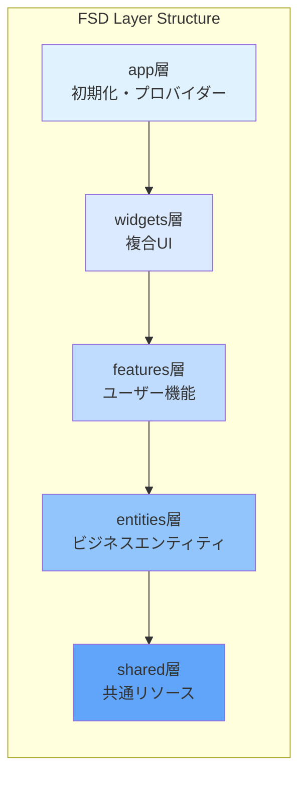
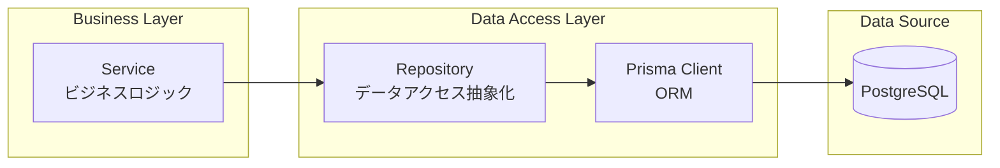
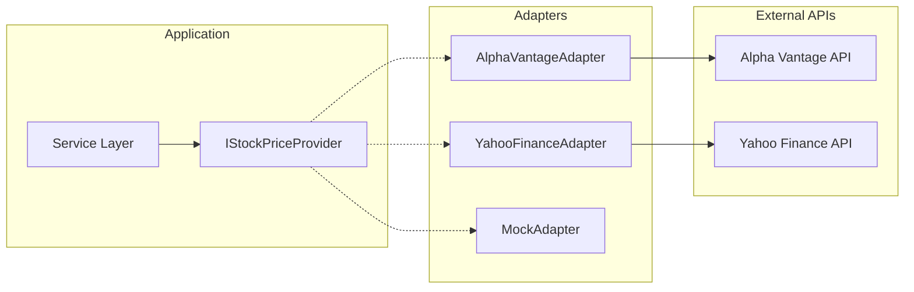
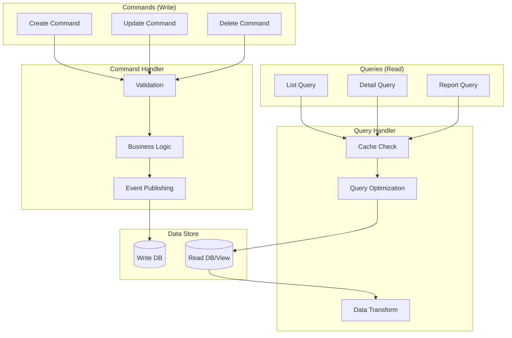
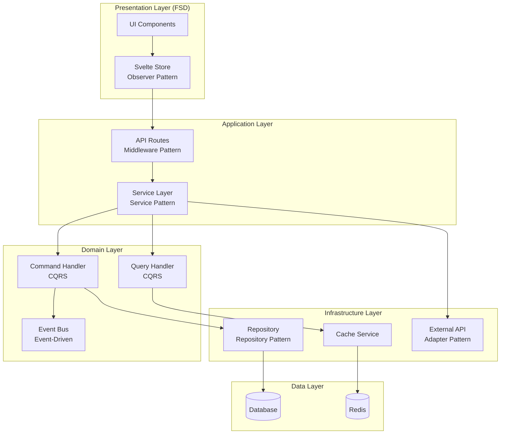

# アーキテクチャパターン詳細設計書

## 文書情報
- **作成日**: 2025-08-10
- **作成者**: システムアーキテクチャ設計エージェント
- **バージョン**: 1.0.0
- **ステータス**: 初版

---

## 1. Feature-Sliced Design (FSD) 詳細

### 1.1 FSDアーキテクチャ概要

Feature-Sliced Designは、フロントエンドアプリケーションを**レイヤー**と**スライス**に分割する方法論です。



### 1.2 レイヤー間の依存関係ルール

```typescript
// ✅ 正しい依存関係
// features層 → entities層
import { SalarySlip } from '@/entities/salary-slip';
import { formatCurrency } from '@/shared/utils/format';

// ❌ 誤った依存関係
// entities層 → features層（上位層への依存は禁止）
import { uploadPDF } from '@/features/salary-slip'; // ERROR!
```

### 1.3 各層の詳細設計

#### アプリケーション初期化層（SvelteKit構造）
```
src/
├── app.html               # SvelteKitメインHTMLテンプレート
├── app.css               # グローバルCSS
├── app.d.ts              # グローバル型定義
└── routes/               # SvelteKitページルーティング
```

#### widgets層
```
src/widgets/
├── header/                # ヘッダーウィジェット
│   ├── ui/
│   │   ├── Header.svelte
│   │   └── Navigation.svelte
│   ├── model/
│   │   └── store.ts
│   └── index.ts
└── dashboard/            # ダッシュボードウィジェット
    ├── ui/
    │   ├── DashboardLayout.svelte
    │   └── SummaryCards.svelte
    ├── model/
    │   └── store.ts
    └── index.ts
```

#### features層
```
src/features/
├── salary-slip/          # 給料明細機能
│   ├── ui/
│   │   ├── FileDropZone.svelte
│   │   ├── SalarySlipList.svelte
│   │   └── ParsedDataPreview.svelte
│   ├── composable/       # ユースケースロジック
│   │   └── useSalarySlip.ts
│   ├── model/
│   │   ├── store.ts
│   │   └── types.ts
│   ├── api/
│   │   └── salarySlipService.ts
│   └── index.ts
├── portfolio/           # ポートフォリオ機能
│   ├── ui/
│   │   ├── StockForm.svelte
│   │   ├── StockList.svelte
│   │   └── PortfolioChart.svelte
│   ├── composable/       # ユースケースロジック
│   │   └── usePortfolio.ts
│   ├── model/
│   │   ├── store.ts
│   │   └── calculations.ts
│   ├── api/
│   │   └── portfolioService.ts
│   └── index.ts
└── dashboard/          # ダッシュボード機能
    ├── ui/
    │   ├── IncomeChart.svelte
    │   └── AssetAllocation.svelte
    ├── composable/       # ユースケースロジック
    │   └── useDashboard.ts
    ├── model/
    │   └── store.ts
    ├── api/
    │   └── dashboardService.ts
    └── index.ts
```

#### entities層
```
src/entities/
├── salary-slip/        # 給料明細エンティティ
│   ├── ui/
│   │   └── SalarySlipCard.svelte
│   ├── api/          # 純粋なデータ取得
│   │   └── salarySlipApi.ts
│   ├── model/
│   │   ├── types.ts
│   │   └── schema.ts
│   └── index.ts
├── stock/             # 株式エンティティ
│   ├── ui/
│   │   └── StockCard.svelte
│   ├── api/          # 純粋なデータ取得
│   │   └── stockApi.ts
│   ├── model/
│   │   ├── types.ts
│   │   └── schema.ts
│   └── index.ts
└── asset/            # 資産エンティティ
    ├── ui/
    │   └── AssetCard.svelte
    ├── api/          # 純粋なデータ取得
    │   └── assetApi.ts
    ├── model/
    │   └── types.ts
    └── index.ts
```

#### shared層
```
src/shared/
├── components/       # 共通コンポーネント
│   ├── ui/          # 基本UIコンポーネント
│   │   ├── Button.svelte
│   │   ├── Card.svelte
│   │   ├── Modal.svelte
│   │   └── Table.svelte
│   └── model/       # Interface定義
│       ├── common.ts
│       └── api.ts
├── utils/            # ユーティリティ
│   ├── format.ts
│   ├── validation.ts
│   └── date.ts
├── api/              # API通信
│   ├── client.ts
│   └── errors.ts
└── config/          # 共通設定
    └── constants.ts
```

---

## 2. Repository Pattern

### 2.1 パターン概要

Repository Patternはデータアクセス層を抽象化し、ビジネスロジックとデータソースを分離します。



### 2.2 実装例

```typescript
// Base Repository
export abstract class BaseRepository<T> {
  protected abstract model: any;
  
  async findById(id: string): Promise<T | null> {
    return await this.model.findUnique({ where: { id } });
  }
  
  async findAll(options?: FindOptions): Promise<T[]> {
    return await this.model.findMany(options);
  }
  
  async create(data: Partial<T>): Promise<T> {
    return await this.model.create({ data });
  }
  
  async update(id: string, data: Partial<T>): Promise<T> {
    return await this.model.update({ where: { id }, data });
  }
  
  async delete(id: string): Promise<void> {
    await this.model.delete({ where: { id } });
  }
}

// Salary Slip Repository
export class SalarySlipRepository extends BaseRepository<SalarySlip> {
  protected model = prisma.salarySlip;
  
  async findByDateRange(
    startDate: Date,
    endDate: Date
  ): Promise<SalarySlip[]> {
    return await this.model.findMany({
      where: {
        paymentDate: {
          gte: startDate,
          lte: endDate,
        },
      },
      orderBy: { paymentDate: 'desc' },
    });
  }
  
  async findDuplicate(
    employeeId: string,
    paymentDate: Date
  ): Promise<SalarySlip | null> {
    return await this.model.findFirst({
      where: { employeeId, paymentDate },
    });
  }
  
  async calculateTotalIncome(userId: string): Promise<number> {
    const result = await this.model.aggregate({
      where: { userId },
      _sum: { netPay: true },
    });
    return result._sum.netPay || 0;
  }
}
```

---

## 3. Service Layer Pattern

### 3.1 パターン概要

Service Layerはビジネスロジックを集約し、複数のリポジトリやサービスを協調させます。

```typescript
// Service Layer Architecture
interface ServiceArchitecture {
  // ビジネスロジックの集約
  businessLogic: {
    validation: "入力検証";
    calculation: "計算処理";
    transformation: "データ変換";
  };
  
  // 複数リポジトリの協調
  coordination: {
    transaction: "トランザクション管理";
    aggregation: "データ集約";
    orchestration: "処理の調整";
  };
  
  // 外部サービス連携
  integration: {
    api: "外部API呼び出し";
    cache: "キャッシュ管理";
    notification: "通知送信";
  };
}
```

### 3.2 実装例

```typescript
// Salary Slip Service
export class SalarySlipService {
  constructor(
    private repository: SalarySlipRepository,
    private pdfParser: PDFParserService,
    private cache: CacheService
  ) {}
  
  async uploadAndParse(files: File[]): Promise<UploadResult[]> {
    const results: UploadResult[] = [];
    
    for (const file of files) {
      try {
        // 1. ファイル検証
        this.validateFile(file);
        
        // 2. PDF解析
        const parsedData = await this.pdfParser.parse(file);
        
        // 3. データ検証
        const validatedData = this.validateParsedData(parsedData);
        
        // 4. 重複チェック
        const duplicate = await this.repository.findDuplicate(
          validatedData.employeeId,
          validatedData.paymentDate
        );
        
        if (duplicate) {
          results.push({
            fileName: file.name,
            status: 'duplicate',
            message: '既に登録済みの給料明細です',
          });
          continue;
        }
        
        // 5. データ保存
        const saved = await this.repository.create(validatedData);
        
        // 6. キャッシュクリア
        await this.cache.invalidate('salary-slips:*');
        
        results.push({
          fileName: file.name,
          status: 'success',
          data: saved,
        });
      } catch (error) {
        results.push({
          fileName: file.name,
          status: 'error',
          error: error.message,
        });
      }
    }
    
    return results;
  }
  
  async getMonthlyTrend(months: number = 12): Promise<ChartData> {
    // キャッシュチェック
    const cacheKey = `trend:${months}`;
    const cached = await this.cache.get<ChartData>(cacheKey);
    if (cached) return cached;
    
    // データ取得と集計
    const endDate = new Date();
    const startDate = new Date();
    startDate.setMonth(startDate.getMonth() - months);
    
    const slips = await this.repository.findByDateRange(startDate, endDate);
    
    // 月ごとに集計
    const trend = this.aggregateByMonth(slips);
    
    // キャッシュ保存
    await this.cache.set(cacheKey, trend, 3600);
    
    return trend;
  }
}
```

---

## 4. Adapter Pattern (外部API連携)

### 4.1 パターン概要

Adapter Patternを使用して、外部APIの実装詳細をビジネスロジックから隠蔽します。



### 4.2 実装例

```typescript
// インターフェース定義
export interface IStockPriceProvider {
  getPrice(symbol: string): Promise<StockPrice>;
  getBulkPrices(symbols: string[]): Promise<Map<string, StockPrice>>;
  isAvailable(): Promise<boolean>;
}

// Alpha Vantage Adapter
export class AlphaVantageAdapter implements IStockPriceProvider {
  private apiKey: string;
  private rateLimiter: RateLimiter;
  
  constructor(apiKey: string) {
    this.apiKey = apiKey;
    this.rateLimiter = new RateLimiter({
      maxRequests: 5,
      perMinute: 1,
    });
  }
  
  async getPrice(symbol: string): Promise<StockPrice> {
    await this.rateLimiter.acquire();
    
    const response = await fetch(
      `https://www.alphavantage.co/query?` +
      `function=GLOBAL_QUOTE&symbol=${symbol}.T&apikey=${this.apiKey}`
    );
    
    if (!response.ok) {
      throw new ExternalAPIError('Alpha Vantage API error');
    }
    
    const data = await response.json();
    return this.transformResponse(data);
  }
  
  private transformResponse(data: any): StockPrice {
    const quote = data['Global Quote'];
    return {
      symbol: quote['01. symbol'].replace('.T', ''),
      price: parseFloat(quote['05. price']),
      change: parseFloat(quote['09. change']),
      changePercent: parseFloat(quote['10. change percent'].replace('%', '')),
      timestamp: new Date(),
    };
  }
  
  async isAvailable(): Promise<boolean> {
    try {
      const response = await fetch(
        `https://www.alphavantage.co/query?function=TIME_SERIES_INTRADAY&symbol=IBM&interval=5min&apikey=demo`
      );
      return response.ok;
    } catch {
      return false;
    }
  }
}

// Fallback Strategy
export class StockPriceService {
  private providers: IStockPriceProvider[];
  
  constructor() {
    this.providers = [
      new AlphaVantageAdapter(process.env.ALPHA_VANTAGE_KEY),
      new YahooFinanceAdapter(),
      new MockAdapter(), // 開発用
    ];
  }
  
  async getPrice(symbol: string): Promise<StockPrice> {
    for (const provider of this.providers) {
      if (await provider.isAvailable()) {
        try {
          return await provider.getPrice(symbol);
        } catch (error) {
          console.error(`Provider failed: ${error}`);
          continue;
        }
      }
    }
    throw new Error('All providers failed');
  }
}
```

---

## 5. Observer Pattern (Svelte Store)

### 5.1 パターン概要

Svelte Storeを使用したObserver Patternで、リアクティブな状態管理を実現します。

```typescript
// Store Architecture
interface StoreArchitecture {
  // 状態管理
  state: {
    readable: "読み取り専用ストア";
    writable: "読み書き可能ストア";
    derived: "派生ストア";
  };
  
  // リアクティビティ
  reactivity: {
    subscription: "自動購読";
    unsubscription: "自動購読解除";
    updates: "自動UI更新";
  };
}
```

### 5.2 実装例

```typescript
// Portfolio Store
import { writable, derived, get } from 'svelte/store';

interface PortfolioState {
  stocks: Stock[];
  loading: boolean;
  error: Error | null;
}

function createPortfolioStore() {
  const { subscribe, set, update } = writable<PortfolioState>({
    stocks: [],
    loading: false,
    error: null,
  });
  
  // 派生ストア：総資産
  const totalValue = derived(
    this,
    $state => $state.stocks.reduce(
      (sum, stock) => sum + (stock.currentPrice * stock.quantity),
      0
    )
  );
  
  // 派生ストア：損益
  const totalGainLoss = derived(
    this,
    $state => $state.stocks.reduce(
      (sum, stock) => sum + (
        (stock.currentPrice - stock.purchasePrice) * stock.quantity
      ),
      0
    )
  );
  
  return {
    subscribe,
    totalValue,
    totalGainLoss,
    
    // アクション
    async loadPortfolio() {
      update(state => ({ ...state, loading: true, error: null }));
      
      try {
        const response = await fetch('/api/portfolio');
        const data = await response.json();
        
        set({
          stocks: data.stocks,
          loading: false,
          error: null,
        });
      } catch (error) {
        update(state => ({
          ...state,
          loading: false,
          error,
        }));
      }
    },
    
    async addStock(stock: StockInput) {
      const response = await fetch('/api/portfolio/stocks', {
        method: 'POST',
        body: JSON.stringify(stock),
      });
      
      if (response.ok) {
        const newStock = await response.json();
        update(state => ({
          ...state,
          stocks: [...state.stocks, newStock],
        }));
      }
    },
    
    async updatePrices() {
      const stocks = get(this).stocks;
      const symbols = stocks.map(s => s.symbol);
      
      const response = await fetch('/api/portfolio/prices', {
        method: 'POST',
        body: JSON.stringify({ symbols }),
      });
      
      if (response.ok) {
        const prices = await response.json();
        
        update(state => ({
          ...state,
          stocks: state.stocks.map(stock => ({
            ...stock,
            currentPrice: prices[stock.symbol] || stock.currentPrice,
            lastUpdated: new Date(),
          })),
        }));
      }
    },
  };
}

export const portfolioStore = createPortfolioStore();
```

---

## 6. Command Query Responsibility Segregation (CQRS)

### 6.1 パターン概要

読み取りと書き込みの責任を分離し、それぞれに最適化された処理を実装します。



### 6.2 実装例

```typescript
// Command Handler
export class SalarySlipCommandHandler {
  async handle(command: Command): Promise<void> {
    switch (command.type) {
      case 'CREATE_SALARY_SLIP':
        await this.handleCreate(command.payload);
        break;
      case 'UPDATE_SALARY_SLIP':
        await this.handleUpdate(command.payload);
        break;
      case 'DELETE_SALARY_SLIP':
        await this.handleDelete(command.payload);
        break;
    }
  }
  
  private async handleCreate(payload: CreateSalarySlipPayload) {
    // 1. Validation
    const validated = salarySlipSchema.parse(payload);
    
    // 2. Business Rules
    const duplicate = await this.checkDuplicate(validated);
    if (duplicate) {
      throw new BusinessRuleViolation('Duplicate salary slip');
    }
    
    // 3. Persist
    const created = await this.repository.create(validated);
    
    // 4. Publish Event
    await this.eventBus.publish({
      type: 'SALARY_SLIP_CREATED',
      payload: created,
    });
    
    // 5. Invalidate Cache
    await this.cache.invalidate('salary-slips:*');
  }
}

// Query Handler
export class SalarySlipQueryHandler {
  async handle(query: Query): Promise<any> {
    switch (query.type) {
      case 'GET_SALARY_SLIPS':
        return await this.handleList(query.params);
      case 'GET_SALARY_SLIP_DETAIL':
        return await this.handleDetail(query.params);
      case 'GET_INCOME_REPORT':
        return await this.handleReport(query.params);
    }
  }
  
  private async handleList(params: ListParams) {
    // 1. Cache Check
    const cacheKey = this.buildCacheKey('list', params);
    const cached = await this.cache.get(cacheKey);
    if (cached) return cached;
    
    // 2. Optimized Query
    const result = await this.readRepository.findWithPagination({
      page: params.page,
      limit: params.limit,
      orderBy: params.orderBy,
    });
    
    // 3. Transform
    const transformed = result.map(this.transformToDTO);
    
    // 4. Cache Result
    await this.cache.set(cacheKey, transformed, 300);
    
    return transformed;
  }
}
```

---

## 7. Event-Driven Architecture

### 7.1 パターン概要

イベント駆動でコンポーネント間の疎結合を実現します。

```typescript
// Event Bus Implementation
export class EventBus {
  private handlers = new Map<string, Set<EventHandler>>();
  
  subscribe(eventType: string, handler: EventHandler) {
    if (!this.handlers.has(eventType)) {
      this.handlers.set(eventType, new Set());
    }
    this.handlers.get(eventType)!.add(handler);
    
    // Unsubscribe function
    return () => {
      this.handlers.get(eventType)?.delete(handler);
    };
  }
  
  async publish(event: Event) {
    const handlers = this.handlers.get(event.type);
    if (!handlers) return;
    
    await Promise.all(
      Array.from(handlers).map(handler => handler(event))
    );
  }
}

// Event Definitions
interface DomainEvents {
  SALARY_SLIP_UPLOADED: {
    id: string;
    fileName: string;
    amount: number;
  };
  
  STOCK_PRICE_UPDATED: {
    symbol: string;
    oldPrice: number;
    newPrice: number;
  };
  
  PORTFOLIO_MILESTONE_REACHED: {
    milestone: string;
    value: number;
  };
}

// Event Handler Example
class NotificationHandler {
  async handle(event: Event) {
    switch (event.type) {
      case 'PORTFOLIO_MILESTONE_REACHED':
        await this.sendNotification({
          title: 'マイルストーン達成',
          message: `ポートフォリオが${event.payload.value}円に到達しました`,
        });
        break;
    }
  }
}
```

---

## 8. Middleware Pattern

### 8.1 パターン概要

リクエスト/レスポンス処理のパイプラインを構築します。

```typescript
// Middleware Pipeline
export class MiddlewarePipeline {
  private middlewares: Middleware[] = [];
  
  use(middleware: Middleware) {
    this.middlewares.push(middleware);
    return this;
  }
  
  async execute(context: Context) {
    let index = 0;
    
    const next = async () => {
      if (index >= this.middlewares.length) return;
      
      const middleware = this.middlewares[index++];
      await middleware(context, next);
    };
    
    await next();
  }
}

// Middleware Examples
const authMiddleware: Middleware = async (ctx, next) => {
  const token = ctx.request.headers.get('authorization');
  
  if (!token) {
    throw new UnauthorizedError();
  }
  
  ctx.user = await validateToken(token);
  await next();
};

const validationMiddleware: Middleware = async (ctx, next) => {
  try {
    ctx.validated = schema.parse(ctx.request.body);
    await next();
  } catch (error) {
    throw new ValidationError(error);
  }
};

const loggingMiddleware: Middleware = async (ctx, next) => {
  const start = Date.now();
  
  try {
    await next();
    const duration = Date.now() - start;
    
    logger.info({
      method: ctx.request.method,
      path: ctx.request.url,
      status: ctx.response.status,
      duration,
    });
  } catch (error) {
    logger.error({
      method: ctx.request.method,
      path: ctx.request.url,
      error: error.message,
    });
    throw error;
  }
};

// Pipeline Setup
const pipeline = new MiddlewarePipeline()
  .use(loggingMiddleware)
  .use(authMiddleware)
  .use(validationMiddleware)
  .use(businessLogicMiddleware);
```

---

## 9. Dependency Injection Pattern

### 9.1 パターン概要

依存性注入により、テスタビリティと保守性を向上させます。

```typescript
// DI Container
export class Container {
  private services = new Map<string, any>();
  private factories = new Map<string, Factory>();
  
  register<T>(token: string, factory: Factory<T>) {
    this.factories.set(token, factory);
  }
  
  get<T>(token: string): T {
    if (!this.services.has(token)) {
      const factory = this.factories.get(token);
      if (!factory) {
        throw new Error(`Service ${token} not registered`);
      }
      this.services.set(token, factory(this));
    }
    return this.services.get(token);
  }
}

// Service Registration
const container = new Container();

container.register('db', () => new PrismaClient());

container.register('cache', () => new RedisCache({
  host: process.env.REDIS_HOST,
  port: process.env.REDIS_PORT,
}));

container.register('salarySlipRepository', (c) => 
  new SalarySlipRepository(c.get('db'))
);

container.register('pdfParser', () => new PDFParserService());

container.register('salarySlipService', (c) => 
  new SalarySlipService(
    c.get('salarySlipRepository'),
    c.get('pdfParser'),
    c.get('cache')
  )
);

// Usage in API Route
export const POST: RequestHandler = async ({ request }) => {
  const service = container.get<SalarySlipService>('salarySlipService');
  const result = await service.uploadAndParse(await request.formData());
  return json(result);
};
```

---

## 10. パターン統合例

### 10.1 全体アーキテクチャでのパターン適用



---

## 11. ベストプラクティス

### 11.1 パターン選択ガイドライン

| 状況 | 推奨パターン | 理由 |
|------|-------------|------|
| **データアクセス** | Repository Pattern | データソースの抽象化 |
| **ビジネスロジック** | Service Layer | ロジックの集約 |
| **外部API連携** | Adapter Pattern | 実装詳細の隠蔽 |
| **状態管理** | Observer Pattern | リアクティブUI |
| **複雑な読み書き** | CQRS | 最適化の分離 |
| **疎結合** | Event-Driven | コンポーネント独立性 |
| **横断的関心事** | Middleware | 共通処理の集約 |

### 11.2 アンチパターンの回避

| アンチパターン | 問題 | 解決策 |
|---------------|------|--------|
| **God Object** | 責任過多 | 単一責任原則の適用 |
| **Spaghetti Code** | 依存関係の混乱 | レイヤー分離の徹底 |
| **Premature Optimization** | 過度な複雑化 | YAGNIの原則 |
| **Tight Coupling** | 変更の波及 | インターフェース定義 |

---

## 12. 次のステップ

1. ✅ システムアーキテクチャ設計
2. ✅ 技術スタック詳細定義
3. ✅ アーキテクチャパターン詳細設計（本書）
4. → データモデル詳細設計
5. → API仕様書作成
6. → 実装ガイドライン作成

---

## 承認

| 役割 | 名前 | 日付 | 署名 |
|------|------|------|------|
| アーキテクト | システムアーキテクチャ設計エージェント | 2025-08-10 | ✅ |
| レビュアー | - | - | [ ] |
| 承認者 | - | - | [ ] |

---

**改訂履歴**

| バージョン | 日付 | 変更内容 | 作成者 |
|-----------|------|----------|---------|
| 1.0.0 | 2025-08-10 | 初版作成 | システムアーキテクチャ設計エージェント |