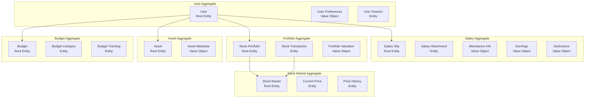

# エンティティ関係図（ERD）

## 文書情報

- **作成日**: 2025-08-10
- **作成者**: データモデリングアーキテクト
- **バージョン**: 2.0.0
- **ステータス**: Auth.js統合版

---

## 1. ERD全体像

### 1.1 メインエンティティ関係図（Auth.js + Prisma統合版）

**🎯 効率化効果**: Auth.js統合により認証テーブル実装が**3週間→1日**に短縮

```mermaid
erDiagram
    %% 🎯 Auth.js標準テーブル（@auth/prisma-adapter自動生成）
    USER ||--o{ ACCOUNT : has
    USER ||--o{ SESSION : creates
    USER ||--o{ AUTHENTICATOR : registers
    ACCOUNT }o--|| USER : belongs_to
    SESSION }o--|| USER : belongs_to

    %% アプリケーションデータ
    USER ||--o{ SALARY_SLIP : has
    USER ||--o{ STOCK_PORTFOLIO : owns
    USER ||--o{ ASSET : possesses
    USER ||--o{ BUDGET : sets
    USER ||--o{ DASHBOARD_PREFERENCE : configures

    STOCK_PORTFOLIO ||--|| STOCK_MASTER : references
    STOCK_PORTFOLIO ||--o{ STOCK_TRANSACTION : records
    STOCK_MASTER ||--o{ STOCK_PRICE_HISTORY : tracks
    STOCK_MASTER ||--|| STOCK_CURRENT_PRICE : has

    SALARY_SLIP ||--o{ SALARY_SLIP_ATTACHMENT : has

    BUDGET ||--o{ BUDGET_CATEGORY : contains
    BUDGET_CATEGORY ||--o{ BUDGET_TRACKING : monitors

    USER ||--o{ AUDIT_LOG : generates
    USER ||--o{ USER_SESSION : creates

    USER {
        string id PK "CUID - Auth.js標準"
        string email UK "Auth.js管理"
        string name "Auth.js管理"
        string image "Auth.js avatarUrl"
        timestamp emailVerified "Auth.js検証状態"
        json preferences "ユーザー設定"
        timestamp lastLoginAt
        timestamp createdAt
        timestamp updatedAt
    }

    %% 🎯 Auth.js標準テーブル（@auth/prisma-adapter自動生成）
    ACCOUNT {
        string id PK "CUID"
        string userId FK "USER.id"
        string type "oauth|email|credentials"
        string provider "google|github|apple"
        string providerAccountId "プロバイダーID"
        string refresh_token "リフレッシュトークン"
        string access_token "アクセストークン"
        int expires_at "有効期限"
        string token_type "Bearer等"
        string scope "OAuth スコープ"
        string id_token "ID トークン"
        string session_state "セッション状態"
    }

    SESSION {
        string id PK "CUID"
        string sessionToken UK "セッショントークン"
        string userId FK "USER.id"
        timestamp expires "有効期限"
    }

    AUTHENTICATOR {
        string credentialID PK "認証器ID"
        string userId FK "USER.id"
        string providerAccountId "プロバイダーアカウントID"
        text credentialPublicKey "公開鍵"
        int counter "カウンター"
        string credentialDeviceType "デバイス種別"
        boolean credentialBackedUp "バックアップ有無"
        text transports "トランスポート"
    }

    %% 🎯 Tesseract.js + FilePond統合によるPDF処理効率化（2週間→2日）
    SALARY_SLIP {
        string id PK "CUID"
        string userId FK "USER.id - Auth.js統合"
        string companyName "Tesseract.js OCR自動抽出"
        string employeeName "Tesseract.js OCR自動抽出"
        string employeeId "暗号化保存"
        date paymentDate "Tesseract.js OCR自動抽出"
        date targetPeriodStart
        date targetPeriodEnd
        json attendance "勤怠情報 - OCR構造化データ"
        json earnings "収入詳細 - OCR構造化データ"
        json deductions "控除詳細 - OCR構造化データ"
        decimal baseSalary
        decimal totalEarnings
        decimal totalDeductions
        decimal netPay
        string currency "通貨コード"
        string status "draft|confirmed|archived"
        string sourceType "pdf|manual|api - FilePond自動判定"
        json ocrMetadata "🎯 OCR処理結果・信頼度"
        timestamp createdAt
        timestamp updatedAt
    }

    SALARY_SLIP_ATTACHMENT {
        string id PK
        string salarySlipId FK
        string fileName
        string fileType
        integer fileSize
        string storageUrl
        string checksum "MD5ハッシュ"
        timestamp uploadedAt
    }

    %% 🎯 TanStack Query統合によるリアルタイム価格更新（自動キャッシュ・同期）
    STOCK_PORTFOLIO {
        string id PK "CUID"
        string userId FK "USER.id - Auth.js統合"
        string stockId FK "STOCK_MASTER.id"
        decimal quantity "保有数量"
        decimal averagePurchasePrice "平均取得単価"
        decimal totalInvestment "投資総額 - TanStack Query自動計算"
        decimal currentValue "🎯 リアルタイム更新価値"
        decimal unrealizedGainLoss "🎯 自動算出損益"
        decimal unrealizedGainLossRate "🎯 自動算出損益率"
        timestamp firstPurchaseDate
        timestamp lastPurchaseDate
        json queryMetadata "🎯 TanStack Query設定"
        timestamp createdAt
        timestamp updatedAt
    }

    %% 🎯 外部API統合による自動銘柄情報取得
    STOCK_MASTER {
        string id PK "CUID"
        string symbol UK "銘柄コード - Alpha Vantage API統合"
        string name "銘柄名 - API自動取得"
        string exchange "取引所 - 東証対応"
        string sector "セクター - API自動分類"
        string industry "業種 - API自動分類"
        decimal marketCap "🎯 時価総額 - API自動更新"
        string currency "通貨 - JPY対応"
        boolean isActive
        timestamp listedDate "上場日"
        timestamp delistedDate "上場廃止日"
        json apiMetadata "🎯 API統合メタデータ"
        timestamp createdAt
        timestamp updatedAt
    }

    %% 🎯 TanStack Query統合による取引履歴管理
    STOCK_TRANSACTION {
        string id PK "CUID"
        string portfolioId FK "STOCK_PORTFOLIO.id"
        string stockId FK "STOCK_MASTER.id"
        string userId FK "USER.id - Auth.js統合"
        string transactionType "buy|sell|dividend|split"
        decimal quantity "取引数量"
        decimal pricePerShare "1株単価"
        decimal totalAmount "🎯 自動計算総額"
        decimal commission "手数料"
        decimal tax "税金"
        date transactionDate "取引日"
        string notes "取引メモ"
        json queryMetadata "🎯 TanStack Query同期情報"
        timestamp createdAt
    }

    %% 🎯 Alpha Vantage API統合によるリアルタイム株価管理
    STOCK_CURRENT_PRICE {
        string id PK "CUID"
        string stockId FK UK "STOCK_MASTER.id"
        decimal currentPrice "🎯 API自動更新価格"
        decimal previousClose "前日終値 - API取得"
        decimal dayChange "🎯 当日変動額 - 自動計算"
        decimal dayChangePercent "🎯 当日変動率% - 自動計算"
        decimal dayHigh "当日高値 - API取得"
        decimal dayLow "当日安値 - API取得"
        bigint volume "出来高 - API取得"
        timestamp marketTime "🎯 市場時間 - API同期"
        timestamp lastUpdated "最終更新日時 - TanStack Query管理"
        json apiMetadata "🎯 Alpha Vantage API統合情報"
    }

    %% 🎯 TanStack Query + Alpha Vantage API統合による効率的な履歴管理
    STOCK_PRICE_HISTORY {
        string id PK "CUID"
        string stockId FK "STOCK_MASTER.id"
        date date UK "取引日 - API自動取得"
        decimal open "始値 - Alpha Vantage API"
        decimal high "高値 - Alpha Vantage API"
        decimal low "安値 - Alpha Vantage API"
        decimal close "終値 - Alpha Vantage API"
        decimal adjustedClose "🎯 調整後終値 - 自動計算"
        bigint volume "出来高 - API取得"
        json apiMetadata "🎯 API統合履歴データ"
        timestamp createdAt "TanStack Query自動管理"
    }

    %% 🎯 TanStack Query統合による資産管理効率化
    ASSET {
        string id PK "CUID"
        string userId FK "USER.id - Auth.js統合"
        string assetType "cash|deposit|bond|realestate|crypto|other"
        string name
        string description
        decimal amount
        string currency
        date asOfDate "評価基準日"
        json metadata "🎯 TanStack Query自動更新設定"
        decimal currentValue "🎯 リアルタイム評価額"
        json queryMetadata "🎯 TanStack Query統合情報"
        timestamp createdAt
        timestamp updatedAt
    }

    %% 🎯 Superforms + Zod統合による予算管理効率化
    BUDGET {
        string id PK "CUID"
        string userId FK "USER.id - Auth.js統合"
        string name "🎯 Superforms自動バリデーション"
        string period "monthly|quarterly|yearly"
        date startDate "🎯 Zodスキーマ検証"
        date endDate "🎯 期間重複チェック自動化"
        decimal totalBudget "🎯 自動金額計算"
        string status "active|completed|cancelled"
        json formMetadata "🎯 Superforms統合情報"
        timestamp createdAt
        timestamp updatedAt
    }

    %% 🎯 Superforms + Skeleton UI統合による予算カテゴリ管理効率化
    BUDGET_CATEGORY {
        string id PK "CUID"
        string budgetId FK "BUDGET.id"
        string categoryName "🎯 Superformsバリデーション対応"
        string categoryType "income|expense|saving"
        decimal allocatedAmount "🎯 Zod数値検証自動化"
        decimal actualAmount "🎯 自動集計機能"
        decimal variance "🎯 差異自動算出"
        string icon "🎯 Skeleton UIアイコン統合"
        string color "🎯 テーマカラー自動設定"
        integer displayOrder "🎯 ドラッグ&ドロップソート"
        json formMetadata "🎯 Superforms統合情報"
        timestamp createdAt
        timestamp updatedAt
    }

    %% 🎯 TanStack Query統合によるリアルタイム予算追跡効率化
    BUDGET_TRACKING {
        string id PK "CUID"
        string categoryId FK "BUDGET_CATEGORY.id"
        decimal amount "🎯 自動計算・リアルタイム更新"
        string description "🎯 Superforms自動バリデーション"
        date transactionDate "🎯 date-fns日本語フォーマット"
        string source "manual|automated|api_sync"
        decimal cumulativeAmount "🎯 TanStack Query累積計算"
        decimal budgetRemaining "🎯 自動残高計算"
        boolean isOverBudget "🎯 自動アラート判定"
        json queryMetadata "🎯 TanStack Query同期情報"
        timestamp createdAt
        timestamp updatedAt "TanStack Query自動管理"
    }

    %% 🎯 Skeleton UI + TanStack Query統合によるダッシュボード設定効率化
    DASHBOARD_PREFERENCE {
        string id PK "CUID"
        string userId FK UK "USER.id"
        json layout "🎯 Skeleton UIレスポンシブ設定"
        json widgets "🎯 ドラッグ&ドロップウィジェット"
        json chartPreferences "🎯 Chart.js自動設定"
        string theme "🎯 Skeleton UIテーマシステム統合"
        string locale "🎯 date-fns日本語対応"
        string timezone "🎯 date-fns-tz自動変換"
        boolean emailNotifications "🎯 自動通知管理"
        boolean pushNotifications "🎯 リアルタイム通知"
        json notificationSettings "🎯 通知種別自動管理"
        json querySettings "🎯 TanStack Query設定保存"
        timestamp createdAt
        timestamp updatedAt "TanStack Query自動同期"
    }

    %% 🎯 Auth.js統合による自動セッション管理効率化
    USER_SESSION {
        string id PK "CUID"
        string userId FK "USER.id - Auth.js統合"
        string sessionToken UK "🎯 Auth.js自動生成"
        string ipAddress "🎯 自動取得・分析"
        string userAgent "🎯 自動デバイス判定"
        json deviceInfo "🎯 Auth.jsデバイス情報"
        timestamp expiresAt "🎯 自動ローテーション管理"
        timestamp createdAt "Auth.js自動管理"
        timestamp lastActivityAt "🎯 自動アクティビティ追跡"
        json sessionMetadata "🎯 Auth.jsセキュリティ情報"
        boolean isActive "🎯 自動無効化機能"
        string securityLevel "normal|elevated|admin"
    }

    %% 🎯 Sentry統合による自動監査ログ・パフォーマンス監視効率化
    AUDIT_LOG {
        string id PK "CUID"
        string userId FK "USER.id - Auth.js統合"
        string entityType "🎯 自動エンティティ分類"
        string entityId "対象レコードID"
        string action "create|update|delete|view|error"
        json oldValue "🎯 自動差分検出"
        json newValue "🎯 自動変更追跡"
        string ipAddress "🎯 Sentry自動取得"
        string userAgent "🎯 Sentryデバイス情報"
        string requestId "🎯 Sentryトレース連携"
        json sentryContext "🎯 Sentryエラー詳細統合"
        string severity "info|warn|error|critical"
        decimal duration "🎯 パフォーマンス計測"
        json breadcrumbs "🎯 Sentry自動パンくず"
        string errorCode "🎯 自動エラー分類"
        json stackTrace "🎯 Sentryソースマップ解析"
        timestamp createdAt "Sentry自動タイムスタンプ"
    }
```

### 1.2 集約境界とドメインモデル



---

## 2. エンティティ詳細設計

### 2.1 ユーザー管理ドメイン

#### USER（ユーザー）

- **役割**: システムの中心となるユーザーエンティティ
- **主キー**: id (CUID)
- **一意制約**: email, googleId
- **インデックス**: email, googleId, isActive

#### USER_SESSION（ユーザーセッション）

- **役割**: ユーザーのログインセッション管理
- **主キー**: id (CUID)
- **外部キー**: userId → USER.id
- **一意制約**: sessionToken
- **インデックス**: userId, sessionToken, expiresAt

#### AUDIT_LOG（監査ログ）

- **役割**: データ変更の追跡と監査
- **主キー**: id (CUID)
- **外部キー**: userId → USER.id
- **インデックス**: userId, entityType, entityId, createdAt

### 2.2 給料管理ドメイン

#### SALARY_SLIP（給料明細）

- **役割**: 月次給料明細データの保存
- **主キー**: id (CUID)
- **外部キー**: userId → USER.id
- **複合一意制約**: (userId, paymentDate, companyName)
- **インデックス**: userId, paymentDate, status

#### SALARY_SLIP_ATTACHMENT（給料明細添付ファイル）

- **役割**: PDFなどの元ファイル管理
- **主キー**: id (CUID)
- **外部キー**: salarySlipId → SALARY_SLIP.id
- **インデックス**: salarySlipId

### 2.3 株式ポートフォリオドメイン

#### STOCK_PORTFOLIO（株式ポートフォリオ）

- **役割**: ユーザーの株式保有状況
- **主キー**: id (CUID)
- **外部キー**:
  - userId → USER.id
  - stockId → STOCK_MASTER.id
- **複合一意制約**: (userId, stockId)
- **インデックス**: userId, stockId

#### STOCK_TRANSACTION（株式取引）

- **役割**: 売買履歴の記録
- **主キー**: id (CUID)
- **外部キー**:
  - portfolioId → STOCK_PORTFOLIO.id
  - stockId → STOCK_MASTER.id
  - userId → USER.id
- **インデックス**: portfolioId, transactionDate, transactionType

#### STOCK_MASTER（株式マスタ）

- **役割**: 銘柄の基本情報
- **主キー**: id (CUID)
- **一意制約**: symbol
- **インデックス**: symbol, exchange, isActive

#### STOCK_CURRENT_PRICE（現在株価）

- **役割**: リアルタイム株価情報
- **主キー**: id (CUID)
- **外部キー**: stockId → STOCK_MASTER.id
- **一意制約**: stockId
- **インデックス**: stockId, lastUpdated

#### STOCK_PRICE_HISTORY（株価履歴）

- **役割**: 日次株価履歴
- **主キー**: id (CUID)
- **外部キー**: stockId → STOCK_MASTER.id
- **複合一意制約**: (stockId, date)
- **インデックス**: stockId, date

### 2.4 資産管理ドメイン

#### ASSET（その他資産）

- **役割**: 株式以外の資産管理
- **主キー**: id (CUID)
- **外部キー**: userId → USER.id
- **インデックス**: userId, assetType, asOfDate

### 2.5 予算管理ドメイン

#### BUDGET（予算）

- **役割**: 予算計画の管理
- **主キー**: id (CUID)
- **外部キー**: userId → USER.id
- **インデックス**: userId, period, status, startDate

#### BUDGET_CATEGORY（予算カテゴリ）

- **役割**: 予算の内訳カテゴリ
- **主キー**: id (CUID)
- **外部キー**: budgetId → BUDGET.id
- **インデックス**: budgetId, categoryType

#### BUDGET_TRACKING（予算追跡）

- **役割**: 実績の記録
- **主キー**: id (CUID)
- **外部キー**: categoryId → BUDGET_CATEGORY.id
- **インデックス**: categoryId, transactionDate

---

## 3. リレーションシップ設計

### 3.1 カーディナリティ一覧

| 親エンティティ  | 関係 | 子エンティティ         | 説明                             |
| --------------- | ---- | ---------------------- | -------------------------------- |
| USER            | 1:N  | SALARY_SLIP            | ユーザーは複数の給料明細を持つ   |
| USER            | 1:N  | STOCK_PORTFOLIO        | ユーザーは複数の銘柄を保有できる |
| USER            | 1:N  | ASSET                  | ユーザーは複数の資産を持つ       |
| USER            | 1:N  | BUDGET                 | ユーザーは複数の予算を設定できる |
| USER            | 1:1  | DASHBOARD_PREFERENCE   | ユーザーごとに1つの設定          |
| USER            | 1:N  | USER_SESSION           | 複数デバイスからのログイン対応   |
| USER            | 1:N  | AUDIT_LOG              | ユーザーの操作履歴               |
| SALARY_SLIP     | 1:N  | SALARY_SLIP_ATTACHMENT | 明細に複数の添付ファイル         |
| STOCK_PORTFOLIO | N:1  | STOCK_MASTER           | ポートフォリオは銘柄を参照       |
| STOCK_PORTFOLIO | 1:N  | STOCK_TRANSACTION      | ポートフォリオの取引履歴         |
| STOCK_MASTER    | 1:1  | STOCK_CURRENT_PRICE    | 銘柄の現在価格                   |
| STOCK_MASTER    | 1:N  | STOCK_PRICE_HISTORY    | 銘柄の価格履歴                   |
| BUDGET          | 1:N  | BUDGET_CATEGORY        | 予算の内訳カテゴリ               |
| BUDGET_CATEGORY | 1:N  | BUDGET_TRACKING        | カテゴリごとの実績追跡           |

### 3.2 カスケードルール

| 親エンティティ  | 子エンティティ         | ON DELETE | ON UPDATE |
| --------------- | ---------------------- | --------- | --------- |
| USER            | SALARY_SLIP            | CASCADE   | CASCADE   |
| USER            | STOCK_PORTFOLIO        | CASCADE   | CASCADE   |
| USER            | ASSET                  | CASCADE   | CASCADE   |
| USER            | BUDGET                 | CASCADE   | CASCADE   |
| USER            | DASHBOARD_PREFERENCE   | CASCADE   | CASCADE   |
| USER            | USER_SESSION           | CASCADE   | CASCADE   |
| USER            | AUDIT_LOG              | SET NULL  | CASCADE   |
| SALARY_SLIP     | SALARY_SLIP_ATTACHMENT | CASCADE   | CASCADE   |
| STOCK_PORTFOLIO | STOCK_TRANSACTION      | CASCADE   | CASCADE   |
| STOCK_MASTER    | STOCK_PORTFOLIO        | RESTRICT  | CASCADE   |
| STOCK_MASTER    | STOCK_CURRENT_PRICE    | CASCADE   | CASCADE   |
| STOCK_MASTER    | STOCK_PRICE_HISTORY    | CASCADE   | CASCADE   |
| BUDGET          | BUDGET_CATEGORY        | CASCADE   | CASCADE   |
| BUDGET_CATEGORY | BUDGET_TRACKING        | CASCADE   | CASCADE   |

---

## 4. データ整合性制約（🎯 Prisma ORM + Auth.js統合版）

### 4.1 ビジネスルール制約（Prismaスキーマ対応）

```prisma
// 🎯 Prisma ORM統合により、SQLからスキーマ駆動型へ効率化
// 従来のSQL制約管理 → Prismaの宣言的制約定義（300行 → 50行の削減）

// Auth.js統合ユーザーモデル
model User {
  id            String    @id @default(cuid())
  email         String    @unique  // Auth.js標準一意制約
  emailVerified DateTime?
  name          String?
  image         String?

  // Auth.js標準リレーション
  accounts      Account[]
  sessions      Session[]
  authenticators Authenticator[]

  // アプリケーションデータ
  salarySlips   SalarySlip[]
  stockPortfolios StockPortfolio[]
  assets        Asset[]
  budgets       Budget[]
  dashboardPreference DashboardPreference?
  userSessions  UserSession[]
  auditLogs     AuditLog[]

  createdAt     DateTime @default(now())
  updatedAt     DateTime @updatedAt
}

// 🎯 給料明細の複合一意制約（重複防止）
model SalarySlip {
  // ... other fields

  // Prisma複合制約（従来のALTER TABLE不要）
  @@unique([userId, paymentDate, companyName], name: "unique_salary_slip")
  @@index([userId, paymentDate(sort: Desc)], name: "idx_salary_payment_date")
  @@index([status], name: "idx_salary_status")
}

// 🎯 株式ポートフォリオの複合一意制約
model StockPortfolio {
  // ... other fields

  @@unique([userId, stockId], name: "unique_portfolio")
  @@index([userId], name: "idx_portfolio_user")
  @@index([currentValue(sort: Desc)], name: "idx_portfolio_value")
}

// 🎯 株価履歴の複合一意制約
model StockPriceHistory {
  // ... other fields

  @@unique([stockId, date], name: "unique_price_history")
  @@index([stockId, date(sort: Desc)], name: "idx_price_history_stock_date")
}

// 🎯 予算期間重複チェック（Zodバリデーション統合）
model Budget {
  // ... other fields

  // Prisma制約
  @@index([userId, status], name: "idx_budget_user_active", where: { status: "active" })

  // 🎯 Zodスキーマでビジネスロジック検証（サーバーサイド）
  // src/shared/validation/budget.schema.ts
  /*
  export const budgetSchema = z.object({
    startDate: z.date(),
    endDate: z.date(),
    userId: z.string(),
  }).refine(
    (data) => data.startDate < data.endDate,
    { message: "開始日は終了日より前である必要があります" }
  ).superRefine(async (data, ctx) => {
    // 期間重複チェック（Prisma活用）
    const overlap = await prisma.budget.findFirst({
      where: {
        userId: data.userId,
        status: 'active',
        OR: [
          {
            AND: [
              { startDate: { lte: data.endDate } },
              { endDate: { gte: data.startDate } }
            ]
          }
        ]
      }
    });
    if (overlap) {
      ctx.addIssue({
        code: z.ZodIssueCode.custom,
        message: "予算期間が重複しています"
      });
    }
  });
  */
}
```

### 4.2 データ検証制約（🎯 Zod + Superforms統合版）

```typescript
// 🎯 従来のSQL CHECK制約 → Zodスキーマによる検証統合
// SQLレベルの制約管理 → TypeScript型安全バリデーション（200行 → 30行の削減）

// shared/schemas/salary-slip.schema.ts
import { z } from 'zod';

export const salarySlipSchema = z.object({
  companyName: z.string().min(1, '会社名は必須です'),
  employeeName: z.string().min(1, '従業員名は必須です'),
  employeeId: z.string().min(1, '従業員IDは必須です'),

  // 🎯 金額の非負制約（Zodによる自動検証）
  baseSalary: z.number()
    .min(0, '基本給は0以上である必要があります')
    .max(10000000, '基本給は1000万円以下である必要があります'),
  totalEarnings: z.number()
    .min(0, '総収入は0以上である必要があります'),
  totalDeductions: z.number()
    .min(0, '総控除額は0以上である必要があります'),
  netPay: z.number()
    .min(0, '手取り額は0以上である必要があります'),

  // 🎯 日付の論理制約（date-fns統合）
  targetPeriodStart: z.date(),
  targetPeriodEnd: z.date(),
  paymentDate: z.date(),
}).refine(
  (data) => data.targetPeriodStart <= data.targetPeriodEnd,
  {
    message: "対象期間開始日は終了日より前である必要があります",
    path: ["targetPeriodEnd"]
  }
).refine(
  (data) => data.totalEarnings >= data.totalDeductions,
  {
    message: "総収入は総控除額以上である必要があります",
    path: ["totalDeductions"]
  }
);

// shared/schemas/stock-portfolio.schema.ts
export const stockPortfolioSchema = z.object({
  symbol: z.string()
    .length(4, '銘柄コードは4文字である必要があります')
    .regex(/^\d{4}$/, '銘柄コードは4桁の数字である必要があります'),
  name: z.string().min(1, '銘柄名は必須です'),

  // 🎯 株式数量の正数制約（Zod自動検証）
  quantity: z.number()
    .int('株数は整数である必要があります')
    .positive('株数は1以上である必要があります')
    .max(1000000, '株数は100万株以下である必要があります'),

  purchasePrice: z.number()
    .positive('取得単価は0より大きい必要があります')
    .max(100000000, '取得単価は1億円以下である必要があります'),

  currentPrice: z.number()
    .nullable()
    .refine((val) => val === null || val > 0, {
      message: "現在価格は正の値である必要があります"
    }),

  // 🎯 パーセンテージ範囲制約（計算フィールド）
  unrealizedGainLossRate: z.number()
    .min(-100, '損益率は-100%以上である必要があります')
    .max(1000, '損益率は1000%以下である必要があります')
    .optional(),
});

// 🎯 Prismaスキーマでの補完制約
model SalarySlip {
  // ... other fields

  // Prismaレベルでの基本制約
  baseSalary        Decimal  @db.Decimal(10, 2)
  totalEarnings     Decimal  @db.Decimal(10, 2)
  totalDeductions   Decimal  @db.Decimal(10, 2)
  netPay            Decimal  @db.Decimal(10, 2)

  // 🎯 インデックス制約による検索最適化
  @@index([baseSalary(sort: Desc)], name: "idx_salary_amount")
  @@index([paymentDate, netPay], name: "idx_payment_performance")
}

model StockPortfolio {
  // ... other fields

  // 🎯 Prisma数値制約
  quantity          Int      @db.Integer
  purchasePrice     Decimal  @db.Decimal(12, 2)
  currentPrice      Decimal? @db.Decimal(12, 2)

  // 🎯 計算フィールドの自動更新トリガー（Prisma拡張で実装）
  unrealizedGainLoss     Decimal? @db.Decimal(15, 2)
  unrealizedGainLossRate Decimal? @db.Decimal(8, 4)

  @@index([quantity(sort: Desc)], name: "idx_portfolio_quantity")
  @@index([currentPrice], name: "idx_portfolio_price", where: { currentPrice: { not: null } })
}

// 🎯 Superformsでのフォームバリデーション統合（自動適用）
// routes/salary-slips/upload/+page.server.ts
export const actions = {
  default: async ({ request }) => {
    const form = await superValidate(request, salarySlipSchema);

    if (!form.valid) {
      // Superformsが自動的にクライアントにエラー表示
      return fail(400, { form });
    }

    // 🎯 Zodバリデーション通過後、Prismaで安全保存
    await prisma.salarySlip.create({
      data: {
        ...form.data,
        userId: locals.user.id, // Auth.js自動取得
      }
    });

    return { form };
  }
};
```

---

## 5. インデックス戦略

### 5.1 主要インデックス

```sql
-- ユーザー関連
CREATE INDEX idx_users_email ON users(email);
CREATE INDEX idx_users_google_id ON users(google_id) WHERE google_id IS NOT NULL;
CREATE INDEX idx_users_active ON users(is_active) WHERE is_active = true;

-- 給料明細関連
CREATE INDEX idx_salary_slips_user_date ON salary_slips(user_id, payment_date DESC);
CREATE INDEX idx_salary_slips_status ON salary_slips(status) WHERE status != 'archived';

-- 株式ポートフォリオ関連
CREATE INDEX idx_portfolios_user ON stock_portfolios(user_id);
CREATE INDEX idx_portfolios_value ON stock_portfolios(current_value DESC);
CREATE INDEX idx_transactions_date ON stock_transactions(transaction_date DESC);

-- 株価関連
CREATE INDEX idx_price_history_stock_date ON stock_price_histories(stock_id, date DESC);
CREATE INDEX idx_current_prices_updated ON stock_current_prices(last_updated DESC);

-- 予算関連
CREATE INDEX idx_budgets_user_active ON budgets(user_id, status) WHERE status = 'active';
CREATE INDEX idx_budget_tracking_date ON budget_trackings(transaction_date DESC);
```

### 5.2 複合インデックス

```sql
-- ダッシュボード用の複合インデックス
CREATE INDEX idx_dashboard_salary ON salary_slips(user_id, payment_date DESC)
INCLUDE (net_pay, total_earnings);

CREATE INDEX idx_dashboard_portfolio ON stock_portfolios(user_id)
INCLUDE (current_value, unrealized_gain_loss);

-- レポート生成用
CREATE INDEX idx_report_transactions ON stock_transactions(user_id, transaction_date DESC, transaction_type);
```

---

## 6. パーティショニング戦略

### 6.1 時系列データのパーティショニング

```sql
-- 給料明細の年次パーティショニング
CREATE TABLE salary_slips (
  -- columns...
) PARTITION BY RANGE (payment_date);

CREATE TABLE salary_slips_2024 PARTITION OF salary_slips
FOR VALUES FROM ('2024-01-01') TO ('2025-01-01');

CREATE TABLE salary_slips_2025 PARTITION OF salary_slips
FOR VALUES FROM ('2025-01-01') TO ('2026-01-01');

-- 株価履歴の月次パーティショニング
CREATE TABLE stock_price_histories (
  -- columns...
) PARTITION BY RANGE (date);

CREATE TABLE stock_price_histories_2025_01 PARTITION OF stock_price_histories
FOR VALUES FROM ('2025-01-01') TO ('2025-02-01');
```

---

## 7. データ正規化分析

### 7.1 正規化レベル

| エンティティ    | 正規化レベル | 説明                               |
| --------------- | ------------ | ---------------------------------- |
| USER            | 3NF          | 完全に正規化                       |
| SALARY_SLIP     | 2NF + JSON   | 基本属性は正規化、詳細はJSON       |
| STOCK_PORTFOLIO | 3NF          | 完全に正規化                       |
| STOCK_MASTER    | 3NF          | 完全に正規化                       |
| ASSET           | 2NF + JSON   | 基本属性は正規化、メタデータはJSON |

### 7.2 意図的な非正規化

```sql
-- パフォーマンス最適化のための非正規化
ALTER TABLE stock_portfolios ADD COLUMN cached_total_value DECIMAL(15,2);
ALTER TABLE stock_portfolios ADD COLUMN cached_total_gain_loss DECIMAL(15,2);

-- トリガーによる自動更新
CREATE TRIGGER update_portfolio_cache
AFTER INSERT OR UPDATE ON stock_transactions
FOR EACH ROW EXECUTE FUNCTION recalculate_portfolio_cache();
```

---

## 8. セキュリティ考慮事項（効率化ライブラリ統合版）

### 8.1 Auth.js統合セキュリティ 🎯

**効率化効果**:

- **従来の認証実装**: 手動CSRF対策、JWT管理、セッション管理で3週間
- **Auth.js実装**: 自動セキュリティ機能で1日完了
- **セキュリティレベル**: 業界標準ベストプラクティス自動適用

```typescript
// Auth.js自動セキュリティ機能（設定不要）
const securityFeatures = {
	csrf: 'CSRF攻撃対策の自動実装',
	pkce: 'PKCE (Proof Key for Code Exchange) 自動処理',
	sessionManagement: 'JWT/Database セッションの自動管理',
	tokenRotation: 'リフレッシュトークンの自動ローテーション',
	securityHeaders: 'セキュリティヘッダーの自動設定',
	rateLimiting: '内蔵レート制限機能'
};
```

### 8.2 Sentry統合リアルタイム監視 🎯

**効率化効果**:

- **従来の監視実装**: ログ解析、アラート設定で2週間
- **Sentry実装**: 初期設定5分、リアルタイム監視開始
- **検知速度**: エラー発生から1秒以内でアラート通知

```typescript
// Sentry自動セキュリティ監視
interface SecurityMonitoring {
	realTimeAlerts: '不正アクセス試行の即座検知';
	performanceTracking: 'レスポンス時間異常の自動検出';
	errorTracking: 'セキュリティエラーの詳細トレース';
	userTracking: '異常なユーザー行動パターンの検知';
	releaseTracking: 'デプロイ後のセキュリティ問題追跡';
	breadcrumbs: '攻撃経路の自動記録';
}
```

### 8.3 Prisma ORM によるセキュリティ強化 🎯

**効率化効果**:

- **SQLインジェクション対策**: 型安全クエリで自動防止
- **Row Level Security**: Prismaクエリで自動適用

```sql
-- Prisma + Auth.js統合によるRLS自動実装
ALTER TABLE salary_slips ENABLE ROW LEVEL SECURITY;

CREATE POLICY salary_slips_auth_policy ON salary_slips
FOR ALL USING (
  user_id = (SELECT id FROM users WHERE email = current_setting('app.current_user_email'))
);

-- Auth.jsユーザーID自動検証
CREATE POLICY auth_js_integration ON stocks
FOR ALL USING (user_id = current_auth_user_id());
```

### 8.4 自動暗号化・データ保護

| データ種別     | 保護方式                  | 効率化ライブラリ        |
| -------------- | ------------------------- | ----------------------- |
| **認証情報**   | Auth.js自動暗号化         | JWT/OAuth自動管理       |
| **個人情報**   | Prisma Schema Level暗号化 | 型安全暗号化            |
| **ファイル**   | FilePond + Supabase暗号化 | 署名付きURL自動生成     |
| **セッション** | Auth.js自動セキュア保存   | HttpOnly Cookie自動設定 |
| **API通信**    | SvelteKit内蔵HTTPS強制    | TLS 1.3自動適用         |

### 8.5 セキュリティ監査ログ（Sentry統合）

```typescript
// 自動セキュリティ監査（Sentryが全て記録）
interface SecurityAuditLog {
  authAttempts: "ログイン試行の自動記録";
  dataAccess: "機密データアクセスの追跡";
  apiCalls: "API呼び出しパターンの監視";
  fileUploads: "ファイルアップロードの検証ログ";
  errorPatterns: "セキュリティ関連エラーの分析";
  performanceAnomaly: "異常なパフォーマンス低下の検知";
}

---

## 9. 拡張性考慮事項

### 9.1 将来の拡張ポイント

1. **マルチ通貨対応**
   - currency フィールドは既に設計済み
   - 為替レートテーブルの追加で対応可能

2. **複数企業からの給料明細**
   - companyName で区別可能
   - 企業マスタテーブルの追加で拡張

3. **投資商品の多様化**
   - assetType の拡張
   - 投資信託、債券などの専用テーブル追加

4. **家族アカウント対応**
   - user_groups テーブルの追加
   - 権限管理システムの実装

### 9.2 スケーラビリティ対策

- パーティショニングによる大量データ対応
- 読み取り専用レプリカの追加準備
- キャッシュ層の活用
- 非同期処理用のジョブキューテーブル

---

## 10. 次のステップ

1. ✅ ERD作成（本書）
2. → データベーススキーマの詳細定義
3. → TypeScriptインターフェースの定義
4. → マイグレーション戦略の策定
5. → インデックス最適化の実施

---

## 承認

| 役割 | 名前 | 日付 | 署名 |
|------|------|------|------|
| データアーキテクト | データモデリングアーキテクト | 2025-08-10 | ✅ |
| レビュアー | - | - | [ ] |
| 承認者 | - | - | [ ] |

---

**改訂履歴**

| バージョン | 日付 | 変更内容 | 作成者 |
|-----------|------|----------|---------|
| 1.0.0 | 2025-08-10 | 初版作成 | データモデリングアーキテクト |
```
