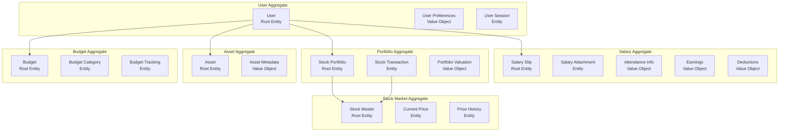

# エンティティ関係図（ERD）

## 文書情報
- **作成日**: 2025-08-10
- **作成者**: データモデリングアーキテクト
- **バージョン**: 1.0.0
- **ステータス**: 初版

---

## 1. ERD全体像

### 1.1 メインエンティティ関係図

```mermaid
erDiagram
    USER ||--o{ SALARY_SLIP : has
    USER ||--o{ STOCK_PORTFOLIO : owns
    USER ||--o{ ASSET : possesses
    USER ||--o{ BUDGET : sets
    USER ||--o{ DASHBOARD_PREFERENCE : configures
    
    STOCK_PORTFOLIO ||--|| STOCK_MASTER : references
    STOCK_PORTFOLIO ||--o{ STOCK_TRANSACTION : records
    STOCK_MASTER ||--o{ STOCK_PRICE_HISTORY : tracks
    STOCK_MASTER ||--|| STOCK_CURRENT_PRICE : has
    
    SALARY_SLIP ||--o{ SALARY_SLIP_ATTACHMENT : has
    
    BUDGET ||--o{ BUDGET_CATEGORY : contains
    BUDGET_CATEGORY ||--o{ BUDGET_TRACKING : monitors
    
    USER ||--o{ AUDIT_LOG : generates
    USER ||--o{ USER_SESSION : creates

    USER {
        string id PK "CUID"
        string email UK "一意制約"
        string name
        string googleId UK "Google OAuth ID"
        string avatarUrl
        boolean isActive
        json preferences "ユーザー設定"
        timestamp emailVerifiedAt
        timestamp lastLoginAt
        timestamp createdAt
        timestamp updatedAt
    }
    
    SALARY_SLIP {
        string id PK "CUID"
        string userId FK
        string companyName
        string employeeName
        string employeeId
        date paymentDate
        date targetPeriodStart
        date targetPeriodEnd
        json attendance "勤怠情報"
        json earnings "収入詳細"
        json deductions "控除詳細"
        decimal baseSalary
        decimal totalEarnings
        decimal totalDeductions
        decimal netPay
        string currency "通貨コード"
        string status "draft|confirmed|archived"
        string sourceType "pdf|manual|api"
        timestamp createdAt
        timestamp updatedAt
    }
    
    SALARY_SLIP_ATTACHMENT {
        string id PK
        string salarySlipId FK
        string fileName
        string fileType
        integer fileSize
        string storageUrl
        string checksum "MD5ハッシュ"
        timestamp uploadedAt
    }
    
    STOCK_PORTFOLIO {
        string id PK "CUID"
        string userId FK
        string stockId FK
        decimal quantity "保有数量"
        decimal averagePurchasePrice "平均取得単価"
        decimal totalInvestment "投資総額"
        decimal currentValue "現在価値"
        decimal unrealizedGainLoss "未実現損益"
        decimal unrealizedGainLossRate "未実現損益率"
        timestamp firstPurchaseDate
        timestamp lastPurchaseDate
        timestamp createdAt
        timestamp updatedAt
    }
    
    STOCK_MASTER {
        string id PK "CUID"
        string symbol UK "銘柄コード"
        string name "銘柄名"
        string exchange "取引所"
        string sector "セクター"
        string industry "業種"
        decimal marketCap "時価総額"
        string currency "通貨"
        boolean isActive
        timestamp listedDate "上場日"
        timestamp delistedDate "上場廃止日"
        timestamp createdAt
        timestamp updatedAt
    }
    
    STOCK_TRANSACTION {
        string id PK
        string portfolioId FK
        string stockId FK
        string userId FK
        string transactionType "buy|sell|dividend"
        decimal quantity
        decimal pricePerShare
        decimal totalAmount
        decimal commission "手数料"
        decimal tax "税金"
        date transactionDate
        string notes
        timestamp createdAt
    }
    
    STOCK_CURRENT_PRICE {
        string id PK
        string stockId FK UK
        decimal currentPrice
        decimal previousClose
        decimal dayChange
        decimal dayChangePercent
        decimal dayHigh
        decimal dayLow
        bigint volume
        timestamp marketTime
        timestamp lastUpdated
    }
    
    STOCK_PRICE_HISTORY {
        string id PK
        string stockId FK
        date date UK
        decimal open
        decimal high
        decimal low
        decimal close
        decimal adjustedClose
        bigint volume
        timestamp createdAt
    }
    
    ASSET {
        string id PK "CUID"
        string userId FK
        string assetType "cash|deposit|bond|realestate|crypto|other"
        string name
        string description
        decimal amount
        string currency
        date asOfDate "評価基準日"
        json metadata "追加情報"
        timestamp createdAt
        timestamp updatedAt
    }
    
    BUDGET {
        string id PK
        string userId FK
        string name
        string period "monthly|quarterly|yearly"
        date startDate
        date endDate
        decimal totalBudget
        string status "active|completed|cancelled"
        timestamp createdAt
        timestamp updatedAt
    }
    
    BUDGET_CATEGORY {
        string id PK
        string budgetId FK
        string categoryName
        string categoryType "income|expense|saving"
        decimal allocatedAmount
        decimal actualAmount
        decimal variance "差異"
        string icon
        string color
        integer displayOrder
    }
    
    BUDGET_TRACKING {
        string id PK
        string categoryId FK
        decimal amount
        string description
        date transactionDate
        string source "manual|automated"
        timestamp createdAt
    }
    
    DASHBOARD_PREFERENCE {
        string id PK
        string userId FK UK
        json layout "ダッシュボードレイアウト"
        json widgets "表示ウィジェット設定"
        json chartPreferences "グラフ表示設定"
        string theme "light|dark|auto"
        string locale "ja|en"
        string timezone
        boolean emailNotifications
        boolean pushNotifications
        json notificationSettings
        timestamp createdAt
        timestamp updatedAt
    }
    
    USER_SESSION {
        string id PK
        string userId FK
        string sessionToken UK
        string ipAddress
        string userAgent
        json deviceInfo
        timestamp expiresAt
        timestamp createdAt
        timestamp lastActivityAt
    }
    
    AUDIT_LOG {
        string id PK
        string userId FK
        string entityType
        string entityId
        string action "create|update|delete|view"
        json oldValue
        json newValue
        string ipAddress
        string userAgent
        timestamp createdAt
    }
```

### 1.2 集約境界とドメインモデル



---

## 2. エンティティ詳細設計

### 2.1 ユーザー管理ドメイン

#### USER（ユーザー）
- **役割**: システムの中心となるユーザーエンティティ
- **主キー**: id (CUID)
- **一意制約**: email, googleId
- **インデックス**: email, googleId, isActive

#### USER_SESSION（ユーザーセッション）
- **役割**: ユーザーのログインセッション管理
- **主キー**: id (CUID)
- **外部キー**: userId → USER.id
- **一意制約**: sessionToken
- **インデックス**: userId, sessionToken, expiresAt

#### AUDIT_LOG（監査ログ）
- **役割**: データ変更の追跡と監査
- **主キー**: id (CUID)
- **外部キー**: userId → USER.id
- **インデックス**: userId, entityType, entityId, createdAt

### 2.2 給料管理ドメイン

#### SALARY_SLIP（給料明細）
- **役割**: 月次給料明細データの保存
- **主キー**: id (CUID)
- **外部キー**: userId → USER.id
- **複合一意制約**: (userId, paymentDate, companyName)
- **インデックス**: userId, paymentDate, status

#### SALARY_SLIP_ATTACHMENT（給料明細添付ファイル）
- **役割**: PDFなどの元ファイル管理
- **主キー**: id (CUID)
- **外部キー**: salarySlipId → SALARY_SLIP.id
- **インデックス**: salarySlipId

### 2.3 株式ポートフォリオドメイン

#### STOCK_PORTFOLIO（株式ポートフォリオ）
- **役割**: ユーザーの株式保有状況
- **主キー**: id (CUID)
- **外部キー**: 
  - userId → USER.id
  - stockId → STOCK_MASTER.id
- **複合一意制約**: (userId, stockId)
- **インデックス**: userId, stockId

#### STOCK_TRANSACTION（株式取引）
- **役割**: 売買履歴の記録
- **主キー**: id (CUID)
- **外部キー**:
  - portfolioId → STOCK_PORTFOLIO.id
  - stockId → STOCK_MASTER.id
  - userId → USER.id
- **インデックス**: portfolioId, transactionDate, transactionType

#### STOCK_MASTER（株式マスタ）
- **役割**: 銘柄の基本情報
- **主キー**: id (CUID)
- **一意制約**: symbol
- **インデックス**: symbol, exchange, isActive

#### STOCK_CURRENT_PRICE（現在株価）
- **役割**: リアルタイム株価情報
- **主キー**: id (CUID)
- **外部キー**: stockId → STOCK_MASTER.id
- **一意制約**: stockId
- **インデックス**: stockId, lastUpdated

#### STOCK_PRICE_HISTORY（株価履歴）
- **役割**: 日次株価履歴
- **主キー**: id (CUID)
- **外部キー**: stockId → STOCK_MASTER.id
- **複合一意制約**: (stockId, date)
- **インデックス**: stockId, date

### 2.4 資産管理ドメイン

#### ASSET（その他資産）
- **役割**: 株式以外の資産管理
- **主キー**: id (CUID)
- **外部キー**: userId → USER.id
- **インデックス**: userId, assetType, asOfDate

### 2.5 予算管理ドメイン

#### BUDGET（予算）
- **役割**: 予算計画の管理
- **主キー**: id (CUID)
- **外部キー**: userId → USER.id
- **インデックス**: userId, period, status, startDate

#### BUDGET_CATEGORY（予算カテゴリ）
- **役割**: 予算の内訳カテゴリ
- **主キー**: id (CUID)
- **外部キー**: budgetId → BUDGET.id
- **インデックス**: budgetId, categoryType

#### BUDGET_TRACKING（予算追跡）
- **役割**: 実績の記録
- **主キー**: id (CUID)
- **外部キー**: categoryId → BUDGET_CATEGORY.id
- **インデックス**: categoryId, transactionDate

---

## 3. リレーションシップ設計

### 3.1 カーディナリティ一覧

| 親エンティティ | 関係 | 子エンティティ | 説明 |
|--------------|------|--------------|------|
| USER | 1:N | SALARY_SLIP | ユーザーは複数の給料明細を持つ |
| USER | 1:N | STOCK_PORTFOLIO | ユーザーは複数の銘柄を保有できる |
| USER | 1:N | ASSET | ユーザーは複数の資産を持つ |
| USER | 1:N | BUDGET | ユーザーは複数の予算を設定できる |
| USER | 1:1 | DASHBOARD_PREFERENCE | ユーザーごとに1つの設定 |
| USER | 1:N | USER_SESSION | 複数デバイスからのログイン対応 |
| USER | 1:N | AUDIT_LOG | ユーザーの操作履歴 |
| SALARY_SLIP | 1:N | SALARY_SLIP_ATTACHMENT | 明細に複数の添付ファイル |
| STOCK_PORTFOLIO | N:1 | STOCK_MASTER | ポートフォリオは銘柄を参照 |
| STOCK_PORTFOLIO | 1:N | STOCK_TRANSACTION | ポートフォリオの取引履歴 |
| STOCK_MASTER | 1:1 | STOCK_CURRENT_PRICE | 銘柄の現在価格 |
| STOCK_MASTER | 1:N | STOCK_PRICE_HISTORY | 銘柄の価格履歴 |
| BUDGET | 1:N | BUDGET_CATEGORY | 予算の内訳カテゴリ |
| BUDGET_CATEGORY | 1:N | BUDGET_TRACKING | カテゴリごとの実績追跡 |

### 3.2 カスケードルール

| 親エンティティ | 子エンティティ | ON DELETE | ON UPDATE |
|--------------|--------------|-----------|-----------|
| USER | SALARY_SLIP | CASCADE | CASCADE |
| USER | STOCK_PORTFOLIO | CASCADE | CASCADE |
| USER | ASSET | CASCADE | CASCADE |
| USER | BUDGET | CASCADE | CASCADE |
| USER | DASHBOARD_PREFERENCE | CASCADE | CASCADE |
| USER | USER_SESSION | CASCADE | CASCADE |
| USER | AUDIT_LOG | SET NULL | CASCADE |
| SALARY_SLIP | SALARY_SLIP_ATTACHMENT | CASCADE | CASCADE |
| STOCK_PORTFOLIO | STOCK_TRANSACTION | CASCADE | CASCADE |
| STOCK_MASTER | STOCK_PORTFOLIO | RESTRICT | CASCADE |
| STOCK_MASTER | STOCK_CURRENT_PRICE | CASCADE | CASCADE |
| STOCK_MASTER | STOCK_PRICE_HISTORY | CASCADE | CASCADE |
| BUDGET | BUDGET_CATEGORY | CASCADE | CASCADE |
| BUDGET_CATEGORY | BUDGET_TRACKING | CASCADE | CASCADE |

---

## 4. データ整合性制約

### 4.1 ビジネスルール制約

```sql
-- 給料明細の重複防止
ALTER TABLE salary_slips 
ADD CONSTRAINT unique_salary_slip 
UNIQUE (user_id, payment_date, company_name);

-- 株式ポートフォリオの重複防止
ALTER TABLE stock_portfolios 
ADD CONSTRAINT unique_portfolio 
UNIQUE (user_id, stock_id);

-- 株価履歴の重複防止
ALTER TABLE stock_price_histories 
ADD CONSTRAINT unique_price_history 
UNIQUE (stock_id, date);

-- 予算期間の重複チェック
CREATE OR REPLACE FUNCTION check_budget_overlap()
RETURNS TRIGGER AS $$
BEGIN
  IF EXISTS (
    SELECT 1 FROM budgets
    WHERE user_id = NEW.user_id
    AND id != NEW.id
    AND status = 'active'
    AND (
      (NEW.start_date BETWEEN start_date AND end_date) OR
      (NEW.end_date BETWEEN start_date AND end_date)
    )
  ) THEN
    RAISE EXCEPTION 'Budget periods cannot overlap';
  END IF;
  RETURN NEW;
END;
$$ LANGUAGE plpgsql;
```

### 4.2 データ検証制約

```sql
-- 金額の非負制約
ALTER TABLE salary_slips 
ADD CONSTRAINT positive_amounts CHECK (
  base_salary >= 0 AND 
  total_earnings >= 0 AND 
  total_deductions >= 0 AND
  net_pay >= 0
);

-- 株式数量の正数制約
ALTER TABLE stock_portfolios 
ADD CONSTRAINT positive_quantity CHECK (quantity > 0);

-- 日付の論理制約
ALTER TABLE salary_slips 
ADD CONSTRAINT valid_period CHECK (
  target_period_start <= target_period_end
);

-- パーセンテージの範囲制約
ALTER TABLE stock_portfolios 
ADD CONSTRAINT valid_percentage CHECK (
  unrealized_gain_loss_rate >= -100
);
```

---

## 5. インデックス戦略

### 5.1 主要インデックス

```sql
-- ユーザー関連
CREATE INDEX idx_users_email ON users(email);
CREATE INDEX idx_users_google_id ON users(google_id) WHERE google_id IS NOT NULL;
CREATE INDEX idx_users_active ON users(is_active) WHERE is_active = true;

-- 給料明細関連
CREATE INDEX idx_salary_slips_user_date ON salary_slips(user_id, payment_date DESC);
CREATE INDEX idx_salary_slips_status ON salary_slips(status) WHERE status != 'archived';

-- 株式ポートフォリオ関連
CREATE INDEX idx_portfolios_user ON stock_portfolios(user_id);
CREATE INDEX idx_portfolios_value ON stock_portfolios(current_value DESC);
CREATE INDEX idx_transactions_date ON stock_transactions(transaction_date DESC);

-- 株価関連
CREATE INDEX idx_price_history_stock_date ON stock_price_histories(stock_id, date DESC);
CREATE INDEX idx_current_prices_updated ON stock_current_prices(last_updated DESC);

-- 予算関連
CREATE INDEX idx_budgets_user_active ON budgets(user_id, status) WHERE status = 'active';
CREATE INDEX idx_budget_tracking_date ON budget_trackings(transaction_date DESC);
```

### 5.2 複合インデックス

```sql
-- ダッシュボード用の複合インデックス
CREATE INDEX idx_dashboard_salary ON salary_slips(user_id, payment_date DESC) 
INCLUDE (net_pay, total_earnings);

CREATE INDEX idx_dashboard_portfolio ON stock_portfolios(user_id) 
INCLUDE (current_value, unrealized_gain_loss);

-- レポート生成用
CREATE INDEX idx_report_transactions ON stock_transactions(user_id, transaction_date DESC, transaction_type);
```

---

## 6. パーティショニング戦略

### 6.1 時系列データのパーティショニング

```sql
-- 給料明細の年次パーティショニング
CREATE TABLE salary_slips (
  -- columns...
) PARTITION BY RANGE (payment_date);

CREATE TABLE salary_slips_2024 PARTITION OF salary_slips
FOR VALUES FROM ('2024-01-01') TO ('2025-01-01');

CREATE TABLE salary_slips_2025 PARTITION OF salary_slips
FOR VALUES FROM ('2025-01-01') TO ('2026-01-01');

-- 株価履歴の月次パーティショニング
CREATE TABLE stock_price_histories (
  -- columns...
) PARTITION BY RANGE (date);

CREATE TABLE stock_price_histories_2025_01 PARTITION OF stock_price_histories
FOR VALUES FROM ('2025-01-01') TO ('2025-02-01');
```

---

## 7. データ正規化分析

### 7.1 正規化レベル

| エンティティ | 正規化レベル | 説明 |
|------------|------------|------|
| USER | 3NF | 完全に正規化 |
| SALARY_SLIP | 2NF + JSON | 基本属性は正規化、詳細はJSON |
| STOCK_PORTFOLIO | 3NF | 完全に正規化 |
| STOCK_MASTER | 3NF | 完全に正規化 |
| ASSET | 2NF + JSON | 基本属性は正規化、メタデータはJSON |

### 7.2 意図的な非正規化

```sql
-- パフォーマンス最適化のための非正規化
ALTER TABLE stock_portfolios ADD COLUMN cached_total_value DECIMAL(15,2);
ALTER TABLE stock_portfolios ADD COLUMN cached_total_gain_loss DECIMAL(15,2);

-- トリガーによる自動更新
CREATE TRIGGER update_portfolio_cache
AFTER INSERT OR UPDATE ON stock_transactions
FOR EACH ROW EXECUTE FUNCTION recalculate_portfolio_cache();
```

---

## 8. セキュリティ考慮事項

### 8.1 暗号化対象フィールド

| エンティティ | フィールド | 暗号化方式 |
|------------|-----------|-----------|
| USER | email | AES-256-GCM |
| SALARY_SLIP | employeeId | AES-256-GCM |
| SALARY_SLIP | earnings (JSON内の一部) | AES-256-GCM |
| SALARY_SLIP_ATTACHMENT | storageUrl | 署名付きURL |

### 8.2 Row Level Security (RLS)

```sql
-- ユーザーは自分のデータのみアクセス可能
ALTER TABLE salary_slips ENABLE ROW LEVEL SECURITY;

CREATE POLICY salary_slips_policy ON salary_slips
FOR ALL USING (user_id = current_user_id());

-- 同様のポリシーを全てのユーザー関連テーブルに適用
```

---

## 9. 拡張性考慮事項

### 9.1 将来の拡張ポイント

1. **マルチ通貨対応**
   - currency フィールドは既に設計済み
   - 為替レートテーブルの追加で対応可能

2. **複数企業からの給料明細**
   - companyName で区別可能
   - 企業マスタテーブルの追加で拡張

3. **投資商品の多様化**
   - assetType の拡張
   - 投資信託、債券などの専用テーブル追加

4. **家族アカウント対応**
   - user_groups テーブルの追加
   - 権限管理システムの実装

### 9.2 スケーラビリティ対策

- パーティショニングによる大量データ対応
- 読み取り専用レプリカの追加準備
- キャッシュ層の活用
- 非同期処理用のジョブキューテーブル

---

## 10. 次のステップ

1. ✅ ERD作成（本書）
2. → データベーススキーマの詳細定義
3. → TypeScriptインターフェースの定義
4. → マイグレーション戦略の策定
5. → インデックス最適化の実施

---

## 承認

| 役割 | 名前 | 日付 | 署名 |
|------|------|------|------|
| データアーキテクト | データモデリングアーキテクト | 2025-08-10 | ✅ |
| レビュアー | - | - | [ ] |
| 承認者 | - | - | [ ] |

---

**改訂履歴**

| バージョン | 日付 | 変更内容 | 作成者 |
|-----------|------|----------|---------|
| 1.0.0 | 2025-08-10 | 初版作成 | データモデリングアーキテクト |