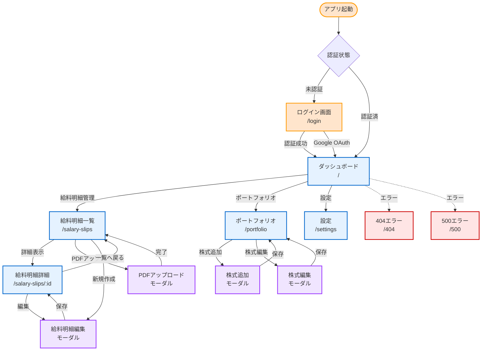
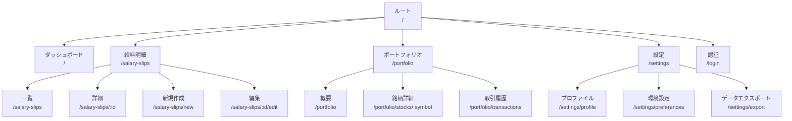
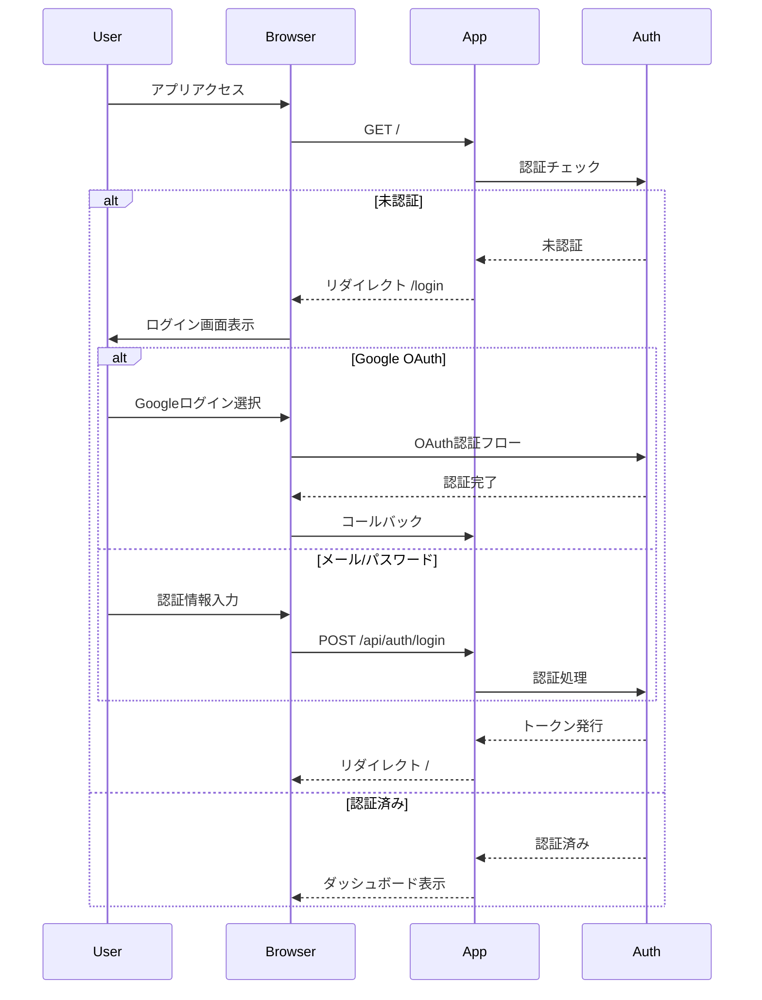
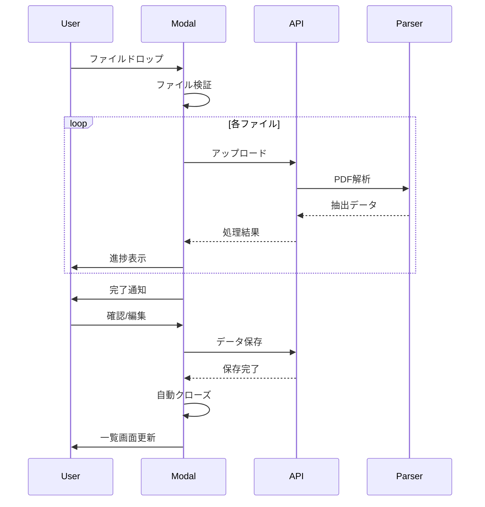
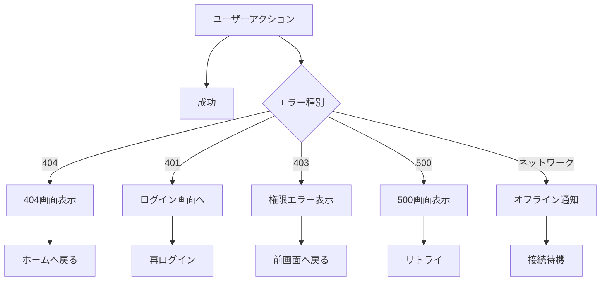
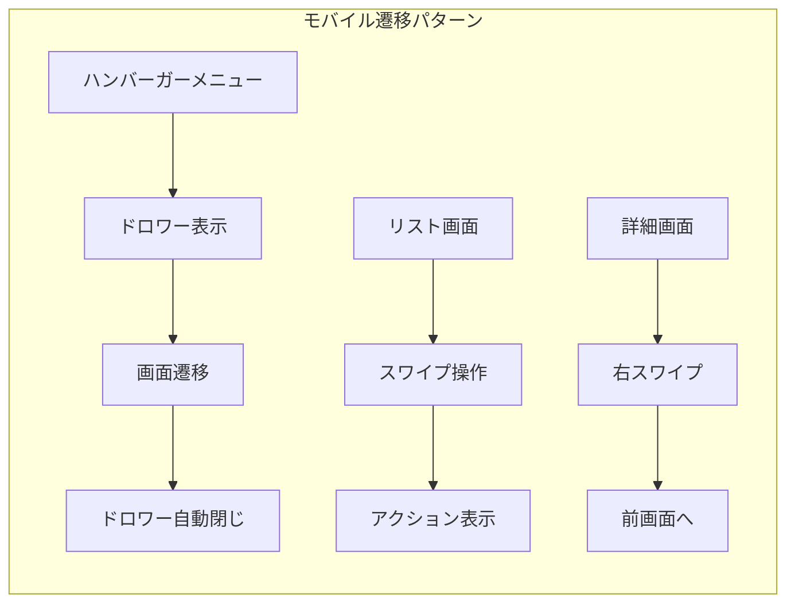

# 画面遷移図

## 文書情報

- **作成日**: 2025-08-10
- **作成者**: UI/UXアーキテクト
- **バージョン**: 1.0.0
- **ステータス**: 初版

---

## 1. 画面遷移全体図

### 1.1 メイン画面フロー



### 1.2 画面階層構造



---

## 2. 画面別遷移詳細

### 2.1 ダッシュボード画面

| 遷移元         | アクション                   | 遷移先         | 遷移タイプ   |
| -------------- | ---------------------------- | -------------- | ------------ |
| 任意の画面     | ロゴクリック                 | ダッシュボード | ページ遷移   |
| ログイン画面   | 認証成功                     | ダッシュボード | リダイレクト |
| ダッシュボード | 給料明細カードクリック       | 給料明細一覧   | ページ遷移   |
| ダッシュボード | ポートフォリオカードクリック | ポートフォリオ | ページ遷移   |
| ダッシュボード | 最近の明細クリック           | 給料明細詳細   | ページ遷移   |
| ダッシュボード | 株式銘柄クリック             | 銘柄詳細       | ページ遷移   |

### 2.2 給料明細画面群

| 遷移元          | アクション            | 遷移先                   | 遷移タイプ                |
| --------------- | --------------------- | ------------------------ | ------------------------- |
| 給料明細一覧    | PDFアップロードボタン | PDFアップロードモーダル  | モーダル表示              |
| 給料明細一覧    | 新規作成ボタン        | 給料明細新規作成         | ページ遷移                |
| 給料明細一覧    | 明細行クリック        | 給料明細詳細             | ページ遷移                |
| 給料明細詳細    | 編集ボタン            | 給料明細編集             | ページ遷移                |
| 給料明細詳細    | 削除ボタン            | 確認ダイアログ → 一覧    | ダイアログ → リダイレクト |
| 給料明細詳細    | PDFダウンロード       | （ファイルダウンロード） | ダウンロード              |
| 給料明細編集    | 保存ボタン            | 給料明細詳細             | リダイレクト              |
| 給料明細編集    | キャンセル            | 給料明細詳細             | ページ遷移                |
| PDFアップロード | アップロード完了      | 給料明細一覧（リロード） | モーダル閉じる → リロード |

### 2.3 ポートフォリオ画面群

| 遷移元           | アクション     | 遷移先                     | 遷移タイプ                |
| ---------------- | -------------- | -------------------------- | ------------------------- |
| ポートフォリオ   | 株式追加ボタン | 株式追加モーダル           | モーダル表示              |
| ポートフォリオ   | 銘柄クリック   | 銘柄詳細                   | ページ遷移                |
| ポートフォリオ   | 取引履歴タブ   | 取引履歴                   | タブ切替（URLも変更）     |
| 銘柄詳細         | 編集ボタン     | 株式編集モーダル           | モーダル表示              |
| 銘柄詳細         | 売却ボタン     | 売却モーダル               | モーダル表示              |
| 銘柄詳細         | 戻るボタン     | ポートフォリオ             | ページ遷移                |
| 株式追加モーダル | 保存           | ポートフォリオ（リロード） | モーダル閉じる → リロード |
| 株式編集モーダル | 保存           | 銘柄詳細（リロード）       | モーダル閉じる → リロード |

### 2.4 設定画面群

| 遷移元             | アクション       | 遷移先                    | 遷移タイプ                |
| ------------------ | ---------------- | ------------------------- | ------------------------- |
| 設定               | プロファイルタブ | プロファイル設定          | タブ切替                  |
| 設定               | 環境設定タブ     | 環境設定                  | タブ切替                  |
| 設定               | エクスポートタブ | データエクスポート        | タブ切替                  |
| プロファイル       | 保存ボタン       | プロファイル（更新）      | 同一画面更新              |
| 環境設定           | テーマ変更       | （即時反映）              | 状態変更                  |
| データエクスポート | エクスポート実行 | （ファイルダウンロード）  | ダウンロード              |
| 設定               | ログアウト       | ログイン画面              | リダイレクト              |
| 設定               | アカウント削除   | 確認ダイアログ → ログイン | ダイアログ → リダイレクト |

---

## 3. 遷移パターン定義

### 3.1 遷移タイプ

| タイプ           | 説明             | 実装方法             | アニメーション          |
| ---------------- | ---------------- | -------------------- | ----------------------- |
| **ページ遷移**   | 通常の画面遷移   | SvelteKit navigation | フェードイン（300ms）   |
| **モーダル表示** | オーバーレイ表示 | Portal + Dialog      | スライドアップ（200ms） |
| **タブ切替**     | 同一画面内の切替 | Component state      | フェード（150ms）       |
| **ドロワー表示** | サイドパネル表示 | Drawer component     | スライドイン（250ms）   |
| **リダイレクト** | 自動遷移         | goto() / redirect()  | なし                    |
| **置換**         | 履歴を置換       | replaceState         | なし                    |

### 3.2 遷移時の状態保持

| 画面            | 保持する状態                   | 保持期間       | 保存先                      |
| --------------- | ------------------------------ | -------------- | --------------------------- |
| 給料明細一覧    | フィルター、ソート、ページ番号 | セッション中   | URL params + SessionStorage |
| ポートフォリオ  | 表示モード、ソート順           | セッション中   | URL params                  |
| ダッシュボード  | 期間選択、ウィジェット設定     | 永続           | LocalStorage                |
| 設定            | 入力中のフォーム               | ページ遷移まで | Component state             |
| PDFアップロード | アップロード進捗               | 完了まで       | Component state             |

### 3.3 戻る操作の挙動

| 現在の画面     | 戻る操作           | 遷移先                     | 特記事項             |
| -------------- | ------------------ | -------------------------- | -------------------- |
| 給料明細詳細   | ブラウザバック     | 給料明細一覧               | フィルター状態を復元 |
| 給料明細編集   | ブラウザバック     | 確認ダイアログ → 詳細/一覧 | 未保存警告           |
| モーダル表示中 | ESC / 外側クリック | モーダルを閉じる           | 画面遷移なし         |
| ログイン画面   | ブラウザバック     | （なし）                   | 認証前は戻れない     |
| エラー画面     | 戻るボタン         | ダッシュボード             | ホームへ誘導         |

---

## 4. 特殊な遷移パターン

### 4.1 認証フロー



### 4.2 PDFアップロードフロー



### 4.3 エラー時の遷移



---

## 5. レスポンシブ対応

### 5.1 ブレークポイント別の遷移変更

| デバイス    | ブレークポイント | 遷移の変更点                           |
| ----------- | ---------------- | -------------------------------------- |
| **Mobile**  | < 640px          | ドロワーメニュー使用、モーダルは全画面 |
| **Tablet**  | 640px - 1024px   | サイドバー固定、モーダルは中央表示     |
| **Desktop** | > 1024px         | サイドバー常時表示、モーダルは中央表示 |

### 5.2 モバイル特有の遷移



---

## 6. パフォーマンス最適化

### 6.1 プリフェッチ戦略

| 画面           | プリフェッチ対象            | タイミング        |
| -------------- | --------------------------- | ----------------- |
| ダッシュボード | 給料明細最新5件、株価データ | ページロード時    |
| 給料明細一覧   | 次ページデータ              | スクロール80%時点 |
| ポートフォリオ | 株価更新データ              | 5分間隔           |
| 設定           | なし                        | -                 |

### 6.2 遅延読み込み

```typescript
// 画面コンポーネントの遅延読み込み設定
const routes = {
	'/': () => import('./Dashboard.svelte'), // 即座に読み込み
	'/salary-slips': () => import('./SalarySlips.svelte'), // 遅延読み込み
	'/portfolio': () => import('./Portfolio.svelte'), // 遅延読み込み
	'/settings': () => import('./Settings.svelte') // 遅延読み込み
};
```

---

## 7. アクセシビリティ考慮

### 7.1 キーボードナビゲーション

| キー        | 動作                 | 適用画面           |
| ----------- | -------------------- | ------------------ |
| Tab         | 次の要素へ移動       | 全画面             |
| Shift + Tab | 前の要素へ移動       | 全画面             |
| Enter       | 選択・実行           | 全画面             |
| ESC         | キャンセル・閉じる   | モーダル、ドロワー |
| ← →         | タブ切替             | タブ付き画面       |
| ↑ ↓         | リスト項目移動       | 一覧画面           |
| Space       | チェックボックス切替 | フォーム画面       |

### 7.2 スクリーンリーダー対応

- 全ての遷移にaria-labelを設定
- 画面遷移時にフォーカス管理
- ランドマークロールの適切な配置
- 遷移完了の音声通知

---

## 8. 実装上の注意事項

### 8.1 SvelteKitルーティング規約

```
src/routes/
├── +layout.svelte          # 共通レイアウト
├── +page.svelte            # ダッシュボード (/)
├── login/
│   └── +page.svelte        # ログイン画面
├── salary-slips/
│   ├── +page.svelte        # 一覧画面
│   ├── new/
│   │   └── +page.svelte    # 新規作成
│   └── [id]/
│       ├── +page.svelte    # 詳細画面
│       └── edit/
│           └── +page.svelte # 編集画面
├── portfolio/
│   ├── +page.svelte        # ポートフォリオ
│   ├── stocks/
│   │   └── [symbol]/
│   │       └── +page.svelte # 銘柄詳細
│   └── transactions/
│       └── +page.svelte     # 取引履歴
└── settings/
    ├── +page.svelte        # 設定メイン
    ├── profile/
    │   └── +page.svelte    # プロファイル
    ├── preferences/
    │   └── +page.svelte    # 環境設定
    └── export/
        └── +page.svelte     # エクスポート
```

### 8.2 画面遷移のベストプラクティス

1. **プログレッシブエンハンスメント**
   - JavaScriptが無効でも基本的な遷移は動作
   - `<a>`タグによるナビゲーション

2. **遷移状態の表示**
   - ローディングインジケーター
   - スケルトンスクリーン
   - プログレスバー

3. **エラーハンドリング**
   - 遷移失敗時のフォールバック
   - オフライン時の対応
   - タイムアウト処理

4. **履歴管理**
   - 適切なpushState/replaceState
   - モーダルの履歴を残さない
   - ディープリンク対応

---

## 9. 次のステップ

1. ✅ 画面遷移図（本書）
2. → ナビゲーションフロー詳細設計
3. → UI状態管理仕様
4. → 画面モックアップ作成
5. → プロトタイプ実装

---

## 承認

| 役割              | 名前              | 日付       | 署名 |
| ----------------- | ----------------- | ---------- | ---- |
| UI/UXアーキテクト | UI/UXアーキテクト | 2025-08-10 | ✅   |
| レビュアー        | -                 | -          | [ ]  |
| 承認者            | -                 | -          | [ ]  |

---

**改訂履歴**

| バージョン | 日付       | 変更内容 | 作成者            |
| ---------- | ---------- | -------- | ----------------- |
| 1.0.0      | 2025-08-10 | 初版作成 | UI/UXアーキテクト |
