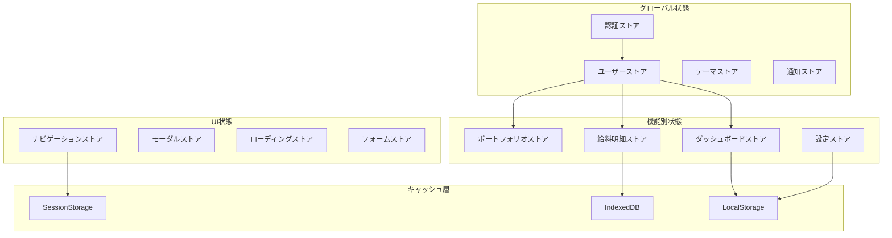

# UI状態管理仕様書

## 文書情報

- **作成日**: 2025-08-10
- **作成者**: UI/UXアーキテクト
- **バージョン**: 1.0.0
- **ステータス**: 初版

---

## 1. 状態管理アーキテクチャ

### 1.1 全体構造



### 1.2 Svelteストア設計

```typescript
// ストアの基本構造
import { derived, get, readable, writable } from 'svelte/store';

// 基底ストアクラス
abstract class BaseStore<T> {
	protected store = writable<T>(this.getInitialState());

	abstract getInitialState(): T;

	subscribe = this.store.subscribe;

	protected update(updater: (state: T) => T) {
		this.store.update(updater);
	}

	protected set(value: T) {
		this.store.set(value);
	}

	get() {
		return get(this.store);
	}

	reset() {
		this.set(this.getInitialState());
	}
}

// 永続化可能なストア
abstract class PersistentStore<T> extends BaseStore<T> {
	protected abstract storageKey: string;
	protected abstract storage: Storage;

	constructor() {
		super();
		this.loadFromStorage();
		this.store.subscribe((value) => this.saveToStorage(value));
	}

	private loadFromStorage() {
		const stored = this.storage.getItem(this.storageKey);
		if (stored) {
			try {
				this.set(JSON.parse(stored));
			} catch (e) {
				console.error('Failed to load from storage:', e);
			}
		}
	}

	private saveToStorage(value: T) {
		try {
			this.storage.setItem(this.storageKey, JSON.stringify(value));
		} catch (e) {
			console.error('Failed to save to storage:', e);
		}
	}
}
```

---

## 2. グローバル状態管理

### 2.1 認証状態

```typescript
// 認証ストア
interface AuthState {
	isAuthenticated: boolean;
	user: User | null;
	token: string | null;
	expiresAt: Date | null;
	isLoading: boolean;
	error: string | null;
}

class AuthStore extends BaseStore<AuthState> {
	getInitialState(): AuthState {
		return {
			isAuthenticated: false,
			user: null,
			token: null,
			expiresAt: null,
			isLoading: false,
			error: null
		};
	}

	async login(credentials: LoginCredentials) {
		this.update((state) => ({ ...state, isLoading: true, error: null }));

		try {
			const response = await api.login(credentials);
			this.update((state) => ({
				...state,
				isAuthenticated: true,
				user: response.user,
				token: response.token,
				expiresAt: new Date(response.expiresAt),
				isLoading: false
			}));

			// トークンを保存
			localStorage.setItem('auth_token', response.token);

			// 自動更新を設定
			this.scheduleTokenRefresh();

			return response;
		} catch (error) {
			this.update((state) => ({
				...state,
				isLoading: false,
				error: error.message
			}));
			throw error;
		}
	}

	async logout() {
		await api.logout();
		localStorage.removeItem('auth_token');
		this.reset();
		goto('/login');
	}

	private scheduleTokenRefresh() {
		const state = this.get();
		if (!state.expiresAt) return;

		const refreshTime = state.expiresAt.getTime() - Date.now() - 5 * 60 * 1000; // 5分前

		setTimeout(async () => {
			await this.refreshToken();
		}, refreshTime);
	}

	async refreshToken() {
		try {
			const response = await api.refreshToken();
			this.update((state) => ({
				...state,
				token: response.token,
				expiresAt: new Date(response.expiresAt)
			}));
			this.scheduleTokenRefresh();
		} catch (error) {
			await this.logout();
		}
	}
}

export const authStore = new AuthStore();
```

### 2.2 ユーザー設定

```typescript
// ユーザー設定ストア
interface UserPreferences {
	theme: 'light' | 'dark' | 'system';
	language: 'ja' | 'en';
	dateFormat: 'YYYY-MM-DD' | 'DD/MM/YYYY' | 'MM/DD/YYYY';
	currency: 'JPY' | 'USD' | 'EUR';
	notifications: {
		email: boolean;
		push: boolean;
		inApp: boolean;
	};
	dashboard: {
		layout: 'grid' | 'list';
		widgets: string[];
		defaultPeriod: '1m' | '3m' | '6m' | '1y';
	};
}

class UserPreferencesStore extends PersistentStore<UserPreferences> {
	protected storageKey = 'user_preferences';
	protected storage = localStorage;

	getInitialState(): UserPreferences {
		return {
			theme: 'system',
			language: 'ja',
			dateFormat: 'YYYY-MM-DD',
			currency: 'JPY',
			notifications: {
				email: true,
				push: false,
				inApp: true
			},
			dashboard: {
				layout: 'grid',
				widgets: ['summary', 'chart', 'recent'],
				defaultPeriod: '1m'
			}
		};
	}

	updateTheme(theme: UserPreferences['theme']) {
		this.update((state) => ({ ...state, theme }));
		this.applyTheme(theme);
	}

	private applyTheme(theme: UserPreferences['theme']) {
		const root = document.documentElement;

		if (theme === 'system') {
			const prefersDark = window.matchMedia('(prefers-color-scheme: dark)').matches;
			root.classList.toggle('dark', prefersDark);
		} else {
			root.classList.toggle('dark', theme === 'dark');
		}
	}
}

export const userPreferencesStore = new UserPreferencesStore();
```

### 2.3 通知管理

```typescript
// 通知ストア
interface Notification {
	id: string;
	type: 'success' | 'error' | 'warning' | 'info';
	title: string;
	message?: string;
	duration?: number;
	action?: {
		label: string;
		onClick: () => void;
	};
	timestamp: Date;
}

class NotificationStore extends BaseStore<Notification[]> {
	getInitialState(): Notification[] {
		return [];
	}

	add(notification: Omit<Notification, 'id' | 'timestamp'>) {
		const newNotification: Notification = {
			...notification,
			id: crypto.randomUUID(),
			timestamp: new Date(),
			duration: notification.duration ?? 5000
		};

		this.update((notifications) => [...notifications, newNotification]);

		// 自動削除
		if (newNotification.duration > 0) {
			setTimeout(() => {
				this.remove(newNotification.id);
			}, newNotification.duration);
		}

		return newNotification.id;
	}

	remove(id: string) {
		this.update((notifications) => notifications.filter((n) => n.id !== id));
	}

	clear() {
		this.set([]);
	}

	// ヘルパーメソッド
	success(title: string, message?: string) {
		return this.add({ type: 'success', title, message });
	}

	error(title: string, message?: string) {
		return this.add({ type: 'error', title, message, duration: 0 });
	}

	warning(title: string, message?: string) {
		return this.add({ type: 'warning', title, message });
	}

	info(title: string, message?: string) {
		return this.add({ type: 'info', title, message });
	}
}

export const notificationStore = new NotificationStore();
```

---

## 3. 機能別状態管理

### 3.1 給料明細状態

```typescript
// 給料明細ストア
interface SalarySlipState {
	slips: SalarySlip[];
	selectedSlip: SalarySlip | null;
	filters: {
		year?: number;
		month?: number;
		status?: string;
		companyName?: string;
	};
	sort: {
		field: string;
		direction: 'asc' | 'desc';
	};
	pagination: {
		page: number;
		limit: number;
		total: number;
	};
	isLoading: boolean;
	error: string | null;
	uploadProgress: {
		current: number;
		total: number;
		fileName: string;
	} | null;
}

class SalarySlipStore extends BaseStore<SalarySlipState> {
	private cache = new Map<string, SalarySlip[]>();

	getInitialState(): SalarySlipState {
		return {
			slips: [],
			selectedSlip: null,
			filters: {},
			sort: {
				field: 'paymentDate',
				direction: 'desc'
			},
			pagination: {
				page: 1,
				limit: 20,
				total: 0
			},
			isLoading: false,
			error: null,
			uploadProgress: null
		};
	}

	async loadSlips(options?: LoadOptions) {
		const state = this.get();
		const cacheKey = JSON.stringify({ ...state.filters, ...state.sort, ...options });

		// キャッシュチェック
		if (this.cache.has(cacheKey)) {
			this.update((s) => ({ ...s, slips: this.cache.get(cacheKey)! }));
			return;
		}

		this.update((s) => ({ ...s, isLoading: true, error: null }));

		try {
			const response = await api.getSalarySlips({
				...state.filters,
				...state.sort,
				...state.pagination,
				...options
			});

			this.cache.set(cacheKey, response.data);

			this.update((s) => ({
				...s,
				slips: response.data,
				pagination: {
					...s.pagination,
					total: response.total
				},
				isLoading: false
			}));
		} catch (error) {
			this.update((s) => ({
				...s,
				isLoading: false,
				error: error.message
			}));
		}
	}

	async uploadPDF(files: File[]) {
		const totalSize = files.reduce((sum, file) => sum + file.size, 0);
		let uploadedSize = 0;

		for (const file of files) {
			this.update((s) => ({
				...s,
				uploadProgress: {
					current: uploadedSize,
					total: totalSize,
					fileName: file.name
				}
			}));

			try {
				await api.uploadSalarySlipPDF(file, {
					onProgress: (progress) => {
						this.update((s) => ({
							...s,
							uploadProgress: {
								current: uploadedSize + progress,
								total: totalSize,
								fileName: file.name
							}
						}));
					}
				});

				uploadedSize += file.size;

				notificationStore.success(`${file.name}のアップロードが完了しました`);
			} catch (error) {
				notificationStore.error(`${file.name}のアップロードに失敗しました`, error.message);
			}
		}

		this.update((s) => ({ ...s, uploadProgress: null }));
		await this.loadSlips();
	}

	setFilters(filters: Partial<SalarySlipState['filters']>) {
		this.update((s) => ({
			...s,
			filters: { ...s.filters, ...filters },
			pagination: { ...s.pagination, page: 1 }
		}));
		this.loadSlips();
	}

	setSort(field: string, direction?: 'asc' | 'desc') {
		this.update((s) => ({
			...s,
			sort: {
				field,
				direction:
					direction ?? (s.sort.field === field && s.sort.direction === 'asc' ? 'desc' : 'asc')
			}
		}));
		this.loadSlips();
	}
}

export const salarySlipStore = new SalarySlipStore();
```

### 3.2 ポートフォリオ状態

```typescript
// ポートフォリオストア
interface PortfolioState {
	stocks: StockHolding[];
	totalValue: number;
	totalGainLoss: number;
	totalGainLossRate: number;
	composition: { symbol: string; percentage: number }[];
	selectedStock: StockHolding | null;
	priceUpdateStatus: {
		isUpdating: boolean;
		lastUpdated: Date | null;
		failedSymbols: string[];
	};
	chartData: {
		period: '1d' | '1w' | '1m' | '3m' | '6m' | '1y';
		data: ChartDataPoint[];
	};
}

class PortfolioStore extends BaseStore<PortfolioState> {
	private updateInterval: NodeJS.Timeout | null = null;

	getInitialState(): PortfolioState {
		return {
			stocks: [],
			totalValue: 0,
			totalGainLoss: 0,
			totalGainLossRate: 0,
			composition: [],
			selectedStock: null,
			priceUpdateStatus: {
				isUpdating: false,
				lastUpdated: null,
				failedSymbols: []
			},
			chartData: {
				period: '1m',
				data: []
			}
		};
	}

	async loadPortfolio() {
		try {
			const portfolio = await api.getPortfolio();

			this.update((s) => ({
				...s,
				stocks: portfolio.stocks,
				totalValue: portfolio.totalValue,
				totalGainLoss: portfolio.totalGainLoss,
				totalGainLossRate: portfolio.totalGainLossRate,
				composition: portfolio.composition
			}));

			await this.updatePrices();
		} catch (error) {
			notificationStore.error('ポートフォリオの読み込みに失敗しました', error.message);
		}
	}

	async updatePrices(force = false) {
		const state = this.get();

		// 最終更新から5分以内はスキップ（強制更新でない限り）
		if (!force && state.priceUpdateStatus.lastUpdated) {
			const fiveMinutesAgo = new Date(Date.now() - 5 * 60 * 1000);
			if (state.priceUpdateStatus.lastUpdated > fiveMinutesAgo) {
				return;
			}
		}

		this.update((s) => ({
			...s,
			priceUpdateStatus: {
				...s.priceUpdateStatus,
				isUpdating: true,
				failedSymbols: []
			}
		}));

		const symbols = state.stocks.map((s) => s.symbol);
		const failedSymbols: string[] = [];

		for (const symbol of symbols) {
			try {
				const price = await api.getStockPrice(symbol);
				this.updateStockPrice(symbol, price);
			} catch (error) {
				failedSymbols.push(symbol);
			}
		}

		this.update((s) => ({
			...s,
			priceUpdateStatus: {
				isUpdating: false,
				lastUpdated: new Date(),
				failedSymbols
			}
		}));

		if (failedSymbols.length > 0) {
			notificationStore.warning(
				'一部の株価更新に失敗しました',
				`失敗した銘柄: ${failedSymbols.join(', ')}`
			);
		}
	}

	private updateStockPrice(symbol: string, price: StockPrice) {
		this.update((state) => {
			const stocks = state.stocks.map((stock) => {
				if (stock.symbol === symbol) {
					const currentValue = price.current * stock.quantity;
					const gainLoss = currentValue - stock.totalCost;
					const gainLossRate = (gainLoss / stock.totalCost) * 100;

					return {
						...stock,
						currentPrice: price.current,
						currentValue,
						gainLoss,
						gainLossRate,
						dayChange: price.dayChange,
						dayChangeRate: price.dayChangeRate
					};
				}
				return stock;
			});

			// 合計値を再計算
			const totalValue = stocks.reduce((sum, s) => sum + s.currentValue, 0);
			const totalCost = stocks.reduce((sum, s) => sum + s.totalCost, 0);
			const totalGainLoss = totalValue - totalCost;
			const totalGainLossRate = (totalGainLoss / totalCost) * 100;

			// 構成比を再計算
			const composition = stocks.map((s) => ({
				symbol: s.symbol,
				percentage: (s.currentValue / totalValue) * 100
			}));

			return {
				...state,
				stocks,
				totalValue,
				totalGainLoss,
				totalGainLossRate,
				composition
			};
		});
	}

	startAutoUpdate(interval = 60000) {
		// デフォルト1分
		this.stopAutoUpdate();
		this.updateInterval = setInterval(() => {
			this.updatePrices();
		}, interval);
	}

	stopAutoUpdate() {
		if (this.updateInterval) {
			clearInterval(this.updateInterval);
			this.updateInterval = null;
		}
	}
}

export const portfolioStore = new PortfolioStore();
```

---

## 4. UI状態管理

### 4.1 モーダル管理

```typescript
// モーダルストア
interface ModalState {
	stack: Modal[];
	isOpen: boolean;
}

interface Modal {
	id: string;
	component: any;
	props?: Record<string, any>;
	options?: {
		closeOnEscape?: boolean;
		closeOnOutsideClick?: boolean;
		showCloseButton?: boolean;
		size?: 'sm' | 'md' | 'lg' | 'xl' | 'full';
	};
}

class ModalStore extends BaseStore<ModalState> {
	getInitialState(): ModalState {
		return {
			stack: [],
			isOpen: false
		};
	}

	open(modal: Omit<Modal, 'id'>) {
		const newModal: Modal = {
			...modal,
			id: crypto.randomUUID(),
			options: {
				closeOnEscape: true,
				closeOnOutsideClick: true,
				showCloseButton: true,
				size: 'md',
				...modal.options
			}
		};

		this.update((state) => ({
			stack: [...state.stack, newModal],
			isOpen: true
		}));

		// ESCキーハンドリング
		if (newModal.options?.closeOnEscape) {
			this.setupEscapeHandler(newModal.id);
		}

		return newModal.id;
	}

	close(id?: string) {
		this.update((state) => {
			if (id) {
				return {
					...state,
					stack: state.stack.filter((m) => m.id !== id),
					isOpen: state.stack.length > 1
				};
			} else {
				// 最後のモーダルを閉じる
				return {
					...state,
					stack: state.stack.slice(0, -1),
					isOpen: state.stack.length > 1
				};
			}
		});
	}

	closeAll() {
		this.set(this.getInitialState());
	}

	private setupEscapeHandler(modalId: string) {
		const handler = (e: KeyboardEvent) => {
			if (e.key === 'Escape') {
				const state = this.get();
				const modal = state.stack.find((m) => m.id === modalId);
				if (modal && state.stack[state.stack.length - 1].id === modalId) {
					this.close(modalId);
					document.removeEventListener('keydown', handler);
				}
			}
		};
		document.addEventListener('keydown', handler);
	}
}

export const modalStore = new ModalStore();

// モーダルヘルパー関数
export function openConfirmDialog(options: {
	title: string;
	message: string;
	confirmLabel?: string;
	cancelLabel?: string;
	onConfirm: () => void | Promise<void>;
	onCancel?: () => void;
}) {
	return modalStore.open({
		component: ConfirmDialog,
		props: options,
		options: {
			size: 'sm',
			closeOnOutsideClick: false
		}
	});
}
```

### 4.2 フォーム状態管理

```typescript
// フォームストア
interface FormState<T = any> {
	values: T;
	errors: Record<string, string>;
	touched: Record<string, boolean>;
	isSubmitting: boolean;
	isValid: boolean;
	isDirty: boolean;
}

class FormStore<T extends Record<string, any>> extends BaseStore<FormState<T>> {
	private initialValues: T;
	private validators: Record<string, (value: any) => string | undefined>;

	constructor(initialValues: T, validators?: Record<string, (value: any) => string | undefined>) {
		super();
		this.initialValues = initialValues;
		this.validators = validators || {};
	}

	getInitialState(): FormState<T> {
		return {
			values: { ...this.initialValues },
			errors: {},
			touched: {},
			isSubmitting: false,
			isValid: true,
			isDirty: false
		};
	}

	setValue(field: keyof T, value: any) {
		this.update((state) => {
			const newValues = { ...state.values, [field]: value };
			const error = this.validators[field as string]?.(value);
			const newErrors = { ...state.errors };

			if (error) {
				newErrors[field as string] = error;
			} else {
				delete newErrors[field as string];
			}

			return {
				...state,
				values: newValues,
				errors: newErrors,
				isDirty: JSON.stringify(newValues) !== JSON.stringify(this.initialValues),
				isValid: Object.keys(newErrors).length === 0
			};
		});
	}

	setTouched(field: keyof T) {
		this.update((state) => ({
			...state,
			touched: { ...state.touched, [field]: true }
		}));
	}

	async submit(onSubmit: (values: T) => Promise<void>) {
		const state = this.get();

		// 全フィールドをtouchedに
		const touched = Object.keys(state.values).reduce(
			(acc, key) => ({
				...acc,
				[key]: true
			}),
			{}
		);

		// 全フィールドを検証
		const errors: Record<string, string> = {};
		for (const [field, validator] of Object.entries(this.validators)) {
			const error = validator(state.values[field]);
			if (error) {
				errors[field] = error;
			}
		}

		this.update((s) => ({
			...s,
			touched,
			errors,
			isValid: Object.keys(errors).length === 0
		}));

		if (Object.keys(errors).length > 0) {
			return;
		}

		this.update((s) => ({ ...s, isSubmitting: true }));

		try {
			await onSubmit(state.values);
			this.reset();
		} catch (error) {
			notificationStore.error('送信に失敗しました', error.message);
		} finally {
			this.update((s) => ({ ...s, isSubmitting: false }));
		}
	}

	reset() {
		this.set(this.getInitialState());
	}
}

// バリデーションヘルパー
export const validators = {
	required:
		(message = '必須項目です') =>
		(value: any) =>
			value === undefined || value === null || value === '' ? message : undefined,

	email:
		(message = '有効なメールアドレスを入力してください') =>
		(value: string) =>
			!value || /^[^\s@]+@[^\s@]+\.[^\s@]+$/.test(value) ? undefined : message,

	min:
		(min: number, message = `${min}以上の値を入力してください`) =>
		(value: number) =>
			value >= min ? undefined : message,

	max:
		(max: number, message = `${max}以下の値を入力してください`) =>
		(value: number) =>
			value <= max ? undefined : message,

	pattern: (pattern: RegExp, message: string) => (value: string) =>
		!value || pattern.test(value) ? undefined : message
};
```

### 4.3 ローディング状態管理

```typescript
// ローディングストア
interface LoadingState {
	global: boolean;
	tasks: Map<string, LoadingTask>;
}

interface LoadingTask {
	id: string;
	message?: string;
	progress?: number;
	startTime: Date;
}

class LoadingStore extends BaseStore<LoadingState> {
	getInitialState(): LoadingState {
		return {
			global: false,
			tasks: new Map()
		};
	}

	startTask(id: string, message?: string): () => void {
		const task: LoadingTask = {
			id,
			message,
			startTime: new Date()
		};

		this.update((state) => {
			const tasks = new Map(state.tasks);
			tasks.set(id, task);
			return {
				...state,
				tasks,
				global: tasks.size > 0
			};
		});

		// クリーンアップ関数を返す
		return () => this.endTask(id);
	}

	updateProgress(id: string, progress: number, message?: string) {
		this.update((state) => {
			const tasks = new Map(state.tasks);
			const task = tasks.get(id);
			if (task) {
				tasks.set(id, { ...task, progress, message: message || task.message });
			}
			return { ...state, tasks };
		});
	}

	endTask(id: string) {
		this.update((state) => {
			const tasks = new Map(state.tasks);
			tasks.delete(id);
			return {
				...state,
				tasks,
				global: tasks.size > 0
			};
		});
	}

	// デコレーター用ヘルパー
	async withLoading<T>(taskId: string, message: string, task: () => Promise<T>): Promise<T> {
		const cleanup = this.startTask(taskId, message);
		try {
			return await task();
		} finally {
			cleanup();
		}
	}
}

export const loadingStore = new LoadingStore();

// ローディングデコレーター
export function withLoading(taskId: string, message?: string) {
	return function (target: any, propertyKey: string, descriptor: PropertyDescriptor) {
		const originalMethod = descriptor.value;

		descriptor.value = async function (...args: any[]) {
			const cleanup = loadingStore.startTask(taskId, message);
			try {
				return await originalMethod.apply(this, args);
			} finally {
				cleanup();
			}
		};

		return descriptor;
	};
}
```

---

## 5. 状態の永続化とキャッシング

### 5.1 永続化戦略

```typescript
// 永続化設定
interface PersistenceConfig {
	storage: 'localStorage' | 'sessionStorage' | 'indexedDB';
	key: string;
	serialize?: (value: any) => string;
	deserialize?: (value: string) => any;
	migrate?: (oldState: any) => any;
	whitelist?: string[];
	blacklist?: string[];
}

// IndexedDBラッパー
class IndexedDBStorage {
	private dbName = 'app_storage';
	private version = 1;
	private storeName = 'state';

	async set(key: string, value: any) {
		const db = await this.openDB();
		const tx = db.transaction(this.storeName, 'readwrite');
		const store = tx.objectStore(this.storeName);
		await store.put({ key, value, timestamp: Date.now() });
	}

	async get(key: string) {
		const db = await this.openDB();
		const tx = db.transaction(this.storeName, 'readonly');
		const store = tx.objectStore(this.storeName);
		const result = await store.get(key);
		return result?.value;
	}

	async remove(key: string) {
		const db = await this.openDB();
		const tx = db.transaction(this.storeName, 'readwrite');
		const store = tx.objectStore(this.storeName);
		await store.delete(key);
	}

	private openDB(): Promise<IDBDatabase> {
		return new Promise((resolve, reject) => {
			const request = indexedDB.open(this.dbName, this.version);

			request.onerror = () => reject(request.error);
			request.onsuccess = () => resolve(request.result);

			request.onupgradeneeded = (event) => {
				const db = (event.target as IDBOpenDBRequest).result;
				if (!db.objectStoreNames.contains(this.storeName)) {
					db.createObjectStore(this.storeName, { keyPath: 'key' });
				}
			};
		});
	}
}

// キャッシュマネージャー
class CacheManager {
	private cache = new Map<string, CacheEntry>();
	private storage = new IndexedDBStorage();

	async get<T>(key: string, fetcher: () => Promise<T>, ttl = 60000): Promise<T> {
		// メモリキャッシュチェック
		const cached = this.cache.get(key);
		if (cached && cached.expiresAt > Date.now()) {
			return cached.value as T;
		}

		// 永続キャッシュチェック
		const stored = await this.storage.get(key);
		if (stored && stored.expiresAt > Date.now()) {
			this.cache.set(key, stored);
			return stored.value as T;
		}

		// フェッチして保存
		const value = await fetcher();
		const entry: CacheEntry = {
			value,
			expiresAt: Date.now() + ttl
		};

		this.cache.set(key, entry);
		await this.storage.set(key, entry);

		return value;
	}

	invalidate(pattern?: string) {
		if (pattern) {
			const regex = new RegExp(pattern);
			for (const key of this.cache.keys()) {
				if (regex.test(key)) {
					this.cache.delete(key);
					this.storage.remove(key);
				}
			}
		} else {
			this.cache.clear();
		}
	}
}

interface CacheEntry {
	value: any;
	expiresAt: number;
}

export const cacheManager = new CacheManager();
```

### 5.2 オプティミスティック更新

```typescript
// オプティミスティック更新の実装
class OptimisticStore<T> extends BaseStore<T> {
	private rollbackState: T | null = null;

	async optimisticUpdate<R>(
		optimisticUpdater: (state: T) => T,
		asyncOperation: () => Promise<R>,
		onSuccess?: (result: R, state: T) => T,
		onError?: (error: any, state: T) => T
	): Promise<R> {
		// 現在の状態を保存
		this.rollbackState = this.get();

		// オプティミスティック更新
		this.update(optimisticUpdater);

		try {
			const result = await asyncOperation();

			// 成功時の更新
			if (onSuccess) {
				this.update((state) => onSuccess(result, state));
			}

			this.rollbackState = null;
			return result;
		} catch (error) {
			// エラー時のロールバック
			if (this.rollbackState) {
				this.set(this.rollbackState);
			}

			if (onError) {
				this.update((state) => onError(error, state));
			}

			this.rollbackState = null;
			throw error;
		}
	}
}

// 使用例
class TodoStore extends OptimisticStore<TodoState> {
	async toggleTodo(id: string) {
		await this.optimisticUpdate(
			// オプティミスティック更新
			(state) => ({
				...state,
				todos: state.todos.map((todo) =>
					todo.id === id ? { ...todo, completed: !todo.completed } : todo
				)
			}),
			// 非同期操作
			() => api.toggleTodo(id),
			// 成功時（サーバーの状態で更新）
			(result, state) => ({
				...state,
				todos: state.todos.map((todo) => (todo.id === id ? result : todo))
			})
		);
	}
}
```

---

## 6. 状態のデバッグとテスト

### 6.1 デバッグツール

```typescript
// Redux DevToolsとの統合
function connectToDevTools<T>(store: Writable<T>, name: string) {
	if (typeof window !== 'undefined' && (window as any).__REDUX_DEVTOOLS_EXTENSION__) {
		const devTools = (window as any).__REDUX_DEVTOOLS_EXTENSION__.connect({
			name,
			features: {
				pause: true,
				lock: true,
				persist: true,
				export: true,
				import: 'custom',
				jump: true,
				skip: true,
				reorder: true,
				dispatch: true,
				test: true
			}
		});

		store.subscribe((state) => {
			devTools.send('UPDATE', state);
		});

		devTools.subscribe((message: any) => {
			if (message.type === 'DISPATCH' && message.state) {
				store.set(JSON.parse(message.state));
			}
		});
	}
}

// ストアロガー
function createStoreLogger<T>(storeName: string) {
	return (state: T) => {
		if (import.meta.env.DEV) {
			console.group(`[${storeName}] State Update`);
			console.log('New State:', state);
			console.log('Timestamp:', new Date().toISOString());
			console.trace('Call Stack');
			console.groupEnd();
		}
	};
}

// 状態スナップショット
class StateSnapshot {
	private snapshots = new Map<string, any>();

	capture(name: string, state: any) {
		this.snapshots.set(name, {
			state: structuredClone(state),
			timestamp: Date.now()
		});
	}

	restore(name: string): any {
		const snapshot = this.snapshots.get(name);
		if (snapshot) {
			return structuredClone(snapshot.state);
		}
		return null;
	}

	list() {
		return Array.from(this.snapshots.entries()).map(([name, data]) => ({
			name,
			timestamp: new Date(data.timestamp).toISOString()
		}));
	}

	clear() {
		this.snapshots.clear();
	}
}

export const stateSnapshot = new StateSnapshot();
```

### 6.2 テストユーティリティ

```typescript
// ストアテストヘルパー
import { render } from '@testing-library/svelte';
import { writable } from 'svelte/store';

export function createMockStore<T>(initialState: T) {
	const store = writable(initialState);
	const spy = {
		subscribe: vi.fn(store.subscribe),
		set: vi.fn((value: T) => store.set(value)),
		update: vi.fn((updater: (value: T) => T) => store.update(updater))
	};

	return {
		store: spy,
		getState: () => get(store),
		setState: (state: T) => store.set(state)
	};
}

// コンポーネントテスト with ストア
export function renderWithStores(component: any, props = {}, stores = {}) {
	const mockStores = Object.entries(stores).reduce(
		(acc, [key, value]) => ({
			...acc,
			[key]: createMockStore(value)
		}),
		{}
	);

	const result = render(component, {
		props,
		context: new Map(Object.entries(mockStores))
	});

	return {
		...result,
		stores: mockStores
	};
}

// ストアアクションテスト
export async function testStoreAction<T>(
	store: BaseStore<T>,
	action: () => Promise<void>,
	expected: Partial<T>
) {
	const unsubscribe = store.subscribe(vi.fn());

	await action();

	const state = store.get();
	expect(state).toMatchObject(expected);

	unsubscribe();
}
```

---

## 7. パフォーマンス最適化

### 7.1 派生ストアの最適化

```typescript
// メモ化された派生ストア
import memoize from 'lodash/memoize';
import { derived } from 'svelte/store';

export function memoizedDerived<T, R>(stores: any, fn: (values: any) => R, initialValue?: R) {
	const memoizedFn = memoize(fn);
	return derived(stores, memoizedFn, initialValue);
}

// 選択的サブスクリプション
export function createSelector<T, R>(
	store: Readable<T>,
	selector: (state: T) => R,
	equality?: (a: R, b: R) => boolean
): Readable<R> {
	let previousValue: R;

	return derived(store, (state, set) => {
		const newValue = selector(state);

		if (!equality || !equality(previousValue, newValue)) {
			previousValue = newValue;
			set(newValue);
		}
	});
}

// バッチ更新
class BatchedStore<T> extends BaseStore<T> {
	private pendingUpdates: Array<(state: T) => T> = [];
	private updateScheduled = false;

	batchUpdate(updater: (state: T) => T) {
		this.pendingUpdates.push(updater);

		if (!this.updateScheduled) {
			this.updateScheduled = true;
			queueMicrotask(() => {
				this.flushUpdates();
			});
		}
	}

	private flushUpdates() {
		if (this.pendingUpdates.length === 0) return;

		this.update((state) => {
			return this.pendingUpdates.reduce((acc, updater) => updater(acc), state);
		});

		this.pendingUpdates = [];
		this.updateScheduled = false;
	}
}
```

### 7.2 メモリ管理

```typescript
// 自動クリーンアップ
export function autoCleanup<T>(store: Writable<T>, cleanupFn: (state: T) => T, interval = 60000) {
	const cleanup = setInterval(() => {
		store.update(cleanupFn);
	}, interval);

	onDestroy(() => {
		clearInterval(cleanup);
	});
}

// WeakMapを使用したキャッシュ
class WeakCache<K extends object, V> {
	private cache = new WeakMap<K, V>();

	get(key: K, factory: () => V): V {
		if (!this.cache.has(key)) {
			this.cache.set(key, factory());
		}
		return this.cache.get(key)!;
	}
}

// メモリリーク防止
export function createSafeStore<T>(initialValue: T) {
	const store = writable(initialValue);
	const subscriptions = new Set<() => void>();

	return {
		subscribe: (fn: (value: T) => void) => {
			const unsubscribe = store.subscribe(fn);
			subscriptions.add(unsubscribe);

			return () => {
				unsubscribe();
				subscriptions.delete(unsubscribe);
			};
		},
		set: store.set,
		update: store.update,
		destroy: () => {
			subscriptions.forEach((unsubscribe) => unsubscribe());
			subscriptions.clear();
		}
	};
}
```

---

## 8. 実装チェックリスト

### 8.1 必須実装項目

- [ ] 認証ストア実装
- [ ] ユーザー設定ストア実装
- [ ] 通知ストア実装
- [ ] 給料明細ストア実装
- [ ] ポートフォリオストア実装
- [ ] モーダルストア実装
- [ ] フォームストア実装
- [ ] ローディングストア実装
- [ ] LocalStorage永続化
- [ ] エラーハンドリング

### 8.2 推奨実装項目

- [ ] IndexedDB永続化
- [ ] キャッシュマネージャー
- [ ] オプティミスティック更新
- [ ] Redux DevTools統合
- [ ] 状態スナップショット
- [ ] バッチ更新
- [ ] メモ化最適化
- [ ] 自動クリーンアップ

---

## 9. 次のステップ

1. ✅ 画面遷移図
2. ✅ ナビゲーションフロー詳細
3. ✅ UI状態管理仕様（本書）
4. → ストア実装
5. → コンポーネント統合
6. → テスト作成

---

## 承認

| 役割              | 名前              | 日付       | 署名 |
| ----------------- | ----------------- | ---------- | ---- |
| UI/UXアーキテクト | UI/UXアーキテクト | 2025-08-10 | ✅   |
| レビュアー        | -                 | -          | [ ]  |
| 承認者            | -                 | -          | [ ]  |

---

**改訂履歴**

| バージョン | 日付       | 変更内容 | 作成者            |
| ---------- | ---------- | -------- | ----------------- |
| 1.0.0      | 2025-08-10 | 初版作成 | UI/UXアーキテクト |
