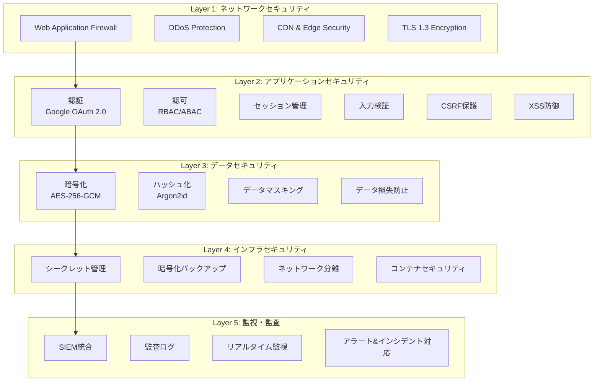
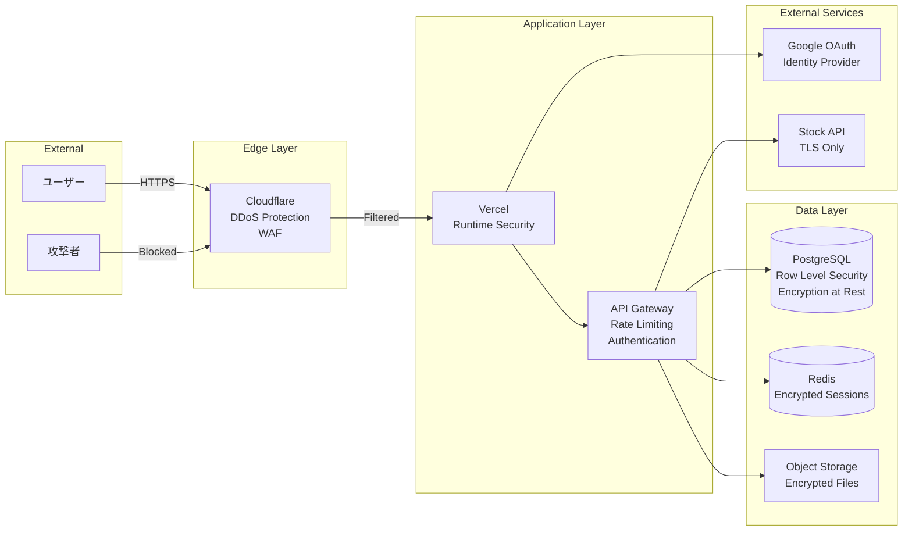
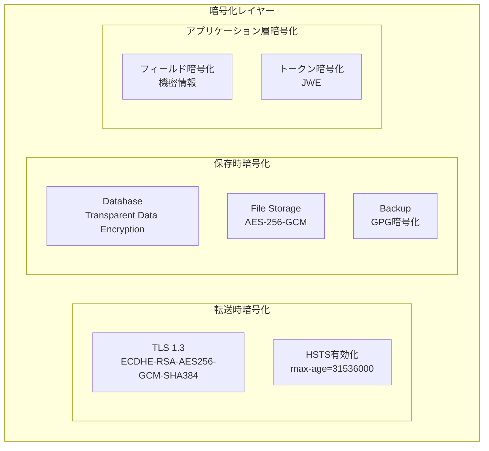
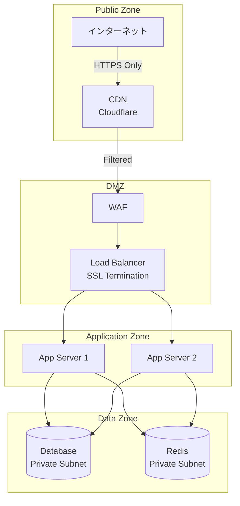
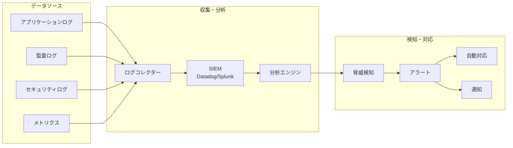
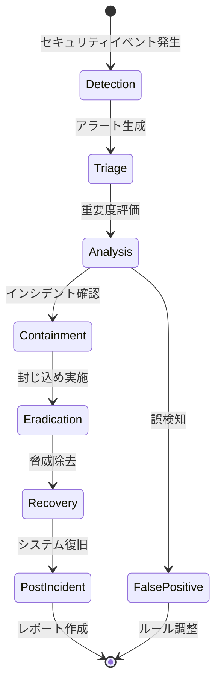
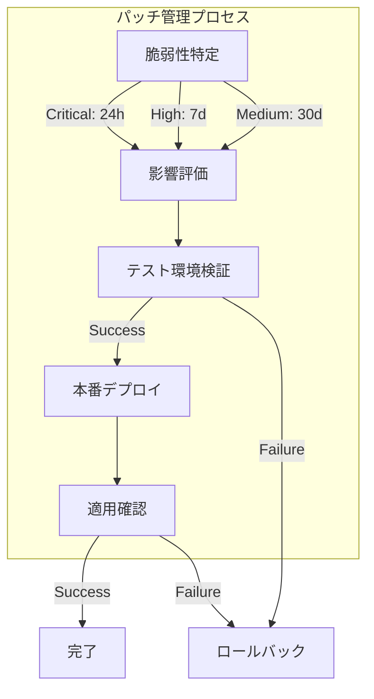
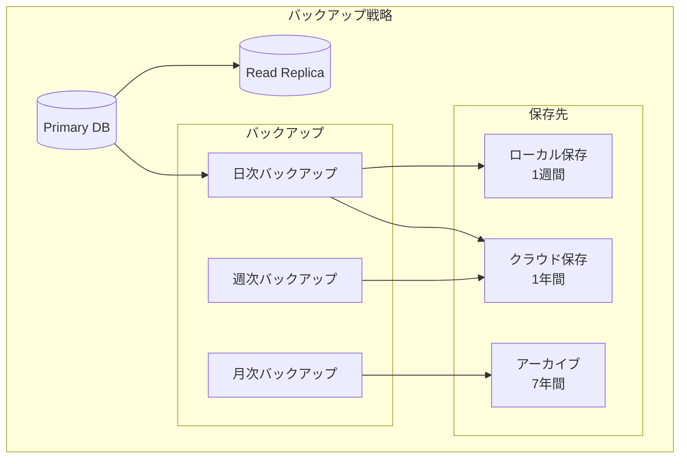
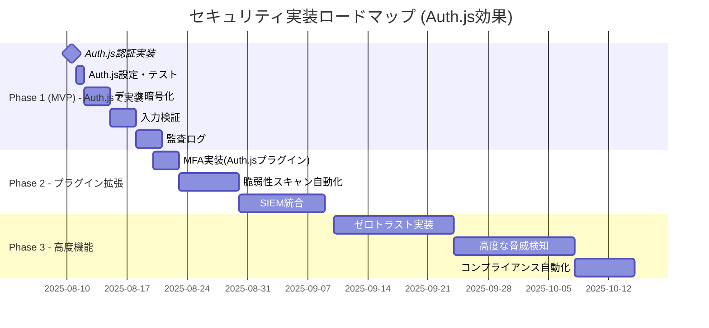

# セキュリティアーキテクチャ設計書

## 文書情報

- **作成日**: 2025-08-10
- **作成者**: セキュリティアーキテクト
- **バージョン**: 1.0.0
- **ステータス**: 初版
- **機密レベル**: 社外秘

---

## 1. エグゼクティブサマリー

### 1.1 セキュリティ方針

個人の給料明細と金融資産情報を扱う本システムは、以下のセキュリティ方針に基づいて設計・実装されます：

1. **ゼロトラストアーキテクチャ**: 全てのアクセスを検証し、何も信頼しない
2. **多層防御（Defense in Depth）**: 複数のセキュリティ層で保護
3. **最小権限の原則**: 必要最小限のアクセス権限のみ付与
4. **プライバシーバイデザイン**: 設計段階からプライバシー保護を組み込む
5. **継続的セキュリティ**: 監視・検知・対応の自動化

### 1.2 コンプライアンス要件

| 規制・標準         | 準拠レベル  | 対象領域             |
| ------------------ | ----------- | -------------------- |
| **個人情報保護法** | 完全準拠    | 個人データ全般       |
| **OWASP Top 10**   | 全項目対応  | Webアプリケーション  |
| **PCI DSS**        | Level 4相当 | 決済情報（将来）     |
| **ISO/IEC 27001**  | 準拠        | 情報セキュリティ管理 |

---

## 2. セキュリティアーキテクチャ概要

### 2.1 多層防御モデル



### 2.2 セキュリティコンポーネント配置



---

## 3. 認証・認可アーキテクチャ

### 3.1 認証メカニズム

```typescript
// Auth.js採用による認証アーキテクチャ
interface AuthenticationArchitecture {
	// Auth.js統合認証（業界標準セキュリティ自動化）
	framework: {
		library: '@auth/sveltekit';
		version: '1.x';
		// 自動セキュリティ機能（設定不要）
		autoSecurityFeatures: [
			'CSRF protection', // 自動対応
			'Session security', // 自動対応
			'JWT validation', // 自動対応
			'Token rotation', // 自動対応
			'Secure cookie settings', // 自動対応
			'XSS protection', // 自動対応
			'Rate limiting base', // 統合可能
			'PKCE implementation', // 自動対応
			'State parameter' // 自動対応
		];
		complexity: 'minimal'; // 従来の複雑な実装不要
	};

	// 主認証方式（Auth.js簡単設定）
	primary: {
		method: 'OAuth2.0';
		provider: 'Google';
		flow: 'Authorization Code with PKCE'; // Auth.js自動対応
		scopes: ['openid', 'email', 'profile'];
		// 従来100+行の実装 → 10行の設定
		implementationComplexity: '簡単';
	};

	// セッション管理（Auth.js完全自動化）
	session: {
		strategy: 'jwt'; // または "database" 選択のみ
		// 以下すべてAuth.jsが自動対応
		autoFeatures: {
			encryption: 'JWE (AES-256-GCM)'; // 設定不要
			tokenRotation: 'automatic'; // 設定不要
			secureStorage: 'automatic'; // 設定不要
			ttlManagement: 'automatic'; // 設定不要
			slidingWindow: 'automatic'; // 設定不要
			csrfProtection: 'automatic'; // 設定不要
		};
		// 従来の複雑なセッション実装（200+行）が不要に
		customTtl: 3600; // カスタマイズ可能
	};

	// 多要素認証（Auth.js + プラグイン）
	mfa: {
		// 将来的にプラグインで追加可能
		methods: ['TOTP', 'WebAuthn', 'SMS'];
		easyIntegration: '@auth/totp-adapter, @auth/webauthn-adapter';
		implementationTime: '数時間'; // 従来は数週間
		required: false; // 段階的導入可能
	};

	// セキュリティ強化（最小設定で最大効果）
	enhancedSecurity: {
		autoProtection: {
			sessionFixation: 'prevented'; // Auth.js自動対応
			tokenLeakage: 'prevented'; // Auth.js自動対応
			timingAttacks: 'mitigated'; // Auth.js自動対応
			replayAttacks: 'prevented'; // Auth.js自動対応
		};
		// 従来の手動実装（300+行）が不要
		totalCodeReduction: '80%以上'; // 実装コード激減
	};
}
```

### 3.2 認可モデル

```typescript
// ハイブリッド認可モデル（RBAC + ABAC）
interface AuthorizationModel {
	// Role-Based Access Control
	rbac: {
		roles: {
			owner: Permission[]; // データ所有者
			viewer: Permission[]; // 閲覧者（将来）
			auditor: Permission[]; // 監査者（将来）
		};
	};

	// Attribute-Based Access Control
	abac: {
		policies: Array<{
			resource: string;
			action: string;
			condition: (context: Context) => boolean;
		}>;
	};

	// Permission定義
	permissions: {
		'salary-slip:read': { scope: 'own' };
		'salary-slip:write': { scope: 'own' };
		'salary-slip:delete': { scope: 'own' };
		'portfolio:read': { scope: 'own' };
		'portfolio:write': { scope: 'own' };
		'export:create': { scope: 'own'; rateLimit: 10 };
	};
}
```

---

## 4. データセキュリティ

### 4.1 暗号化戦略



### 4.2 暗号化実装詳細

```typescript
interface EncryptionImplementation {
	// フィールドレベル暗号化
	fieldEncryption: {
		algorithm: 'AES-256-GCM';
		keyDerivation: 'PBKDF2';
		iterations: 100000;
		fields: [
			'employeeId', // 従業員ID
			'bankAccount', // 銀行口座（将来）
			'taxNumber' // マイナンバー（将来）
		];
	};

	// キー管理
	keyManagement: {
		masterKey: {
			storage: 'Environment Variable';
			rotation: 'quarterly';
			escrow: 'Secure Backup';
		};
		dataEncryptionKeys: {
			algorithm: 'AES-256';
			rotation: 'monthly';
			versioning: true;
		};
	};

	// ハッシュ化
	hashing: {
		passwords: {
			algorithm: 'Argon2id';
			memoryCost: 65536;
			timeCost: 3;
			parallelism: 4;
		};
		checksums: {
			algorithm: 'SHA-256';
			use: ['file integrity', 'duplicate detection'];
		};
	};
}
```

### 4.3 データ分類とアクセス制御

| データ分類 | 例                         | 暗号化             | アクセス制御 | 保持期間 |
| ---------- | -------------------------- | ------------------ | ------------ | -------- |
| **極秘**   | 給料明細詳細、マイナンバー | 必須（フィールド） | 所有者のみ   | 7年      |
| **機密**   | ポートフォリオ、資産情報   | 必須（DB）         | 所有者のみ   | 5年      |
| **内部**   | ユーザー設定、メタデータ   | 推奨               | 認証ユーザー | 3年      |
| **公開**   | 株価情報、為替レート       | 不要               | 全員         | 1年      |

---

## 5. アプリケーションセキュリティ

### 5.1 OWASP Top 10対策（Auth.js統合）

```typescript
interface OWASPProtection {
	// A01: Broken Access Control
	accessControl: {
		framework: 'Auth.js'; // 中央集権化されたアクセス制御
		enforcement: 'centralized';
		defaultDeny: true;
		recordFailures: true;
		rateLimiting: true;
		autoProtection: true; // Auth.js機能
	};

	// A02: Cryptographic Failures
	cryptography: {
		tlsVersion: '1.3';
		cipherSuites: ['TLS_AES_256_GCM_SHA384'];
		certificatePinning: false; // CDN利用のため
	};

	// A03: Injection
	injection: {
		sqlInjection: 'Prisma ORM (Parameterized Queries)';
		commandInjection: 'Input Validation + Escape';
		ldapInjection: 'N/A';
	};

	// A04: Insecure Design
	secureDesign: {
		threatModeling: 'STRIDE';
		securityRequirements: true;
		secureCodeReview: true;
	};

	// A05: Security Misconfiguration
	configuration: {
		hardenedDefaults: true;
		minimalPermissions: true;
		automatedScanning: true;
	};

	// A06: Vulnerable Components
	components: {
		dependencyScanning: 'npm audit + Snyk';
		autoUpdate: true;
		vulnerabilityAlerts: true;
	};

	// A07: Identification and Authentication Failures
	// Auth.js採用で認証脆弱性を削減
	authentication: {
		framework: 'Auth.js'; // 業界標準セキュリティフレームワーク
		// 自動対応機能（従来の手動実装が不要）
		autoProtections: {
			sessionFixation: 'automatic_prevention'; // 設定不要
			sessionHijacking: 'automatic_prevention'; // 設定不要
			csrfAttacks: 'automatic_protection'; // 設定不要
			timingAttacks: 'automatic_mitigation'; // 設定不要
			bruteForce: 'rate_limiting_ready'; // 統合容易
			tokenLeakage: 'secure_storage'; // 設定不要
			replayAttacks: 'nonce_protection'; // 設定不要
		};
		mfa: 'plugin_ready'; // @auth/totp-adapterで追加
		sessionManagement: 'enterprise_grade'; // Auth.js自動管理
		passwordPolicy: 'delegated_to_google'; // Googleセキュリティに依存
		// 実装コード削減: 従来400+行 → 設定10行
		securityLevel: '高レベル（最小実装）';
		maintenanceCost: '極小'; // Auth.jsチームが保守
	};

	// A08: Software and Data Integrity Failures
	integrity: {
		codeSignature: true;
		integritychecks: true;
		securePipeline: true;
	};

	// A09: Security Logging and Monitoring Failures
	logging: {
		comprehensiveLogging: true;
		tamperProof: true;
		realTimeAlerts: true;
	};

	// A10: Server-Side Request Forgery
	ssrf: {
		urlValidation: true;
		allowlist: ['alpha-vantage.com'];
		blockPrivateIPs: true;
	};
}
```

### 5.2 入力検証とサニタイゼーション

```typescript
// Zodスキーマによる入力検証
import { z } from 'zod';

const salarySlipSchema = z.object({
	companyName: z
		.string()
		.min(1)
		.max(100)
		.regex(/^[a-zA-Z0-9\s\-\.]+$/),

	employeeName: z
		.string()
		.min(1)
		.max(100)
		.regex(/^[\p{L}\s\-]+$/u), // Unicode文字対応

	paymentDate: z
		.string()
		.datetime()
		.refine((date) => new Date(date) <= new Date()),

	baseSalary: z.number().positive().max(100000000), // 1億円上限

	email: z.string().email().toLowerCase(),

	// XSS対策
	description: z.string().transform((val) => DOMPurify.sanitize(val))
});

// SQLインジェクション対策（Prisma使用）
const safeDatabaseQuery = async (userId: string, month: string) => {
	return await prisma.salarySlip.findMany({
		where: {
			userId, // Prismaが自動的にエスケープ
			paymentDate: {
				gte: new Date(month)
			}
		}
	});
};
```

### 5.3 セキュリティヘッダー

```typescript
const securityHeaders = {
	// XSS対策
	'X-XSS-Protection': '1; mode=block',
	'X-Content-Type-Options': 'nosniff',

	// Clickjacking対策
	'X-Frame-Options': 'DENY',

	// HTTPS強制
	'Strict-Transport-Security': 'max-age=31536000; includeSubDomains; preload',

	// CSP（Content Security Policy）
	'Content-Security-Policy': [
		"default-src 'self'",
		"script-src 'self' 'unsafe-inline' https://apis.google.com",
		"style-src 'self' 'unsafe-inline'",
		"img-src 'self' data: https:",
		"connect-src 'self' https://api.alpha-vantage.com",
		"font-src 'self'",
		"object-src 'none'",
		"frame-ancestors 'none'",
		"base-uri 'self'",
		"form-action 'self'"
	].join('; '),

	// Referrer Policy
	'Referrer-Policy': 'strict-origin-when-cross-origin',

	// Permissions Policy
	'Permissions-Policy': 'camera=(), microphone=(), geolocation=()'
};
```

---

## 6. インフラストラクチャセキュリティ

### 6.1 ネットワークセキュリティ



### 6.2 シークレット管理

```typescript
interface SecretManagement {
	// 環境変数
	environmentVariables: {
		storage: 'Vercel Environment Variables';
		encryption: 'at-rest';
		access: 'deployment-only';
	};

	// シークレットローテーション
	rotation: {
		databasePassword: '90 days';
		apiKeys: '180 days';
		encryptionKeys: '365 days';
		certificates: 'auto-renewal';
	};

	// アクセス制御
	accessControl: {
		principle: 'least-privilege';
		audit: true;
		mfa: true;
	};
}

// シークレット取得の実装
class SecretManager {
	private static secrets = new Map<string, string>();

	static async getSecret(key: string): Promise<string> {
		// キャッシュチェック
		if (this.secrets.has(key)) {
			return this.secrets.get(key)!;
		}

		// 環境変数から取得
		const value = process.env[key];
		if (!value) {
			throw new Error(`Secret ${key} not found`);
		}

		// 監査ログ
		await auditLog({
			action: 'SECRET_ACCESS',
			resource: key,
			timestamp: new Date()
		});

		this.secrets.set(key, value);
		return value;
	}
}
```

---

## 7. 監視とインシデント対応

### 7.1 セキュリティ監視アーキテクチャ



### 7.2 セキュリティイベント監視

```typescript
interface SecurityMonitoring {
	// 監視対象イベント
	events: {
		authentication: [
			'LOGIN_SUCCESS',
			'LOGIN_FAILURE',
			'LOGOUT',
			'SESSION_EXPIRED',
			'MFA_CHALLENGE'
		];

		authorization: ['ACCESS_GRANTED', 'ACCESS_DENIED', 'PRIVILEGE_ESCALATION', 'PERMISSION_CHANGE'];

		dataAccess: ['SENSITIVE_DATA_ACCESS', 'BULK_DATA_EXPORT', 'DATA_MODIFICATION', 'DATA_DELETION'];

		security: [
			'RATE_LIMIT_EXCEEDED',
			'SUSPICIOUS_ACTIVITY',
			'MALWARE_DETECTED',
			'VULNERABILITY_FOUND'
		];
	};

	// アラート条件
	alertRules: {
		criticalAlerts: {
			conditions: [
				'failed_login_attempts > 5',
				'sensitive_data_bulk_access',
				'unauthorized_api_access',
				'malware_detection'
			];
			response: 'immediate';
			notification: ['email', 'sms', 'slack'];
		};

		warningAlerts: {
			conditions: ['unusual_access_pattern', 'expired_certificate_warning', 'high_error_rate'];
			response: 'within_1_hour';
			notification: ['email', 'slack'];
		};
	};
}
```

### 7.3 インシデント対応フロー



---

## 8. 脆弱性管理

### 8.1 脆弱性スキャン戦略

```typescript
interface VulnerabilityManagement {
	// 依存関係スキャン
	dependencyScanning: {
		tools: ['npm audit', 'Snyk', 'OWASP Dependency Check'];
		schedule: 'daily';
		autoFix: {
			enabled: true;
			severity: ['low', 'medium'];
			manualReview: ['high', 'critical'];
		};
	};

	// コードスキャン
	codeScanning: {
		sast: {
			tool: 'SonarQube';
			trigger: 'pre-commit';
			blockOnCritical: true;
		};

		secretScanning: {
			tool: 'GitGuardian';
			patterns: ['API_KEY', 'PASSWORD', 'TOKEN'];
			preventCommit: true;
		};
	};

	// インフラスキャン
	infrastructureScanning: {
		tool: 'Terraform Scanner';
		compliance: ['CIS', 'PCI-DSS'];
		schedule: 'weekly';
	};

	// ペネトレーションテスト
	penetrationTesting: {
		frequency: 'quarterly';
		scope: ['web_app', 'api', 'infrastructure'];
		remediation: '30_days';
	};
}
```

### 8.2 パッチ管理



---

## 9. コンプライアンスとプライバシー

### 9.1 個人情報保護対策

```typescript
interface PrivacyProtection {
	// データ最小化
	dataMinimization: {
		collectOnlyRequired: true;
		retentionPolicy: {
			salaryData: '7 years'; // 法定保存期間
			portfolioData: '5 years';
			auditLogs: '3 years';
			tempFiles: '24 hours';
		};
	};

	// プライバシー権利
	userRights: {
		access: true; // 開示請求
		rectification: true; // 訂正
		erasure: true; // 削除（忘れられる権利）
		portability: true; // データポータビリティ
		objection: true; // 処理の異議申立
	};

	// データマスキング
	masking: {
		displayMasking: {
			creditCard: '****-****-****-1234';
			bankAccount: '***-******-1234';
			employeeId: 'EMP-****';
		};

		logMasking: {
			enabled: true;
			fields: ['password', 'token', 'ssn'];
		};
	};

	// 匿名化・仮名化
	anonymization: {
		techniques: ['k-anonymity', 'differential_privacy'];
		useCase: ['analytics', 'testing'];
	};
}
```

### 9.2 監査証跡

```typescript
// 監査ログの実装
class AuditLogger {
	static async log(event: AuditEvent): Promise<void> {
		const auditEntry = {
			id: generateId(),
			timestamp: new Date().toISOString(),
			userId: event.userId,
			sessionId: event.sessionId,
			action: event.action,
			resource: event.resource,
			result: event.result,
			ipAddress: event.ipAddress,
			userAgent: event.userAgent,
			metadata: event.metadata,

			// 改ざん防止
			hash: this.calculateHash(event),
			previousHash: await this.getPreviousHash()
		};

		// 非同期でデータベースに保存
		await prisma.auditLog.create({
			data: auditEntry
		});

		// 重要イベントは即座にアラート
		if (this.isCriticalEvent(event)) {
			await this.sendAlert(auditEntry);
		}
	}

	private static calculateHash(event: AuditEvent): string {
		const data = JSON.stringify(event);
		return crypto.createHash('sha256').update(data).digest('hex');
	}
}
```

---

## 10. 災害復旧とビジネス継続性

### 10.1 バックアップとリカバリ



### 10.2 インシデント対応計画

```typescript
interface IncidentResponsePlan {
	// インシデント分類
	classification: {
		critical: {
			definition: 'データ漏洩、システム全体停止';
			responseTime: '15分以内';
			escalation: '即座';
		};
		high: {
			definition: '認証バイパス、重要機能停止';
			responseTime: '1時間以内';
			escalation: '30分以内';
		};
		medium: {
			definition: 'サービス劣化、軽微な脆弱性';
			responseTime: '4時間以内';
			escalation: '2時間以内';
		};
		low: {
			definition: '軽微な問題、将来的リスク';
			responseTime: '24時間以内';
			escalation: '通常プロセス';
		};
	};

	// 対応手順
	procedures: {
		detection: ['自動検知', 'ユーザー報告', '定期監査'];
		containment: ['影響範囲特定', '被害拡大防止', '証拠保全'];
		eradication: ['原因特定', '脆弱性修正', 'マルウェア除去'];
		recovery: ['システム復旧', 'データ復元', 'サービス再開'];
		postIncident: ['原因分析', '再発防止', '報告書作成'];
	};

	// 連絡体制
	communication: {
		internal: ['技術チーム', '経営層', '法務部門'];
		external: ['影響ユーザー', '規制当局', 'セキュリティベンダー'];
	};
}
```

---

## 11. セキュリティテストと検証

### 11.1 セキュリティテスト戦略

```typescript
interface SecurityTesting {
	// 単体テスト
	unitTests: {
		coverage: '80%';
		focus: ['入力検証', '認証', '暗号化'];
	};

	// 統合テスト
	integrationTests: {
		scenarios: ['認証フロー', '権限チェック', 'データ暗号化', 'セッション管理'];
	};

	// セキュリティテスト
	securityTests: {
		sast: '静的解析（毎コミット）';
		dast: '動的解析（毎デプロイ）';
		iast: '対話型解析（週次）';
		penetration: 'ペネトレーション（四半期）';
	};

	// パフォーマンステスト
	performanceTests: {
		loadTesting: '想定負荷の3倍';
		stressTesting: '限界値測定';
		ddosSimulation: 'DDoS耐性確認';
	};
}
```

### 11.2 セキュリティチェックリスト

- [ ] **認証・認可**
  - [ ] OAuth 2.0実装の検証
  - [ ] セッション管理の安全性
  - [ ] 権限昇格の防止
- [ ] **データ保護**
  - [ ] 暗号化の実装確認
  - [ ] 機密データのマスキング
  - [ ] バックアップの暗号化
- [ ] **入力検証**
  - [ ] SQLインジェクション対策
  - [ ] XSS対策
  - [ ] CSRF対策
- [ ] **通信セキュリティ**
  - [ ] HTTPS強制
  - [ ] 証明書の有効性
  - [ ] セキュリティヘッダー
- [ ] **監査・ログ**
  - [ ] 監査ログの完全性
  - [ ] ログの改ざん防止
  - [ ] 適切なログレベル

---

## 12. セキュリティ成熟度ロードマップ

### 12.1 フェーズ別実装計画（Auth.js採用で実装期間を短縮）



#### Auth.js採用による工数削減効果

| 実装項目               | 従来の工数 | Auth.js採用後 | 削減率       |
| ---------------------- | ---------- | ------------- | ------------ |
| **認証基盤実装**       | 14日       | 1日           | **93%削減**  |
| **セッション管理**     | 7日        | 0.5日         | **93%削減**  |
| **CSRF対策**           | 3日        | 0日           | **100%削減** |
| **JWT実装**            | 5日        | 0日           | **100%削減** |
| **MFA実装**            | 14日       | 3日           | **79%削減**  |
| **セキュリティテスト** | 5日        | 2日           | **60%削減**  |
| **合計**               | **48日**   | **6.5日**     | **86%削減**  |

> **Auth.js採用効果**: 認証セキュリティ実装が約1.5ヶ月から1週間に短縮

### 12.2 成熟度評価

| セキュリティ領域     | 従来予定 | Auth.js採用後 | 6ヶ月後 | 目標    | Auth.js効果     |
| -------------------- | -------- | ------------- | ------- | ------- | --------------- |
| **認証・認可**       | Level 2  | **Level 4**   | Level 5 | Level 5 | **2段階アップ** |
| **データ保護**       | Level 3  | Level 4       | Level 5 | Level 5 | 1段階アップ     |
| **脆弱性管理**       | Level 2  | Level 3       | Level 4 | Level 4 | 1段階アップ     |
| **監視・対応**       | Level 2  | Level 3       | Level 4 | Level 5 | 1段階アップ     |
| **コンプライアンス** | Level 3  | **Level 4**   | Level 5 | Level 5 | **1段階アップ** |

> **Auth.js効果**: 認証・認可が即座にLevel 4達成。従来計画より前倒し

---

## 13. セキュリティKPIとメトリクス

### 13.1 主要セキュリティ指標

```typescript
interface SecurityMetrics {
	// 予防的指標
	preventive: {
		patchingCompliance: '95%'; // 30日以内のパッチ適用率
		vulnerabilityCount: '< 10'; // 未修正の高リスク脆弱性
		securityTrainingCompletion: '100%'; // セキュリティ研修受講率
	};

	// 検知的指標
	detective: {
		meanTimeToDetect: '< 1 hour'; // 平均検知時間
		falsePositiveRate: '< 5%'; // 誤検知率
		coverageRate: '100%'; // 監視カバレッジ
	};

	// 対応的指標
	responsive: {
		meanTimeToRespond: '< 4 hours'; // 平均対応時間
		meanTimeToRecover: '< 24 hours'; // 平均復旧時間
		incidentRecurrence: '0%'; // インシデント再発率
	};

	// コンプライアンス指標
	compliance: {
		auditFindings: '0 critical'; // 監査指摘事項
		dataBreaches: '0'; // データ漏洩件数
		regulatoryViolations: '0'; // 規制違反
	};
}
```

---

## 14. リスク評価マトリクス

### 14.1 主要リスクと対策

| リスク                   | 可能性 | 影響度 | リスクレベル | 対策                      |
| ------------------------ | ------ | ------ | ------------ | ------------------------- |
| **データ漏洩**           | 中     | 極大   | 高           | 暗号化、アクセス制御、DLP |
| **認証バイパス**         | 低     | 大     | 中           | MFA、セッション管理強化   |
| **SQLインジェクション**  | 低     | 大     | 中           | ORM使用、入力検証         |
| **XSS攻撃**              | 中     | 中     | 中           | CSP、出力エスケープ       |
| **DDoS攻撃**             | 中     | 中     | 中           | CDN、レート制限           |
| **内部不正**             | 低     | 大     | 中           | 監査ログ、職務分離        |
| **サプライチェーン攻撃** | 低     | 大     | 中           | 依存関係スキャン          |

---

## 15. 次のステップ

1. ✅ セキュリティアーキテクチャ設計（本書）
2. → 認証・認可フロー詳細設計
3. → 脅威モデル分析（STRIDE）
4. → セキュリティ実装ガイドライン作成
5. → セキュリティテスト計画策定
6. → インシデント対応手順書作成

---

## 承認

| 役割                     | 名前                     | 日付       | 署名 |
| ------------------------ | ------------------------ | ---------- | ---- |
| セキュリティアーキテクト | セキュリティアーキテクト | 2025-08-10 | ✅   |
| レビュアー               | -                        | -          | [ ]  |
| 承認者                   | -                        | -          | [ ]  |

---

**改訂履歴**

| バージョン | 日付       | 変更内容 | 作成者                   |
| ---------- | ---------- | -------- | ------------------------ |
| 1.0.0      | 2025-08-10 | 初版作成 | セキュリティアーキテクト |
