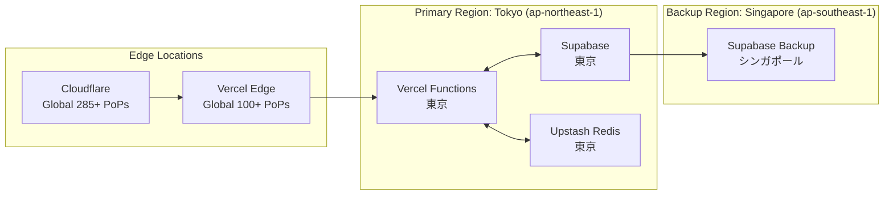
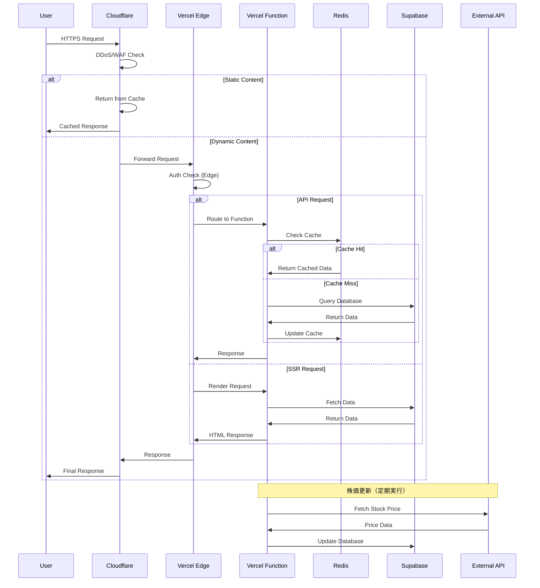
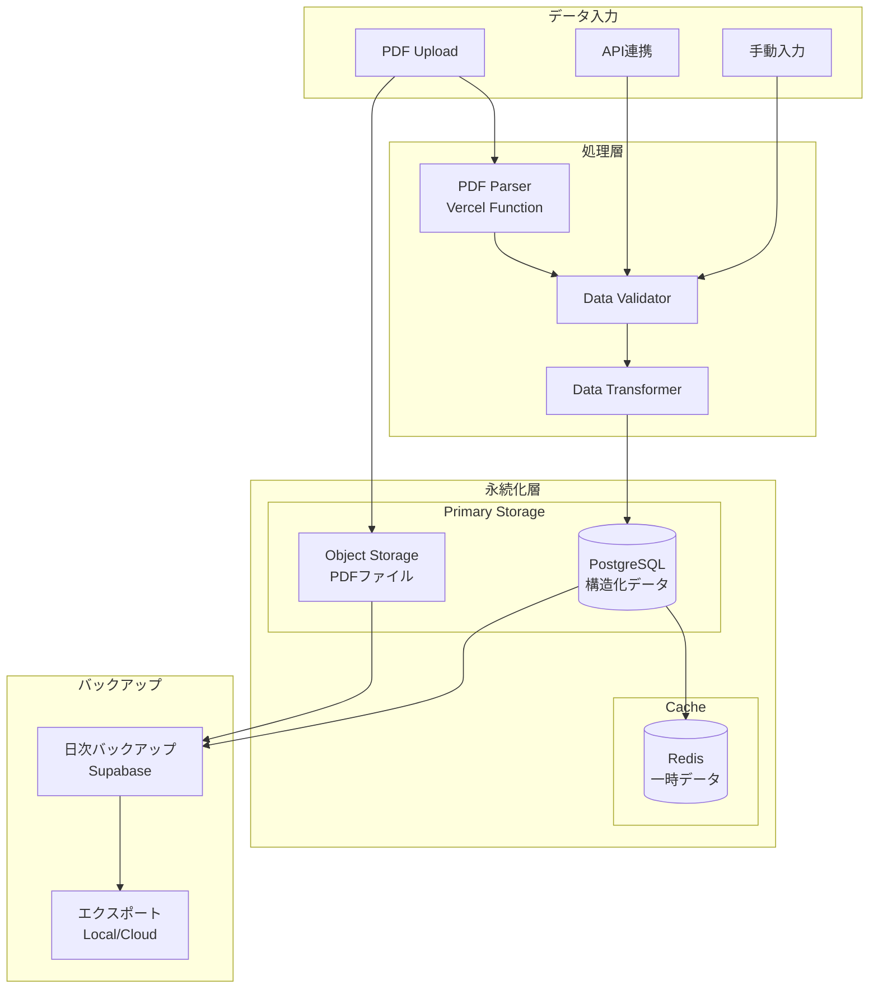
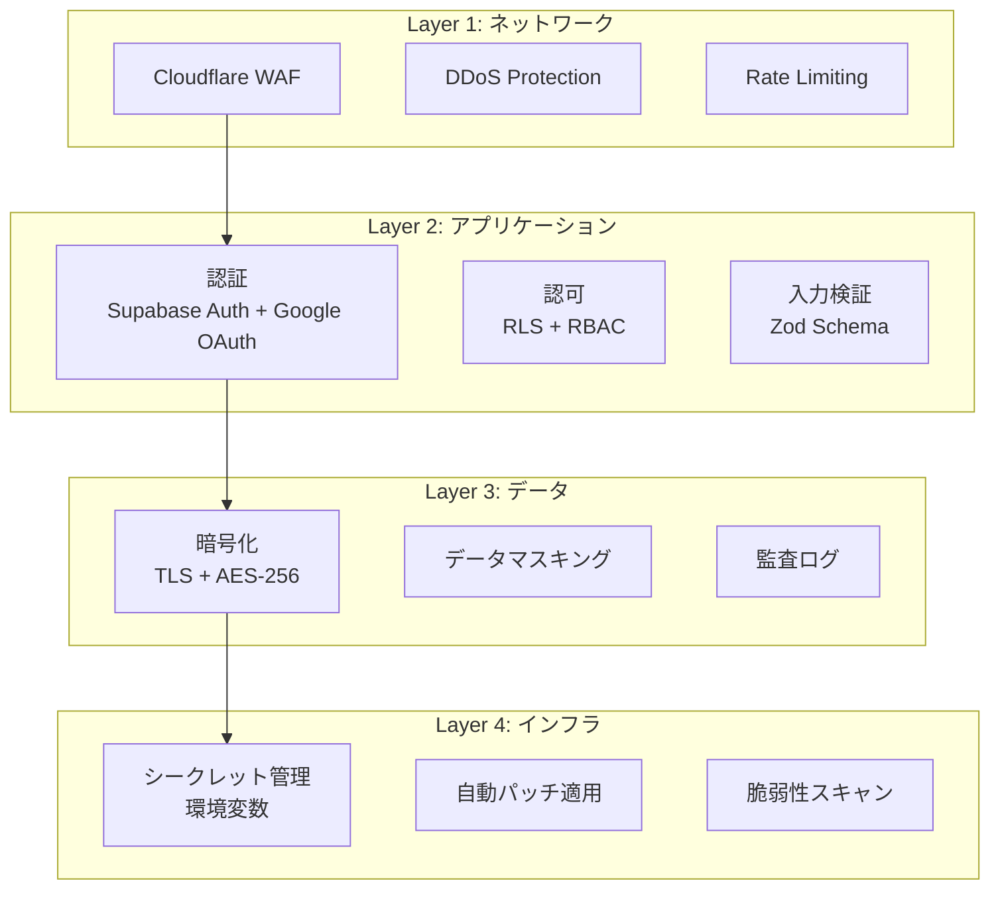
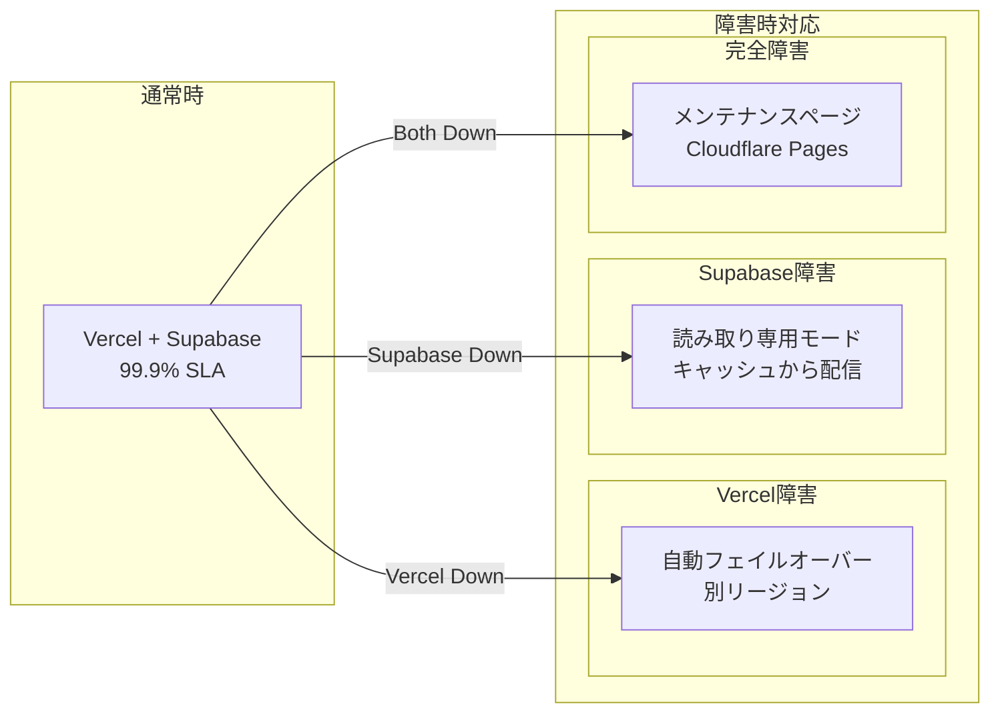
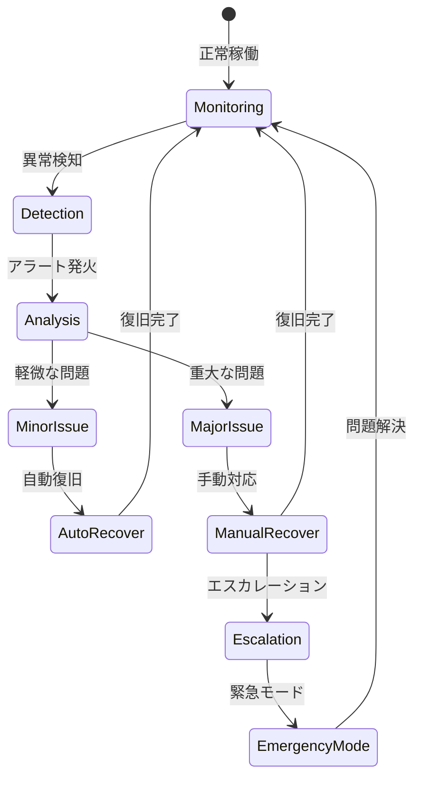
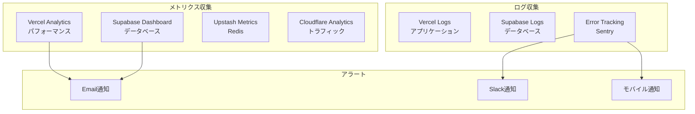
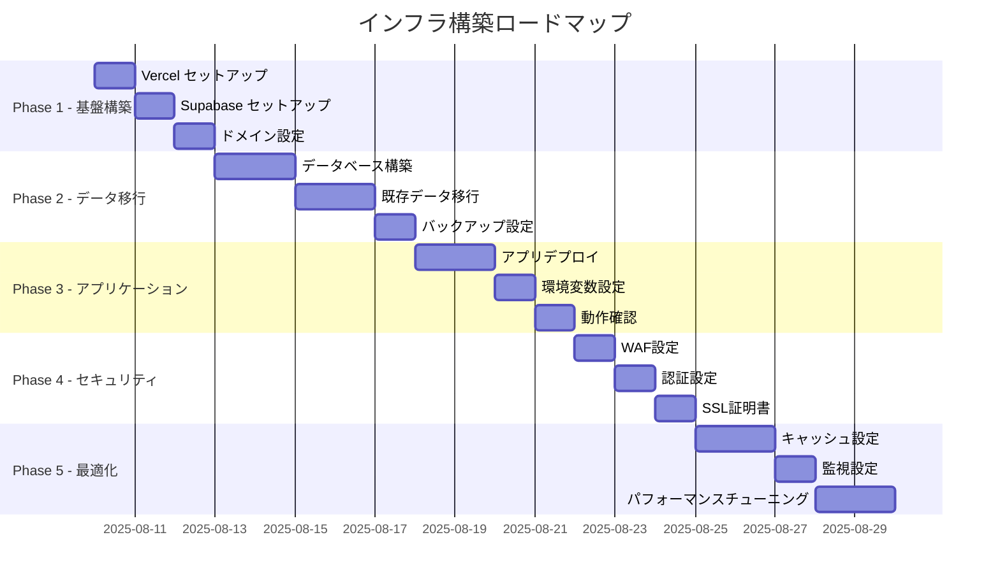
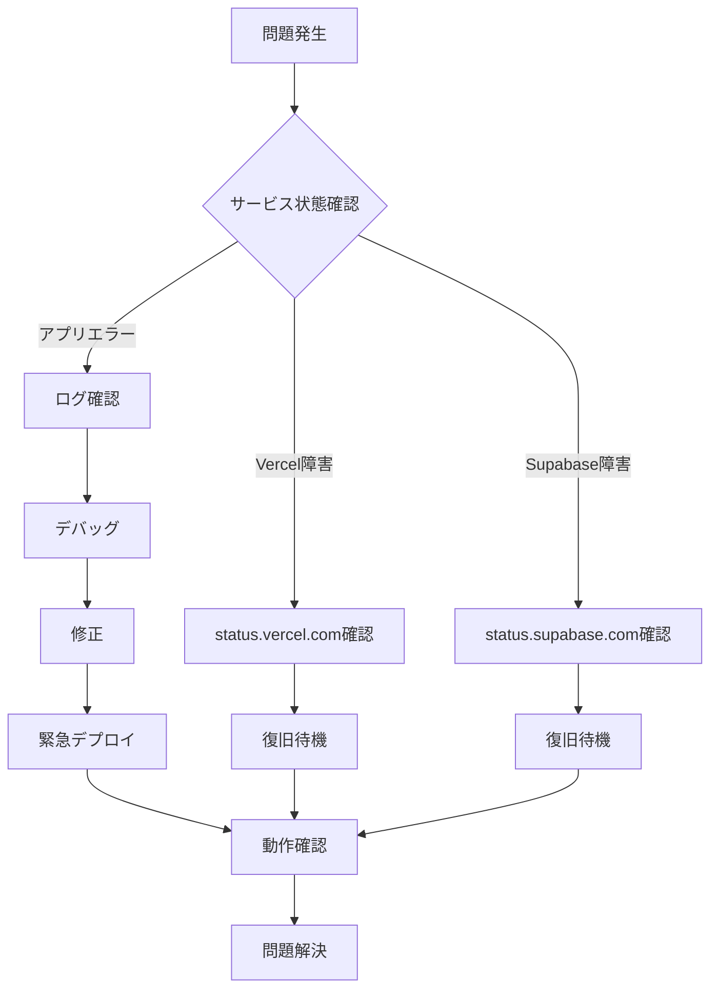

# インフラストラクチャアーキテクチャ設計書

## 文書情報
- **作成日**: 2025-08-10
- **作成者**: インフラストラクチャアーキテクト
- **バージョン**: 1.0.0
- **ステータス**: 初版

---

## 1. エグゼクティブサマリー

### 1.1 設計概要

個人の給料と資産管理システムのインフラストラクチャは、**コスト効率**と**運用の簡素化**を最優先に設計されています。Vercel + Supabaseを中心とした、フルマネージドサービスの組み合わせにより、インフラ管理の負担を最小化しつつ、高い可用性とセキュリティを実現します。

### 1.2 主要な設計原則

1. **サーバーレスファースト**: インフラ管理を最小化
2. **無料枠の最大活用**: 個人利用に適したコスト構造
3. **自動スケーリング**: 需要に応じた自動リソース調整
4. **グローバルエッジ配信**: CDNによる高速配信
5. **ゼロダウンタイムデプロイ**: 継続的なサービス提供

---

## 2. アーキテクチャ概要

### 2.1 システム全体構成

```mermaid
graph TB
    subgraph "User Layer"
        User[ユーザー<br/>ブラウザ]
    end
    
    subgraph "Edge Layer"
        CF[Cloudflare<br/>CDN/WAF/DDoS Protection]
    end
    
    subgraph "Application Layer - Vercel"
        subgraph "Edge Functions"
            EF[Edge Functions<br/>認証・ルーティング]
        end
        subgraph "Serverless Functions"
            API[API Routes<br/>ビジネスロジック]
            SSR[SSR/ISR<br/>レンダリング]
        end
        subgraph "Static Assets"
            Static[Static Files<br/>JS/CSS/Images]
        end
    end
    
    subgraph "Data Layer - Supabase"
        subgraph "Database"
            PG[(PostgreSQL<br/>主データストア)]
            Vec[(pgvector<br/>将来: AI検索)]
        end
        subgraph "Storage"
            S3[Storage<br/>PDFファイル保存]
        end
        subgraph "Realtime"
            RT[Realtime<br/>将来: リアルタイム更新]
        end
        subgraph "Auth"
            Auth[Auth<br/>認証サービス]
        end
    end
    
    subgraph "Cache Layer"
        Redis[Upstash Redis<br/>セッション・キャッシュ]
    end
    
    subgraph "External Services"
        Google[Google OAuth<br/>認証プロバイダー]
        AlphaV[Alpha Vantage<br/>株価API]
    end
    
    subgraph "Monitoring"
        VA[Vercel Analytics<br/>パフォーマンス監視]
        Sentry[Sentry<br/>エラートラッキング]
    end
    
    User -->|HTTPS| CF
    CF -->|Cache Miss| EF
    EF --> API
    EF --> SSR
    EF --> Static
    
    API --> PG
    API --> S3
    API --> Redis
    API --> Auth
    
    SSR --> PG
    
    Auth --> Google
    API --> AlphaV
    
    API -.->|Logs| VA
    API -.->|Errors| Sentry
```

### 2.2 リージョン配置戦略



---

## 3. コンポーネント詳細設計

### 3.1 Vercel Platform

#### 3.1.1 構成詳細

```typescript
interface VercelConfiguration {
  // プロジェクト設定
  project: {
    framework: "sveltekit";
    nodeVersion: "20.x";
    buildCommand: "npm run build";
    outputDirectory: ".vercel/output";
    installCommand: "npm install";
  };
  
  // 関数設定
  functions: {
    // API Routes
    api: {
      runtime: "nodejs20.x";
      maxDuration: 10; // 秒（Hobbyプラン）
      memory: 1024; // MB
      regions: ["hnd1"]; // 東京
    };
    
    // Edge Functions
    edge: {
      runtime: "edge";
      regions: "global";
    };
  };
  
  // 環境変数
  environment: {
    production: {
      DATABASE_URL: "encrypted",
      REDIS_URL: "encrypted",
      GOOGLE_CLIENT_ID: "encrypted",
      ENCRYPTION_KEY: "encrypted",
    };
    preview: {
      // プレビュー環境用設定
    };
  };
  
  // キャッシング設定
  caching: {
    // 静的アセット
    static: {
      maxAge: 31536000; // 1年
      immutable: true;
    };
    
    // ISR (Incremental Static Regeneration)
    isr: {
      revalidate: 3600; // 1時間
    };
    
    // API レスポンス
    api: {
      "s-maxage": 60; // CDNキャッシュ
      "stale-while-revalidate": 86400;
    };
  };
}
```

#### 3.1.2 無料枠活用

| リソース | 無料枠 | 想定使用量 | 余裕度 |
|---------|--------|-----------|--------|
| **帯域幅** | 100GB/月 | 5GB/月 | 95% |
| **関数実行** | 100GB-hours/月 | 10GB-hours/月 | 90% |
| **ビルド時間** | 6,000分/月 | 300分/月 | 95% |
| **エッジリクエスト** | 1,000万/月 | 10万/月 | 99% |
| **Analytics** | 2,500イベント/月 | 1,000イベント/月 | 60% |

### 3.2 Supabase Platform

#### 3.2.1 構成詳細

```typescript
interface SupabaseConfiguration {
  // データベース設定
  database: {
    plan: "free";
    instance: {
      cpu: "shared-cpu-1x";
      memory: "1GB";
      storage: "500MB"; // 無料枠
    };
    
    pooling: {
      mode: "transaction";
      maxConnections: 15; // 無料枠制限
      defaultPoolSize: 5;
    };
    
    backup: {
      pointInTimeRecovery: false; // 無料枠では利用不可
      dailyBackups: 7; // 7日間保持
    };
  };
  
  // ストレージ設定
  storage: {
    totalSize: "1GB"; // 無料枠
    maxFileSize: "50MB";
    
    buckets: {
      "salary-slips": {
        public: false;
        allowedMimeTypes: ["application/pdf"];
        maxFileSize: "10MB";
      };
      "avatars": {
        public: true;
        allowedMimeTypes: ["image/*"];
        maxFileSize: "2MB";
      };
    };
  };
  
  // 認証設定
  auth: {
    providers: ["google"];
    
    settings: {
      disableSignup: false;
      emailConfirmations: true;
      passwordMinLength: 8;
      
      jwt: {
        secret: "auto-generated";
        expiry: 3600; // 1時間
      };
      
      sessions: {
        timebox: 86400; // 24時間
        inactivityTimeout: 1800; // 30分
      };
    };
  };
  
  // リアルタイム設定（将来利用）
  realtime: {
    enabled: false; // 初期は無効
    maxConcurrentUsers: 200; // 無料枠
    eventsPerSecond: 10;
  };
}
```

#### 3.2.2 Row Level Security (RLS) 設定

```sql
-- ユーザーデータの完全分離
CREATE POLICY "Users can only see own data"
ON salary_slips
FOR ALL
USING (auth.uid() = user_id);

CREATE POLICY "Users can only see own portfolio"
ON stock_portfolios
FOR ALL
USING (auth.uid() = user_id);

-- 読み取り専用のマスターデータ
CREATE POLICY "Everyone can read stock masters"
ON stock_masters
FOR SELECT
USING (true);
```

### 3.3 Upstash Redis

#### 3.3.1 構成詳細

```typescript
interface UpstashConfiguration {
  // 基本設定
  plan: "free";
  region: "ap-northeast-1"; // 東京
  
  limits: {
    dailyRequests: 10000; // 無料枠
    maxConnections: 1000;
    maxDatabaseSize: "256MB";
    maxRequestSize: "1MB";
    maxRecordSize: "100MB";
  };
  
  // 使用パターン
  usage: {
    // セッション管理
    sessions: {
      prefix: "session:",
      ttl: 86400, // 24時間
      estimatedCount: 10,
    };
    
    // APIキャッシュ
    cache: {
      prefix: "cache:",
      ttl: 3600, // 1時間
      patterns: [
        "stock-prices",
        "dashboard-summary",
        "portfolio-total",
      ];
    };
    
    // レート制限
    rateLimiting: {
      prefix: "rate:",
      window: 900, // 15分
      maxRequests: 100,
    };
  };
  
  // 永続性設定
  persistence: {
    enabled: true;
    evictionPolicy: "allkeys-lru";
  };
}
```

### 3.4 Cloudflare (CDN/WAF)

#### 3.4.1 構成詳細

```typescript
interface CloudflareConfiguration {
  // 基本設定
  plan: "free";
  
  // CDN設定
  cdn: {
    caching: {
      level: "standard";
      browserCacheTTL: 14400; // 4時間
      edgeCacheTTL: 7200; // 2時間
      
      rules: [
        {
          path: "/static/*",
          ttl: 31536000, // 1年
          browserCache: true,
        },
        {
          path: "/api/*",
          ttl: 0, // キャッシュしない
          browserCache: false,
        },
      ];
    };
    
    performance: {
      minify: {
        javascript: true,
        css: true,
        html: true,
      };
      brotli: true,
      http2: true,
      http3: true,
    };
  };
  
  // セキュリティ設定
  security: {
    // WAF
    waf: {
      sensitivity: "high";
      rules: [
        "OWASP ModSecurity Core Rule Set",
        "Cloudflare Managed Ruleset",
      ];
    };
    
    // DDoS Protection
    ddos: {
      enabled: true;
      sensitivity: "high";
    };
    
    // Bot Management
    botManagement: {
      challengeSuspicious: true;
      blockKnownBots: true;
    };
    
    // SSL/TLS
    ssl: {
      mode: "full_strict";
      minVersion: "1.2";
      hsts: {
        enabled: true,
        maxAge: 31536000,
        includeSubdomains: true,
        preload: true,
      };
    };
  };
  
  // ページルール
  pageRules: [
    {
      url: "*.salary-manager.com/api/*",
      settings: {
        cacheLevel: "bypass",
        securityLevel: "high",
      },
    },
    {
      url: "*.salary-manager.com/admin/*",
      settings: {
        securityLevel: "under_attack",
      },
    },
  ];
}
```

---

## 4. ネットワークアーキテクチャ

### 4.1 トラフィックフロー



### 4.2 レイテンシー最適化

| 経路 | 想定レイテンシー | 最適化手法 |
|------|-----------------|-----------|
| **静的コンテンツ** | < 50ms | CDNエッジキャッシュ |
| **API (キャッシュヒット)** | < 100ms | Redis キャッシュ |
| **API (DB クエリ)** | < 200ms | 接続プーリング、インデックス |
| **SSR ページ** | < 300ms | ISR、部分的静的生成 |
| **外部API呼び出し** | < 1000ms | バックグラウンドジョブ化 |

---

## 5. データアーキテクチャ

### 5.1 データフロー設計



### 5.2 データ配置戦略

| データ種別 | 保存先 | 暗号化 | バックアップ | 保持期間 |
|-----------|--------|--------|-------------|----------|
| **給料明細データ** | PostgreSQL | ✓ | 日次 | 7年 |
| **PDFファイル** | Object Storage | ✓ | 日次 | 7年 |
| **株式ポートフォリオ** | PostgreSQL | ✓ | 日次 | 5年 |
| **セッション情報** | Redis | ✓ | なし | 24時間 |
| **キャッシュデータ** | Redis | - | なし | 1時間 |
| **監査ログ** | PostgreSQL | ✓ | 日次 | 3年 |

---

## 6. セキュリティアーキテクチャ

### 6.1 多層防御の実装



### 6.2 コンプライアンス対応

| 要件 | 実装方法 | ツール/サービス |
|------|---------|----------------|
| **個人情報保護法** | データ暗号化、アクセス制御 | Supabase RLS |
| **データ保持** | 7年間保存、自動削除 | PostgreSQL + Cron |
| **監査証跡** | 全操作ログ記録 | Audit Tables |
| **データポータビリティ** | エクスポート機能 | CSV/JSON Export |
| **忘れられる権利** | データ削除機能 | Soft/Hard Delete |

---

## 7. 可用性とディザスタリカバリ

### 7.1 可用性設計



### 7.2 バックアップ・リカバリ戦略

| コンポーネント | RPO | RTO | バックアップ方法 | リストア手順 |
|---------------|-----|-----|----------------|-------------|
| **データベース** | 24時間 | 4時間 | Supabase自動バックアップ | 管理画面から復元 |
| **ファイルストレージ** | 24時間 | 2時間 | Object Storageレプリケーション | 手動復元 |
| **設定・コード** | 0 | 30分 | Git リポジトリ | 再デプロイ |
| **セッション** | N/A | N/A | 揮発性データ | 再ログイン |

### 7.3 障害対応フロー



---

## 8. パフォーマンス最適化

### 8.1 キャッシング戦略

```typescript
interface CachingStrategy {
  // ブラウザキャッシュ
  browser: {
    static: {
      images: "max-age=31536000, immutable";
      css: "max-age=31536000, immutable";
      js: "max-age=31536000, immutable";
    };
    dynamic: {
      html: "no-cache, must-revalidate";
      api: "private, max-age=0";
    };
  };
  
  // CDNキャッシュ
  cdn: {
    static: {
      ttl: 31536000; // 1年
      purgeOnDeploy: true;
    };
    api: {
      ttl: 60; // 1分
      staleWhileRevalidate: 86400; // 24時間
      varyBy: ["authorization", "accept-language"];
    };
  };
  
  // アプリケーションキャッシュ
  application: {
    redis: {
      sessionTTL: 86400; // 24時間
      dataCacheTTL: 3600; // 1時間
      
      strategies: {
        dashboardSummary: "cache-aside";
        stockPrices: "write-through";
        userPreferences: "write-behind";
      };
    };
    
    database: {
      queryCache: true;
      preparedStatements: true;
      connectionPooling: true;
    };
  };
}
```

### 8.2 最適化メトリクス

| メトリクス | 目標値 | 現在値 | 改善施策 |
|-----------|--------|--------|----------|
| **FCP (First Contentful Paint)** | < 1.8s | - | CDN、プリロード |
| **LCP (Largest Contentful Paint)** | < 2.5s | - | 画像最適化、遅延読み込み |
| **FID (First Input Delay)** | < 100ms | - | コード分割、Web Worker |
| **CLS (Cumulative Layout Shift)** | < 0.1 | - | 画像サイズ指定、フォント最適化 |
| **TTFB (Time to First Byte)** | < 200ms | - | エッジ関数、キャッシング |

---

## 9. コスト最適化

### 9.1 月間コスト見積もり

| サービス | プラン | 月額費用 | 備考 |
|---------|--------|----------|------|
| **Vercel** | Hobby (Free) | ¥0 | 個人利用十分 |
| **Supabase** | Free | ¥0 | 500MB DB、1GB Storage |
| **Upstash Redis** | Free | ¥0 | 10,000リクエスト/日 |
| **Cloudflare** | Free | ¥0 | 基本WAF/CDN |
| **Google OAuth** | Free | ¥0 | - |
| **Alpha Vantage** | Free | ¥0 | 5リクエスト/分 |
| **ドメイン** | - | ¥150 | 年額¥1,800 |
| **合計** | - | **¥150** | 極めて低コスト |

### 9.2 スケールアップ時のコスト

| 利用規模 | 想定コスト | 必要な変更 |
|----------|-----------|-----------|
| **個人利用** | ¥150/月 | 現状維持 |
| **家族利用（5人）** | ¥150/月 | 現状維持 |
| **小規模（10人）** | ¥2,000/月 | Vercel Pro |
| **中規模（100人）** | ¥10,000/月 | Supabase Pro + Vercel Pro |

### 9.3 コスト削減施策

1. **キャッシング最大化**
   - 静的コンテンツの長期キャッシュ
   - APIレスポンスのキャッシュ
   - データベースクエリ結果のキャッシュ

2. **リソース最適化**
   - 画像の自動圧縮とWebP変換
   - JavaScriptのコード分割
   - 不要な依存関係の削除

3. **API呼び出し最適化**
   - バッチ処理の活用
   - レート制限内での効率的な利用
   - 不必要なポーリングの削減

---

## 10. 監視とオブザーバビリティ

### 10.1 監視アーキテクチャ



### 10.2 主要監視項目

| カテゴリ | 監視項目 | 閾値 | アラート |
|---------|---------|------|----------|
| **可用性** | アップタイム | < 99.9% | 即時 |
| **パフォーマンス** | レスポンスタイム | > 3秒 | 5分後 |
| **エラー** | エラー率 | > 1% | 即時 |
| **リソース** | DB接続数 | > 80% | 15分後 |
| **セキュリティ** | 不正ログイン試行 | > 5回 | 即時 |
| **コスト** | API使用量 | > 90% | 日次 |

---

## 11. 自動化とDevOps

### 11.1 CI/CDパイプライン

```mermaid
graph LR
    subgraph "開発"
        Dev[ローカル開発]
        Test[ユニットテスト]
    end
    
    subgraph "CI - GitHub Actions"
        Push[Git Push]
        Lint[Lint & Format]
        Build[ビルド]
        TestCI[テスト実行]
        Security[セキュリティスキャン]
    end
    
    subgraph "CD - Vercel"
        Preview[プレビューデプロイ]
        Review[コードレビュー]
        Merge[マージ]
        Prod[本番デプロイ]
    end
    
    Dev --> Test
    Test --> Push
    Push --> Lint
    Lint --> Build
    Build --> TestCI
    TestCI --> Security
    Security --> Preview
    Preview --> Review
    Review --> Merge
    Merge --> Prod
```



### 11.2 Infrastructure as Code

```typescript
// vercel.json
{
  "framework": "sveltekit",
  "buildCommand": "npm run build",
  "functions": {
    "src/routes/api/*.ts": {
      "maxDuration": 10,
      "memory": 1024
    }
  },
  "crons": [
    {
      "path": "/api/cron/update-stock-prices",
      "schedule": "0 6 * * 1-5"  // 平日朝6時
    },
    {
      "path": "/api/cron/cleanup",
      "schedule": "0 2 * * *"     // 毎日深夜2時
    }
  ],
  "headers": [
    {
      "source": "/(.*)",
      "headers": [
        {
          "key": "X-Frame-Options",
          "value": "DENY"
        },
        {
          "key": "X-Content-Type-Options",
          "value": "nosniff"
        },
        {
          "key": "Referrer-Policy",
          "value": "strict-origin-when-cross-origin"
        }
      ]
    }
  ]
}
```

---

## 12. 移行戦略

### 12.1 段階的移行計画



### 12.2 チェックリスト

- [ ] **Phase 1: 基盤構築**
  - [ ] Vercelアカウント作成
  - [ ] Supabaseプロジェクト作成
  - [ ] Upstash Redisインスタンス作成
  - [ ] Cloudflareアカウント設定
  - [ ] ドメイン取得・設定

- [ ] **Phase 2: データ移行**
  - [ ] Prismaスキーマ適用
  - [ ] 初期データ投入
  - [ ] バックアップジョブ設定
  - [ ] データ整合性確認

- [ ] **Phase 3: アプリケーション**
  - [ ] GitHubリポジトリ連携
  - [ ] 環境変数設定
  - [ ] ビルド・デプロイ
  - [ ] 機能テスト実施

- [ ] **Phase 4: セキュリティ**
  - [ ] WAFルール設定
  - [ ] Google OAuth設定
  - [ ] RLS設定
  - [ ] セキュリティヘッダー確認

- [ ] **Phase 5: 最適化**
  - [ ] CDNキャッシュ設定
  - [ ] Redisキャッシュ実装
  - [ ] 監視ダッシュボード設定
  - [ ] パフォーマンス計測

---

## 13. トラブルシューティング

### 13.1 よくある問題と対処法

| 問題 | 症状 | 原因 | 対処法 |
|------|------|------|--------|
| **503エラー** | サービス利用不可 | 関数タイムアウト | タイムアウト値増加、処理最適化 |
| **429エラー** | Too Many Requests | レート制限 | キャッシュ実装、リトライロジック |
| **データベース接続エラー** | 接続失敗 | 接続数上限 | 接続プーリング、接続数削減 |
| **認証エラー** | ログイン失敗 | セッション期限切れ | セッションリフレッシュ実装 |
| **CORS エラー** | API呼び出し失敗 | CORS設定不備 | Vercel.json で CORS設定 |

### 13.2 緊急時対応手順



---

## 14. 将来の拡張計画

### 14.1 スケーラビリティロードマップ

| フェーズ | 時期 | ユーザー数 | 必要な変更 |
|---------|------|-----------|-----------|
| **Phase 1** | 現在 | 1-5 | 現行構成維持 |
| **Phase 2** | 6ヶ月後 | 5-20 | Vercel Pro移行検討 |
| **Phase 3** | 1年後 | 20-100 | Supabase Pro、専用Redis |
| **Phase 4** | 2年後 | 100+ | マルチテナント化、エンタープライズ |

### 14.2 機能拡張に伴うインフラ変更

```typescript
interface FutureEnhancements {
  // AI機能追加
  ai: {
    infrastructure: "Vercel AI SDK";
    vectorDB: "Supabase pgvector";
    llm: "OpenAI API / Claude API";
    useCase: ["明細分析", "予算提案", "投資アドバイス"];
  };
  
  // リアルタイム機能
  realtime: {
    infrastructure: "Supabase Realtime";
    useCase: ["株価リアルタイム更新", "協調編集"];
  };
  
  // モバイルアプリ
  mobile: {
    framework: "React Native / Flutter";
    backend: "既存API活用";
    push: "Firebase Cloud Messaging";
  };
  
  // 高度な分析
  analytics: {
    dataWarehouse: "BigQuery / Snowflake";
    etl: "Airbyte / Fivetran";
    visualization: "Looker / Tableau";
  };
}
```

---

## 15. まとめ

### 15.1 設計の特徴

1. **極めて低コスト**: 月額¥150で運用可能
2. **高い拡張性**: 必要に応じて段階的にスケール可能
3. **運用負荷最小**: フルマネージドサービスで運用自動化
4. **セキュア**: エンタープライズグレードのセキュリティ
5. **高パフォーマンス**: グローバルCDNとキャッシング

### 15.2 期待される成果

- **初期投資**: 実質¥0（ドメイン代のみ）
- **運用工数**: 月1時間以内
- **可用性**: 99.9%以上
- **パフォーマンス**: ページロード3秒以内
- **セキュリティ**: OWASP Top 10対応

---

## 承認

| 役割 | 名前 | 日付 | 署名 |
|------|------|------|------|
| インフラアーキテクト | インフラストラクチャアーキテクト | 2025-08-10 | ✅ |
| レビュアー | - | - | [ ] |
| 承認者 | - | - | [ ] |

---

**改訂履歴**

| バージョン | 日付 | 変更内容 | 作成者 |
|-----------|------|----------|--------|
| 1.0.0 | 2025-08-10 | 初版作成 | インフラストラクチャアーキテクト |