# デプロイメント設計書

## 文書情報
- **作成日**: 2025-08-10
- **作成者**: DevOpsアーキテクト
- **バージョン**: 1.0.0
- **ステータス**: 初版

---

## 1. エグゼクティブサマリー

### 1.1 デプロイメント戦略概要

本システムのデプロイメント戦略は、**継続的デリバリー（CD）**と**ゼロダウンタイムデプロイ**を実現するため、GitHub ActionsとVercelの自動デプロイメント機能を活用します。個人開発プロジェクトに最適化された、シンプルかつ堅牢なパイプラインを構築します。

### 1.2 主要な設計原則

1. **自動化ファースト**: 手動作業を最小化
2. **フェイルファスト**: 問題の早期発見と修正
3. **ロールバック可能**: いつでも安全に前バージョンへ戻せる
4. **環境の一貫性**: 開発から本番まで同一構成
5. **監査証跡**: 全デプロイメントの記録保持

---

## 2. CI/CDパイプライン設計

### 2.1 パイプライン全体像

```mermaid
graph TB
    subgraph "Development"
        Dev[開発者] --> Commit[Git Commit]
        Commit --> Push[Git Push]
    end
    
    subgraph "GitHub"
        Push --> Branch{ブランチ判定}
        Branch -->|feature/*| PR[Pull Request]
        Branch -->|main| MainPush[Main Push]
        
        PR --> CIPR[CI Pipeline<br/>Pull Request]
        MainPush --> CIMain[CI Pipeline<br/>Main]
    end
    
    subgraph "CI Pipeline"
        CIPR --> Lint1[Linting]
        Lint1 --> Format1[Formatting Check]
        Format1 --> Type1[Type Check]
        Type1 --> Test1[Unit Tests]
        Test1 --> Build1[Build]
        Build1 --> Security1[Security Scan]
        
        CIMain --> Lint2[Linting]
        Lint2 --> Format2[Formatting Check]
        Format2 --> Type2[Type Check]
        Type2 --> Test2[Unit Tests]
        Test2 --> Build2[Build]
        Build2 --> Security2[Security Scan]
        Security2 --> E2E[E2E Tests]
    end
    
    subgraph "Vercel"
        Security1 --> Preview[Preview Deploy]
        E2E --> Production[Production Deploy]
        
        Preview --> PreviewURL[Preview URL]
        Production --> ProdURL[Production URL]
    end
    
    subgraph "Post Deployment"
        Production --> Smoke[Smoke Tests]
        Smoke --> Monitor[Monitoring]
        Monitor --> Alert{Alert?}
        Alert -->|Yes| Rollback[Auto Rollback]
        Alert -->|No| Success[Success]
    end
```



### 2.2 ブランチ戦略


### 2.3 環境構成

| 環境 | ブランチ | URL | 用途 | 自動デプロイ |
|------|---------|-----|------|-------------|
| **Development** | feature/* | localhost:5173 | ローカル開発 | - |
| **Preview** | feature/*, develop | *.vercel.app | レビュー・検証 | ✓ |
| **Staging** | develop | staging.salary-manager.com | 統合テスト | ✓ |
| **Production** | main | salary-manager.com | 本番環境 | ✓ |

---

## 3. GitHub Actions設定

### 3.1 CI Workflow

```yaml
# .github/workflows/ci.yml
name: CI Pipeline

on:
  push:
    branches: [main, develop]
  pull_request:
    branches: [main, develop]

env:
  NODE_VERSION: '20.x'
  PNPM_VERSION: '8'

jobs:
  # ===== Linting & Formatting =====
  quality-check:
    name: Code Quality Check
    runs-on: ubuntu-latest
    steps:
      - name: Checkout code
        uses: actions/checkout@v4
        
      - name: Setup Node.js
        uses: actions/setup-node@v4
        with:
          node-version: ${{ env.NODE_VERSION }}
          
      - name: Setup pnpm
        uses: pnpm/action-setup@v2
        with:
          version: ${{ env.PNPM_VERSION }}
          
      - name: Get pnpm store directory
        id: pnpm-cache
        shell: bash
        run: |
          echo "STORE_PATH=$(pnpm store path)" >> $GITHUB_OUTPUT
          
      - name: Setup pnpm cache
        uses: actions/cache@v3
        with:
          path: ${{ steps.pnpm-cache.outputs.STORE_PATH }}
          key: ${{ runner.os }}-pnpm-store-${{ hashFiles('**/pnpm-lock.yaml') }}
          restore-keys: |
            ${{ runner.os }}-pnpm-store-
            
      - name: Install dependencies
        run: pnpm install --frozen-lockfile
        
      - name: Run ESLint
        run: pnpm run lint
        
      - name: Check Prettier formatting
        run: pnpm run format:check
        
      - name: Run TypeScript type check
        run: pnpm run check

  # ===== Testing =====
  test:
    name: Test Suite
    runs-on: ubuntu-latest
    needs: quality-check
    strategy:
      matrix:
        test-type: [unit, integration]
    steps:
      - name: Checkout code
        uses: actions/checkout@v4
        
      - name: Setup Node.js
        uses: actions/setup-node@v4
        with:
          node-version: ${{ env.NODE_VERSION }}
          
      - name: Setup pnpm
        uses: pnpm/action-setup@v2
        with:
          version: ${{ env.PNPM_VERSION }}
          
      - name: Install dependencies
        run: pnpm install --frozen-lockfile
        
      - name: Run ${{ matrix.test-type }} tests
        run: pnpm run test:${{ matrix.test-type }}
        env:
          DATABASE_URL: ${{ secrets.TEST_DATABASE_URL }}
          
      - name: Upload coverage reports
        if: matrix.test-type == 'unit'
        uses: codecov/codecov-action@v3
        with:
          token: ${{ secrets.CODECOV_TOKEN }}
          flags: unittests
          
  # ===== Build =====
  build:
    name: Build Application
    runs-on: ubuntu-latest
    needs: quality-check
    steps:
      - name: Checkout code
        uses: actions/checkout@v4
        
      - name: Setup Node.js
        uses: actions/setup-node@v4
        with:
          node-version: ${{ env.NODE_VERSION }}
          
      - name: Setup pnpm
        uses: pnpm/action-setup@v2
        with:
          version: ${{ env.PNPM_VERSION }}
          
      - name: Install dependencies
        run: pnpm install --frozen-lockfile
        
      - name: Build application
        run: pnpm run build
        env:
          PUBLIC_APP_URL: ${{ secrets.PUBLIC_APP_URL }}
          
      - name: Upload build artifacts
        uses: actions/upload-artifact@v3
        with:
          name: build-artifacts
          path: .vercel/output
          retention-days: 7

  # ===== Security Scanning =====
  security:
    name: Security Scanning
    runs-on: ubuntu-latest
    needs: build
    steps:
      - name: Checkout code
        uses: actions/checkout@v4
        
      - name: Run npm audit
        run: npm audit --audit-level=moderate
        continue-on-error: true
        
      - name: Run Snyk Security Scan
        uses: snyk/actions/node@master
        env:
          SNYK_TOKEN: ${{ secrets.SNYK_TOKEN }}
        with:
          args: --severity-threshold=high
          
      - name: Run SAST with CodeQL
        uses: github/codeql-action/analyze@v2
        
      - name: Secret Scanning
        uses: trufflesecurity/trufflehog@main
        with:
          path: ./
          base: ${{ github.event.repository.default_branch }}
          head: HEAD
          
  # ===== E2E Testing (Main branch only) =====
  e2e:
    name: E2E Tests
    runs-on: ubuntu-latest
    needs: [test, build, security]
    if: github.ref == 'refs/heads/main'
    steps:
      - name: Checkout code
        uses: actions/checkout@v4
        
      - name: Setup Node.js
        uses: actions/setup-node@v4
        with:
          node-version: ${{ env.NODE_VERSION }}
          
      - name: Setup pnpm
        uses: pnpm/action-setup@v2
        with:
          version: ${{ env.PNPM_VERSION }}
          
      - name: Install dependencies
        run: pnpm install --frozen-lockfile
        
      - name: Install Playwright browsers
        run: pnpm exec playwright install --with-deps
        
      - name: Run E2E tests
        run: pnpm run test:e2e
        env:
          BASE_URL: ${{ secrets.PREVIEW_URL }}
          
      - name: Upload test results
        if: always()
        uses: actions/upload-artifact@v3
        with:
          name: playwright-report
          path: playwright-report/
          retention-days: 30

  # ===== Deployment Readiness Check =====
  deploy-check:
    name: Deployment Readiness
    runs-on: ubuntu-latest
    needs: [test, build, security]
    if: github.ref == 'refs/heads/main'
    outputs:
      ready: ${{ steps.check.outputs.ready }}
    steps:
      - name: Check deployment conditions
        id: check
        run: |
          echo "ready=true" >> $GITHUB_OUTPUT
          
      - name: Notify deployment status
        uses: actions/github-script@v6
        with:
          script: |
            github.rest.repos.createCommitStatus({
              owner: context.repo.owner,
              repo: context.repo.repo,
              sha: context.sha,
              state: 'success',
              description: 'Ready for deployment',
              context: 'ci/deploy-check'
            })
```

### 3.2 CD Workflow

```yaml
# .github/workflows/cd.yml
name: CD Pipeline

on:
  workflow_run:
    workflows: ["CI Pipeline"]
    types:
      - completed
    branches: [main]

jobs:
  # ===== Pre-deployment =====
  pre-deploy:
    name: Pre-deployment Tasks
    runs-on: ubuntu-latest
    if: ${{ github.event.workflow_run.conclusion == 'success' }}
    steps:
      - name: Checkout code
        uses: actions/checkout@v4
        
      - name: Database Migration Check
        run: |
          echo "Checking for pending migrations..."
          # Add migration check logic here
          
      - name: Backup Database
        run: |
          echo "Creating database backup..."
          # Add backup logic here
          
      - name: Create deployment tag
        run: |
          git config user.name github-actions
          git config user.email github-actions@github.com
          git tag -a "deploy-$(date +%Y%m%d-%H%M%S)" -m "Deployment $(date +%Y-%m-%d)"
          git push origin --tags

  # ===== Production Deployment =====
  deploy-production:
    name: Deploy to Production
    runs-on: ubuntu-latest
    needs: pre-deploy
    environment:
      name: production
      url: https://salary-manager.com
    steps:
      - name: Trigger Vercel Deployment
        run: |
          curl -X POST ${{ secrets.VERCEL_DEPLOY_HOOK }}
          
      - name: Wait for deployment
        run: |
          echo "Waiting for deployment to complete..."
          sleep 60
          
      - name: Run smoke tests
        run: |
          curl -f https://salary-manager.com/api/health || exit 1
          
  # ===== Post-deployment =====
  post-deploy:
    name: Post-deployment Tasks
    runs-on: ubuntu-latest
    needs: deploy-production
    steps:
      - name: Purge CDN Cache
        run: |
          curl -X POST "https://api.cloudflare.com/client/v4/zones/${{ secrets.CLOUDFLARE_ZONE_ID }}/purge_cache" \
            -H "Authorization: Bearer ${{ secrets.CLOUDFLARE_API_TOKEN }}" \
            -H "Content-Type: application/json" \
            --data '{"purge_everything":true}'
            
      - name: Notify deployment success
        uses: 8398a7/action-slack@v3
        with:
          status: success
          text: 'Production deployment successful'
          webhook_url: ${{ secrets.SLACK_WEBHOOK }}
          
      - name: Update deployment metrics
        run: |
          echo "Recording deployment metrics..."
          # Add metrics recording logic

  # ===== Rollback (if needed) =====
  rollback:
    name: Rollback Deployment
    runs-on: ubuntu-latest
    needs: deploy-production
    if: failure()
    steps:
      - name: Trigger rollback
        run: |
          echo "Initiating rollback..."
          # Add rollback logic
          
      - name: Restore database backup
        run: |
          echo "Restoring database..."
          # Add restore logic
          
      - name: Notify rollback
        uses: 8398a7/action-slack@v3
        with:
          status: failure
          text: '⚠️ Deployment failed! Rollback initiated.'
          webhook_url: ${{ secrets.SLACK_WEBHOOK }}
```

---

## 4. Vercel設定

### 4.1 プロジェクト設定

```json
// vercel.json
{
  "framework": "sveltekit",
  "buildCommand": "pnpm run build",
  "outputDirectory": ".vercel/output",
  "installCommand": "pnpm install",
  
  "github": {
    "enabled": true,
    "autoAlias": true,
    "silent": false,
    "autoJobCancelation": true
  },
  
  "functions": {
    "src/routes/api/**/*.ts": {
      "runtime": "nodejs20.x",
      "maxDuration": 10,
      "memory": 1024,
      "regions": ["hnd1"]
    }
  },
  
  "crons": [
    {
      "path": "/api/cron/update-stock-prices",
      "schedule": "0 6 * * 1-5"
    },
    {
      "path": "/api/cron/backup",
      "schedule": "0 2 * * *"
    },
    {
      "path": "/api/cron/cleanup",
      "schedule": "0 3 * * 0"
    }
  ],
  
  "env": {
    "NODE_ENV": "production",
    "DATABASE_URL": "@database-url",
    "REDIS_URL": "@redis-url",
    "GOOGLE_CLIENT_ID": "@google-client-id",
    "GOOGLE_CLIENT_SECRET": "@google-client-secret",
    "ENCRYPTION_KEY": "@encryption-key",
    "PUBLIC_APP_URL": "@public-app-url"
  },
  
  "headers": [
    {
      "source": "/(.*)",
      "headers": [
        {
          "key": "X-Frame-Options",
          "value": "DENY"
        },
        {
          "key": "X-Content-Type-Options",
          "value": "nosniff"
        },
        {
          "key": "X-XSS-Protection",
          "value": "1; mode=block"
        },
        {
          "key": "Strict-Transport-Security",
          "value": "max-age=31536000; includeSubDomains; preload"
        },
        {
          "key": "Referrer-Policy",
          "value": "strict-origin-when-cross-origin"
        },
        {
          "key": "Permissions-Policy",
          "value": "camera=(), microphone=(), geolocation=()"
        }
      ]
    },
    {
      "source": "/api/(.*)",
      "headers": [
        {
          "key": "Cache-Control",
          "value": "no-store, no-cache, must-revalidate"
        }
      ]
    },
    {
      "source": "/static/(.*)",
      "headers": [
        {
          "key": "Cache-Control",
          "value": "public, max-age=31536000, immutable"
        }
      ]
    }
  ],
  
  "redirects": [
    {
      "source": "/old-path",
      "destination": "/new-path",
      "permanent": true
    }
  ],
  
  "rewrites": [
    {
      "source": "/api/v1/(.*)",
      "destination": "/api/$1"
    }
  ]
}
```

### 4.2 環境変数管理

```typescript
// scripts/env-setup.ts
interface EnvironmentConfig {
  // 環境別設定
  environments: {
    development: {
      DATABASE_URL: "postgresql://localhost:5432/salary_dev";
      REDIS_URL: "redis://localhost:6379";
      PUBLIC_APP_URL: "http://localhost:5173";
      LOG_LEVEL: "debug";
    };
    
    preview: {
      DATABASE_URL: "@supabase-preview-url";
      REDIS_URL: "@upstash-preview-url";
      PUBLIC_APP_URL: "https://*.vercel.app";
      LOG_LEVEL: "info";
    };
    
    production: {
      DATABASE_URL: "@supabase-production-url";
      REDIS_URL: "@upstash-production-url";
      PUBLIC_APP_URL: "https://salary-manager.com";
      LOG_LEVEL: "error";
    };
  };
  
  // シークレット管理
  secrets: {
    required: [
      "DATABASE_URL",
      "REDIS_URL",
      "GOOGLE_CLIENT_ID",
      "GOOGLE_CLIENT_SECRET",
      "ENCRYPTION_KEY",
      "SESSION_SECRET"
    ];
    
    optional: [
      "SENTRY_DSN",
      "ANALYTICS_ID",
      "ALPHA_VANTAGE_API_KEY"
    ];
  };
  
  // 検証ルール
  validation: {
    DATABASE_URL: /^postgresql:\/\/.+/,
    REDIS_URL: /^redis:\/\/.+/,
    PUBLIC_APP_URL: /^https?:\/\/.+/,
    ENCRYPTION_KEY: /^[a-f0-9]{64}$/,
  };
}

// 環境変数検証スクリプト
export async function validateEnvironment(env: string) {
  const config = getEnvironmentConfig(env);
  const errors: string[] = [];
  
  // 必須変数チェック
  for (const key of config.secrets.required) {
    if (!process.env[key]) {
      errors.push(`Missing required environment variable: ${key}`);
    }
  }
  
  // フォーマット検証
  for (const [key, pattern] of Object.entries(config.validation)) {
    const value = process.env[key];
    if (value && !pattern.test(value)) {
      errors.push(`Invalid format for ${key}`);
    }
  }
  
  if (errors.length > 0) {
    throw new Error(`Environment validation failed:\n${errors.join('\n')}`);
  }
}
```

---

## 5. デプロイメント戦略

### 5.1 デプロイメント方式


### 5.2 ロールアウト戦略

```typescript
interface RolloutStrategy {
  // カナリアデプロイメント
  canary: {
    enabled: true;
    stages: [
      { percentage: 5, duration: "10m", metrics: ["error_rate", "latency"] },
      { percentage: 25, duration: "30m", metrics: ["error_rate", "latency"] },
      { percentage: 50, duration: "1h", metrics: ["error_rate", "latency"] },
      { percentage: 100, duration: "stable", metrics: [] }
    ];
    
    rollbackConditions: {
      errorRate: 0.01; // 1%以上でロールバック
      latency: 3000; // 3秒以上でロールバック
      availability: 0.999; // 99.9%未満でロールバック
    };
  };
  
  // フィーチャーフラグ
  featureFlags: {
    provider: "Vercel Edge Config";
    flags: {
      "new-dashboard": {
        enabled: false,
        rollout: 0,
        allowlist: ["admin@example.com"]
      },
      "ai-analysis": {
        enabled: false,
        rollout: 0,
        blocklist: []
      }
    };
  };
  
  // A/Bテスト
  abTesting: {
    enabled: false;
    experiments: [];
  };
}
```

---

## 6. データベースマイグレーション

### 6.1 マイグレーション戦略


### 6.2 Prismaマイグレーション設定

```typescript
// scripts/migrate.ts
import { exec } from 'child_process';
import { promisify } from 'util';

const execAsync = promisify(exec);

interface MigrationConfig {
  preChecks: () => Promise<void>;
  backup: () => Promise<string>;
  migrate: () => Promise<void>;
  verify: () => Promise<void>;
  rollback: (backupId: string) => Promise<void>;
}

export class DatabaseMigration implements MigrationConfig {
  async preChecks(): Promise<void> {
    console.log('🔍 Running pre-migration checks...');
    
    // 接続確認
    await execAsync('pnpm prisma db pull --print');
    
    // 未適用のマイグレーション確認
    const { stdout } = await execAsync('pnpm prisma migrate status');
    if (stdout.includes('Database schema is not up to date')) {
      console.log('⚠️  Pending migrations detected');
    }
  }
  
  async backup(): Promise<string> {
    console.log('💾 Creating database backup...');
    
    const backupId = `backup-${Date.now()}`;
    const backupUrl = process.env.DATABASE_BACKUP_URL;
    
    // Supabase CLIを使用したバックアップ
    await execAsync(`supabase db dump --db-url ${process.env.DATABASE_URL} > backups/${backupId}.sql`);
    
    console.log(`✅ Backup created: ${backupId}`);
    return backupId;
  }
  
  async migrate(): Promise<void> {
    console.log('Applying migrations...');
    
    try {
      // マイグレーション実行
      await execAsync('pnpm prisma migrate deploy');
      
      // シード実行（必要な場合）
      if (process.env.RUN_SEED === 'true') {
        await execAsync('pnpm prisma db seed');
      }
      
      console.log('✅ Migrations applied successfully');
    } catch (error) {
      console.error('❌ Migration failed:', error);
      throw error;
    }
  }
  
  async verify(): Promise<void> {
    console.log('🔍 Verifying database schema...');
    
    // スキーマ検証
    await execAsync('pnpm prisma validate');
    
    // 基本的なクエリテスト
    const testQueries = [
      'SELECT COUNT(*) FROM users',
      'SELECT COUNT(*) FROM salary_slips',
      'SELECT COUNT(*) FROM stock_portfolios'
    ];
    
    for (const query of testQueries) {
      try {
        await execAsync(`pnpm prisma db execute --sql "${query}"`);
      } catch (error) {
        throw new Error(`Verification query failed: ${query}`);
      }
    }
    
    console.log('✅ Database schema verified');
  }
  
  async rollback(backupId: string): Promise<void> {
    console.log(`⏪ Rolling back to backup: ${backupId}...`);
    
    try {
      // バックアップから復元
      await execAsync(`psql ${process.env.DATABASE_URL} < backups/${backupId}.sql`);
      
      console.log('✅ Rollback completed');
    } catch (error) {
      console.error('❌ Rollback failed:', error);
      throw error;
    }
  }
  
  async run(): Promise<void> {
    let backupId: string | null = null;
    
    try {
      await this.preChecks();
      backupId = await this.backup();
      await this.migrate();
      await this.verify();
      
      console.log('Migration completed successfully');
    } catch (error) {
      console.error('❌ Migration failed:', error);
      
      if (backupId) {
        console.log('🔄 Initiating rollback...');
        await this.rollback(backupId);
      }
      
      process.exit(1);
    }
  }
}

// 実行
if (require.main === module) {
  const migration = new DatabaseMigration();
  migration.run();
}
```

---

## 7. 監視とアラート

### 7.1 デプロイメント監視

```typescript
interface DeploymentMonitoring {
  // メトリクス収集
  metrics: {
    deployment: {
      frequency: "deployments per day";
      duration: "time to deploy";
      successRate: "successful deployments %";
      rollbackRate: "rollback frequency";
    };
    
    application: {
      responseTime: "p50, p95, p99";
      errorRate: "4xx, 5xx errors";
      availability: "uptime percentage";
      throughput: "requests per second";
    };
    
    infrastructure: {
      cpuUsage: "function CPU %";
      memoryUsage: "function memory MB";
      coldStarts: "cold start frequency";
      executionTime: "function duration";
    };
  };
  
  // アラート設定
  alerts: {
    critical: {
      deploymentFailure: {
        condition: "deployment.status === 'failed'";
        action: ["slack", "email", "pagerduty"];
      };
      
      highErrorRate: {
        condition: "error_rate > 5%";
        duration: "5 minutes";
        action: ["rollback", "slack"];
      };
      
      serviceDown: {
        condition: "availability < 99%";
        duration: "1 minute";
        action: ["page", "escalate"];
      };
    };
    
    warning: {
      slowDeployment: {
        condition: "deployment_time > 10 minutes";
        action: ["slack"];
      };
      
      increasedLatency: {
        condition: "p95_latency > 3 seconds";
        duration: "10 minutes";
        action: ["investigate"];
      };
    };
  };
}
```

### 7.2 ヘルスチェック実装

```typescript
// src/routes/api/health/+server.ts
import { json } from '@sveltejs/kit';
import { prisma } from '$lib/server/prisma';
import { redis } from '$lib/server/redis';

export async function GET() {
  const checks = {
    status: 'healthy',
    timestamp: new Date().toISOString(),
    version: process.env.VERCEL_GIT_COMMIT_SHA?.slice(0, 7) || 'unknown',
    checks: {
      database: 'unknown',
      cache: 'unknown',
      storage: 'unknown'
    }
  };
  
  // Database check
  try {
    await prisma.$queryRaw`SELECT 1`;
    checks.checks.database = 'healthy';
  } catch (error) {
    checks.checks.database = 'unhealthy';
    checks.status = 'degraded';
  }
  
  // Redis check
  try {
    await redis.ping();
    checks.checks.cache = 'healthy';
  } catch (error) {
    checks.checks.cache = 'unhealthy';
    checks.status = 'degraded';
  }
  
  // Storage check
  try {
    // Add storage health check
    checks.checks.storage = 'healthy';
  } catch (error) {
    checks.checks.storage = 'unhealthy';
    checks.status = 'degraded';
  }
  
  const statusCode = checks.status === 'healthy' ? 200 : 503;
  
  return json(checks, { status: statusCode });
}

// Readiness check
export async function HEAD() {
  try {
    // Quick checks
    await prisma.$queryRaw`SELECT 1`;
    return new Response(null, { status: 200 });
  } catch {
    return new Response(null, { status: 503 });
  }
}
```

---

## 8. ロールバック戦略

### 8.1 自動ロールバック


### 8.2 ロールバック実装

```typescript
// scripts/rollback.ts
class RollbackManager {
  async performRollback(reason: string): Promise<void> {
    console.log(`🔄 Initiating rollback: ${reason}`);
    
    try {
      // 1. 前バージョンの特定
      const previousVersion = await this.getPreviousVersion();
      
      // 2. トラフィック切り替え
      await this.switchTraffic(previousVersion);
      
      // 3. デプロイメント実行
      await this.deployVersion(previousVersion);
      
      // 4. 検証
      await this.verifyRollback();
      
      // 5. 通知
      await this.notifyTeam(reason, previousVersion);
      
      console.log(`✅ Rollback completed to version: ${previousVersion}`);
    } catch (error) {
      console.error('❌ Rollback failed:', error);
      await this.escalate(error);
    }
  }
  
  private async getPreviousVersion(): Promise<string> {
    // Vercel APIから前バージョン取得
    const response = await fetch('https://api.vercel.com/v6/deployments', {
      headers: {
        Authorization: `Bearer ${process.env.VERCEL_TOKEN}`
      }
    });
    
    const deployments = await response.json();
    return deployments.deployments[1].url; // 前のデプロイメント
  }
  
  private async switchTraffic(version: string): Promise<void> {
    // Vercel APIでトラフィック切り替え
    await fetch(`https://api.vercel.com/v10/projects/${process.env.VERCEL_PROJECT_ID}/alias`, {
      method: 'POST',
      headers: {
        Authorization: `Bearer ${process.env.VERCEL_TOKEN}`,
        'Content-Type': 'application/json'
      },
      body: JSON.stringify({
        alias: process.env.PRODUCTION_URL,
        deployment: version
      })
    });
  }
  
  private async verifyRollback(): Promise<void> {
    // ヘルスチェック
    const health = await fetch(`${process.env.PRODUCTION_URL}/api/health`);
    if (!health.ok) {
      throw new Error('Health check failed after rollback');
    }
    
    // 基本機能テスト
    const criticalEndpoints = [
      '/api/auth/session',
      '/api/salary-slips',
      '/api/portfolio'
    ];
    
    for (const endpoint of criticalEndpoints) {
      const response = await fetch(`${process.env.PRODUCTION_URL}${endpoint}`);
      if (!response.ok && response.status !== 401) {
        throw new Error(`Critical endpoint failed: ${endpoint}`);
      }
    }
  }
}
```

---

## 9. シークレット管理

### 9.1 シークレット階層


### 9.2 シークレットローテーション

```typescript
// scripts/rotate-secrets.ts
interface SecretRotation {
  schedule: {
    database_password: "quarterly";
    api_keys: "monthly";
    encryption_keys: "yearly";
    oauth_credentials: "never"; // 手動のみ
  };
  
  process: {
    preRotation: () => Promise<void>;
    generateNew: () => Promise<string>;
    updateApplication: (secret: string) => Promise<void>;
    verify: () => Promise<void>;
    cleanup: () => Promise<void>;
  };
}

class SecretRotationManager implements SecretRotation {
  async rotateSecret(secretType: string): Promise<void> {
    console.log(`🔐 Starting secret rotation for: ${secretType}`);
    
    try {
      // 1. 事前準備
      await this.preRotation();
      
      // 2. 新しいシークレット生成
      const newSecret = await this.generateNew();
      
      // 3. アプリケーション更新
      await this.updateApplication(newSecret);
      
      // 4. 検証
      await this.verify();
      
      // 5. クリーンアップ
      await this.cleanup();
      
      console.log('✅ Secret rotation completed');
    } catch (error) {
      console.error('❌ Secret rotation failed:', error);
      throw error;
    }
  }
  
  async generateNew(): Promise<string> {
    const crypto = require('crypto');
    return crypto.randomBytes(32).toString('hex');
  }
  
  async updateApplication(secret: string): Promise<void> {
    // Vercel環境変数更新
    await fetch(`https://api.vercel.com/v9/projects/${process.env.VERCEL_PROJECT_ID}/env`, {
      method: 'POST',
      headers: {
        Authorization: `Bearer ${process.env.VERCEL_TOKEN}`,
        'Content-Type': 'application/json'
      },
      body: JSON.stringify({
        key: 'NEW_SECRET',
        value: secret,
        type: 'encrypted',
        target: ['production']
      })
    });
  }
}
```

---

## 10. テスト自動化

### 10.1 デプロイメントテスト

```typescript
// tests/deployment/smoke.test.ts
import { test, expect } from '@playwright/test';

test.describe('Deployment Smoke Tests', () => {
  const baseUrl = process.env.DEPLOYMENT_URL || 'https://salary-manager.com';
  
  test.beforeAll(async () => {
    // デプロイメント完了待機
    await waitForDeployment(baseUrl);
  });
  
  test('Homepage loads successfully', async ({ page }) => {
    const response = await page.goto(baseUrl);
    expect(response?.status()).toBe(200);
    await expect(page).toHaveTitle(/給料管理システム/);
  });
  
  test('API health check passes', async ({ request }) => {
    const response = await request.get(`${baseUrl}/api/health`);
    expect(response.status()).toBe(200);
    
    const health = await response.json();
    expect(health.status).toBe('healthy');
  });
  
  test('Authentication flow works', async ({ page }) => {
    await page.goto(`${baseUrl}/login`);
    await expect(page.locator('button:has-text("Googleでログイン")')).toBeVisible();
  });
  
  test('Critical pages are accessible', async ({ page }) => {
    const criticalPages = [
      '/',
      '/dashboard',
      '/salary-slips',
      '/portfolio'
    ];
    
    for (const path of criticalPages) {
      const response = await page.goto(`${baseUrl}${path}`);
      expect(response?.status()).not.toBe(500);
    }
  });
  
  test('Static assets load correctly', async ({ page }) => {
    await page.goto(baseUrl);
    
    // CSS loaded
    const styles = await page.evaluate(() => {
      return window.getComputedStyle(document.body).backgroundColor;
    });
    expect(styles).toBeTruthy();
    
    // JavaScript executed
    const jsLoaded = await page.evaluate(() => {
      return typeof window.__sveltekit_dev !== 'undefined';
    });
    expect(jsLoaded).toBeTruthy();
  });
});

async function waitForDeployment(url: string, maxRetries = 30): Promise<void> {
  for (let i = 0; i < maxRetries; i++) {
    try {
      const response = await fetch(`${url}/api/health`);
      if (response.ok) return;
    } catch (error) {
      // Continue retrying
    }
    await new Promise(resolve => setTimeout(resolve, 10000)); // 10秒待機
  }
  throw new Error('Deployment did not become ready in time');
}
```

---

## 11. リリースノート自動生成

### 11.1 リリースノート生成

```typescript
// scripts/generate-release-notes.ts
import { Octokit } from '@octokit/rest';

class ReleaseNotesGenerator {
  private octokit: Octokit;
  
  constructor() {
    this.octokit = new Octokit({
      auth: process.env.GITHUB_TOKEN
    });
  }
  
  async generate(fromTag: string, toTag: string): Promise<string> {
    const commits = await this.getCommits(fromTag, toTag);
    const pullRequests = await this.getPullRequests(commits);
    
    const notes = this.formatReleaseNotes({
      version: toTag,
      date: new Date().toISOString().split('T')[0],
      commits,
      pullRequests
    });
    
    return notes;
  }
  
  private formatReleaseNotes(data: any): string {
    return `
# Release ${data.version}

Released on ${data.date}

## New Features
${this.filterByType(data.pullRequests, 'feat')}

## 🐛 Bug Fixes
${this.filterByType(data.pullRequests, 'fix')}

## 📦 Dependencies
${this.filterByType(data.pullRequests, 'deps')}

## 📚 Documentation
${this.filterByType(data.pullRequests, 'docs')}

## 🔧 Maintenance
${this.filterByType(data.pullRequests, 'chore')}

---

**Full Changelog**: [${data.fromTag}...${data.version}](https://github.com/owner/repo/compare/${data.fromTag}...${data.version})
    `.trim();
  }
  
  private filterByType(prs: any[], type: string): string {
    return prs
      .filter(pr => pr.title.startsWith(`${type}:`))
      .map(pr => `- ${pr.title} (#${pr.number})`)
      .join('\n') || '- No changes';
  }
}
```

---

## 12. 次のステップ

### 12.1 実装ロードマップ

```mermaid
gantt
    title デプロイメント実装計画
    dateFormat YYYY-MM-DD
    
    section Phase 1
    GitHub Actions設定      :2025-08-10, 2d
    Vercel連携             :1d
    環境変数設定           :1d
    
    section Phase 2
    CI Pipeline実装        :2025-08-14, 3d
    テスト自動化           :2d
    セキュリティスキャン    :1d
    
    section Phase 3
    CD Pipeline実装        :2025-08-20, 3d
    プレビュー環境設定      :1d
    本番デプロイ設定        :2d
    
    section Phase 4
    監視設定              :2025-08-26, 2d
    アラート設定           :1d
    ロールバック実装       :2d
```



---

## 承認

| 役割 | 名前 | 日付 | 署名 |
|------|------|------|------|
| DevOpsアーキテクト | DevOpsアーキテクト | 2025-08-10 | ✅ |
| レビュアー | - | - | [ ] |
| 承認者 | - | - | [ ] |

---

**改訂履歴**

| バージョン | 日付 | 変更内容 | 作成者 |
|-----------|------|----------|--------|
| 1.0.0 | 2025-08-10 | 初版作成 | DevOpsアーキテクト |