# スケーリング戦略とコスト最適化設計書

## 文書情報

- **作成日**: 2025-08-10
- **作成者**: クラウドコストアーキテクト
- **バージョン**: 1.0.0
- **ステータス**: 初版

---

## 1. エグゼクティブサマリー

### 1.1 戦略概要

個人利用を前提とした本システムのスケーリング戦略は、**コスト効率の最大化**と**必要に応じた段階的拡張**を基本方針とします。初期段階では無料枠を最大限活用し、成長に応じて適切なタイミングでスケールアップ・スケールアウトを実施します。

### 1.2 コスト最適化の原則

1. **無料枠ファースト**: 可能な限り無料枠内で運用
2. **使用量ベース課金**: 固定費を避け、従量課金を選択
3. **自動スケーリング**: リソースの無駄を防ぐ自動調整
4. **キャッシング最大化**: データ転送とコンピューティングコストの削減
5. **定期的な最適化**: 使用状況の分析と継続的改善

---

## 2. 現状分析と将来予測

### 2.1 使用量予測モデル

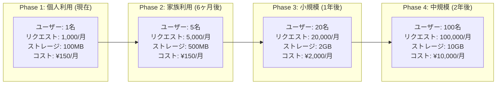

### 2.2 リソース使用量マトリクス

| リソース               | Phase 1 (現在) | Phase 2  | Phase 3   | Phase 4    |
| ---------------------- | -------------- | -------- | --------- | ---------- |
| **月間アクセス数**     | 1,000          | 5,000    | 20,000    | 100,000    |
| **同時接続数**         | 1              | 5        | 20        | 100        |
| **データベースサイズ** | 100MB          | 500MB    | 2GB       | 10GB       |
| **ファイルストレージ** | 100MB          | 500MB    | 2GB       | 10GB       |
| **帯域幅**             | 1GB/月         | 5GB/月   | 20GB/月   | 100GB/月   |
| **API呼び出し**        | 500/月         | 2,500/月 | 10,000/月 | 50,000/月  |
| **関数実行時間**       | 1GB-hour       | 5GB-hour | 20GB-hour | 100GB-hour |

---

## 3. スケーリング戦略

### 3.1 垂直スケーリング（スケールアップ）

```typescript
interface VerticalScalingPlan {
	// Vercel Functions
	functions: {
		phase1: {
			memory: 1024; // MB
			timeout: 10; // seconds
			concurrency: 1000;
		};
		phase2: {
			memory: 1024;
			timeout: 10;
			concurrency: 1000;
		};
		phase3: {
			memory: 2048; // アップグレード
			timeout: 30; // Pro plan
			concurrency: 1000;
		};
		phase4: {
			memory: 3072;
			timeout: 60; // Enterprise
			concurrency: 1000;
		};
	};

	// Supabase Database
	database: {
		phase1: {
			plan: 'free';
			cpu: 'shared';
			memory: '1GB';
			storage: '500MB';
			connections: 15;
		};
		phase2: {
			plan: 'free';
			cpu: 'shared';
			memory: '1GB';
			storage: '500MB';
			connections: 15;
		};
		phase3: {
			plan: 'pro';
			cpu: '2-core';
			memory: '4GB';
			storage: '8GB';
			connections: 60;
		};
		phase4: {
			plan: 'pro';
			cpu: '4-core';
			memory: '8GB';
			storage: '100GB';
			connections: 200;
		};
	};

	// Redis Cache
	cache: {
		phase1: {
			plan: 'free';
			memory: '256MB';
			requests: 10000; // per day
			bandwidth: '10GB';
		};
		phase2: {
			plan: 'free';
			memory: '256MB';
			requests: 10000;
			bandwidth: '10GB';
		};
		phase3: {
			plan: 'pay-as-you-go';
			memory: '1GB';
			requests: 100000;
			bandwidth: '100GB';
		};
		phase4: {
			plan: 'pro';
			memory: '5GB';
			requests: 1000000;
			bandwidth: '500GB';
		};
	};
}
```

### 3.2 水平スケーリング（スケールアウト）

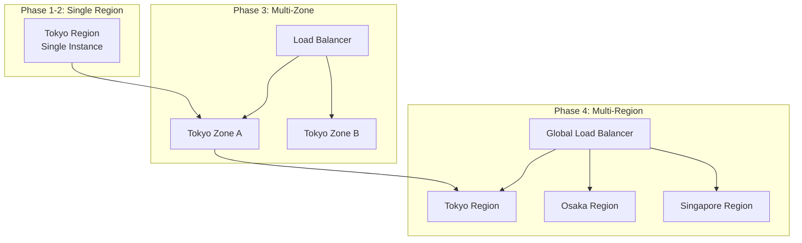

### 3.3 自動スケーリング設定

```typescript
interface AutoScalingConfig {
	// Vercel Edge Functions (自動)
	edge: {
		automatic: true;
		global: true;
		limits: 'platform managed';
	};

	// Serverless Functions
	functions: {
		minInstances: 0; // コールドスタート許容
		maxInstances: 100; // Phase 1-2
		targetCPU: 70; // %
		scaleUpRate: 1; // instance/10s
		scaleDownDelay: 300; // seconds
	};

	// Database Connection Pool
	database: {
		minConnections: 2;
		maxConnections: {
			phase1: 15; // Supabase free limit
			phase2: 15;
			phase3: 60; // Pro plan
			phase4: 200;
		};
		idleTimeout: 60; // seconds
		connectionTimeout: 30;
	};

	// Cache Eviction
	cache: {
		maxMemoryPolicy: 'allkeys-lru';
		ttlDefault: 3600; // 1 hour
		ttlSession: 86400; // 24 hours
		evictionSamples: 5;
	};
}
```

---

## 4. コスト最適化戦略

### 4.1 コスト内訳分析

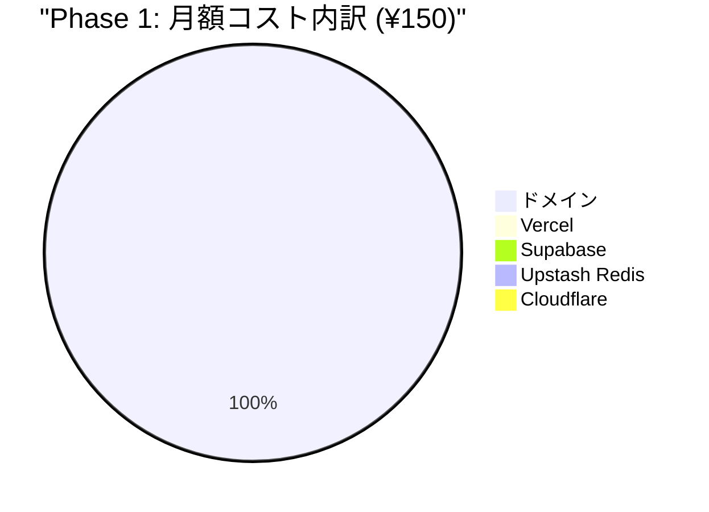

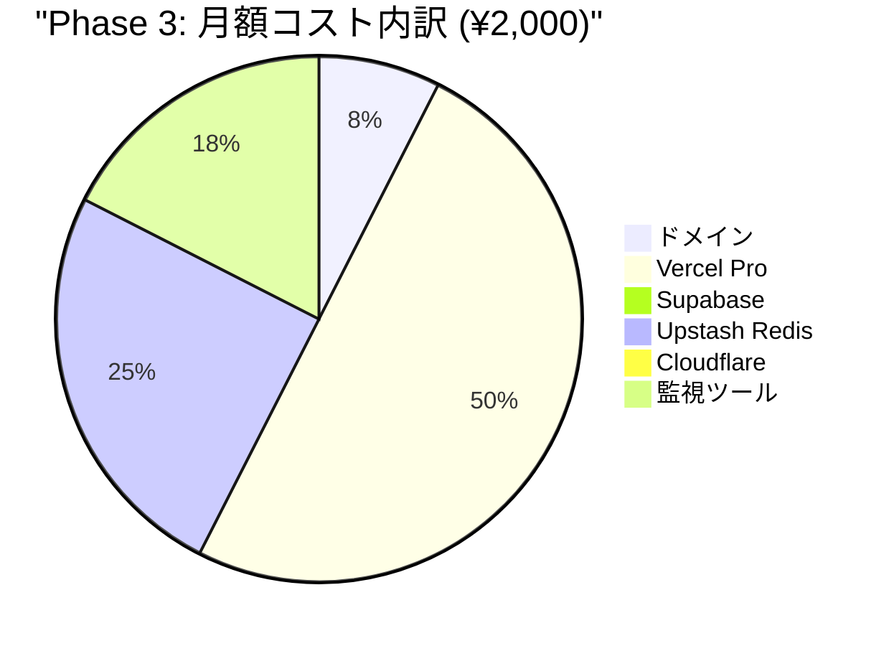

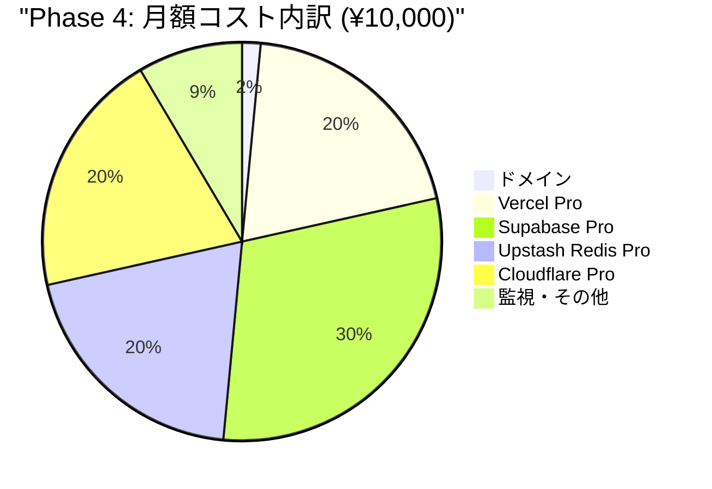

### 4.2 コスト削減施策

```typescript
interface CostOptimizationStrategies {
	// 1. キャッシング戦略
	caching: {
		staticAssets: {
			strategy: '永続キャッシュ';
			ttl: 31536000; // 1年
			savings: '帯域幅90%削減';
		};
		apiResponses: {
			strategy: '条件付きキャッシュ';
			ttl: 3600; // 1時間
			savings: 'DB呼び出し70%削減';
		};
		sessionData: {
			strategy: 'Redis活用';
			ttl: 86400; // 24時間
			savings: 'DB負荷50%削減';
		};
	};

	// 2. データ最適化
	dataOptimization: {
		compression: {
			images: 'WebP変換で60%削減';
			text: 'Brotli圧縮で30%削減';
			api: 'gzip圧縮で70%削減';
		};
		lazyLoading: {
			images: '初期ロード50%削減';
			components: 'バンドルサイズ40%削減';
		};
		pagination: {
			defaultSize: 20;
			maxSize: 100;
			savings: 'データ転送80%削減';
		};
	};

	// 3. コンピューティング最適化
	computing: {
		edgeComputing: {
			strategy: 'エッジでの前処理';
			savings: 'オリジン負荷60%削減';
		};
		functionOptimization: {
			coldStart: 'ウォームアップ戦略';
			bundleSize: 'Tree shaking';
			runtime: '最小限の依存関係';
		};
		batchProcessing: {
			stockUpdates: '1日1回バッチ';
			reports: '非同期生成';
			cleanup: 'オフピーク実行';
		};
	};

	// 4. ストレージ最適化
	storage: {
		dataRetention: {
			logs: '7日で自動削除';
			tempFiles: '24時間で削除';
			oldBackups: '30日で削除';
		};
		deduplication: {
			files: 'ハッシュベース重複排除';
			data: '正規化による重複削減';
		};
		archival: {
			oldData: 'コールドストレージ移行';
			compression: 'アーカイブ時圧縮';
		};
	};
}
```

### 4.3 コスト監視ダッシュボード

```typescript
interface CostMonitoring {
	// リアルタイム監視
	realtime: {
		metrics: ['現在の使用量', '予測請求額', '前日比較', '異常検知'];
		alerts: {
			dailyBudget: 100; // 円
			monthlyBudget: 2000; // 円
			unusualSpike: '150%'; // 通常の150%超
		};
	};

	// 週次レポート
	weekly: {
		breakdown: {
			byService: true;
			byResource: true;
			byEnvironment: true;
		};
		trends: {
			weekOverWeek: true;
			forecast: true;
			recommendations: true;
		};
	};

	// 月次分析
	monthly: {
		costAllocation: {
			compute: '関数実行コスト';
			storage: 'ストレージコスト';
			network: 'データ転送コスト';
			other: 'その他サービス';
		};
		optimization: {
			opportunities: '削減可能な項目';
			implemented: '実施済み施策';
			planned: '計画中の施策';
		};
	};
}
```

---

## 5. パフォーマンス最適化

### 5.1 レスポンスタイム最適化

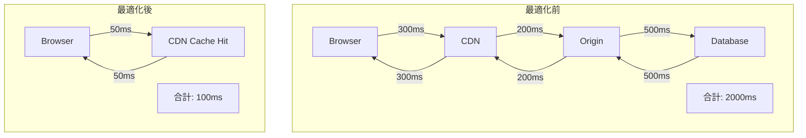

### 5.2 最適化技術スタック

```typescript
interface PerformanceOptimization {
	// フロントエンド最適化
	frontend: {
		bundling: {
			codeeSplitting: true;
			treeeShaking: true;
			minification: true;
			compression: 'brotli';
		};

		loading: {
			lazyLoading: true;
			prefetching: true;
			preloading: ['critical-css', 'fonts'];
			serviceWorker: true;
		};

		rendering: {
			ssr: '初回アクセス';
			csr: 'ナビゲーション';
			hydration: 'progressive';
			virtualDOM: true;
		};
	};

	// バックエンド最適化
	backend: {
		database: {
			indexing: '全検索カラム';
			queryOptimization: true;
			connectionPooling: true;
			preparedStatements: true;
		};

		caching: {
			queryCache: '60秒';
			objectCache: 'Redis';
			httpCache: 'CDN';
			applicationCache: 'メモリ';
		};

		processing: {
			asyncProcessing: true;
			batchOperations: true;
			parallelExecution: true;
			streamProcessing: true;
		};
	};

	// ネットワーク最適化
	network: {
		protocol: {
			http2: true;
			http3: true;
			websocket: '将来対応';
		};

		compression: {
			gzip: true;
			brotli: true;
			dynamicCompression: true;
		};

		cdn: {
			edgeCaching: true;
			geoRouting: true;
			smartRouting: true;
		};
	};
}
```

---

## 6. リソース使用量予測

### 6.1 成長モデル

```typescript
interface GrowthModel {
	// ユーザー成長予測
	userGrowth: {
		month1: 1;
		month3: 3;
		month6: 5;
		month12: 20;
		month24: 100;
	};

	// データ成長予測
	dataGrowth: {
		salarySlips: {
			perUserPerMonth: 1;
			averageSize: '100KB';
			retention: '7年';
		};
		stockTransactions: {
			perUserPerMonth: 5;
			averageSize: '1KB';
			retention: '5年';
		};
		auditLogs: {
			perUserPerDay: 10;
			averageSize: '500B';
			retention: '3年';
		};
	};

	// トラフィック成長予測
	trafficGrowth: {
		apiCalls: {
			perUserPerDay: 30;
			peakMultiplier: 3;
			growthRate: '10%/月';
		};
		bandwidth: {
			perUserPerMonth: '200MB';
			cacheHitRate: '80%';
			actualTransfer: '40MB';
		};
	};
}
```

### 6.2 キャパシティプランニング

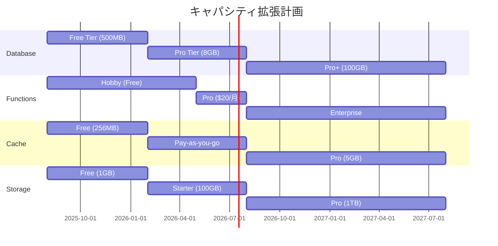

---

## 7. 災害対策とビジネス継続性

### 7.1 バックアップ戦略

```typescript
interface BackupStrategy {
	// データバックアップ
	dataBackup: {
		frequency: {
			database: '日次';
			files: '週次';
			config: '変更時';
		};

		retention: {
			daily: 7; // 7日分
			weekly: 4; // 4週分
			monthly: 12; // 12ヶ月分
		};

		storage: {
			primary: 'Supabase内蔵';
			secondary: '外部クラウド';
			tertiary: 'ローカル';
		};

		encryption: {
			atRest: 'AES-256';
			inTransit: 'TLS 1.3';
			keyManagement: '分離保管';
		};
	};

	// リカバリ計画
	recoveryPlan: {
		rto: {
			// Recovery Time Objective
			phase1: 'N/A'; // 個人利用
			phase2: '24時間';
			phase3: '4時間';
			phase4: '1時間';
		};

		rpo: {
			// Recovery Point Objective
			phase1: '24時間';
			phase2: '24時間';
			phase3: '6時間';
			phase4: '1時間';
		};

		procedures: {
			detection: '自動監視';
			notification: 'アラート';
			assessment: '影響分析';
			recovery: '自動/手動';
			verification: 'テスト';
		};
	};
}
```

### 7.2 フェイルオーバー戦略

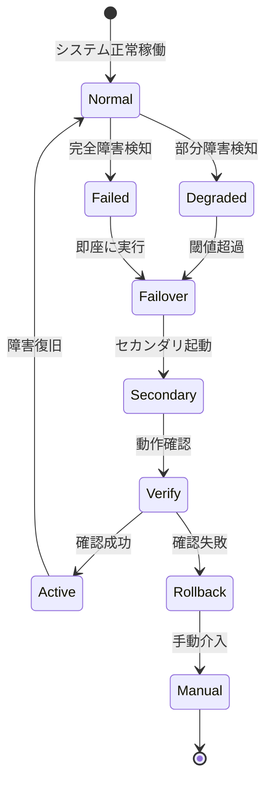

---

## 8. セキュリティとコンプライアンス

### 8.1 セキュリティコスト配分

```typescript
interface SecurityCostAllocation {
	// 基本セキュリティ（無料）
	basic: {
		waf: 'Cloudflare Free';
		ddos: 'Cloudflare Free';
		ssl: "Let's Encrypt";
		auth: 'Supabase Auth';
		cost: 0;
	};

	// 中級セキュリティ（Phase 3）
	intermediate: {
		waf: 'Cloudflare Pro';
		monitoring: 'Sentry';
		scanning: 'Snyk';
		backup: '暗号化バックアップ';
		cost: 1000; // 円/月
	};

	// 高度セキュリティ（Phase 4）
	advanced: {
		waf: 'Cloudflare Business';
		siem: 'Datadog';
		pentest: '四半期実施';
		compliance: '監査対応';
		cost: 3000; // 円/月
	};
}
```

### 8.2 コンプライアンス対応

| フェーズ      | 要件           | 対応内容               | コスト影響 |
| ------------- | -------------- | ---------------------- | ---------- |
| **Phase 1-2** | 個人情報保護   | 基本的な暗号化         | ¥0         |
| **Phase 3**   | データ管理強化 | 監査ログ、アクセス制御 | +¥500/月   |
| **Phase 4**   | 企業レベル     | SOC2準拠、監査証跡     | +¥2,000/月 |

---

## 9. 移行計画

### 9.1 段階的移行戦略

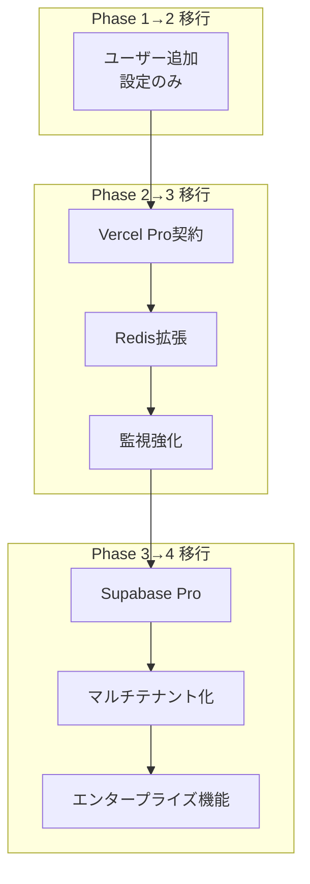

### 9.2 移行チェックリスト

```typescript
interface MigrationChecklist {
	// Phase 1 → Phase 2
	phase1to2: {
		technical: ['ユーザー管理機能の有効化', 'マルチセッション対応', '権限管理の実装'];
		operational: ['バックアップ頻度の確認', '監視項目の追加', 'ドキュメント更新'];
		cost: '変更なし';
	};

	// Phase 2 → Phase 3
	phase2to3: {
		technical: [
			'Vercel Pro へのアップグレード',
			'Redis容量拡張',
			'CDNキャッシュ設定最適化',
			'API レート制限実装'
		];
		operational: ['SLA定義', 'サポート体制確立', '運用手順書作成'];
		cost: '+¥1,850/月';
	};

	// Phase 3 → Phase 4
	phase3to4: {
		technical: ['Supabase Pro契約', 'データベース最適化', '水平スケーリング実装', '高可用性構成'];
		operational: ['24/7監視体制', 'インシデント対応プロセス', '定期メンテナンス計画'];
		cost: '+¥8,000/月';
	};
}
```

---

## 10. ROI分析

### 10.1 投資対効果

```typescript
interface ROIAnalysis {
	// コスト削減効果
	costSavings: {
		manualWork: {
			before: '月5時間の手作業';
			after: '月30分';
			saving: '4.5時間 = ¥11,250相当';
		};

		errorReduction: {
			before: '月1-2回のミス';
			after: 'ほぼゼロ';
			saving: '修正時間2時間 = ¥5,000相当';
		};

		efficiency: {
			reportGeneration: '即座に生成';
			dataAccess: 'リアルタイム';
			saving: '月2時間 = ¥5,000相当';
		};

		totalMonthlySaving: 21250; // 円
	};

	// 投資コスト
	investmentCost: {
		phase1: {
			monthly: 150;
			annual: 1800;
			roi: '14,017%'; // (21,250 - 150) / 150 * 100
		};

		phase3: {
			monthly: 2000;
			annual: 24000;
			roi: '963%'; // (21,250 - 2,000) / 2,000 * 100
		};

		phase4: {
			monthly: 10000;
			annual: 120000;
			roi: '113%'; // (21,250 - 10,000) / 10,000 * 100
		};
	};

	// 回収期間
	paybackPeriod: {
		phase1: '即座';
		phase3: '1ヶ月';
		phase4: '6ヶ月';
	};
}
```

### 10.2 ビジネス価値

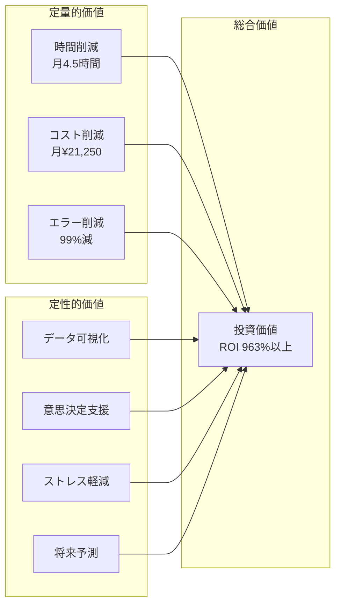

---

## 11. 最適化の自動化

### 11.1 自動最適化システム

```typescript
interface AutoOptimization {
	// コスト最適化の自動化
	costAutomation: {
		// 未使用リソースの検出と削除
		unusedResources: {
			detection: '日次スキャン';
			types: ['未使用関数', '古いデプロイメント', '期限切れキャッシュ'];
			action: '自動削除または通知';
		};

		// リソースのライトサイジング
		rightSizing: {
			monitoring: '継続的';
			metrics: ['CPU使用率', 'メモリ使用率', '実行時間'];
			recommendation: '週次レポート';
			autoApply: false; // 手動承認必要
		};

		// 予約インスタンスの推奨
		reservation: {
			analysis: '月次';
			threshold: '70%以上の定常利用';
			savingEstimate: '20-30%';
		};
	};

	// パフォーマンス最適化の自動化
	performanceAutomation: {
		// キャッシュ戦略の動的調整
		caching: {
			hitRateMonitoring: true;
			ttlAdjustment: 'ヒット率に基づく';
			invalidation: 'スマート無効化';
		};

		// クエリ最適化
		queryOptimization: {
			slowQueryDetection: '> 1秒';
			indexSuggestion: true;
			queryRewriting: '推奨のみ';
		};

		// コード最適化
		codeOptimization: {
			bundleSizeAlert: '> 500KB';
			unusedCodeDetection: true;
			dependencyUpdate: 'セキュリティパッチ自動';
		};
	};
}
```

### 11.2 最適化スクリプト

```typescript
// scripts/optimize.ts
class SystemOptimizer {
	async runDailyOptimization(): Promise<OptimizationReport> {
		const report: OptimizationReport = {
			timestamp: new Date(),
			optimizations: [],
			savings: 0
		};

		// 1. キャッシュ最適化
		const cacheOpt = await this.optimizeCache();
		report.optimizations.push(cacheOpt);

		// 2. データベース最適化
		const dbOpt = await this.optimizeDatabase();
		report.optimizations.push(dbOpt);

		// 3. ストレージ最適化
		const storageOpt = await this.optimizeStorage();
		report.optimizations.push(storageOpt);

		// 4. 関数最適化
		const functionOpt = await this.optimizeFunctions();
		report.optimizations.push(functionOpt);

		// レポート生成
		report.savings = this.calculateSavings(report.optimizations);
		await this.sendReport(report);

		return report;
	}

	private async optimizeCache(): Promise<Optimization> {
		// キャッシュヒット率の分析
		const hitRate = await this.getCacheHitRate();

		if (hitRate < 0.7) {
			// TTL延長を推奨
			return {
				type: 'cache',
				action: 'increase_ttl',
				currentValue: '1h',
				recommendedValue: '4h',
				estimatedSaving: '¥500/月'
			};
		}

		return { type: 'cache', action: 'no_action_needed' };
	}

	private async optimizeDatabase(): Promise<Optimization> {
		// スロークエリの検出
		const slowQueries = await this.getSlowQueries();

		if (slowQueries.length > 0) {
			// インデックス追加を推奨
			return {
				type: 'database',
				action: 'add_indexes',
				queries: slowQueries,
				estimatedImprovement: '50% faster',
				estimatedSaving: '¥1,000/月'
			};
		}

		return { type: 'database', action: 'no_action_needed' };
	}
}
```

---

## 12. 長期ロードマップ

### 12.1 3年間の成長計画

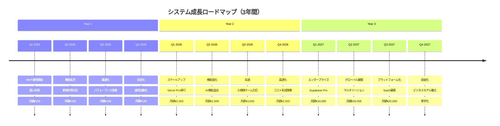

### 12.2 技術進化計画

```typescript
interface TechnologyEvolution {
	year1: {
		focus: '基盤確立';
		technologies: ['Svelte 5', 'SvelteKit', 'PostgreSQL', 'Redis'];
		achievements: ['MVP完成', '自動化確立', '運用安定化'];
	};

	year2: {
		focus: '機能拡張';
		technologies: ['AI/ML統合', 'リアルタイム機能', '高度な分析'];
		achievements: ['予測分析', '自動レポート', '投資アドバイス'];
	};

	year3: {
		focus: 'プラットフォーム化';
		technologies: ['マイクロサービス', 'Kubernetes', 'GraphQL'];
		achievements: ['マルチテナント', 'API公開', 'エコシステム構築'];
	};
}
```

---

## 13. リスク管理

### 13.1 スケーリングリスク

| リスク                 | 可能性 | 影響度 | 対策                   |
| ---------------------- | ------ | ------ | ---------------------- |
| **急激な成長**         | 低     | 高     | 自動スケーリング設定   |
| **コスト超過**         | 中     | 中     | アラート設定、上限設定 |
| **技術的負債**         | 中     | 高     | 定期的リファクタリング |
| **ベンダーロックイン** | 高     | 中     | 抽象化層の実装         |
| **規制変更**           | 低     | 高     | コンプライアンス監視   |

### 13.2 リスク軽減策

```typescript
interface RiskMitigation {
	// 技術的リスク
	technical: {
		singlePointOfFailure: {
			risk: '単一障害点';
			mitigation: '冗長化、フェイルオーバー';
		};
		scalabilityBottleneck: {
			risk: 'スケーラビリティボトルネック';
			mitigation: '負荷テスト、容量計画';
		};
		securityVulnerability: {
			risk: 'セキュリティ脆弱性';
			mitigation: '定期スキャン、パッチ適用';
		};
	};

	// ビジネスリスク
	business: {
		costOverrun: {
			risk: '予算超過';
			mitigation: '使用量アラート、承認プロセス';
		};
		vendorDependency: {
			risk: 'ベンダー依存';
			mitigation: 'マルチクラウド戦略';
		};
		dataLoss: {
			risk: 'データ損失';
			mitigation: '多層バックアップ';
		};
	};

	// 運用リスク
	operational: {
		knowledgeLoss: {
			risk: '知識の喪失';
			mitigation: 'ドキュメント化、自動化';
		};
		humanError: {
			risk: '人的ミス';
			mitigation: '自動化、承認フロー';
		};
		incidentResponse: {
			risk: 'インシデント対応遅延';
			mitigation: 'プレイブック、訓練';
		};
	};
}
```

---

## 14. まとめと推奨事項

### 14.1 主要な推奨事項

1. **現在（Phase 1）**
   - 無料枠を最大限活用
   - キャッシング戦略の確立
   - 監視体制の構築

2. **6ヶ月後（Phase 2）**
   - 使用量の定期レビュー
   - 最適化の自動化開始
   - バックアップ戦略の強化

3. **1年後（Phase 3）**
   - Vercel Pro への移行検討
   - パフォーマンス最適化
   - コスト分析の定期実施

4. **2年後（Phase 4）**
   - エンタープライズ機能の評価
   - マルチリージョン展開
   - SaaS化の検討

### 14.2 成功指標（KPI）

```typescript
interface SuccessMetrics {
	cost: {
		costPerUser: '< ¥100/月';
		infrastructureCost: '< 売上の10%';
		optimizationSaving: '> 20%/年';
	};

	performance: {
		availability: '> 99.9%';
		responseTime: '< 200ms (p95)';
		errorRate: '< 0.1%';
	};

	scalability: {
		autoScalingEfficiency: '> 90%';
		resourceUtilization: '60-80%';
		capacityHeadroom: '> 30%';
	};

	operational: {
		deploymentFrequency: '> 週1回';
		mttr: '< 1時間';
		automationRate: '> 80%';
	};
}
```

---

## 承認

| 役割                       | 名前                       | 日付       | 署名 |
| -------------------------- | -------------------------- | ---------- | ---- |
| クラウドコストアーキテクト | クラウドコストアーキテクト | 2025-08-10 | ✅   |
| レビュアー                 | -                          | -          | [ ]  |
| 承認者                     | -                          | -          | [ ]  |

---

**改訂履歴**

| バージョン | 日付       | 変更内容 | 作成者                     |
| ---------- | ---------- | -------- | -------------------------- |
| 1.0.0      | 2025-08-10 | 初版作成 | クラウドコストアーキテクト |
