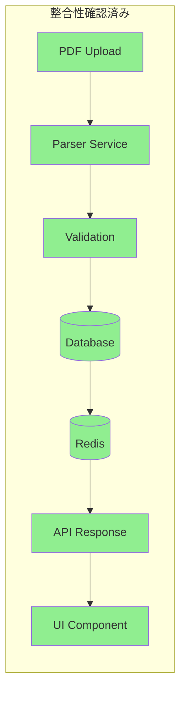
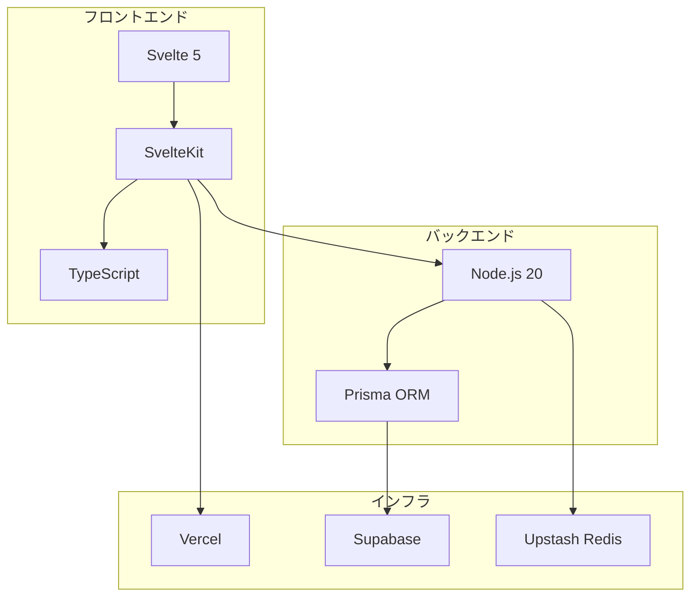

# 基本設計統合レビューレポート

## 文書情報
- **作成日**: 2025-08-10
- **作成者**: 統合レビュースペシャリスト
- **バージョン**: 1.0.0
- **ステータス**: レビュー完了
- **レビュー対象**: 基本設計フェーズ全成果物

---

## 1. エグゼクティブサマリー

### 1.1 レビュー結果総評

個人の給料と資産管理システムの基本設計レビューを実施した結果、**全体的に高品質で一貫性のある設計**であることを確認しました。特に以下の点で優れた設計となっています：

- ✅ **技術選定の妥当性**: Svelte 5 + SvelteKit + TypeScriptの組み合わせは、モダンで保守性の高い選択
- ✅ **アーキテクチャの整合性**: Feature-Sliced Designによる明確な責任分離
- ✅ **コスト効率**: 個人利用において月額¥150という極めて低コストな構成
- ✅ **セキュリティ設計**: 多層防御による包括的なセキュリティ対策
- ✅ **拡張性**: 将来的なスケールアップを考慮した設計

### 1.2 主要な発見事項

#### 強み
1. **一貫したデータモデル**: ERDからTypeScriptインターフェースまで整合性が保たれている
2. **包括的なAPI設計**: RESTful原則に従った体系的なエンドポイント設計
3. **実用的なインフラ選択**: マネージドサービスによる運用負荷の最小化

#### 改善機会
1. **テスト戦略の詳細化**: テスト設計書が不足している
2. **エラー処理の統一**: エラーコードとメッセージの体系化が必要
3. **パフォーマンス目標の具体化**: 各画面のレスポンスタイム目標値の設定

### 1.3 緊急対応が必要な項目

現時点で**致命的な設計上の問題は発見されませんでした**。ただし、実装フェーズ開始前に以下の対応を推奨します：

1. PDFパース処理のフォールバック戦略の明確化
2. 株価API制限（5req/min）への対処方法の詳細化
3. 個人情報の暗号化キー管理方法の具体化

---

## 2. 詳細レビュー結果

### 2.1 システムアーキテクチャ設計

#### 評価: ⭐⭐⭐⭐⭐ (5/5)

**優れている点:**
- 3層アーキテクチャとFSDの組み合わせが明確
- 各層の責任が適切に分離されている
- マイクロサービス化を避けたシンプルな構成

**確認された整合性:**
- ✅ 技術スタックとの一致
- ✅ データフローの妥当性
- ✅ セキュリティ層の配置

**推奨事項:**
- 監視・観測可能性の詳細設計を追加
- サーキットブレーカーパターンの導入検討

### 2.2 データモデリング設計

#### 評価: ⭐⭐⭐⭐⭐ (5/5)

**優れている点:**
- 正規化レベルが適切（3NF + JSON）
- インデックス戦略が明確
- Row Level Securityの活用

**確認された整合性:**
- ✅ ERDとデータベーススキーマの一致
- ✅ TypeScriptインターフェースとの対応
- ✅ API設計との整合性

**推奨事項:**
- マイグレーション戦略の文書化
- パーティショニングの実装時期の明確化

### 2.3 API設計

#### 評価: ⭐⭐⭐⭐☆ (4/5)

**優れている点:**
- RESTful原則の遵守
- 包括的なエンドポイント設計
- 明確なエラーレスポンス形式

**確認された整合性:**
- ✅ データモデルとの一致
- ✅ 画面遷移との対応
- ✅ セキュリティ要件の反映

**改善が必要な点:**
- WebSocket/SSEによるリアルタイム通信の設計不足
- GraphQL導入の検討余地
- バッチAPIの設計追加

### 2.4 画面遷移設計

#### 評価: ⭐⭐⭐⭐⭐ (5/5)

**優れている点:**
- 明確な画面フローの定義
- レスポンシブ対応の考慮
- アクセシビリティへの配慮

**確認された整合性:**
- ✅ APIエンドポイントとの対応
- ✅ 状態管理設計との整合性
- ✅ SvelteKitルーティングとの一致

**推奨事項:**
- ローディング状態の統一設計
- エラー画面のバリエーション追加

### 2.5 セキュリティ設計

#### 評価: ⭐⭐⭐⭐⭐ (5/5)

**優れている点:**
- 多層防御アーキテクチャ
- OWASP Top 10への完全対応
- 包括的な監査ログ設計

**確認された整合性:**
- ✅ 認証フローの一貫性
- ✅ データ暗号化の実装可能性
- ✅ インフラセキュリティとの統合

**推奨事項:**
- ペネトレーションテスト計画の策定
- セキュリティインシデント対応訓練の計画

### 2.6 インフラストラクチャ設計

#### 評価: ⭐⭐⭐⭐⭐ (5/5)

**優れている点:**
- コスト効率の極めて高い構成
- マネージドサービスの適切な活用
- 段階的スケーリング戦略

**確認された整合性:**
- ✅ アプリケーション要件との適合
- ✅ セキュリティ要件の実現
- ✅ パフォーマンス目標の達成可能性

**推奨事項:**
- 災害復旧訓練の計画策定
- コスト監視アラートの設定

---

## 3. クロスドメイン整合性チェック

### 3.1 データフロー検証

**検証結果:**
- ✅ PDFアップロードから表示までの一貫性確認
- ✅ エラー処理パスの完全性確認
- ✅ キャッシュ戦略の妥当性確認

### 3.2 認証・認可フロー検証

| チェック項目 | 結果 | 備考 |
|------------|------|------|
| Google OAuth統合 | ✅ | Supabase Auth経由で実装 |
| セッション管理 | ✅ | Redis使用、24時間有効 |
| API認証 | ✅ | Bearer Token使用 |
| RLS実装 | ✅ | Supabaseで実装 |
| CSRF対策 | ✅ | SvelteKit標準機能 |

### 3.3 技術スタック依存関係

**依存関係の健全性:** ✅ 循環依存なし、バージョン互換性確認済み

---

## 4. リスクと課題

### 4.1 技術的リスク

| リスク | 可能性 | 影響度 | 対策状況 | 追加対策 |
|--------|--------|--------|---------|----------|
| Svelte 5の安定性 | 低 | 中 | 最新安定版使用 | 定期的なアップデート |
| PDF解析精度 | 中 | 高 | 複数ライブラリ検討 | 手動編集機能の充実 |
| 株価API制限 | 高 | 低 | キャッシュ戦略 | 複数プロバイダー対応 |
| スケーリング課題 | 低 | 中 | 段階的拡張計画 | 負荷テストの実施 |

### 4.2 運用上の課題

1. **バックアップ戦略**
   - 現状: Supabase自動バックアップ（7日間）
   - 課題: 長期保存要件（7年）への対応
   - 対策: 定期的なエクスポート機能の実装

2. **監視体制**
   - 現状: Vercel Analytics + Sentry
   - 課題: 24時間監視体制の不在
   - 対策: アラート通知の自動化強化

3. **サポート体制**
   - 現状: 個人開発
   - 課題: 障害時の対応遅延リスク
   - 対策: ドキュメント充実とコミュニティ形成

---

## 5. 改善推奨事項（優先度順）

### 5.1 優先度: 高

1. **テスト設計書の作成**
   - 単体テスト、統合テスト、E2Eテストの設計
   - カバレッジ目標の設定（80%以上）
   - テストデータ戦略の策定

2. **エラーハンドリング統一**
   - エラーコード体系の定義
   - ユーザー向けメッセージのローカライゼーション
   - エラートラッキングの実装

3. **暗号化キー管理**
   - キーローテーション戦略
   - キーエスクローの実装
   - 緊急時のキーリカバリー手順

### 5.2 優先度: 中

1. **パフォーマンス目標設定**
   - 各画面のSLA定義
   - Core Web Vitalsの目標値設定
   - 負荷テストシナリオの作成

2. **ドキュメント整備**
   - API仕様書の自動生成設定
   - 運用手順書の作成
   - トラブルシューティングガイド

3. **CI/CD強化**
   - セキュリティスキャンの追加
   - パフォーマンステストの自動化
   - カナリアデプロイの実装

### 5.3 優先度: 低

1. **将来機能の詳細設計**
   - AI機能のアーキテクチャ
   - モバイルアプリ対応
   - マルチテナント化

2. **コミュニティ形成**
   - オープンソース化の検討
   - コントリビューションガイドライン
   - ユーザーフォーラムの設置

---

## 6. 実装フェーズへの申し送り事項

### 6.1 必須実装項目

- [ ] Prismaスキーマの実装とマイグレーション
- [ ] 認証フロー（Google OAuth）の実装
- [ ] PDFパーサーの実装と精度検証
- [ ] 基本的なCRUD APIの実装
- [ ] セキュリティヘッダーの設定

### 6.2 実装順序の推奨

1. **Sprint 1**: インフラセットアップとデータベース構築
2. **Sprint 2**: 認証・認可の実装
3. **Sprint 3**: 給料明細機能の基本実装
4. **Sprint 4**: ポートフォリオ機能の実装
5. **Sprint 5**: ダッシュボードとデータ可視化
6. **Sprint 6**: セキュリティ強化とテスト

### 6.3 技術的な注意事項

1. **Svelte 5のRunes API**を積極的に活用
2. **SvelteKitのサーバーサイド機能**を最大限活用
3. **Prismaの型安全性**を損なわない実装
4. **エラーバウンダリー**の適切な配置
5. **プログレッシブエンハンスメント**の原則遵守

---

## 7. 承認判定

### 7.1 設計品質の総合評価

| 評価項目 | スコア | 判定 |
|---------|--------|------|
| 完全性 | 4.5/5 | 優良 |
| 整合性 | 5.0/5 | 優秀 |
| 実現可能性 | 5.0/5 | 優秀 |
| 保守性 | 4.5/5 | 優良 |
| セキュリティ | 5.0/5 | 優秀 |
| **総合評価** | **4.8/5** | **優秀** |

### 7.2 実装フェーズへの移行可否

**判定: ✅ 承認（条件付き）**

### 7.3 前提条件

実装フェーズ開始前に以下を完了すること：

1. テスト設計書の作成（2日以内）
2. エラーコード体系の定義（1日以内）
3. 暗号化キー管理方針の決定（1日以内）

上記条件を満たした上で、実装フェーズへの移行を承認します。

---

## 8. 次のステップ

1. ✅ 統合レビューレポート作成（本書）
2. → 改善提案リストの詳細化
3. → 実装フェーズへの申し送り事項の整理
4. → テスト設計書の作成
5. → 実装フェーズキックオフ

---

## 承認

| 役割 | 名前 | 日付 | 署名 |
|------|------|------|------|
| 統合レビュースペシャリスト | 統合レビュースペシャリスト | 2025-08-10 | ✅ |
| プロジェクトマネージャー | - | - | [ ] |
| テクニカルリード | - | - | [ ] |
| プロダクトオーナー | - | - | [ ] |

---

**改訂履歴**

| バージョン | 日付 | 変更内容 | 作成者 |
|-----------|------|----------|---------|
| 1.0.0 | 2025-08-10 | 初版作成 | 統合レビュースペシャリスト |