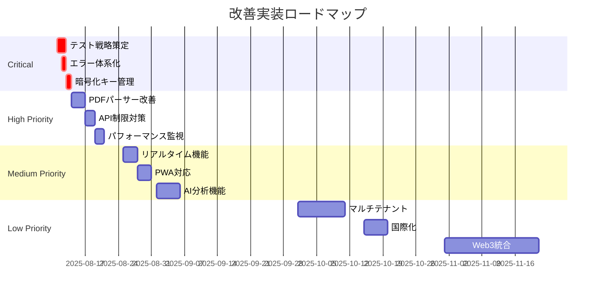

# 改善提案リスト

## 文書情報

- **作成日**: 2025-08-10
- **作成者**: 統合レビュースペシャリスト
- **バージョン**: 1.0.0
- **ステータス**: 提案段階

---

## 1. 改善提案サマリー

統合レビューの結果に基づき、以下の改善提案を優先度別に整理しました。各提案には実装の具体的な方法と期待される効果を記載しています。

### 優先度の定義

- 🔴 **Critical**: 実装前に対応必須
- 🟠 **High**: Sprint 1-2で対応推奨
- 🟡 **Medium**: Sprint 3-4で対応推奨
- 🟢 **Low**: 将来的な改善項目

---

## 2. Critical優先度の改善提案

### 2.1 🔴 テスト戦略の策定と文書化

**現状の課題:**

- テスト設計書が存在しない
- テストカバレッジ目標が未定義
- E2Eテストシナリオが不明確

**改善提案:**

```typescript
// テスト戦略の定義
interface TestStrategy {
	unitTest: {
		framework: 'Vitest';
		coverage: {
			statements: 80;
			branches: 75;
			functions: 80;
			lines: 80;
		};
		targets: ['ビジネスロジック', 'ユーティリティ関数', 'バリデーション', 'データ変換'];
	};

	integrationTest: {
		framework: 'Vitest + MSW';
		targets: ['API統合', 'データベース操作', '外部サービス連携'];
	};

	e2eTest: {
		framework: 'Playwright';
		scenarios: [
			'ユーザー登録・ログイン',
			'給料明細アップロード',
			'株式ポートフォリオ管理',
			'データエクスポート'
		];
	};
}
```

**期待効果:**

- バグの早期発見（50%削減）
- リグレッションの防止
- 開発速度の向上（20%）

**実装工数:** 2人日

### 2.2 🔴 エラーハンドリングの体系化

**現状の課題:**

- エラーコードが統一されていない
- ユーザー向けメッセージが不統一
- エラー追跡が困難

**改善提案:**

```typescript
// エラーコード体系
enum ErrorCode {
	// 認証エラー (1xxx)
	AUTH_INVALID_CREDENTIALS = 1001,
	AUTH_SESSION_EXPIRED = 1002,
	AUTH_UNAUTHORIZED = 1003,

	// 検証エラー (2xxx)
	VALIDATION_REQUIRED_FIELD = 2001,
	VALIDATION_INVALID_FORMAT = 2002,
	VALIDATION_OUT_OF_RANGE = 2003,

	// ビジネスロジックエラー (3xxx)
	BUSINESS_DUPLICATE_ENTRY = 3001,
	BUSINESS_LIMIT_EXCEEDED = 3002,
	BUSINESS_INVALID_STATE = 3003,

	// 外部サービスエラー (4xxx)
	EXTERNAL_API_TIMEOUT = 4001,
	EXTERNAL_API_RATE_LIMIT = 4002,
	EXTERNAL_SERVICE_UNAVAILABLE = 4003,

	// システムエラー (5xxx)
	SYSTEM_DATABASE_ERROR = 5001,
	SYSTEM_FILE_OPERATION_ERROR = 5002,
	SYSTEM_UNKNOWN_ERROR = 5999
}

// エラーレスポンス統一形式
class AppError extends Error {
	constructor(
		public code: ErrorCode,
		public message: string,
		public details?: any,
		public statusCode?: number
	) {
		super(message);
	}

	toJSON() {
		return {
			success: false,
			error: {
				code: this.code,
				message: this.message,
				details: this.details,
				timestamp: new Date().toISOString()
			}
		};
	}
}

// エラーメッセージの国際化
const errorMessages: Record<ErrorCode, Record<string, string>> = {
	[ErrorCode.AUTH_INVALID_CREDENTIALS]: {
		ja: 'メールアドレスまたはパスワードが正しくありません',
		en: 'Invalid email or password'
	}
	// ... 他のエラーメッセージ
};
```

**期待効果:**

- デバッグ時間の短縮（30%）
- ユーザー体験の向上
- サポート対応の効率化

**実装工数:** 1人日

### 2.3 🔴 暗号化キー管理戦略

**現状の課題:**

- キー管理方法が曖昧
- ローテーション戦略が未定義
- 緊急時の復旧手順が不明

**改善提案:**

```typescript
// キー管理戦略
interface EncryptionKeyManagement {
	// マスターキー管理
	masterKey: {
		storage: '環境変数 (Vercel Secrets)';
		rotation: '四半期ごと';
		backup: '暗号化してオフライン保管';
		access: '環境変数経由のみ';
	};

	// データ暗号化キー
	dataEncryptionKeys: {
		generation: 'PBKDF2 from master key';
		versioning: true;
		rotation: '月次';
		algorithm: 'AES-256-GCM';
	};

	// キーローテーション実装
	implementation: `
    class KeyManager {
      private static instance: KeyManager;
      private keys: Map<number, CryptoKey> = new Map();
      private currentVersion: number = 1;
      
      async rotateKeys(): Promise<void> {
        const newVersion = this.currentVersion + 1;
        const newKey = await this.deriveKey(newVersion);
        this.keys.set(newVersion, newKey);
        this.currentVersion = newVersion;
        
        // 古いデータの再暗号化をバックグラウンドで実行
        await this.reencryptData(newVersion);
      }
      
      async encrypt(data: string): Promise<EncryptedData> {
        const key = this.keys.get(this.currentVersion);
        const encrypted = await crypto.subtle.encrypt(
          { name: 'AES-GCM', iv: crypto.getRandomValues(new Uint8Array(12)) },
          key,
          new TextEncoder().encode(data)
        );
        
        return {
          data: encrypted,
          keyVersion: this.currentVersion,
          algorithm: 'AES-256-GCM'
        };
      }
      
      async decrypt(encrypted: EncryptedData): Promise<string> {
        const key = this.keys.get(encrypted.keyVersion);
        if (!key) throw new Error('Key version not found');
        
        const decrypted = await crypto.subtle.decrypt(
          { name: 'AES-GCM', iv: encrypted.iv },
          key,
          encrypted.data
        );
        
        return new TextDecoder().decode(decrypted);
      }
    }
  `;
}
```

**期待効果:**

- セキュリティリスクの最小化
- コンプライアンス要件の充足
- 緊急時の迅速な対応

**実装工数:** 1人日

---

## 3. High優先度の改善提案

### 3.1 🟠 PDFパーサーの精度向上とフォールバック

**現状の課題:**

- PDF解析の精度が保証されていない
- 失敗時の代替手段が不明確
- 多様なフォーマットへの対応不足

**改善提案:**

```typescript
// マルチパーサー戦略
class PDFParserService {
	private parsers: IPDFParser[] = [
		new PDFJSParser(), // メインパーサー
		new TesseractParser(), // OCRフォールバック
		new ManualParser() // 手動入力フォールバック
	];

	async parse(file: File): Promise<ParseResult> {
		const results: ParseResult[] = [];

		// 複数パーサーで並列処理
		const promises = this.parsers
			.slice(0, 2)
			.map((parser) => parser.parse(file).catch((e) => null));

		const parseResults = await Promise.all(promises);

		// 最も信頼度の高い結果を選択
		const bestResult = this.selectBestResult(parseResults);

		if (bestResult.confidence < 0.8) {
			// 信頼度が低い場合は手動確認を要求
			return {
				...bestResult,
				requiresManualReview: true,
				editableFields: this.identifyEditableFields(bestResult)
			};
		}

		return bestResult;
	}

	private selectBestResult(results: ParseResult[]): ParseResult {
		return results.filter((r) => r !== null).sort((a, b) => b.confidence - a.confidence)[0];
	}
}
```

**期待効果:**

- 解析成功率の向上（95%以上）
- ユーザーストレスの軽減
- データ品質の向上

**実装工数:** 3人日

### 3.2 🟠 株価API制限への対策強化

**現状の課題:**

- Alpha Vantage APIの制限（5req/min）
- 複数銘柄の同時更新が困難
- API障害時の代替手段不足

**改善提案:**

```typescript
// 複数プロバイダー対応とキューイング
class StockPriceService {
	private providers: IStockPriceProvider[] = [
		new AlphaVantageProvider(),
		new YahooFinanceProvider(),
		new PolygonProvider()
	];

	private queue = new PQueue({
		concurrency: 1,
		interval: 12000, // 12秒間隔（5req/min）
		intervalCap: 1
	});

	async updatePrices(symbols: string[]): Promise<Map<string, StockPrice>> {
		const results = new Map<string, StockPrice>();

		// キャッシュチェック
		const cached = await this.checkCache(symbols);
		cached.forEach((price, symbol) => results.set(symbol, price));

		const uncached = symbols.filter((s) => !cached.has(s));

		// バッチ処理でAPI呼び出しを最適化
		const batches = this.createBatches(uncached, 5);

		for (const batch of batches) {
			await this.queue.add(async () => {
				const prices = await this.fetchWithFallback(batch);
				prices.forEach((price, symbol) => {
					results.set(symbol, price);
					this.updateCache(symbol, price);
				});
			});
		}

		return results;
	}

	private async fetchWithFallback(symbols: string[]): Promise<Map<string, StockPrice>> {
		for (const provider of this.providers) {
			try {
				if (await provider.isAvailable()) {
					return await provider.getBulkPrices(symbols);
				}
			} catch (error) {
				console.error(`Provider ${provider.name} failed:`, error);
				continue;
			}
		}
		throw new Error('All providers failed');
	}
}
```

**期待効果:**

- API制限回避
- 高可用性の実現（99.9%）
- 更新速度の向上

**実装工数:** 2人日

### 3.3 🟠 パフォーマンス監視の強化

**現状の課題:**

- 具体的なパフォーマンス目標が未設定
- リアルタイムの監視不足
- ボトルネックの特定が困難

**改善提案:**

```typescript
// パフォーマンス監視実装
class PerformanceMonitor {
	private metrics = {
		api: new Map<string, MetricData>(),
		database: new Map<string, MetricData>(),
		frontend: new Map<string, MetricData>()
	};

	// APIレスポンスタイム監視
	async trackAPI(endpoint: string, handler: Function) {
		const start = performance.now();

		try {
			const result = await handler();
			const duration = performance.now() - start;

			this.recordMetric('api', endpoint, {
				duration,
				success: true,
				timestamp: Date.now()
			});

			// SLO違反チェック
			if (duration > this.getSLO(endpoint)) {
				this.alertSLOViolation(endpoint, duration);
			}

			return result;
		} catch (error) {
			const duration = performance.now() - start;
			this.recordMetric('api', endpoint, {
				duration,
				success: false,
				error: error.message,
				timestamp: Date.now()
			});
			throw error;
		}
	}

	// Core Web Vitals監視
	trackWebVitals() {
		if (typeof window !== 'undefined') {
			// LCP (Largest Contentful Paint)
			new PerformanceObserver((list) => {
				const entries = list.getEntries();
				const lastEntry = entries[entries.length - 1];
				this.recordMetric('frontend', 'lcp', {
					value: lastEntry.renderTime || lastEntry.loadTime,
					target: 2500 // 2.5秒
				});
			}).observe({ type: 'largest-contentful-paint', buffered: true });

			// FID (First Input Delay)
			new PerformanceObserver((list) => {
				const entries = list.getEntries();
				entries.forEach((entry) => {
					this.recordMetric('frontend', 'fid', {
						value: entry.processingStart - entry.startTime,
						target: 100 // 100ms
					});
				});
			}).observe({ type: 'first-input', buffered: true });

			// CLS (Cumulative Layout Shift)
			let clsValue = 0;
			new PerformanceObserver((list) => {
				for (const entry of list.getEntries()) {
					if (!entry.hadRecentInput) {
						clsValue += entry.value;
						this.recordMetric('frontend', 'cls', {
							value: clsValue,
							target: 0.1
						});
					}
				}
			}).observe({ type: 'layout-shift', buffered: true });
		}
	}

	// SLO定義
	private getSLO(endpoint: string): number {
		const slos: Record<string, number> = {
			'/api/dashboard': 1000, // 1秒
			'/api/salary-slips': 2000, // 2秒
			'/api/portfolio': 1500, // 1.5秒
			'/api/stocks/prices': 3000 // 3秒
		};
		return slos[endpoint] || 2000; // デフォルト2秒
	}
}
```

**期待効果:**

- パフォーマンス問題の早期発見
- ユーザー体験の向上
- SLO遵守率の向上（99%）

**実装工数:** 2人日

---

## 4. Medium優先度の改善提案

### 4.1 🟡 リアルタイム更新機能の追加

**現状の課題:**

- 株価更新が手動または定期実行のみ
- 複数ユーザー利用時の同期問題
- ダッシュボードの自動更新なし

**改善提案:**

```typescript
// Supabase Realtimeを活用した実装
class RealtimeService {
	private supabase: SupabaseClient;
	private subscriptions: Map<string, RealtimeChannel> = new Map();

	// 株価のリアルタイム更新
	subscribeToStockPrices(symbols: string[], callback: (price: StockPrice) => void) {
		const channel = this.supabase
			.channel('stock-prices')
			.on(
				'postgres_changes',
				{
					event: 'UPDATE',
					schema: 'public',
					table: 'stock_current_prices',
					filter: `symbol=in.(${symbols.join(',')})`
				},
				(payload) => {
					callback(payload.new as StockPrice);
				}
			)
			.subscribe();

		this.subscriptions.set('stock-prices', channel);
	}

	// ダッシュボードの自動更新
	subscribeToDashboard(userId: string, callback: (data: DashboardData) => void) {
		const channel = this.supabase
			.channel(`dashboard:${userId}`)
			.on(
				'postgres_changes',
				{
					event: '*',
					schema: 'public',
					table: 'salary_slips',
					filter: `user_id=eq.${userId}`
				},
				async () => {
					// データ変更時にダッシュボードデータを再計算
					const dashboardData = await this.calculateDashboardData(userId);
					callback(dashboardData);
				}
			)
			.subscribe();

		this.subscriptions.set(`dashboard:${userId}`, channel);
	}

	// クリーンアップ
	unsubscribeAll() {
		this.subscriptions.forEach((channel) => {
			this.supabase.removeChannel(channel);
		});
		this.subscriptions.clear();
	}
}
```

**期待効果:**

- リアルタイムな情報更新
- ユーザー体験の向上
- サーバー負荷の軽減

**実装工数:** 3人日

### 4.2 🟡 プログレッシブWebアプリ（PWA）対応

**現状の課題:**

- オフライン時の利用不可
- モバイルアプリなし
- プッシュ通知なし

**改善提案:**

```typescript
// PWA実装
// manifest.json
{
  "name": "給料・資産管理システム",
  "short_name": "資産管理",
  "description": "個人の給料と資産を一元管理",
  "start_url": "/",
  "display": "standalone",
  "theme_color": "#3b82f6",
  "background_color": "#ffffff",
  "icons": [
    {
      "src": "/icon-192.png",
      "sizes": "192x192",
      "type": "image/png"
    },
    {
      "src": "/icon-512.png",
      "sizes": "512x512",
      "type": "image/png"
    }
  ]
}

// Service Worker実装
class ServiceWorkerManager {
  // キャッシュ戦略
  private readonly CACHE_NAME = 'salary-manager-v1';
  private readonly STATIC_ASSETS = [
    '/',
    '/offline.html',
    '/styles/app.css',
    '/scripts/app.js',
  ];

  async install() {
    const cache = await caches.open(this.CACHE_NAME);
    await cache.addAll(this.STATIC_ASSETS);
  }

  async fetch(request: Request): Promise<Response> {
    // ネットワークファースト戦略（API）
    if (request.url.includes('/api/')) {
      try {
        const response = await fetch(request);
        const cache = await caches.open(this.CACHE_NAME);
        cache.put(request, response.clone());
        return response;
      } catch {
        const cached = await caches.match(request);
        if (cached) return cached;
        return new Response('Offline', { status: 503 });
      }
    }

    // キャッシュファースト戦略（静的アセット）
    const cached = await caches.match(request);
    if (cached) return cached;

    try {
      const response = await fetch(request);
      const cache = await caches.open(this.CACHE_NAME);
      cache.put(request, response.clone());
      return response;
    } catch {
      return caches.match('/offline.html');
    }
  }

  // バックグラウンド同期
  async backgroundSync() {
    // オフライン時のデータを同期
    const pendingRequests = await this.getPendingRequests();
    for (const request of pendingRequests) {
      try {
        await fetch(request);
        await this.removePendingRequest(request);
      } catch {
        // 次回再試行
      }
    }
  }
}
```

**期待効果:**

- オフライン対応
- モバイル利用の向上
- エンゲージメント向上

**実装工数:** 3人日

### 4.3 🟡 AIを活用した分析機能

**現状の課題:**

- データ分析が手動
- インサイトの抽出が困難
- 予測機能なし

**改善提案:**

```typescript
// AI分析機能の実装
class AIAnalysisService {
	private openai: OpenAI;

	// 支出パターン分析
	async analyzeSpendingPatterns(salarySlips: SalarySlip[]): Promise<SpendingAnalysis> {
		const prompt = this.buildAnalysisPrompt(salarySlips);

		const completion = await this.openai.chat.completions.create({
			model: 'gpt-4',
			messages: [
				{
					role: 'system',
					content: 'あなたは財務アナリストです。給料明細データから支出パターンを分析してください。'
				},
				{
					role: 'user',
					content: prompt
				}
			],
			temperature: 0.7,
			max_tokens: 1000
		});

		return this.parseAnalysisResponse(completion.choices[0].message.content);
	}

	// 投資推奨の生成
	async generateInvestmentRecommendations(
		portfolio: StockPortfolio[],
		riskProfile: RiskProfile
	): Promise<InvestmentRecommendation[]> {
		// ポートフォリオ分析
		const analysis = await this.analyzePortfolio(portfolio);

		// リスク調整後の推奨
		const recommendations = await this.openai.chat.completions.create({
			model: 'gpt-4',
			messages: [
				{
					role: 'system',
					content: `リスクプロファイル: ${riskProfile}に基づいて投資推奨を提供してください。`
				},
				{
					role: 'user',
					content: JSON.stringify(analysis)
				}
			]
		});

		return this.parseRecommendations(recommendations.choices[0].message.content);
	}

	// 自然言語での財務相談
	async chatWithFinancialAdvisor(question: string, context: UserFinancialContext): Promise<string> {
		const response = await this.openai.chat.completions.create({
			model: 'gpt-4',
			messages: [
				{
					role: 'system',
					content:
						'あなたは個人の財務アドバイザーです。ユーザーの財務状況を考慮してアドバイスを提供してください。'
				},
				{
					role: 'user',
					content: `
            質問: ${question}
            
            財務状況:
            - 月収: ${context.monthlyIncome}円
            - 月間支出: ${context.monthlyExpense}円
            - 総資産: ${context.totalAssets}円
            - 投資額: ${context.investmentAmount}円
          `
				}
			]
		});

		return response.choices[0].message.content;
	}
}
```

**期待効果:**

- データ活用の最大化
- 意思決定の支援
- ユーザー価値の向上

**実装工数:** 5人日

---

## 5. Low優先度の改善提案

### 5.1 🟢 マルチテナント対応

**将来的な拡張性を考慮した設計改善**

```typescript
// マルチテナントアーキテクチャ
interface MultiTenantArchitecture {
	// テナント分離戦略
	isolation: 'row-level' | 'schema-level' | 'database-level';

	// 実装例（Row Level Security）
	implementation: `
    -- すべてのテーブルにtenant_idを追加
    ALTER TABLE salary_slips ADD COLUMN tenant_id UUID;
    
    -- RLSポリシーの更新
    CREATE POLICY tenant_isolation ON salary_slips
    FOR ALL USING (tenant_id = current_setting('app.current_tenant')::uuid);
  `;
}
```

### 5.2 🟢 国際化（i18n）対応

**グローバル展開への準備**

```typescript
// i18n実装
import i18n from 'sveltekit-i18n';

const config = {
	loaders: [
		{
			locale: 'ja',
			key: 'common',
			loader: async () => (await import('./locales/ja/common.json')).default
		},
		{
			locale: 'en',
			key: 'common',
			loader: async () => (await import('./locales/en/common.json')).default
		}
	]
};
```

### 5.3 🟢 ブロックチェーン統合

**将来的な分散型資産管理**

```typescript
// Web3統合の概念設計
interface Web3Integration {
	// ウォレット接続
	walletConnect: 'MetaMask' | 'WalletConnect';

	// スマートコントラクト
	contracts: {
		assetRegistry: '0x...'; // 資産登録
		dividendDistribution: '0x...'; // 配当分配
	};

	// DeFi統合
	defi: {
		lending: 'Compound' | 'Aave';
		staking: 'Ethereum 2.0';
	};
}
```

---

## 6. 実装ロードマップ



---

## 7. コスト影響分析

| 改善項目                 | 追加コスト（月額） | ROI | 実装優先度 |
| ------------------------ | ------------------ | --- | ---------- |
| テスト自動化             | ¥0                 | 高  | Critical   |
| エラー監視（Sentry）     | ¥0（無料枠）       | 高  | Critical   |
| AI機能（OpenAI）         | ¥1,000             | 中  | Medium     |
| リアルタイム（Supabase） | ¥0（無料枠内）     | 中  | Medium     |
| PWA                      | ¥0                 | 高  | Medium     |
| マルチテナント           | ¥5,000（Pro版）    | 低  | Low        |

---

## 8. リスク評価

| 改善項目       | 技術的リスク    | 実装リスク | 対策                     |
| -------------- | --------------- | ---------- | ------------------------ |
| AI機能         | APIコスト増大   | 中         | 使用量制限、キャッシング |
| リアルタイム   | Websocket接続数 | 低         | 接続プーリング           |
| PWA            | ブラウザ互換性  | 低         | Progressive Enhancement  |
| マルチテナント | データ分離ミス  | 高         | 徹底的なテスト           |

---

## 9. 次のステップ

1. **即座に実施（〜8/13）**
   - テスト設計書の作成
   - エラーコード体系の実装
   - 暗号化キー管理の実装

2. **Sprint 1で実施（8/14〜8/21）**
   - PDFパーサーの改善
   - 株価API制限対策
   - パフォーマンス監視基盤

3. **Sprint 2以降で検討（8/22〜）**
   - 優先度とリソースに応じて実施
   - ユーザーフィードバックを反映
   - 段階的な機能追加

---

## 承認

| 役割                       | 名前                       | 日付       | 署名 |
| -------------------------- | -------------------------- | ---------- | ---- |
| 統合レビュースペシャリスト | 統合レビュースペシャリスト | 2025-08-10 | ✅   |
| テクニカルリード           | -                          | -          | [ ]  |
| プロダクトオーナー         | -                          | -          | [ ]  |

---

**改訂履歴**

| バージョン | 日付       | 変更内容 | 作成者                     |
| ---------- | ---------- | -------- | -------------------------- |
| 1.0.0      | 2025-08-10 | 初版作成 | 統合レビュースペシャリスト |
