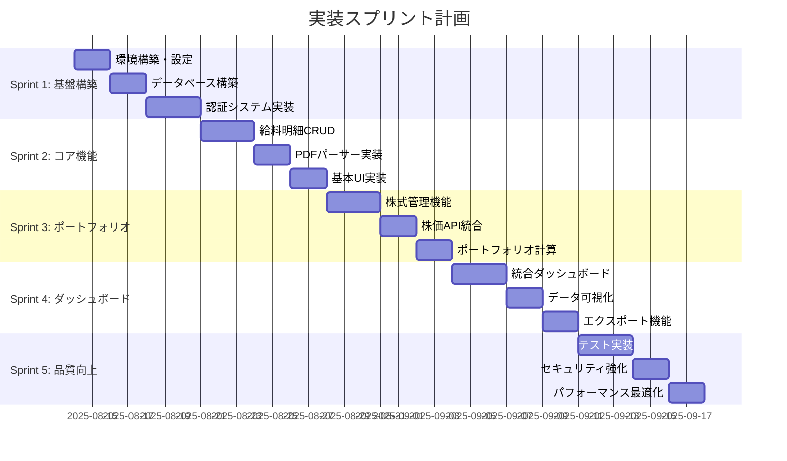
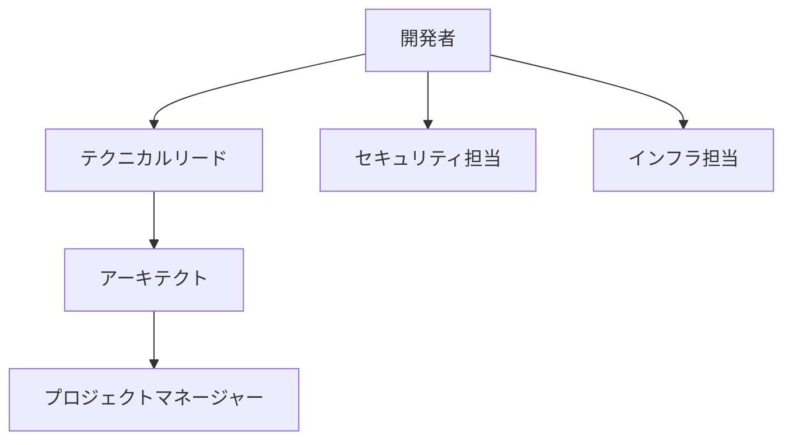

# 実装フェーズへの申し送り事項

## 文書情報
- **作成日**: 2025-08-10
- **作成者**: 統合レビュースペシャリスト
- **バージョン**: 1.0.0
- **ステータス**: 申し送り完了
- **対象チーム**: 実装チーム

---

## 1. プロジェクト概要と現状

### 1.1 プロジェクトスコープ
**個人の給料と資産（株式）を一元管理するWebアプリケーション**

- 給料明細のPDF取り込みと管理
- 株式ポートフォリオの時価評価
- 統合ダッシュボードによる資産可視化
- 完全な個人データの分離とセキュリティ

### 1.2 基本設計フェーズの成果
✅ **完了した設計成果物:**
- システムアーキテクチャ設計
- データモデル設計（ERD、スキーマ、TypeScript型）
- API仕様書（エンドポイント、スキーマ、OpenAPI）
- 画面遷移設計
- セキュリティアーキテクチャ
- インフラストラクチャ設計

### 1.3 技術スタック確定版
```typescript
const techStack = {
  frontend: {
    framework: "Svelte 5",
    metaFramework: "SvelteKit 2.x",
    language: "TypeScript 5.3+",
    styling: "Tailwind CSS 3.4+",
    charts: "Chart.js 4.4+",
  },
  backend: {
    runtime: "Node.js 20.x LTS",
    api: "SvelteKit API Routes",
    orm: "Prisma 5.x",
  },
  database: {
    primary: "PostgreSQL 15+ (Supabase)",
    cache: "Redis (Upstash)",
    storage: "Object Storage (Supabase)",
  },
  infrastructure: {
    hosting: "Vercel",
    cdn: "Cloudflare",
    monitoring: "Vercel Analytics + Sentry",
  },
  authentication: {
    provider: "Google OAuth 2.0",
    service: "Supabase Auth",
  },
};
```

---

## 2. 実装前の必須対応事項

### 2.1 🔴 Critical - 実装開始前に完了必須

#### テスト設計書の作成（期限: 8/12）
```typescript
// 最低限必要なテスト設計
interface RequiredTestDesign {
  unitTests: {
    // ビジネスロジックのテストケース
    pdfParser: ["正常系", "異常系", "境界値"];
    salaryCalculation: ["各種計算式", "端数処理"];
    portfolioValuation: ["時価評価", "損益計算"];
  };
  
  integrationTests: {
    // API統合テスト
    authentication: ["ログイン", "ログアウト", "セッション管理"];
    dataFlow: ["CRUD操作", "トランザクション"];
  };
  
  e2eTests: {
    // 主要ユーザーフロー
    criticalPaths: [
      "ユーザー登録→ログイン→ダッシュボード表示",
      "PDF アップロード→解析→保存→表示",
      "株式登録→価格更新→ポートフォリオ計算",
    ];
  };
}
```

#### エラーコード体系の実装（期限: 8/11）
- `/src/shared/utils/errors/` ディレクトリに実装
- ErrorCode enum の定義
- AppError クラスの実装
- エラーメッセージの国際化対応

#### 暗号化キー管理の実装（期限: 8/11）
- 環境変数の設定（Vercel Secrets）
- KeyManager クラスの実装
- 暗号化/復号化ユーティリティの作成

### 2.2 環境構築チェックリスト

```bash
# 1. 必須アカウントの作成
□ Vercelアカウント
□ Supabaseアカウント
□ Upstash Redisアカウント
□ Cloudflareアカウント
□ Google Cloud Console（OAuth用）

# 2. プロジェクトセットアップ
□ Vercelプロジェクト作成
□ Supabaseプロジェクト作成
□ Redisインスタンス作成
□ ドメイン設定

# 3. 環境変数の設定
□ DATABASE_URL
□ DIRECT_URL
□ REDIS_URL
□ GOOGLE_CLIENT_ID
□ GOOGLE_CLIENT_SECRET
□ ENCRYPTION_KEY
□ ALPHA_VANTAGE_API_KEY
```

---

## 3. 実装順序と優先度

### 3.1 推奨される実装スプリント



### 3.2 各スプリントの成果物

#### Sprint 1: 基盤構築（8/14-8/20）
```typescript
// 完成すべき機能
const sprint1Deliverables = {
  infrastructure: [
    "Vercel デプロイ設定",
    "Supabase データベース構築",
    "Prisma スキーマ適用",
    "環境変数設定完了",
  ],
  authentication: [
    "Google OAuth 統合",
    "セッション管理",
    "ユーザー登録・ログイン",
    "認証ミドルウェア",
  ],
  foundation: [
    "プロジェクト構造（FSD）",
    "共通コンポーネント",
    "エラーハンドリング",
    "ログシステム",
  ],
};
```

#### Sprint 2: コア機能（8/21-8/27）
```typescript
// 給料明細管理の実装
const sprint2Deliverables = {
  api: [
    "GET /api/salary-slips",
    "POST /api/salary-slips",
    "PUT /api/salary-slips/:id",
    "DELETE /api/salary-slips/:id",
    "POST /api/salary-slips/upload",
  ],
  features: [
    "PDFパーサー（pdf.js）",
    "データ検証",
    "重複チェック",
    "手動編集機能",
  ],
  ui: [
    "給料明細一覧画面",
    "給料明細詳細画面",
    "PDFアップロードモーダル",
    "編集フォーム",
  ],
};
```

---

## 4. 技術的な実装ガイドライン

### 4.1 Svelte 5 Runes APIの活用

```svelte
<script lang="ts">
  // Svelte 5の新しいRunes APIを使用
  let count = $state(0);
  let doubled = $derived(count * 2);
  
  // エフェクトの実行
  $effect(() => {
    console.log(`Count changed to ${count}`);
  });
  
  // Props with runes
  let { data = $bindable() } = $props();
</script>
```

### 4.2 Feature-Sliced Design構造（04-Implementation準拠）

**⚠️ 重要：04-Implementation/IMPLEMENTATION_ORDER.mdで定義された正式構造に準拠**

```bash
src/
├── shared/components/      # 共通リソース（最下位層）
│   ├── ui/               # 基本UIコンポーネント
│   └── model/           # Interface定義
├── entities/              # ビジネスエンティティ（下位層）
│   ├── salary-slip/
│   │   ├── ui/          # ビジネス専用UI（ロジック無し）
│   │   ├── api/         # 純粋なデータ取得
│   │   └── model/       # 型定義
│   ├── stock/
│   │   ├── ui/
│   │   ├── api/
│   │   └── model/
│   └── asset/
│       ├── ui/
│       ├── api/
│       └── model/
├── features/              # ユーザー向け機能（上位層）
│   ├── salary-slip/
│   │   ├── ui/          # UIとビジネスロジック
│   │   ├── api/         # API+ビジネスロジック
│   │   ├── composable/  # ユースケースロジック
│   │   └── model/       # フィーチャー固有型
│   ├── portfolio/
│   │   ├── ui/
│   │   ├── api/
│   │   ├── composable/
│   │   └── model/
│   └── dashboard/
│       ├── ui/
│       ├── api/
│       ├── composable/
│       └── model/
└── routes/                # SvelteKit ルーティング
    ├── +layout.svelte
    ├── +page.svelte
    └── api/              # API エンドポイント
```

**FSD依存関係ルール**：
- shared ← entities ← features（上位層は下位層のみ使用可能）
- 同レベル層間での直接依存は禁止

### 4.3 型安全性の確保

```typescript
// Prismaによる型生成を活用
import type { SalarySlip, Stock, User } from '@prisma/client';

// Zodによる実行時検証
import { z } from 'zod';

const salarySlipSchema = z.object({
  companyName: z.string().min(1).max(100),
  paymentDate: z.string().datetime(),
  baseSalary: z.number().positive(),
  netPay: z.number().positive(),
});

// API レスポンス型
type ApiResponse<T> = {
  success: true;
  data: T;
} | {
  success: false;
  error: {
    code: ErrorCode;
    message: string;
    details?: any;
  };
};
```

### 4.4 パフォーマンス最適化のポイント

```typescript
// 1. 遅延読み込み
const LazyComponent = lazy(() => import('./HeavyComponent.svelte'));

// 2. 仮想スクロール（大量データ）
import VirtualList from '@tanstack/svelte-virtual';

// 3. デバウンス処理
import { debounce } from '$shared/utils';
const debouncedSearch = debounce(search, 300);

// 4. メモ化
const expensiveCalculation = $derived.memo(() => {
  return performExpensiveCalculation(data);
});

// 5. 画像最適化
import { optimizeImage } from '$shared/utils/image';
```

---

## 5. セキュリティ実装チェックリスト

### 5.1 必須セキュリティ対策

```typescript
// セキュリティ実装の優先順位
const securityChecklist = {
  critical: [
    "✅ HTTPS強制（Vercel自動）",
    "□ 環境変数の暗号化",
    "□ SQLインジェクション対策（Prisma）",
    "□ XSS対策（出力エスケープ）",
    "□ CSRF対策（SvelteKit標準）",
  ],
  high: [
    "□ レート制限実装",
    "□ 入力検証（Zod）",
    "□ セキュリティヘッダー設定",
    "□ 監査ログ実装",
    "□ セッション管理",
  ],
  medium: [
    "□ Content Security Policy",
    "□ データ暗号化",
    "□ ファイルアップロード制限",
    "□ エラーメッセージの適切化",
  ],
};
```

### 5.2 Supabase RLS設定

```sql
-- 必須のRLSポリシー
-- ユーザーは自分のデータのみアクセス可能
ALTER TABLE salary_slips ENABLE ROW LEVEL SECURITY;
ALTER TABLE stock_portfolios ENABLE ROW LEVEL SECURITY;
ALTER TABLE assets ENABLE ROW LEVEL SECURITY;

CREATE POLICY "Users can only see own salary slips"
ON salary_slips FOR ALL
USING (auth.uid() = user_id);

CREATE POLICY "Users can only see own portfolio"
ON stock_portfolios FOR ALL
USING (auth.uid() = user_id);

CREATE POLICY "Users can only see own assets"
ON assets FOR ALL
USING (auth.uid() = user_id);
```

---

## 6. 品質保証ガイドライン

### 6.1 コーディング規約

```typescript
// 命名規則
const namingConventions = {
  files: "kebab-case",           // salary-slip.ts
  components: "PascalCase",       // SalarySlipCard.svelte
  functions: "camelCase",         // calculateNetPay()
  constants: "UPPER_SNAKE_CASE", // MAX_FILE_SIZE
  interfaces: "PascalCase",       // ISalarySlip or SalarySlipType
};

// コンポーネント構造
// ComponentName.svelte
`
<script lang="ts">
  // 1. Imports
  // 2. Props
  // 3. State
  // 4. Computed/Derived
  // 5. Lifecycle/Effects
  // 6. Functions
</script>

<!-- Template -->

<style>
  /* Component styles */
</style>
`;
```

### 6.2 Git コミット規約

```bash
# コミットメッセージフォーマット
<type>(<scope>): <subject>

# Types
feat: 新機能
fix: バグ修正
docs: ドキュメント
style: フォーマット
refactor: リファクタリング
test: テスト
chore: その他

# 例
feat(salary-slip): PDFアップロード機能を実装
fix(portfolio): 株価更新のレート制限エラーを修正
docs(api): エンドポイント仕様を更新
```

### 6.3 レビューチェックポイント

```markdown
## PRレビューチェックリスト
- [ ] 機能要件を満たしている
- [ ] テストが追加/更新されている
- [ ] 型安全性が保たれている
- [ ] エラーハンドリングが適切
- [ ] パフォーマンスへの影響を考慮
- [ ] セキュリティ上の問題がない
- [ ] コーディング規約に準拠
- [ ] ドキュメントが更新されている
```

---

## 7. トラブルシューティングガイド

### 7.1 よくある問題と対処法

```typescript
// 問題1: Prisma型が生成されない
// 解決法:
npm run prisma:generate

// 問題2: 環境変数が読み込まれない
// 解決法:
// .env.localファイルを確認
// Vercelの環境変数設定を確認

// 問題3: SvelteKitのハイドレーションエラー
// 解決法:
// SSRとクライアントで同じ初期状態を保証
// $effect.pre()を使用してサーバーサイドで実行

// 問題4: TypeScriptエラー
// 解決法:
npm run check

// 問題5: Supabase接続エラー
// 解決法:
// DATABASE_URLの確認
// RLSポリシーの確認
// ネットワーク設定の確認
```

### 7.2 デバッグツール

```typescript
// 開発用デバッグユーティリティ
export const debug = {
  // API レスポンスログ
  logApiResponse: (endpoint: string, response: any) => {
    if (import.meta.env.DEV) {
      console.group(`API: ${endpoint}`);
      console.log('Response:', response);
      console.groupEnd();
    }
  },
  
  // Store の状態ログ
  logStoreState: (storeName: string, state: any) => {
    if (import.meta.env.DEV) {
      console.log(`Store [${storeName}]:`, state);
    }
  },
  
  // パフォーマンス計測
  measurePerformance: async (name: string, fn: Function) => {
    if (import.meta.env.DEV) {
      const start = performance.now();
      const result = await fn();
      const end = performance.now();
      console.log(`Performance [${name}]: ${end - start}ms`);
      return result;
    }
    return await fn();
  },
};
```

---

## 8. 外部リソースと参考資料

### 8.1 公式ドキュメント
- [Svelte 5 Documentation](https://svelte.dev/docs)
- [SvelteKit Documentation](https://kit.svelte.dev/docs)
- [Prisma Documentation](https://www.prisma.io/docs)
- [Supabase Documentation](https://supabase.com/docs)
- [Vercel Documentation](https://vercel.com/docs)

### 8.2 設計パターン参考資料
- [Feature-Sliced Design](https://feature-sliced.design/)
- [OWASP Security Guidelines](https://owasp.org/www-project-top-ten/)

### 8.3 コミュニティリソース
- Svelte Discord
- SvelteKit GitHub Discussions
- Prisma Slack Community

---

## 9. 連絡体制と質問対応

### 9.1 エスカレーションパス



### 9.2 質問カテゴリと担当

| カテゴリ | 担当 | 対応時間 |
|---------|------|----------|
| アーキテクチャ | アーキテクト | 24時間以内 |
| セキュリティ | セキュリティ担当 | 即時（Critical） |
| インフラ | インフラ担当 | 24時間以内 |
| ビジネスロジック | プロダクトオーナー | 48時間以内 |

---

## 10. 成功基準とマイルストーン

### 10.1 各スプリントの完了基準

```typescript
const sprintCompletionCriteria = {
  sprint1: {
    // 基盤構築の完了基準
    criteria: [
      "認証機能が動作する",
      "データベースに接続できる",
      "基本的なCRUDが動作する",
      "Vercelにデプロイされている",
    ],
    metrics: {
      testCoverage: 60,
      buildTime: "< 5 minutes",
      deploymentSuccess: true,
    },
  },
  sprint2: {
    // コア機能の完了基準
    criteria: [
      "PDFアップロードが動作する",
      "給料明細の登録・表示が可能",
      "データ検証が機能する",
    ],
    metrics: {
      testCoverage: 70,
      pdfParseSuccess: "> 90%",
      apiResponseTime: "< 2 seconds",
    },
  },
  // ... 他のスプリント
};
```

### 10.2 最終リリース基準

- ✅ 全機能の実装完了
- ✅ テストカバレッジ 80%以上
- ✅ セキュリティ監査合格
- ✅ パフォーマンス目標達成
- ✅ ドキュメント完備
- ✅ 本番環境での動作確認

---

## 承認

| 役割 | 名前 | 日付 | 署名 |
|------|------|------|------|
| 統合レビュースペシャリスト | 統合レビュースペシャリスト | 2025-08-10 | ✅ |
| プロジェクトマネージャー | - | - | [ ] |
| テクニカルリード | - | - | [ ] |
| 実装チームリード | - | - | [ ] |

---

**改訂履歴**

| バージョン | 日付 | 変更内容 | 作成者 |
|-----------|------|----------|---------|
| 1.0.0 | 2025-08-10 | 初版作成 | 統合レビュースペシャリスト |