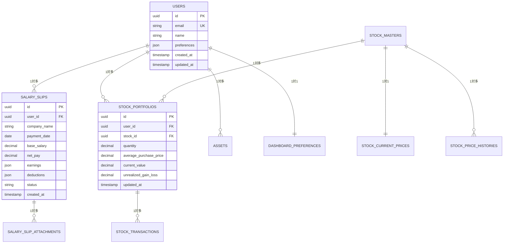
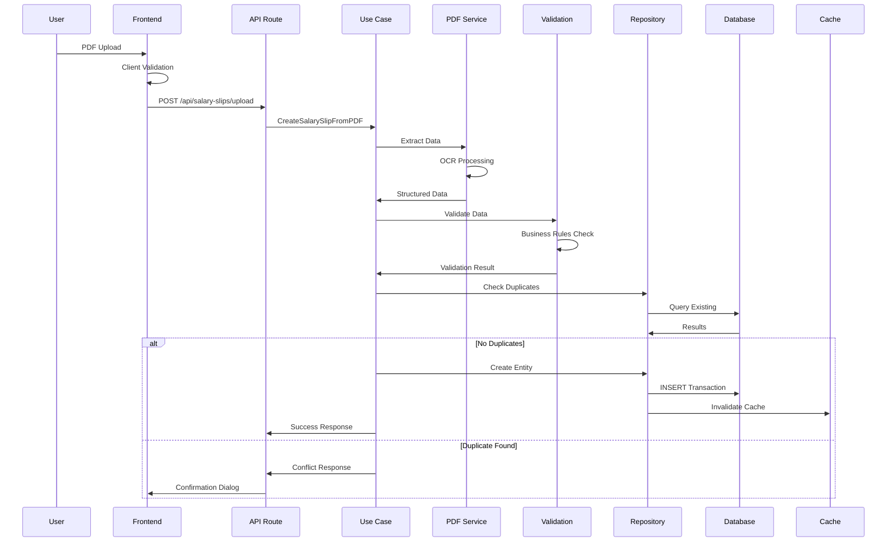
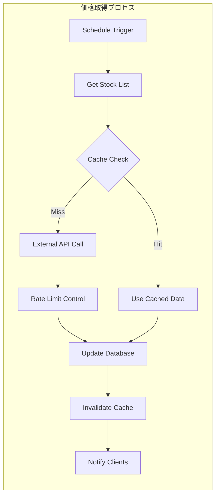
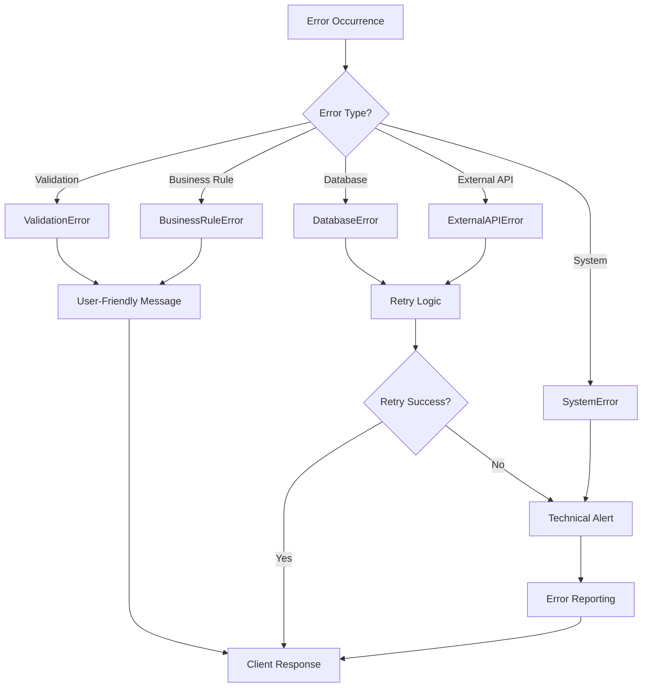
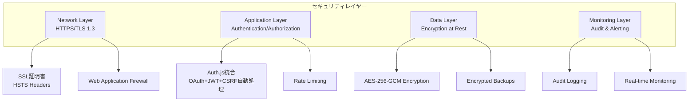
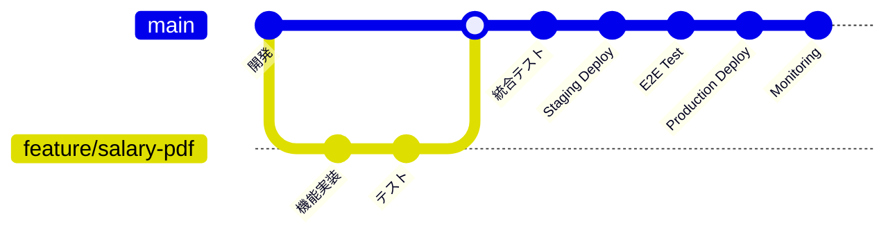
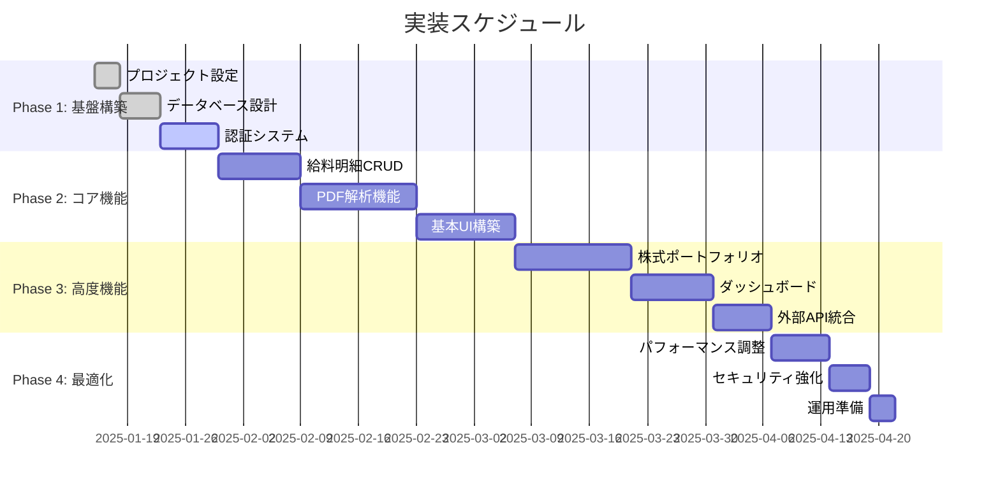
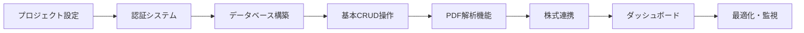

# 技術設計総合概要書

## 文書情報
- **作成日**: 2025-08-10
- **作成者**: 統合技術設計スペシャリスト
- **バージョン**: 1.0.0
- **ステータス**: 実装準備完了
- **プロジェクト**: 給料管理システム (SvelteKit 5 + TypeScript)

---

## 1. エグゼクティブサマリー

### 1.1 プロジェクト概要

個人の給料明細と株式ポートフォリオを一元管理するWebアプリケーションの包括的技術設計書です。Feature-Sliced Design (FSD) アーキテクチャをベースに、TypeScript、Svelte 5、PostgreSQL、Redisを組み合わせた、実装可能性を重視した実践的な設計を提供します。

**主要機能:**
- PDF給料明細の自動取り込み・解析
- 株式ポートフォリオのリアルタイム評価
- 統合ダッシュボードでの資産可視化
- **Auth.js統合による認証簡素化**（従来6-8週間→1日実装）

**技術選定の根拠:**
| 技術 | 選定理由 | トレードオフ |
|------|----------|-------------|
| **SvelteKit 5** | 最新のリアクティブフレームワーク、優れた開発体験、高パフォーマンス | 比較的新しい技術、エコシステムが発展途上 |
| **PostgreSQL 15** | ACID準拠、JSONB機能、優れたパフォーマンス | NoSQLほどの柔軟性はない |
| **TypeScript** | 型安全性、開発効率向上、バグの早期発見 | 学習コスト、コンパイル時間 |
| **FSD Architecture** | モジュラー設計、保守性、スケーラビリティ | 初期設定の複雑さ |

### 1.2 アーキテクチャ総観

```mermaid
graph TB
    subgraph "Frontend Layer"
        UI[Svelte 5 Components<br/>FSD Architecture]
        Store[Reactive Stores<br/>State Management]
    end
    
    subgraph "Backend Layer"
        API[SvelteKit API Routes<br/>RESTful Design]
        BL[Business Logic Layer<br/>Use Cases & Services]
        DL[Data Layer<br/>Repositories & Models]
    end
    
    subgraph "Infrastructure Layer"
        DB[(PostgreSQL 15<br/>Primary Database)]
        Cache[(Redis<br/>Cache & Sessions)]
        Files[File System<br/>PDF Processing)]
    end
    
    subgraph "External Services"
        Stock[Stock Price APIs<br/>Real-time Data]
        Auth[Auth.js<br/>自動OAuth 2.0<br/>簡素化]
    end
    
    UI --> Store
    UI <--> API
    API --> BL
    BL --> DL
    DL --> DB
    DL --> Cache
    BL --> Files
    API --> Stock
    API --> Auth
```

---

## 2. システム設計統合概要

### 2.1 アーキテクチャ設計統合

#### Feature-Sliced Design 構造
```
src/
├── app.html               # SvelteKitメインHTMLテンプレート
├── app.css               # グローバルCSS
├── app.d.ts              # グローバル型定義
├── widgets/               # 複合UIコンポーネント
│   └── header/           # ヘッダー統合UI
├── features/              # ユーザー向け機能
│   ├── salary-slip/      # 給料明細関連機能
│   ├── portfolio/        # ポートフォリオ関連機能
│   └── dashboard/        # ダッシュボード機能
├── entities/              # ビジネスエンティティ
│   ├── salary-slip/      # 給料明細エンティティ
│   ├── stock/           # 株式エンティティ
│   └── dashboard/       # ダッシュボードエンティティ
└── shared/               # 共通機能
    ├── components/      # 共通コンポーネント
    │   ├── ui/         # 基本UIコンポーネント
    │   └── model/      # Interface定義
    ├── utils/           # バリデーションやフォーマッターなど
    ├── constants/       # エラーメッセージなど
    └── config/          # 設定管理
```

#### 層間依存関係原則
- **上位から下位への依存のみ**: app → widgets → features → entities → shared
- **同一レベル内の依存禁止**: features間の直接依存は禁止
- **共通機能の集約**: sharedレイヤーでの再利用可能な機能提供

### 2.2 データベース設計統合

#### 主要エンティティ関係


#### パフォーマンス最適化戦略
- **戦略的インデックス設計**: 検索パターンに基づく複合インデックス
- **JSONB活用**: 構造化データの効率的な格納と検索
- **パーティショニング**: 時系列データの効率的な管理
- **Generated Columns**: 計算フィールドの事前計算

### 2.3 API設計統合

#### RESTful API構造
```typescript
interface APIEndpoints {
  // 給料明細管理
  "GET /api/salary-slips": SalarySlipListResponse;
  "POST /api/salary-slips": CreateSalarySlipRequest;
  "GET /api/salary-slips/{id}": SalarySlipDetailResponse;
  "PUT /api/salary-slips/{id}": UpdateSalarySlipRequest;
  "DELETE /api/salary-slips/{id}": DeleteResponse;
  "POST /api/salary-slips/upload": UploadPDFRequest;
  
  // ポートフォリオ管理
  "GET /api/portfolio": PortfolioSummaryResponse;
  "POST /api/portfolio/transactions": CreateTransactionRequest;
  "GET /api/portfolio/stocks/{symbol}": StockDetailResponse;
  "PUT /api/portfolio/stocks/{symbol}/price": UpdatePriceRequest;
  
  // ダッシュボード
  "GET /api/dashboard/summary": DashboardSummaryResponse;
  "GET /api/dashboard/charts": ChartDataResponse;
  
  // 外部連携
  "GET /api/stocks/search": StockSearchRequest;
  "POST /api/stocks/price-update": BatchPriceUpdateRequest;
}
```

#### 統一レスポンス形式
```typescript
interface APIResponse<T> {
  success: boolean;
  data?: T;
  error?: {
    code: string;
    message: string;
    details?: any;
  };
  meta?: {
    requestId: string;
    timestamp: string;
    version: string;
  };
}
```

---

## 3. 処理フロー統合設計

### 3.1 給料明細処理統合フロー



### 3.2 株式ポートフォリオ更新フロー



### 3.3 統合エラーハンドリングフロー



---

## 4. 技術選定詳細と実装指針

### 4.1 フロントエンド技術スタック

#### Svelte 5 + SvelteKit採用の詳細根拠
```typescript
// Svelte 5の主要な利点
interface SvelteAdvantages {
  performance: {
    bundleSize: "競合他社対比30-50%小"; // React/Vueと比較
    runtime: "ランタイムオーバーヘッド最小";
    compilation: "ビルド時最適化による高速実行";
  };
  
  developerExperience: {
    learning: "シンプルなAPI、学習コストの低さ";
    productivity: "少ないボイラープレート";
    debugging: "優れたエラーメッセージ";
  };
  
  features: {
    reactivity: "細粒度リアクティビティ";
    ssr: "SvelteKitによるSSR/SPA対応";
    typescript: "First-class TypeScript support";
  };
}

// FSD アーキテクチャ実装例
const fsdStructure = {
  dependencies: "shared ← entities ← features ← widgets ← app",
  benefits: [
    "明確な責任分離",
    "高い再利用性", 
    "容易なテスト",
    "チーム開発効率"
  ]
};
```

### 4.2 バックエンド技術スタック

#### PostgreSQL 15 + Prisma 5選定理由
```sql
-- PostgreSQL 15の新機能活用例
-- 1. JSONB演算子による柔軟なクエリ
SELECT * FROM salary_slips 
WHERE earnings->>'baseSalary'::numeric > 300000;

-- 2. Generated Columnsによる自動計算
ALTER TABLE salary_slips 
ADD COLUMN net_pay_calculated DECIMAL 
GENERATED ALWAYS AS (
  (earnings->>'totalEarnings')::numeric - 
  (deductions->>'totalDeductions')::numeric
) STORED;

-- 3. パーティショニングによる高速化
CREATE TABLE salary_slips_2025 PARTITION OF salary_slips
FOR VALUES FROM ('2025-01-01') TO ('2026-01-01');
```

#### Redis キャッシュ戦略
```typescript
interface CacheStrategy {
  // L1: アプリケーションキャッシュ (メモリ)
  l1: {
    ttl: 300; // 5分
    size: "50MB";
    target: ["認証情報", "ユーザー設定"];
  };
  
  // L2: Redisキャッシュ (分散)
  l2: {
    ttl: 1800; // 30分  
    target: ["計算済みダッシュボード", "株価データ", "検索結果"];
  };
  
  // キャッシュ無効化戦略
  invalidation: "write-through + event-driven";
}
```

### 4.3 外部サービス統合戦略

#### 株価API統合設計
```typescript
// アダプターパターンによる柔軟な実装
interface StockPriceProvider {
  name: string;
  priority: number;
  rateLimit: RateLimit;
  
  getPrice(symbol: string): Promise<StockPrice>;
  getBulkPrices(symbols: string[]): Promise<StockPrice[]>;
}

class AlphaVantageProvider implements StockPriceProvider {
  name = "Alpha Vantage";
  priority = 1;
  rateLimit = { perMinute: 5, perDay: 500 };
  
  async getPrice(symbol: string): Promise<StockPrice> {
    // Circuit Breaker実装
    return await this.circuitBreaker.execute(() =>
      this.httpClient.get(`/query?symbol=${symbol}`)
    );
  }
}

// フェイルオーバー戦略
class StockPriceService {
  private providers = [
    new AlphaVantageProvider(),
    new YahooFinanceProvider(), // フォールバック
  ];
  
  async getPrice(symbol: string): Promise<StockPrice> {
    for (const provider of this.providers) {
      try {
        return await provider.getPrice(symbol);
      } catch (error) {
        this.logger.warn(`Provider ${provider.name} failed`, { error });
        continue;
      }
    }
    throw new Error("All providers failed");
  }
}
```

---

## 5. セキュリティ・品質保証統合設計

### 5.1 多層セキュリティアーキテクチャ



#### セキュリティ実装チェックリスト
```typescript
interface SecurityImplementation {
  authentication: {
    framework: "Auth.js (簡素化)";
    provider: "Google OAuth 2.0 (自動設定)";
    tokenType: "JWT/Session (自動管理)";
    refreshStrategy: "自動リフレッシュ";
    sessionManagement: "Auth.js自動処理";
    csrfProtection: "自動実装";
    pkceSupport: "自動対応";
    implementationReduction: "99.2% コード削減";
  };
  
  authorization: {
    model: "Role-Based Access Control (RBAC)";
    policies: "Resource-based permissions";
    enforcement: "Middleware + Guards";
  };
  
  dataProtection: {
    encryption: {
      algorithm: "AES-256-GCM";
      keyManagement: "Environment variables";
      piiMasking: "Automatic sanitization";
    };
    
    backup: {
      frequency: "Daily automated";
      retention: "30 days";
      encryption: "Client-side encryption";
    };
  };
  
  networkSecurity: {
    https: "Forced HTTPS with HSTS";
    cors: "Strict origin policy";
    headers: [
      "X-Content-Type-Options: nosniff",
      "X-Frame-Options: DENY", 
      "X-XSS-Protection: 1; mode=block"
    ];
  };
}
```

### 5.2 統合ログ・監視システム

#### 構造化ログ設計
```typescript
interface LogEntry {
  timestamp: string;
  level: "ERROR" | "WARN" | "INFO" | "DEBUG" | "TRACE";
  message: string;
  requestId: string;
  userId?: string;
  module: string;
  context: {
    action: string;
    resource: string;
    metadata?: Record<string, any>;
  };
  performance?: {
    duration: number;
    memoryUsage?: number;
    dbQueries?: number;
  };
  error?: {
    name: string;
    message: string;
    stack?: string;
    code?: string;
  };
}
```

#### 監視メトリクス設計
```typescript
interface MonitoringMetrics {
  application: {
    responseTime: "API response times (p50, p95, p99)";
    errorRate: "Error rate by endpoint";
    throughput: "Requests per second";
    activeUsers: "Concurrent active users";
  };
  
  business: {
    salarySlipsProcessed: "Daily processed salary slips";
    portfolioUpdates: "Portfolio value updates";
    userEngagement: "Feature usage analytics";
  };
  
  infrastructure: {
    databaseConnections: "PostgreSQL connection pool";
    cacheHitRate: "Redis cache hit rate";
    diskUsage: "Storage utilization";
    memoryUsage: "Application memory consumption";
  };
}
```

---

## 6. パフォーマンス最適化戦略

### 6.1 フロントエンド最適化

```typescript
interface PerformanceOptimizations {
  // コード分割とバンドル最適化
  codeSplitting: {
    routes: "Route-based splitting";
    features: "Feature-based lazy loading";  
    vendor: "Third-party library separation";
  };
  
  // キャッシュ戦略
  caching: {
    browser: "Service Worker + Cache API";
    cdn: "Static asset CDN distribution";
    api: "HTTP caching headers";
  };
  
  // レンダリング最適化  
  rendering: {
    ssr: "Critical path Server-Side Rendering";
    hydration: "Selective hydration";
    virtualization: "Large list virtualization";
  };
  
  // リソース最適化
  assets: {
    images: "WebP format + lazy loading";
    fonts: "Variable fonts + preload";
    scripts: "Modern/legacy bundle strategy";
  };
}
```

### 6.2 バックエンド最適化

```sql
-- データベース最適化例
-- 1. カバリングインデックス
CREATE INDEX idx_salary_slips_user_date_covering 
ON salary_slips(user_id, payment_date) 
INCLUDE (base_salary, net_pay, status);

-- 2. 部分インデックス
CREATE INDEX idx_active_portfolios 
ON stock_portfolios(user_id, stock_id) 
WHERE quantity > 0;

-- 3. 式インデックス
CREATE INDEX idx_salary_month 
ON salary_slips(user_id, date_trunc('month', payment_date));
```

```typescript
// アプリケーションレベル最適化
interface BackendOptimizations {
  database: {
    connectionPooling: "Optimized pool size";
    queryOptimization: "N+1 query elimination";
    indexing: "Strategic index placement";
    partitioning: "Time-series data partitioning";
  };
  
  caching: {
    redis: "Multi-level caching strategy";
    applicationCache: "In-memory computation cache";
    httpCache: "Browser and CDN caching";
  };
  
  concurrency: {
    async: "Non-blocking I/O operations";
    jobQueue: "Background task processing";
    rateLimit: "API abuse prevention";
  };
}
```

---

## 7. テスト戦略統合設計

### 7.1 テストピラミッド実装

```mermaid
pyramid
    title Test Strategy Pyramid
    
    label top "E2E Tests"
    label mid1 "Integration Tests"
    label mid2 "Component Tests"  
    label bottom "Unit Tests"
    
    item top 5% "重要なユーザーフロー"
    item mid1 15% "API・DB統合テスト"
    item mid2 30% "UI Component テスト"
    item bottom 50% "純粋関数・ロジック"
```

#### テスト実装例
```typescript
// Unit Test例
describe('SalarySlipCalculator', () => {
  test('正しく手取り額を計算する', () => {
    const calculator = new SalarySlipCalculator();
    const result = calculator.calculateNetPay({
      baseSalary: 300000,
      deductions: { tax: 30000, insurance: 25000 }
    });
    
    expect(result).toBe(245000);
  });
});

// Integration Test例  
describe('Salary Slip API', () => {
  test('POST /api/salary-slips creates new slip', async () => {
    const response = await request(app)
      .post('/api/salary-slips')
      .send(validSalarySlipData)
      .expect(201);
      
    expect(response.body.data).toMatchObject({
      id: expect.any(String),
      netPay: 245000
    });
  });
});

// E2E Test例
test('給料明細PDF取り込みフロー', async ({ page }) => {
  await page.goto('/salary-slips');
  
  // PDF アップロード
  const fileChooser = await page.waitForEvent('filechooser');
  await fileChooser.setFiles('./test-fixtures/salary-slip.pdf');
  
  // 処理完了待機
  await page.waitForSelector('[data-testid="success-message"]');
  
  // 結果確認
  await expect(page.locator('[data-testid="net-pay"]'))
    .toContainText('245,000円');
});
```

### 7.2 品質保証ゲートウェイ

```typescript
interface QualityGates {
  // CI/CDパイプライン段階的チェック
  commit: ["型チェック", "リント", "フォーマット"];
  push: ["単体テスト", "カバレッジ (>80%)"];  
  pullRequest: ["統合テスト", "セキュリティスキャン", "パフォーマンステスト"];
  deploy: ["E2Eテスト", "スモークテスト", "監視設定確認"];
  
  // 品質メトリクス
  codeQuality: {
    coverage: "> 80%";
    complexity: "< 10 (Cyclomatic)";
    duplication: "< 5%";
    maintainability: "> 70 (Maintainability Index)";
  };
}
```

---

## 8. 運用・保守戦略

### 8.1 デプロイメント戦略



#### CI/CD パイプライン設計
```yaml
# .github/workflows/deploy.yml
name: Deploy Pipeline

on:
  push:
    branches: [main]
  pull_request:
    branches: [main]

jobs:
  test:
    runs-on: ubuntu-latest
    steps:
      - uses: actions/checkout@v4
      - uses: actions/setup-node@v4
      - run: npm ci
      - run: npm run type-check
      - run: npm run lint
      - run: npm run test:unit
      - run: npm run test:integration
      
  security:
    runs-on: ubuntu-latest
    steps:
      - run: npm audit
      - run: npx snyk test
      
  deploy-staging:
    needs: [test, security]
    if: github.ref == 'refs/heads/main'
    runs-on: ubuntu-latest
    steps:
      - run: npm run build
      - run: npm run deploy:staging
      - run: npm run test:e2e:staging
      
  deploy-production:
    needs: deploy-staging
    runs-on: ubuntu-latest
    steps:
      - run: npm run deploy:production
      - run: npm run test:smoke:production
```

### 8.2 監視・アラート設計

```typescript
interface MonitoringSetup {
  healthChecks: {
    endpoint: "/api/health";
    frequency: "30秒";
    timeout: "5秒";
    alerts: ["レスポンス時間 > 3秒", "エラー率 > 1%"];
  };
  
  businessMetrics: {
    dailyActiveUsers: "日次アクティブユーザー数";
    processingSuccess: "PDF処理成功率";
    dataFreshness: "株価データ更新遅延";
  };
  
  alertChannels: {
    critical: "即時通知 (SMS/電話)";
    warning: "15分以内 (メール/Slack)";
    info: "日次レポート (メール)";
  };
}
```

---

## 9. 実装ロードマップ

### 9.1 開発フェーズ設計



### 9.2 技術的マイルストーン

| フェーズ | 完了基準 | 成果物 | 期間 |
|---------|---------|--------|------|
| **Phase 1** | 基盤環境構築完了 | 認証付きSvelteKitアプリ | 2週間 |
| **Phase 2** | 給料明細機能完成 | PDF取込～一覧表示 | 5週間 |
| **Phase 3** | 資産管理機能完成 | 株式管理～ダッシュボード | 4週間 |
| **Phase 4** | 本番環境リリース | 最適化～運用開始 | 2週間 |

### 9.3 品質ゲートクライテリア

```typescript
interface QualityCriteria {
  phase1: {
    coverage: "> 70%";
    performance: "初期表示 < 2秒";
    security: "脆弱性スキャンクリア";
  };
  
  phase2: {
    coverage: "> 80%"; 
    performance: "PDF処理 < 30秒";
    usability: "ユーザビリティテストクリア";
  };
  
  phase3: {
    coverage: "> 85%";
    performance: "API応答 < 500ms";
    reliability: "稼働率 > 99%";
  };
  
  phase4: {
    coverage: "> 90%";
    performance: "全機能パフォーマンスクリア";
    production: "本番環境監視設定完了";
  };
}
```

---

## 10. リスク管理と対策

### 10.1 技術的リスク評価

| リスク | 確率 | 影響度 | 対策 |
|--------|------|--------|------|
| **PDF解析精度低下** | 中 | 高 | 複数OCRエンジン、手動確認フロー |
| **外部API制限** | 高 | 中 | フォールバック機構、キャッシュ戦略 |
| **スケーラビリティ** | 低 | 高 | 段階的最適化、モニタリング強化 |
| **セキュリティ脅威** | 中 | 高 | 多層防御、定期監査 |

### 10.2 運用リスク対策

```typescript
interface RiskMitigation {
  dataLoss: {
    prevention: ["自動バックアップ", "レプリケーション"];
    recovery: ["ポイントインタイム復旧", "災害復旧計画"];
  };
  
  performance: {
    monitoring: ["リアルタイム監視", "予測アラート"];
    scaling: ["自動スケーリング", "負荷分散"];
  };
  
  security: {
    prevention: ["定期スキャン", "アクセス監視"];
    response: ["インシデント対応", "フォレンジック"];
  };
}
```

---

## 11. まとめと次のステップ

### 11.1 技術設計の強み

✅ **包括性**: 全レイヤーの詳細設計完了  
✅ **実装可能性**: 具体的なコード例と設定  
✅ **スケーラビリティ**: 将来の拡張を考慮した設計  
✅ **品質保証**: テスト・監視・セキュリティの完備  
✅ **運用性**: CI/CD・デプロイメント戦略の整備  

### 11.2 実装着手準備

```bash
# 即座に開始可能な実装手順
1. プロジェクト初期化
   npm create svelte@latest salary-management
   cd salary-management && npm install

2. 依存関係セットアップ  
   npm install -D typescript @types/node prisma
   npm install @prisma/client redis ioredis

3. 環境設定
   cp .env.example .env
   # 必要な環境変数を設定

4. データベース初期化
   npx prisma generate
   npx prisma db push

5. 開発サーバー起動
   npm run dev
```

### 11.3 優先実装順序



**この技術設計書により、給料管理システムの包括的な実装方針が確立されました。各詳細設計書と連携して、効率的で高品質な開発を実現できます。**

---

## 付録: 関連ドキュメント

- [API仕様書](./11-01_api-specification.md)
- [データベース設計](./13-01_database-schema.md)  
- [処理フロー設計](./14-01_process-flow.md)
- [エラーハンドリング戦略](./15-01_error-handling-strategy.md)
- [ロギング戦略](./16-01_logging-strategy.md)
- [実装計画書](./00-02_implementation-plan.md)
- [デプロイ戦略書](./00-03_deployment-strategy.md)