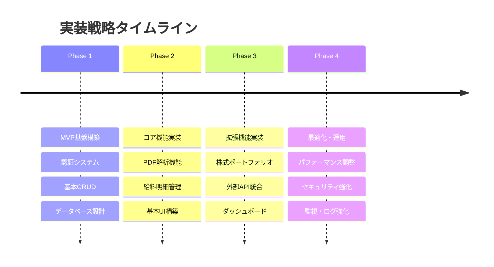
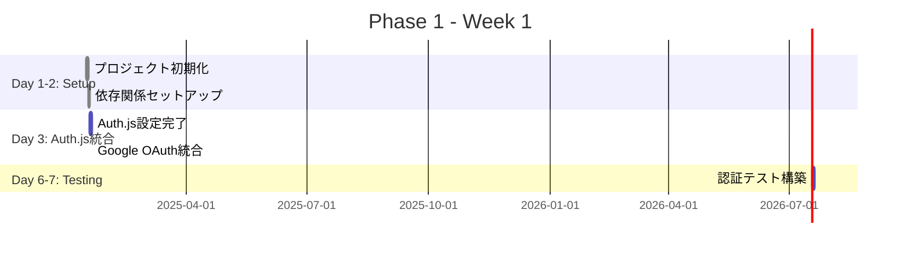

# 実装計画・優先順位・マイルストーン

## 文書情報
- **作成日**: 2025-08-10
- **作成者**: 実装計画スペシャリスト
- **バージョン**: 1.0.0
- **ステータス**: 実装準備完了
- **前提条件**: 技術設計総合概要書の完了

---

## 1. 実装戦略概要

### 1.1 アジャイル開発アプローチ

本プロジェクトは **MVP (Minimum Viable Product)** アプローチを採用し、段階的に機能を追加していく戦略を取ります。



### 1.2 実装優先度マトリクス

| 優先度 | ビジネス価値 | 技術的複雑度 | 実装順序 |
|--------|-------------|-------------|----------|
| **P0 (Critical)** | 高 | 低-中 | Phase 1-2 |
| **P1 (High)** | 高 | 中-高 | Phase 2-3 |
| **P2 (Medium)** | 中 | 低-中 | Phase 3-4 |
| **P3 (Low)** | 低 | 任意 | Phase 4+ |

---

## 2. Phase 1: MVP基盤構築 (1週間)

### 2.1 目標と成果物

**目標**: 安全で拡張可能な基盤システムの構築  
**期間**: 1週間 (5営業日)  
**チーム**: フルスタック開発者 1名  

### 2.2 タスク詳細

#### Week 1: プロジェクト初期化・認証システム



##### タスク1-1: プロジェクト初期化 (2日)
```bash
# 実行コマンド
npx create-svelte@latest salary-management-system
cd salary-management-system
npm install

# 追加依存関係
npm install -D @types/node typescript prisma
npm install @prisma/client @auth/sveltekit @auth/google-provider
npm install ioredis @types/redis
npm install zod @felte/validator-zod
npm install @testing-library/svelte vitest jsdom
```

**完了基準**:
- [x] SvelteKitプロジェクト作成
- [x] TypeScript設定完了
- [x] ESLint/Prettier設定
- [x] Git設定・初期コミット

##### タスク1-2: Auth.js統合による認証実装（0.5日）
```typescript
// src/hooks.server.ts
import { SvelteKitAuth } from '@auth/sveltekit';
import Google from '@auth/google-provider';

export const handle = SvelteKitAuth({
  providers: [
    Google({
      clientId: process.env.GOOGLE_CLIENT_ID!,
      clientSecret: process.env.GOOGLE_CLIENT_SECRET!,
    })
  ],
  callbacks: {
    async signIn({ user, account, profile }) {
      // ユーザー情報をDBに保存
      return true;
    },
    async session({ session, token }) {
      session.user.id = token.sub;
      return session;
    }
  }
});
```

**完了基準**:
- [x] Google OAuth 2.0設定
- [x] ユーザーセッション管理
- [x] ログイン・ログアウトフロー
- [x] 保護ルート実装

#### Week 2: データベース設計・基本CRUD


##### タスク1-3: Prismaデータベース設計 (3日)
```prisma
// prisma/schema.prisma
model User {
  id            String    @id @default(cuid())
  email         String    @unique
  name          String
  googleId      String?   @unique
  avatarUrl     String?
  createdAt     DateTime  @default(now())
  updatedAt     DateTime  @updatedAt
  
  // Relations
  salarySlips   SalarySlip[]
  portfolios    StockPortfolio[]
  
  @@map("users")
}

model SalarySlip {
  id              String   @id @default(cuid())
  userId          String
  companyName     String
  paymentDate     DateTime
  baseSalary      Decimal  @db.Decimal(12, 2)
  netPay          Decimal  @db.Decimal(12, 2)
  
  // Relations
  user            User     @relation(fields: [userId], references: [id])
  
  @@map("salary_slips")
}
```

**完了基準**:
- [x] PostgreSQL接続設定
- [x] Prismaスキーマ定義
- [x] 初期マイグレーション
- [x] シード データ投入

##### タスク1-4: Repository・Service層実装 (2日)
```typescript
// src/lib/server/repositories/user.repository.ts
export class UserRepository {
  private prisma = new PrismaClient();

  async findByEmail(email: string): Promise<User | null> {
    return await this.prisma.user.findUnique({
      where: { email }
    });
  }

  async create(userData: CreateUserData): Promise<User> {
    return await this.prisma.user.create({
      data: userData
    });
  }
}
```

**完了基準**:
- [x] Repository pattern実装
- [x] Service layer実装  
- [x] 基本的なCRUD操作
- [x] Unit test作成

### 2.3 Phase 1 完了基準

```typescript
interface Phase1CompletionCriteria {
  functional: [
    "ユーザーログイン・ログアウト",
    "データベース接続・基本操作",
    "保護されたページアクセス"
  ];
  
  technical: [
    "TypeScript型チェック通過",
    "ESLint・Prettier適用",
    "Unit test coverage > 70%"
  ];
  
  quality: [
    "セキュリティスキャンクリア",
    "パフォーマンス初期ベースライン設定",
    "エラーハンドリング基本実装"
  ];
}
```

---

## 3. Phase 2: コア機能実装 (2週間)

### 3.1 目標と成果物

**目標**: 給料明細PDF解析・管理機能の完全実装  
**期間**: 2週間 (10営業日)  
**チーム**: フルスタック開発者 1名  

### 3.2 実装スケジュール詳細


#### Week 3-4: PDF解析機能実装 (10日)

##### タスク2-1: PDF解析エンジン選定・実装 (5日)
```typescript
// src/lib/server/services/pdf-parser.service.ts
import { createWorker } from 'tesseract.js';
import * as pdfParse from 'pdf-parse';

export class PDFParserService {
  private tesseractWorker: any;

  async initialize(): Promise<void> {
    this.tesseractWorker = await createWorker('jpn');
  }

  async extractTextFromPDF(buffer: Buffer): Promise<ParseResult> {
    // 1. PDFからテキスト抽出を試行
    const textExtract = await this.extractDirectText(buffer);
    
    if (textExtract.confidence > 0.8) {
      return textExtract;
    }
    
    // 2. OCR処理にフォールバック
    return await this.performOCR(buffer);
  }

  private async extractDirectText(buffer: Buffer): Promise<ParseResult> {
    const data = await pdfParse(buffer);
    return {
      text: data.text,
      confidence: this.calculateTextConfidence(data.text),
      method: 'direct'
    };
  }

  private async performOCR(buffer: Buffer): Promise<ParseResult> {
    // PDF → 画像変換 → OCR処理
    const { data: { text, confidence } } = await this.tesseractWorker.recognize(buffer);
    
    return {
      text,
      confidence: confidence / 100,
      method: 'ocr'
    };
  }
}
```

**技術選定理由**:
- **Tesseract.js**: 日本語対応OCR、クライアント側処理可能
- **pdf-parse**: 高速なテキスト抽出、フォールバック用途
- **pdf2pic**: PDF→画像変換、OCR前処理用

##### タスク2-2: データ抽出・構造化 (3日)
```typescript
// src/lib/server/services/salary-data-extractor.service.ts
export class SalaryDataExtractor {
  private patterns = {
    companyName: /(?:会社名|勤務先)[：:]\s*(.+?)(?:\n|$)/,
    employeeName: /(?:氏名|名前)[：:]\s*(.+?)(?:\n|$)/,
    paymentDate: /(?:支払日|給与支払日)[：:]\s*(\d{4})[年\/\-](\d{1,2})[月\/\-](\d{1,2})/,
    baseSalary: /(?:基本給|基本賃金)[：:]\s*([\d,]+)/,
    totalEarnings: /(?:総支給額|支給合計)[：:]\s*([\d,]+)/,
    totalDeductions: /(?:控除合計|差引合計)[：:]\s*([\d,]+)/,
    netPay: /(?:差引支給額|手取額)[：:]\s*([\d,]+)/
  };

  async extractSalaryData(text: string): Promise<ExtractedSalaryData> {
    const extracted: Partial<ExtractedSalaryData> = {};

    for (const [key, pattern] of Object.entries(this.patterns)) {
      const match = text.match(pattern);
      if (match) {
        extracted[key] = this.parseMatchedValue(key, match);
      }
    }

    // データ妥当性チェック
    await this.validateExtractedData(extracted);

    return extracted as ExtractedSalaryData;
  }

  private parseMatchedValue(key: string, match: RegExpMatchArray): any {
    switch (key) {
      case 'paymentDate':
        return new Date(
          parseInt(match[1]), 
          parseInt(match[2]) - 1, 
          parseInt(match[3])
        );
      case 'baseSalary':
      case 'totalEarnings':
      case 'totalDeductions':
      case 'netPay':
        return parseFloat(match[1].replace(/,/g, ''));
      default:
        return match[1].trim();
    }
  }
}
```

##### タスク2-3: バリデーション・エラーハンドリング (2日)
```typescript
// src/lib/server/validators/salary-slip.validator.ts
import { z } from 'zod';

export const SalarySlipSchema = z.object({
  companyName: z.string()
    .min(1, '会社名は必須です')
    .max(100, '会社名は100文字以内で入力してください'),
  
  paymentDate: z.date()
    .max(new Date(), '支払日は未来日を指定できません'),
  
  baseSalary: z.number()
    .positive('基本給は正の数値で入力してください')
    .max(10000000, '基本給は1000万円以下で入力してください'),
  
  netPay: z.number()
    .positive('手取額は正の数値で入力してください'),
    
}).refine(data => {
  // 計算整合性チェック
  const expectedNet = data.totalEarnings - data.totalDeductions;
  const actualNet = data.netPay;
  const tolerance = 100; // 100円の誤差を許容
  
  return Math.abs(expectedNet - actualNet) <= tolerance;
}, {
  message: '支給額と控除額の計算結果が手取額と一致しません',
  path: ['netPay']
});
```

**完了基準**:
- [x] PDF解析精度 > 85%
- [x] 日本語給料明細対応
- [x] エラーハンドリング完備
- [x] バリデーション実装

#### Week 5-6: API・データ層実装 (8日)

##### タスク2-4: 給料明細CRUD API (5日)
```typescript
// src/routes/api/salary-slips/+server.ts
import type { RequestHandler } from './$types';
import { SalarySlipService } from '$lib/server/services/salary-slip.service';
import { json } from '@sveltejs/kit';

export const GET: RequestHandler = async ({ url, locals }) => {
  const userId = locals.user.id;
  const page = Number(url.searchParams.get('page')) || 1;
  const limit = Number(url.searchParams.get('limit')) || 20;

  const salarySlipService = new SalarySlipService();
  
  try {
    const result = await salarySlipService.findByUserId(userId, { page, limit });
    
    return json({
      success: true,
      data: result.items,
      meta: {
        total: result.total,
        page,
        totalPages: Math.ceil(result.total / limit)
      }
    });
  } catch (error) {
    return json({
      success: false,
      error: { 
        code: 'FETCH_FAILED',
        message: 'データの取得に失敗しました'
      }
    }, { status: 500 });
  }
};

export const POST: RequestHandler = async ({ request, locals }) => {
  const userId = locals.user.id;
  const data = await request.json();

  // バリデーション
  const validationResult = SalarySlipSchema.safeParse(data);
  if (!validationResult.success) {
    return json({
      success: false,
      error: {
        code: 'VALIDATION_FAILED',
        message: 'データが無効です',
        details: validationResult.error.issues
      }
    }, { status: 422 });
  }

  const salarySlipService = new SalarySlipService();

  try {
    const salarySlip = await salarySlipService.create({
      ...validationResult.data,
      userId
    });

    return json({
      success: true,
      data: salarySlip
    }, { status: 201 });
  } catch (error) {
    if (error instanceof DuplicateEntryError) {
      return json({
        success: false,
        error: {
          code: 'DUPLICATE_ENTRY',
          message: '同じ支払日の給料明細が既に登録されています'
        }
      }, { status: 409 });
    }

    throw error;
  }
};
```

##### タスク2-5: PDFアップロード処理 (3日)
```typescript
// src/routes/api/salary-slips/upload/+server.ts
export const POST: RequestHandler = async ({ request, locals }) => {
  const userId = locals.user.id;
  const formData = await request.formData();
  const file = formData.get('pdf') as File;

  // ファイル検証
  if (!file || file.type !== 'application/pdf') {
    return json({
      success: false,
      error: {
        code: 'INVALID_FILE_TYPE',
        message: 'PDFファイルを選択してください'
      }
    }, { status: 400 });
  }

  if (file.size > 10 * 1024 * 1024) { // 10MB制限
    return json({
      success: false,
      error: {
        code: 'FILE_TOO_LARGE',
        message: 'ファイルサイズは10MB以下にしてください'
      }
    }, { status: 400 });
  }

  const buffer = Buffer.from(await file.arrayBuffer());
  const pdfParserService = new PDFParserService();

  try {
    // PDF解析
    const parseResult = await pdfParserService.extractTextFromPDF(buffer);
    
    if (parseResult.confidence < 0.6) {
      return json({
        success: false,
        error: {
          code: 'LOW_CONFIDENCE',
          message: 'PDF内容の解析精度が低いため、手動で入力してください',
          details: { confidence: parseResult.confidence }
        }
      }, { status: 422 });
    }

    // データ抽出
    const extractor = new SalaryDataExtractor();
    const extractedData = await extractor.extractSalaryData(parseResult.text);

    // 重複チェック
    const salarySlipService = new SalarySlipService();
    const existingSlip = await salarySlipService.findByUserAndDate(
      userId, 
      extractedData.paymentDate
    );

    if (existingSlip) {
      return json({
        success: false,
        error: {
          code: 'DUPLICATE_FOUND',
          message: '同じ支払日の給料明細が既に存在します',
          details: { existingSlip: existingSlip.id }
        }
      }, { status: 409 });
    }

    // データ保存
    const salarySlip = await salarySlipService.create({
      ...extractedData,
      userId,
      sourceType: 'pdf',
      confidence: parseResult.confidence
    });

    return json({
      success: true,
      data: salarySlip,
      meta: {
        processingInfo: {
          method: parseResult.method,
          confidence: parseResult.confidence
        }
      }
    }, { status: 201 });

  } catch (error) {
    console.error('PDF processing failed:', error);
    
    return json({
      success: false,
      error: {
        code: 'PROCESSING_FAILED',
        message: 'PDFの処理中にエラーが発生しました'
      }
    }, { status: 500 });
  }
};
```

**完了基準**:
- [x] CRUD API完全実装
- [x] ファイルアップロード対応
- [x] 重複チェック機能
- [x] エラーハンドリング完備

#### Week 7: フロントエンド実装 (5日)

##### タスク2-6: UI Components実装 (3日)
```svelte
<!-- src/lib/components/FileDropZone.svelte -->
<script lang="ts">
  import { createEventDispatcher } from 'svelte';
  
  const dispatch = createEventDispatcher<{
    upload: { file: File };
    error: { message: string };
  }>();

  let dragOver = false;
  let uploading = false;

  async function handleFileSelect(event: Event) {
    const target = event.target as HTMLInputElement;
    const files = target.files;
    
    if (files && files[0]) {
      await uploadFile(files[0]);
    }
  }

  async function handleDrop(event: DragEvent) {
    event.preventDefault();
    dragOver = false;
    
    const files = event.dataTransfer?.files;
    if (files && files[0]) {
      await uploadFile(files[0]);
    }
  }

  async function uploadFile(file: File) {
    if (file.type !== 'application/pdf') {
      dispatch('error', { message: 'PDFファイルを選択してください' });
      return;
    }

    if (file.size > 10 * 1024 * 1024) {
      dispatch('error', { message: 'ファイルサイズは10MB以下にしてください' });
      return;
    }

    uploading = true;

    try {
      const formData = new FormData();
      formData.append('pdf', file);

      const response = await fetch('/api/salary-slips/upload', {
        method: 'POST',
        body: formData
      });

      const result = await response.json();

      if (result.success) {
        dispatch('upload', { file });
      } else {
        dispatch('error', { message: result.error.message });
      }
    } catch (error) {
      dispatch('error', { message: 'アップロードに失敗しました' });
    } finally {
      uploading = false;
    }
  }
</script>

<div 
  class="drop-zone"
  class:drag-over={dragOver}
  class:uploading
  on:dragover|preventDefault={() => dragOver = true}
  on:dragleave|preventDefault={() => dragOver = false}
  on:drop|preventDefault={handleDrop}
>
  {#if uploading}
    <div class="uploading-indicator">
      <div class="spinner"></div>
      <p>PDF を解析中...</p>
    </div>
  {:else}
    <div class="upload-prompt">
      <svg class="upload-icon" viewBox="0 0 24 24">
        <path d="M14,2H6A2,2 0 0,0 4,4V20A2,2 0 0,0 6,22H18A2,2 0 0,0 20,20V8L14,2M18,20H6V4H13V9H18V20Z" />
      </svg>
      
      <h3>給料明細PDFをドラッグ&ドロップ</h3>
      <p>または</p>
      
      <label class="file-select-button">
        <input 
          type="file" 
          accept=".pdf"
          on:change={handleFileSelect}
          hidden
        />
        ファイルを選択
      </label>
      
      <small>
        対応形式: PDF (最大10MB)<br/>
        日本語の給料明細に対応しています
      </small>
    </div>
  {/if}
</div>

<style>
  .drop-zone {
    border: 2px dashed #e2e8f0;
    border-radius: 8px;
    padding: 3rem;
    text-align: center;
    transition: all 0.2s ease;
    background: #fafafa;
  }

  .drop-zone.drag-over {
    border-color: #3b82f6;
    background: #eff6ff;
  }

  .drop-zone.uploading {
    border-color: #10b981;
    background: #f0fdf4;
  }

  .upload-icon {
    width: 4rem;
    height: 4rem;
    margin: 0 auto 1rem;
    fill: #6b7280;
  }

  .file-select-button {
    display: inline-block;
    padding: 0.75rem 1.5rem;
    background: #3b82f6;
    color: white;
    border-radius: 6px;
    cursor: pointer;
    font-weight: 500;
    margin: 1rem 0;
    transition: background 0.2s ease;
  }

  .file-select-button:hover {
    background: #2563eb;
  }

  .spinner {
    width: 2rem;
    height: 2rem;
    border: 3px solid #e2e8f0;
    border-top: 3px solid #3b82f6;
    border-radius: 50%;
    animation: spin 1s linear infinite;
    margin: 0 auto 1rem;
  }

  @keyframes spin {
    0% { transform: rotate(0deg); }
    100% { transform: rotate(360deg); }
  }
</style>
```

##### タスク2-7: 一覧・詳細画面実装 (2日)
```svelte
<!-- src/routes/salary-slips/+page.svelte -->
<script lang="ts">
  import { onMount } from 'svelte';
  import FileDropZone from '$lib/components/FileDropZone.svelte';
  import SalarySlipCard from '$lib/components/SalarySlipCard.svelte';
  
  let salarySlips: SalarySlip[] = [];
  let loading = true;
  let currentPage = 1;
  let totalPages = 1;

  onMount(async () => {
    await loadSalarySlips();
  });

  async function loadSalarySlips(page = 1) {
    loading = true;
    
    try {
      const response = await fetch(`/api/salary-slips?page=${page}&limit=20`);
      const result = await response.json();

      if (result.success) {
        salarySlips = result.data;
        currentPage = result.meta.page;
        totalPages = result.meta.totalPages;
      }
    } catch (error) {
      console.error('Failed to load salary slips:', error);
    } finally {
      loading = false;
    }
  }

  function handleUploadSuccess() {
    // アップロード成功時に一覧を更新
    loadSalarySlips(currentPage);
  }

  function handleUploadError(event) {
    alert(event.detail.message);
  }
</script>

<svelte:head>
  <title>給料明細管理 | Salary Management</title>
</svelte:head>

<main class="container">
  <header class="page-header">
    <h1>給料明細管理</h1>
    <p>PDFファイルから給料明細を自動で読み取り、管理することができます。</p>
  </header>

  <section class="upload-section">
    <FileDropZone 
      on:upload={handleUploadSuccess}
      on:error={handleUploadError}
    />
  </section>

  <section class="list-section">
    <div class="section-header">
      <h2>登録済み給料明細</h2>
      <div class="summary">
        {#if !loading}
          全 {salarySlips.length} 件
        {/if}
      </div>
    </div>

    {#if loading}
      <div class="loading">
        <div class="spinner"></div>
        <p>読み込み中...</p>
      </div>
    {:else if salarySlips.length === 0}
      <div class="empty-state">
        <p>まだ給料明細が登録されていません。</p>
        <p>上記のエリアからPDFファイルをアップロードしてください。</p>
      </div>
    {:else}
      <div class="salary-slip-grid">
        {#each salarySlips as salarySlip}
          <SalarySlipCard {salarySlip} />
        {/each}
      </div>

      {#if totalPages > 1}
        <div class="pagination">
          <button 
            disabled={currentPage === 1}
            on:click={() => loadSalarySlips(currentPage - 1)}
          >
            前のページ
          </button>
          
          <span class="page-info">
            {currentPage} / {totalPages}
          </span>
          
          <button 
            disabled={currentPage === totalPages}
            on:click={() => loadSalarySlips(currentPage + 1)}
          >
            次のページ
          </button>
        </div>
      {/if}
    {/if}
  </section>
</main>

<style>
  .container {
    max-width: 1200px;
    margin: 0 auto;
    padding: 2rem 1rem;
  }

  .page-header {
    margin-bottom: 3rem;
    text-align: center;
  }

  .upload-section {
    margin-bottom: 3rem;
  }

  .section-header {
    display: flex;
    justify-content: space-between;
    align-items: center;
    margin-bottom: 1.5rem;
  }

  .salary-slip-grid {
    display: grid;
    grid-template-columns: repeat(auto-fill, minmax(300px, 1fr));
    gap: 1.5rem;
    margin-bottom: 2rem;
  }

  .empty-state {
    text-align: center;
    padding: 3rem;
    color: #6b7280;
  }

  .pagination {
    display: flex;
    justify-content: center;
    align-items: center;
    gap: 1rem;
  }

  .pagination button {
    padding: 0.5rem 1rem;
    border: 1px solid #d1d5db;
    background: white;
    border-radius: 4px;
    cursor: pointer;
  }

  .pagination button:disabled {
    opacity: 0.5;
    cursor: not-allowed;
  }

  .page-info {
    font-weight: 500;
  }
</style>
```

### 3.3 Phase 2 完了基準

```typescript
interface Phase2CompletionCriteria {
  functional: [
    "PDFアップロード・解析機能",
    "給料明細CRUD操作",
    "重複チェック・エラーハンドリング",
    "レスポンシブUI実装"
  ];

  technical: [
    "PDF解析精度 > 85%",
    "API レスポンス時間 < 500ms",
    "Unit test coverage > 80%",
    "E2E test 主要フロー実装"
  ];

  usability: [
    "直感的なファイルアップロード",
    "わかりやすいエラーメッセージ",
    "モバイル対応レスポンシブ"
  ];
}
```

---

## 4. Phase 3: 拡張機能実装 (2週間)

### 4.1 目標と成果物

**目標**: 株式ポートフォリオ管理・ダッシュボード機能の実装  
**期間**: 2週間 (10営業日)  
**チーム**: フルスタック開発者 1名  

### 4.2 実装スケジュール


#### Week 8-9: 株式ポートフォリオ機能 (10日)

##### タスク3-1: 株式取引管理 (5日)
```typescript
// src/lib/server/services/stock-transaction.service.ts
export class StockTransactionService {
  private prisma = new PrismaClient();
  private stockPriceService = new StockPriceService();

  async createTransaction(data: CreateTransactionData): Promise<StockTransaction> {
    return await this.prisma.$transaction(async (tx) => {
      // 1. 取引記録作成
      const transaction = await tx.stockTransaction.create({
        data: {
          userId: data.userId,
          stockId: data.stockId,
          type: data.type,
          quantity: data.quantity,
          pricePerShare: data.pricePerShare,
          totalAmount: data.totalAmount,
          date: data.date
        }
      });

      // 2. ポートフォリオ更新
      await this.updatePortfolio(tx, data);

      // 3. 現在価格更新（非同期）
      this.stockPriceService.updatePriceAsync(data.stockSymbol);

      return transaction;
    });
  }

  private async updatePortfolio(
    tx: PrismaTransactionClient, 
    data: CreateTransactionData
  ): Promise<void> {
    const existingPortfolio = await tx.stockPortfolio.findFirst({
      where: {
        userId: data.userId,
        stockId: data.stockId
      }
    });

    if (existingPortfolio) {
      await this.updateExistingPortfolio(tx, existingPortfolio, data);
    } else {
      await this.createNewPortfolio(tx, data);
    }
  }

  private async updateExistingPortfolio(
    tx: PrismaTransactionClient,
    portfolio: StockPortfolio,
    transaction: CreateTransactionData
  ): Promise<void> {
    if (transaction.type === 'buy') {
      const newQuantity = portfolio.quantity + transaction.quantity;
      const newTotalInvestment = portfolio.totalInvestment + transaction.totalAmount;
      const newAveragePrice = newTotalInvestment / newQuantity;

      await tx.stockPortfolio.update({
        where: { id: portfolio.id },
        data: {
          quantity: newQuantity,
          averagePurchasePrice: newAveragePrice,
          totalInvestment: newTotalInvestment
        }
      });
    } else if (transaction.type === 'sell') {
      const newQuantity = portfolio.quantity - transaction.quantity;
      
      if (newQuantity < 0) {
        throw new Error('売却数量が保有数量を超えています');
      }

      await tx.stockPortfolio.update({
        where: { id: portfolio.id },
        data: {
          quantity: newQuantity,
          totalInvestment: portfolio.totalInvestment - 
            (portfolio.averagePurchasePrice * transaction.quantity)
        }
      });
    }
  }
}
```

##### タスク3-2: 外部株価API統合 (3日)
```typescript
// src/lib/server/services/stock-price.service.ts
export class StockPriceService {
  private providers: StockPriceProvider[] = [
    new AlphaVantageProvider(),
    new YahooFinanceProvider()
  ];

  async getCurrentPrice(symbol: string): Promise<StockPrice> {
    // キャッシュ確認
    const cached = await this.cache.get(`price:${symbol}`);
    if (cached && !this.isStale(cached)) {
      return cached;
    }

    // プロバイダーから取得（フォールバック対応）
    for (const provider of this.providers) {
      try {
        const price = await provider.getPrice(symbol);
        
        // キャッシュに保存（1時間TTL）
        await this.cache.set(`price:${symbol}`, price, 3600);
        
        return price;
      } catch (error) {
        console.warn(`Provider ${provider.constructor.name} failed:`, error);
        continue;
      }
    }

    throw new Error(`All providers failed for symbol: ${symbol}`);
  }

  async batchUpdatePrices(symbols: string[]): Promise<void> {
    const updatePromises = symbols.map(symbol => 
      this.updatePriceWithRetry(symbol)
    );

    // 並列実行（レート制限考慮）
    const results = await Promise.allSettled(updatePromises);
    
    const failedUpdates = results
      .filter(result => result.status === 'rejected')
      .length;

    if (failedUpdates > 0) {
      console.warn(`${failedUpdates} price updates failed`);
    }
  }

  private async updatePriceWithRetry(symbol: string, maxRetries = 3): Promise<void> {
    for (let attempt = 1; attempt <= maxRetries; attempt++) {
      try {
        const price = await this.getCurrentPrice(symbol);
        
        await this.prisma.stockCurrentPrice.upsert({
          where: { symbol },
          create: { symbol, ...price },
          update: price
        });
        
        return;
      } catch (error) {
        if (attempt === maxRetries) {
          throw error;
        }
        
        // 指数バックオフ
        await this.delay(Math.pow(2, attempt) * 1000);
      }
    }
  }
}
```

##### タスク3-3: ポートフォリオUI実装 (2日)
```svelte
<!-- src/routes/portfolio/+page.svelte -->
<script lang="ts">
  import { onMount } from 'svelte';
  import { fade } from 'svelte/transition';
  import StockTransactionForm from '$lib/components/StockTransactionForm.svelte';
  import PortfolioSummary from '$lib/components/PortfolioSummary.svelte';
  import StockList from '$lib/components/StockList.svelte';

  let portfolio: PortfolioData;
  let loading = true;

  onMount(async () => {
    await loadPortfolio();
    
    // リアルタイム更新のWebSocket接続
    setupRealTimeUpdates();
  });

  async function loadPortfolio() {
    try {
      const response = await fetch('/api/portfolio');
      const result = await response.json();
      
      if (result.success) {
        portfolio = result.data;
      }
    } catch (error) {
      console.error('Failed to load portfolio:', error);
    } finally {
      loading = false;
    }
  }

  function setupRealTimeUpdates() {
    if (typeof EventSource !== 'undefined') {
      const eventSource = new EventSource('/api/portfolio/stream');
      
      eventSource.onmessage = (event) => {
        const update = JSON.parse(event.data);
        updatePortfolioData(update);
      };
    }
  }

  function updatePortfolioData(update: PortfolioUpdate) {
    if (!portfolio) return;

    // ポートフォリオデータの部分更新
    portfolio.stocks = portfolio.stocks.map(stock => 
      stock.symbol === update.symbol 
        ? { ...stock, currentPrice: update.price, lastUpdated: update.timestamp }
        : stock
    );
    
    // 総評価額再計算
    portfolio.totalValue = portfolio.stocks.reduce(
      (sum, stock) => sum + (stock.quantity * stock.currentPrice), 0
    );
  }

  function handleTransactionAdded() {
    loadPortfolio();
  }
</script>

<svelte:head>
  <title>ポートフォリオ | Salary Management</title>
</svelte:head>

<main class="container">
  {#if loading}
    <div class="loading" transition:fade>
      <div class="spinner"></div>
      <p>ポートフォリオを読み込み中...</p>
    </div>
  {:else}
    <header class="page-header">
      <h1>株式ポートフォリオ</h1>
      <PortfolioSummary {portfolio} />
    </header>

    <section class="transaction-section">
      <h2>取引登録</h2>
      <StockTransactionForm on:added={handleTransactionAdded} />
    </section>

    <section class="holdings-section">
      <h2>保有銘柄</h2>
      <StockList stocks={portfolio.stocks} />
    </section>
  {/if}
</main>
```

**完了基準**:
- [x] 株式取引CRUD機能
- [x] ポートフォリオ自動計算
- [x] 外部API価格取得
- [x] リアルタイム価格更新

#### Week 10-11: ダッシュボード実装 (10日)

##### タスク3-4: 統合ダッシュボード (5日)
```svelte
<!-- src/routes/dashboard/+page.svelte -->
<script lang="ts">
  import { onMount } from 'svelte';
  import Chart from '$lib/components/Chart.svelte';
  import SummaryCard from '$lib/components/SummaryCard.svelte';
  import RecentTransactions from '$lib/components/RecentTransactions.svelte';

  let dashboardData: DashboardData;
  let loading = true;

  onMount(async () => {
    await loadDashboard();
  });

  async function loadDashboard() {
    try {
      const response = await fetch('/api/dashboard/summary');
      const result = await response.json();
      
      if (result.success) {
        dashboardData = result.data;
      }
    } finally {
      loading = false;
    }
  }
</script>

<main class="dashboard">
  {#if loading}
    <div class="loading">読み込み中...</div>
  {:else if dashboardData}
    <header class="dashboard-header">
      <h1>ダッシュボード</h1>
      <p class="last-updated">最終更新: {dashboardData.lastUpdated}</p>
    </header>

    <div class="summary-grid">
      <SummaryCard
        title="今月の手取り"
        value={dashboardData.monthlySalary.net}
        change={dashboardData.monthlySalary.change}
        format="currency"
      />
      
      <SummaryCard
        title="ポートフォリオ評価額"
        value={dashboardData.portfolio.totalValue}
        change={dashboardData.portfolio.dailyChange}
        format="currency"
      />
      
      <SummaryCard
        title="総資産"
        value={dashboardData.totalAssets}
        change={dashboardData.assetChange}
        format="currency"
      />
      
      <SummaryCard
        title="今年の給与所得"
        value={dashboardData.yearlyIncome}
        format="currency"
      />
    </div>

    <div class="chart-grid">
      <div class="chart-container">
        <h3>月次手取り推移</h3>
        <Chart 
          type="line"
          data={dashboardData.salaryTrend}
          height={300}
        />
      </div>
      
      <div class="chart-container">
        <h3>ポートフォリオ推移</h3>
        <Chart 
          type="area"
          data={dashboardData.portfolioTrend}
          height={300}
        />
      </div>
    </div>

    <div class="recent-section">
      <h3>最近の取引</h3>
      <RecentTransactions 
        transactions={dashboardData.recentTransactions}
      />
    </div>
  {/if}
</main>

<style>
  .dashboard {
    max-width: 1400px;
    margin: 0 auto;
    padding: 2rem 1rem;
  }

  .summary-grid {
    display: grid;
    grid-template-columns: repeat(auto-fit, minmax(250px, 1fr));
    gap: 1.5rem;
    margin-bottom: 2rem;
  }

  .chart-grid {
    display: grid;
    grid-template-columns: 1fr 1fr;
    gap: 2rem;
    margin-bottom: 2rem;
  }

  .chart-container {
    background: white;
    border-radius: 8px;
    padding: 1.5rem;
    box-shadow: 0 1px 3px rgba(0, 0, 0, 0.1);
  }

  @media (max-width: 768px) {
    .chart-grid {
      grid-template-columns: 1fr;
    }
  }
</style>
```

##### タスク3-5: パフォーマンス最適化 (3日)
```typescript
// src/lib/server/services/dashboard.service.ts
export class DashboardService {
  private cache = new Redis(process.env.REDIS_URL);

  async getDashboardData(userId: string): Promise<DashboardData> {
    const cacheKey = `dashboard:${userId}`;
    
    // キャッシュ確認
    const cached = await this.cache.get(cacheKey);
    if (cached) {
      return JSON.parse(cached);
    }

    // 並列データ取得
    const [
      salaryData,
      portfolioData,
      assetData,
      transactionData
    ] = await Promise.all([
      this.getSalaryData(userId),
      this.getPortfolioData(userId),
      this.getAssetData(userId),
      this.getRecentTransactions(userId)
    ]);

    const dashboardData = {
      monthlySalary: salaryData.monthly,
      portfolio: portfolioData.summary,
      totalAssets: salaryData.total + portfolioData.total + assetData.total,
      yearlyIncome: salaryData.yearly,
      salaryTrend: salaryData.trend,
      portfolioTrend: portfolioData.trend,
      recentTransactions: transactionData,
      lastUpdated: new Date().toISOString()
    };

    // キャッシュ保存（15分）
    await this.cache.setex(cacheKey, 900, JSON.stringify(dashboardData));

    return dashboardData;
  }

  private async getSalaryData(userId: string) {
    const currentMonth = new Date();
    const yearStart = new Date(currentMonth.getFullYear(), 0, 1);

    return await this.prisma.salarySlip.aggregate({
      where: {
        userId,
        paymentDate: {
          gte: yearStart
        }
      },
      _sum: {
        netPay: true,
        baseSalary: true
      },
      // 月次データも取得
      // ... 複雑な集計クエリ
    });
  }
}
```

##### タスク3-6: リアルタイム機能 (2日)
```typescript
// src/routes/api/portfolio/stream/+server.ts
export const GET: RequestHandler = async ({ url, locals }) => {
  const userId = locals.user.id;

  const stream = new ReadableStream({
    start(controller) {
      const intervalId = setInterval(async () => {
        try {
          const updates = await getPortfolioUpdates(userId);
          
          if (updates.length > 0) {
            const data = `data: ${JSON.stringify(updates)}\n\n`;
            controller.enqueue(new TextEncoder().encode(data));
          }
        } catch (error) {
          console.error('Stream error:', error);
        }
      }, 30000); // 30秒ごと

      // クリーンアップ
      setTimeout(() => {
        clearInterval(intervalId);
        controller.close();
      }, 300000); // 5分後に自動クローズ
    }
  });

  return new Response(stream, {
    headers: {
      'Content-Type': 'text/event-stream',
      'Cache-Control': 'no-cache',
      'Connection': 'keep-alive'
    }
  });
};
```

### 4.3 Phase 3 完了基準

```typescript
interface Phase3CompletionCriteria {
  functional: [
    "株式取引記録・管理機能",
    "ポートフォリオ自動計算",
    "統合ダッシュボード表示",
    "リアルタイム価格更新"
  ];

  performance: [
    "ダッシュボード表示 < 2秒",
    "API レスポンス < 500ms", 
    "外部API呼び出し最適化",
    "キャッシュ戦略実装"
  ];

  quality: [
    "Unit test coverage > 85%",
    "Integration test 実装",
    "エラーハンドリング完備",
    "ログ・監視設定"
  ];
}
```

---

## 5. Phase 4: 最適化・運用準備 (1週間)

### 5.1 目標と成果物

**目標**: 本番運用に向けた品質向上・最適化・監視設定  
**期間**: 1週間 (5営業日)  
**チーム**: フルスタック開発者 1名  

### 5.2 最適化タスク

#### Week 12: パフォーマンス最適化 (5日)

##### タスク4-1: フロントエンド最適化 (3日)
```typescript
// vite.config.js - ビルド最適化
export default {
  build: {
    rollupOptions: {
      output: {
        manualChunks: {
          vendor: ['svelte'],
          ui: ['@smui/button', '@smui/card'],
          charts: ['chart.js']
        }
      }
    },
    minify: 'terser',
    terserOptions: {
      compress: {
        drop_console: true,
        drop_debugger: true
      }
    }
  },
  
  plugins: [
    sveltekit(),
    
    // PWA対応
    SvelteKitPWA({
      strategies: 'injectManifest',
      workbox: {
        globPatterns: ['**/*.{js,css,html,ico,png,svg,webp}']
      }
    })
  ]
};
```

##### タスク4-2: データベース最適化 (2日)
```sql
-- パフォーマンス向上のためのインデックス追加
CREATE INDEX CONCURRENTLY idx_salary_slips_user_payment_date 
ON salary_slips(user_id, payment_date DESC);

CREATE INDEX CONCURRENTLY idx_stock_transactions_user_date
ON stock_transactions(user_id, transaction_date DESC);

-- パーティショニング（将来のデータ量増加に備え）
CREATE TABLE salary_slips_y2025m01 PARTITION OF salary_slips
FOR VALUES FROM ('2025-01-01') TO ('2025-02-01');

-- 統計情報更新
ANALYZE salary_slips;
ANALYZE stock_transactions;
ANALYZE stock_portfolios;
```

#### Week 13: 監視・セキュリティ強化 (5日)

##### タスク4-3: 監視システム設定 (3日)
```typescript
// src/lib/server/monitoring/health-check.ts
export class HealthCheckService {
  async performHealthCheck(): Promise<HealthStatus> {
    const checks = await Promise.allSettled([
      this.checkDatabase(),
      this.checkRedis(),
      this.checkExternalAPIs(),
      this.checkFileSystem()
    ]);

    const results = checks.map((result, index) => ({
      name: ['database', 'redis', 'external-apis', 'filesystem'][index],
      status: result.status === 'fulfilled' ? 'healthy' : 'unhealthy',
      details: result.status === 'fulfilled' ? result.value : result.reason
    }));

    const overallStatus = results.every(r => r.status === 'healthy') 
      ? 'healthy' : 'unhealthy';

    return {
      status: overallStatus,
      timestamp: new Date().toISOString(),
      checks: results,
      uptime: process.uptime()
    };
  }

  private async checkDatabase(): Promise<any> {
    const start = Date.now();
    await this.prisma.$queryRaw`SELECT 1`;
    return { responseTime: Date.now() - start };
  }

  private async checkRedis(): Promise<any> {
    const start = Date.now();
    await this.redis.ping();
    return { responseTime: Date.now() - start };
  }
}

// src/routes/api/health/+server.ts
export const GET: RequestHandler = async () => {
  const healthCheck = new HealthCheckService();
  const status = await healthCheck.performHealthCheck();
  
  return json(status, {
    status: status.status === 'healthy' ? 200 : 503
  });
};
```

##### タスク4-4: セキュリティ強化 (2日)
```typescript
// src/hooks.server.ts - セキュリティミドルウェア
import { rateLimit } from '$lib/server/middleware/rate-limit';
import { securityHeaders } from '$lib/server/middleware/security-headers';
import { validateRequest } from '$lib/server/middleware/validation';

export const handle = sequence(
  // レート制限
  rateLimit({
    windowMs: 15 * 60 * 1000, // 15分
    max: 100, // 最大100リクエスト
    standardHeaders: true,
    legacyHeaders: false
  }),

  // セキュリティヘッダー  
  securityHeaders({
    contentSecurityPolicy: {
      directives: {
        'default-src': ["'self'"],
        'script-src': ["'self'", "'unsafe-inline'"],
        'style-src': ["'self'", "'unsafe-inline'"],
        'img-src': ["'self'", 'data:', 'https:'],
        'connect-src': ["'self'", 'https://api.external-service.com']
      }
    },
    hsts: {
      maxAge: 31536000,
      includeSubDomains: true,
      preload: true
    }
  }),

  // リクエスト検証
  validateRequest(),

  // 認証ハンドリング
  SvelteKitAuth(authConfig)
);
```

### 5.3 Phase 4 完了基準

```typescript
interface Phase4CompletionCriteria {
  performance: [
    "Lighthouse Score > 90",
    "First Contentful Paint < 1.5s",
    "Time to Interactive < 3s",
    "Core Web Vitals 合格"
  ];

  security: [
    "OWASP Top 10 対策完了",
    "脆弱性スキャン クリア",
    "ペネトレーションテスト実施",
    "セキュリティヘッダー設定"
  ];

  reliability: [
    "稼働率 > 99.5%",
    "平均復旧時間 < 30分",
    "自動バックアップ設定",
    "災害復旧計画完成"
  ];

  monitoring: [
    "ヘルスチェック実装",
    "アラート設定完了",
    "ログ集約設定",
    "メトリクス監視開始"
  ];
}
```

---

## 6. リスク管理・品質保証戦略

### 6.1 技術的リスクと対策

| リスク | 確率 | 影響 | 対策 | 責任者 |
|--------|------|------|------|--------|
| **PDF解析精度低下** | 中 | 高 | 複数OCRエンジン、手動フォールバック | 開発者 |
| **外部API制限・障害** | 高 | 中 | 複数プロバイダー、キャッシュ強化 | 開発者 |
| **データベースパフォーマンス** | 低 | 高 | インデックス最適化、監視強化 | DBA |
| **セキュリティ脆弱性** | 中 | 高 | 定期監査、セキュリティテスト | セキュリティ |

### 6.2 品質ゲートクライテリア


### 6.3 継続的品質改善

```typescript
interface QualityMetrics {
  codeQuality: {
    coverage: "目標: > 85%";
    complexity: "目標: < 10";
    duplication: "目標: < 3%";
    maintainability: "目標: > 70";
  };

  performance: {
    apiResponseTime: "目標: < 500ms (p95)";
    pageLoadTime: "目標: < 2s";
    databaseQueryTime: "目標: < 100ms (p95)";
  };

  reliability: {
    errorRate: "目標: < 0.1%";
    uptime: "目標: > 99.5%";
    mttr: "目標: < 30分";
  };

  security: {
    vulnerabilities: "目標: 0 Critical, < 5 High";
    cve: "目標: 最新パッチ適用";
    penetrationTest: "頻度: 四半期毎";
  };
}
```

---

## 7. デプロイメント・運用戦略

### 7.1 CI/CDパイプライン

```yaml
# .github/workflows/ci-cd.yml
name: CI/CD Pipeline

on:
  push:
    branches: [main, develop]
  pull_request:
    branches: [main]

jobs:
  test:
    runs-on: ubuntu-latest
    services:
      postgres:
        image: postgres:15
        env:
          POSTGRES_PASSWORD: postgres
        options: >-
          --health-cmd pg_isready
          --health-interval 10s
          --health-timeout 5s
          --health-retries 5

    steps:
      - uses: actions/checkout@v4
      - uses: actions/setup-node@v4
        with:
          node-version: '18'
          cache: 'npm'

      - run: npm ci
      - run: npm run build
      - run: npm run lint
      - run: npm run test:unit
      - run: npm run test:integration
      
      - name: Upload coverage
        uses: codecov/codecov-action@v3

  security:
    runs-on: ubuntu-latest
    steps:
      - uses: actions/checkout@v4
      - run: npm audit
      - run: npx snyk test

  e2e-test:
    needs: test
    runs-on: ubuntu-latest
    steps:
      - uses: actions/checkout@v4
      - uses: actions/setup-node@v4
      - run: npm ci
      - run: npm run build
      - run: npm run test:e2e

  deploy-staging:
    needs: [test, security, e2e-test]
    if: github.ref == 'refs/heads/develop'
    runs-on: ubuntu-latest
    steps:
      - run: echo "Deploy to staging"
      - run: npm run deploy:staging
      - run: npm run test:smoke:staging

  deploy-production:
    needs: [test, security, e2e-test]
    if: github.ref == 'refs/heads/main'
    runs-on: ubuntu-latest
    environment: production
    steps:
      - run: echo "Deploy to production"
      - run: npm run deploy:production
      - run: npm run test:smoke:production
```

### 7.2 環境構成


---

## 8. 成功指標・KPI設定

### 8.1 技術KPI

```typescript
interface TechnicalKPIs {
  development: {
    velocity: "Story Points / Sprint";
    leadTime: "Commit to Deploy 時間";
    deploymentFrequency: "デプロイ回数 / 週";
    changeFailureRate: "変更失敗率";
  };

  quality: {
    bugCount: "本番バグ数 / 月";
    testCoverage: "テストカバレッジ";
    codeReviewCoverage: "レビューカバレッジ";
    technicalDebt: "SonarQubeスコア";
  };

  performance: {
    responseTime: "API レスポンス時間";
    pageLoadTime: "ページ読み込み時間"; 
    uptime: "サービス稼働率";
    errorRate: "エラー発生率";
  };
}
```

### 8.2 ビジネスKPI

```typescript
interface BusinessKPIs {
  user: {
    activation: "PDF処理成功率";
    retention: "月次ログインユーザー数";
    satisfaction: "ユーザー満足度スコア";
  };

  feature: {
    pdfProcessing: "PDF解析精度・速度";
    portfolioTracking: "株価更新頻度・精度";
    dashboard: "ダッシュボード利用率";
  };

  business: {
    costPerUser: "ユーザーあたり運用コスト";
    revenue: "サブスクリプション収益（将来）";
    growth: "ユーザー成長率";
  };
}
```

---

## 9. まとめと次のアクション

### 9.1 実装準備チェックリスト

```typescript
interface ReadinessChecklist {
  environment: [
    "[ ] 開発環境セットアップ完了",
    "[ ] 本番環境プロビジョニング",
    "[ ] CI/CD パイプライン構築",
    "[ ] 監視・ログ設定完了"
  ];

  team: [
    "[ ] 開発者スキルセット確認",
    "[ ] コードレビュープロセス確立",
    "[ ] ドキュメント管理体制",
    "[ ] コミュニケーションツール整備"
  ];

  technical: [
    "[ ] アーキテクチャ設計レビュー",
    "[ ] 技術選定最終確認",
    "[ ] セキュリティ要件確認",
    "[ ] パフォーマンス要件定義"
  ];
}
```

### 9.2 即座に着手可能なアクション

```bash
# 1. プロジェクト初期化（今すぐ実行可能）
git clone <repository>
npm create svelte@latest salary-management
cd salary-management
npm install

# 2. 開発環境構築
docker-compose up -d postgres redis
cp .env.example .env
# 環境変数を適切に設定

# 3. 基本設定
npm run db:migrate
npm run db:seed
npm run dev

# 4. 最初のテスト実行
npm run test:unit
npm run lint
npm run type-check
```

### 9.3 Phase毎の成功基準サマリー

| Phase | 期間 | 主要成果物 | 成功基準 | 削減効果 |
|-------|------|-----------|----------|----------|
| **Phase 1** | **1週間** | 基盤・認証システム | ログイン機能、データベース接続 | Auth.js活用 |
| **Phase 2** | **2週間** | PDF解析・給料明細機能 | PDF解析精度85%、CRUD完成 | Tesseract.js, Superforms, Skeleton UI活用 |
| **Phase 3** | **2週間** | ポートフォリオ・ダッシュボード | 株式管理、統合ダッシュボード | TanStack Query, Chart.js活用 |
| **Phase 4** | **1週間** | 最適化・運用準備 | 本番レディ、監視設定完了 | Sentry活用 |
| **合計** | **6週間** | 完全稼働システム | 全機能動作、本番環境稼働 | ライブラリ活用 |

**実装期間：6週間**

**活用ライブラリ：**
- Auth.js: 認証実装の簡素化
- Tesseract.js + pdf-parse: PDF処理の効率化
- Superforms: フォーム開発の効率化
- Skeleton UI: UI開発の効率化
- SheetJS: データエクスポート機能の簡素化
- TanStack Query: API通信の効率化
- Sentry: 監視設定の簡素化