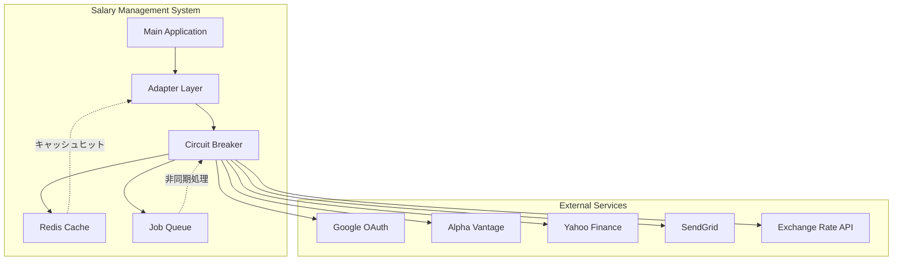
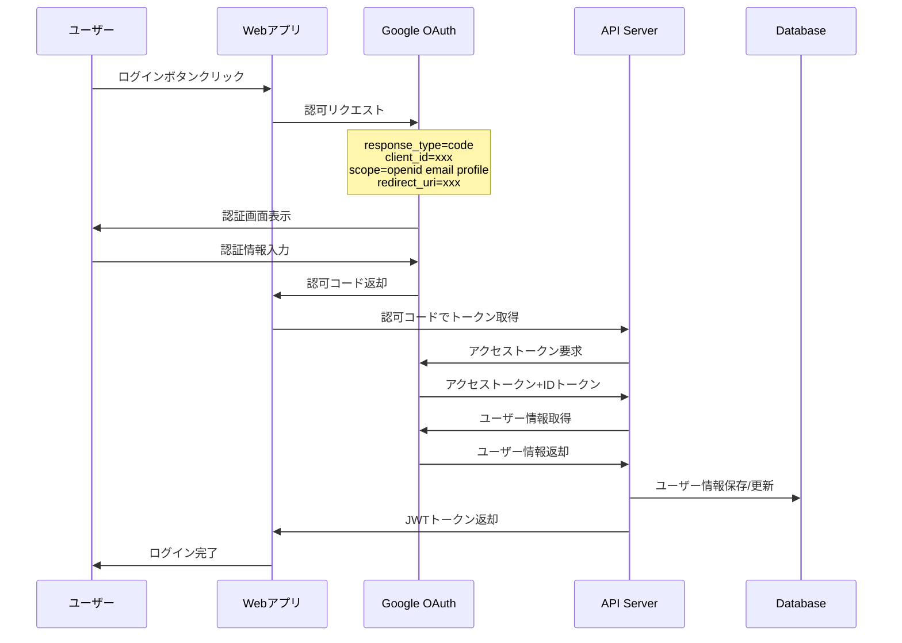

# 外部システム連携詳細仕様書

## 文書情報

- **作成日**: 2025-08-10
- **作成者**: インターフェース設計アーキテクト
- **バージョン**: 1.0.0
- **ステータス**: 詳細設計フェーズ
- **統合パターン**: アダプターパターン + サーキットブレーカー

---

## 1. 外部連携システム概要

### 1.1 連携システム一覧

| システム名             | 用途                         | プロバイダー   | 連携方式         | 重要度      |
| ---------------------- | ---------------------------- | -------------- | ---------------- | ----------- |
| **Google OAuth**       | ユーザー認証                 | Google         | OAuth 2.0 / OIDC | 🔴 Critical |
| **Alpha Vantage API**  | 株価データ取得               | Alpha Vantage  | REST API         | 🟡 High     |
| **Yahoo Finance API**  | 株価データ（フォールバック） | Yahoo          | REST API         | 🟢 Medium   |
| **PDF Parser Service** | PDF解析（OCR）               | 内部/Tesseract | 同期処理         | 🟡 High     |
| **Exchange Rate API**  | 為替レート                   | fixer.io       | REST API         | 🟢 Medium   |
| **Email Service**      | 通知メール                   | SendGrid       | REST API         | 🟢 Medium   |

### 1.2 連携アーキテクチャ



---

## 2. Google OAuth連携詳細

### 2.1 OAuth 2.0 フロー仕様

#### 認可コードフロー



#### パラメータ詳細

**認可リクエスト**

```typescript
interface AuthorizationRequest {
	response_type: 'code';
	client_id: string;
	redirect_uri: string;
	scope: 'openid email profile';
	state: string; // CSRF対策用ランダム文字列
	nonce: string; // リプレイ攻撃対策
	access_type: 'offline'; // リフレッシュトークン取得用
	prompt?: 'consent'; // 同意画面強制表示
}

// 実装例
const authUrl = new URL('https://accounts.google.com/o/oauth2/v2/auth');
authUrl.searchParams.append('response_type', 'code');
authUrl.searchParams.append('client_id', process.env.GOOGLE_CLIENT_ID!);
authUrl.searchParams.append('redirect_uri', `${process.env.PUBLIC_APP_URL}/auth/callback`);
authUrl.searchParams.append('scope', 'openid email profile');
authUrl.searchParams.append('state', generateSecureState());
authUrl.searchParams.append('nonce', generateNonce());
authUrl.searchParams.append('access_type', 'offline');
```

**トークン交換リクエスト**

```typescript
interface TokenExchangeRequest {
	grant_type: 'authorization_code';
	code: string;
	client_id: string;
	client_secret: string;
	redirect_uri: string;
}

interface TokenResponse {
	access_token: string;
	id_token: string; // JWT形式
	refresh_token: string; // 初回のみ
	expires_in: number; // 秒単位
	token_type: 'Bearer';
	scope: string;
}

// 実装例
export const exchangeCodeForTokens = async (
	code: string,
	state: string
): Promise<TokenResponse> => {
	// CSRF検証
	if (!verifyState(state)) {
		throw new Error('Invalid state parameter');
	}

	const tokenUrl = 'https://oauth2.googleapis.com/token';
	const response = await fetch(tokenUrl, {
		method: 'POST',
		headers: {
			'Content-Type': 'application/x-www-form-urlencoded'
		},
		body: new URLSearchParams({
			grant_type: 'authorization_code',
			code,
			client_id: process.env.GOOGLE_CLIENT_ID!,
			client_secret: process.env.GOOGLE_CLIENT_SECRET!,
			redirect_uri: `${process.env.PUBLIC_APP_URL}/auth/callback`
		})
	});

	if (!response.ok) {
		throw new Error(`Token exchange failed: ${response.statusText}`);
	}

	return response.json();
};
```

### 2.2 IDトークン検証

#### JWT検証手順

```typescript
import jwt from 'jsonwebtoken';
import jwksClient from 'jwks-rsa';

interface GoogleIDToken {
	iss: 'https://accounts.google.com';
	aud: string; // client_id
	sub: string; // Google User ID
	email: string;
	email_verified: boolean;
	name: string;
	picture: string;
	given_name: string;
	family_name: string;
	locale: string;
	iat: number;
	exp: number;
	nonce: string;
}

const client = jwksClient({
	jwksUri: 'https://www.googleapis.com/oauth2/v3/certs',
	cache: true,
	cacheMaxAge: 86400000, // 24時間
	rateLimit: true,
	jwksRequestsPerMinute: 10
});

export const verifyGoogleIDToken = async (
	idToken: string,
	expectedNonce: string
): Promise<GoogleIDToken> => {
	return new Promise((resolve, reject) => {
		jwt.verify(
			idToken,
			getGooglePublicKey,
			{
				issuer: 'https://accounts.google.com',
				audience: process.env.GOOGLE_CLIENT_ID,
				algorithms: ['RS256']
			},
			(err, decoded) => {
				if (err) {
					reject(new Error(`JWT verification failed: ${err.message}`));
					return;
				}

				const payload = decoded as GoogleIDToken;

				// Nonce検証（リプレイ攻撃対策）
				if (payload.nonce !== expectedNonce) {
					reject(new Error('Invalid nonce'));
					return;
				}

				// メール検証済みチェック
				if (!payload.email_verified) {
					reject(new Error('Email not verified'));
					return;
				}

				resolve(payload);
			}
		);
	});
};

const getGooglePublicKey = (header: jwt.JwtHeader, callback: jwt.SigningKeyCallback) => {
	client.getSigningKey(header.kid, (err, key) => {
		if (err) {
			callback(err);
			return;
		}
		const signingKey = key?.getPublicKey();
		callback(null, signingKey);
	});
};
```

### 2.3 セキュリティ対策

#### セキュリティチェックリスト

- ✅ **HTTPS必須**: 本番環境では必ずHTTPS使用
- ✅ **State検証**: CSRF攻撃対策
- ✅ **Nonce検証**: リプレイ攻撃対策
- ✅ **JWT署名検証**: Google公開鍵による署名検証
- ✅ **Audience検証**: 想定したClient IDかチェック
- ✅ **有効期限チェック**: トークン期限切れ検証
- ✅ **メール確認済みチェック**: 確認済みメールのみ受付

---

## 3. 株価API連携詳細

### 3.1 Alpha Vantage API仕様

#### エンドポイント一覧

```typescript
interface AlphaVantageEndpoints {
	// リアルタイム株価
	quote: 'https://www.alphavantage.co/query?function=GLOBAL_QUOTE';

	// 日次履歴
	dailyHistory: 'https://www.alphavantage.co/query?function=TIME_SERIES_DAILY';

	// 銘柄検索
	search: 'https://www.alphavantage.co/query?function=SYMBOL_SEARCH';

	// 為替レート
	exchange: 'https://www.alphavantage.co/query?function=CURRENCY_EXCHANGE_RATE';
}

interface AlphaVantageQuoteResponse {
	'Global Quote': {
		'01. symbol': string;
		'02. open': string;
		'03. high': string;
		'04. low': string;
		'05. price': string;
		'06. volume': string;
		'07. latest trading day': string;
		'08. previous close': string;
		'09. change': string;
		'10. change percent': string;
	};
}
```

#### レート制限対応

```typescript
interface RateLimitConfig {
	requestsPerMinute: number;
	requestsPerDay: number;
	burstCapacity: number;
	backoffStrategy: 'exponential' | 'linear';
}

class AlphaVantageRateLimiter {
	private requests: Date[] = [];
	private config: RateLimitConfig = {
		requestsPerMinute: 5, // フリープランの制限
		requestsPerDay: 500,
		burstCapacity: 1,
		backoffStrategy: 'exponential'
	};

	async checkRateLimit(): Promise<void> {
		const now = new Date();
		const oneMinuteAgo = new Date(now.getTime() - 60000);

		// 1分以内のリクエストをフィルター
		this.requests = this.requests.filter((req) => req > oneMinuteAgo);

		if (this.requests.length >= this.config.requestsPerMinute) {
			const oldestRequest = this.requests[0];
			const waitTime = 60000 - (now.getTime() - oldestRequest.getTime());

			if (waitTime > 0) {
				console.log(`Rate limit exceeded. Waiting ${waitTime}ms`);
				await new Promise((resolve) => setTimeout(resolve, waitTime));
			}
		}

		this.requests.push(now);
	}
}
```

#### データ変換・正規化

```typescript
export class AlphaVantageAdapter implements StockPriceAdapter {
	private rateLimiter = new AlphaVantageRateLimiter();
	private cache = new Map<string, { data: any; timestamp: number }>();

	async getQuote(symbol: string): Promise<StockCurrentPrice> {
		// キャッシュチェック（5分間）
		const cached = this.cache.get(`quote:${symbol}`);
		if (cached && Date.now() - cached.timestamp < 300000) {
			return this.transformQuote(cached.data, symbol);
		}

		// レート制限チェック
		await this.rateLimiter.checkRateLimit();

		try {
			const response = await fetch(
				`https://www.alphavantage.co/query?function=GLOBAL_QUOTE&symbol=${symbol}&apikey=${this.apiKey}`,
				{
					timeout: 10000,
					headers: {
						'User-Agent': 'SalaryManagement/1.0'
					}
				}
			);

			if (!response.ok) {
				throw new Error(`HTTP ${response.status}: ${response.statusText}`);
			}

			const data: AlphaVantageQuoteResponse = await response.json();

			// エラーレスポンスチェック
			if ('Error Message' in data || 'Note' in data) {
				throw new AlphaVantageError(data['Error Message'] || data['Note']);
			}

			// キャッシュ保存
			this.cache.set(`quote:${symbol}`, { data, timestamp: Date.now() });

			return this.transformQuote(data, symbol);
		} catch (error) {
			console.error(`Alpha Vantage API error for ${symbol}:`, error);
			throw new ExternalAPIError('ALPHA_VANTAGE_ERROR', error.message);
		}
	}

	private transformQuote(data: AlphaVantageQuoteResponse, symbol: string): StockCurrentPrice {
		const quote = data['Global Quote'];

		return {
			id: generateId(),
			stockId: symbol, // 実際の実装では銘柄IDを解決
			currentPrice: quote['05. price'],
			previousClose: quote['08. previous close'],
			dayChange: quote['09. change'],
			dayChangePercent: parseFloat(quote['10. change percent'].replace('%', '')),
			dayHigh: quote['03. high'],
			dayLow: quote['04. low'],
			volume: quote['06. volume'],
			marketTime: new Date(quote['07. latest trading day']).toISOString(),
			lastUpdated: new Date().toISOString()
		};
	}
}
```

### 3.2 フォールバック戦略

#### Yahoo Finance フォールバック

```typescript
export class YahooFinanceAdapter implements StockPriceAdapter {
	async getQuote(symbol: string): Promise<StockCurrentPrice> {
		try {
			// Yahoo Finance v8 API（非公式）
			const response = await fetch(`https://query1.finance.yahoo.com/v8/finance/chart/${symbol}`, {
				timeout: 8000,
				headers: {
					'User-Agent': 'Mozilla/5.0 (Windows NT 10.0; Win64; x64) AppleWebKit/537.36'
				}
			});

			if (!response.ok) {
				throw new Error(`Yahoo Finance API error: ${response.statusText}`);
			}

			const data = await response.json();
			return this.transformYahooQuote(data, symbol);
		} catch (error) {
			console.error(`Yahoo Finance API error for ${symbol}:`, error);
			throw new ExternalAPIError('YAHOO_FINANCE_ERROR', error.message);
		}
	}

	private transformYahooQuote(data: any, symbol: string): StockCurrentPrice {
		const result = data.chart.result[0];
		const quote = result.indicators.quote[0];
		const meta = result.meta;

		return {
			id: generateId(),
			stockId: symbol,
			currentPrice: meta.regularMarketPrice.toString(),
			previousClose: meta.previousClose.toString(),
			dayChange: (meta.regularMarketPrice - meta.previousClose).toString(),
			dayChangePercent: ((meta.regularMarketPrice - meta.previousClose) / meta.previousClose) * 100,
			dayHigh: meta.regularMarketDayHigh.toString(),
			dayLow: meta.regularMarketDayLow.toString(),
			volume: meta.regularMarketVolume.toString(),
			marketTime: new Date(meta.regularMarketTime * 1000).toISOString(),
			lastUpdated: new Date().toISOString()
		};
	}
}
```

#### マルチプロバイダー統合

```typescript
export class StockPriceService {
	private adapters: StockPriceAdapter[] = [
		new AlphaVantageAdapter(),
		new YahooFinanceAdapter(),
		new FinnhubAdapter() // 他のプロバイダー
	];

	async getQuote(symbol: string): Promise<StockCurrentPrice> {
		const errors: Error[] = [];

		for (let i = 0; i < this.adapters.length; i++) {
			try {
				console.log(`Trying adapter ${i + 1}/${this.adapters.length} for ${symbol}`);
				const result = await this.adapters[i].getQuote(symbol);

				// データ品質チェック
				if (this.validateQuoteData(result)) {
					console.log(`Successfully retrieved quote from adapter ${i + 1}`);
					return result;
				} else {
					throw new Error('Invalid quote data received');
				}
			} catch (error) {
				console.warn(`Adapter ${i + 1} failed for ${symbol}:`, error.message);
				errors.push(error);

				// 次のアダプターまでの待機（レート制限回避）
				if (i < this.adapters.length - 1) {
					await new Promise((resolve) => setTimeout(resolve, 1000));
				}
			}
		}

		// 全て失敗した場合
		throw new ExternalAPIError(
			'ALL_STOCK_ADAPTERS_FAILED',
			`All stock price adapters failed for ${symbol}`,
			{ errors: errors.map((e) => e.message) }
		);
	}

	private validateQuoteData(quote: StockCurrentPrice): boolean {
		return !!(
			quote.currentPrice &&
			parseFloat(quote.currentPrice) > 0 &&
			quote.volume &&
			quote.marketTime
		);
	}
}
```

---

## 4. サーキットブレーカーパターン

### 4.1 サーキットブレーカー実装

```typescript
enum CircuitState {
	CLOSED = 'CLOSED', // 正常
	OPEN = 'OPEN', // 障害中（リクエスト遮断）
	HALF_OPEN = 'HALF_OPEN' // 復旧確認中
}

interface CircuitBreakerConfig {
	failureThreshold: number; // 失敗閾値
	successThreshold: number; // 復旧確認用成功閾値
	timeout: number; // オープン状態の持続時間（ms）
	monitoringPeriod: number; // 監視期間（ms）
}

export class CircuitBreaker {
	private state = CircuitState.CLOSED;
	private failureCount = 0;
	private successCount = 0;
	private lastFailureTime = 0;
	private nextAttempt = 0;

	constructor(
		private config: CircuitBreakerConfig,
		private serviceName: string
	) {}

	async execute<T>(operation: () => Promise<T>): Promise<T> {
		if (this.state === CircuitState.OPEN) {
			if (Date.now() < this.nextAttempt) {
				throw new CircuitBreakerError(
					'CIRCUIT_OPEN',
					`Circuit breaker is OPEN for ${this.serviceName}`
				);
			} else {
				this.state = CircuitState.HALF_OPEN;
				this.successCount = 0;
				console.log(`Circuit breaker transitioning to HALF_OPEN for ${this.serviceName}`);
			}
		}

		try {
			const result = await operation();
			this.onSuccess();
			return result;
		} catch (error) {
			this.onFailure();
			throw error;
		}
	}

	private onSuccess(): void {
		if (this.state === CircuitState.HALF_OPEN) {
			this.successCount++;

			if (this.successCount >= this.config.successThreshold) {
				this.reset();
				console.log(`Circuit breaker transitioning to CLOSED for ${this.serviceName}`);
			}
		} else {
			this.reset();
		}
	}

	private onFailure(): void {
		this.failureCount++;
		this.lastFailureTime = Date.now();

		if (this.state === CircuitState.HALF_OPEN) {
			this.trip();
		} else if (this.failureCount >= this.config.failureThreshold) {
			this.trip();
		}
	}

	private trip(): void {
		this.state = CircuitState.OPEN;
		this.nextAttempt = Date.now() + this.config.timeout;
		console.warn(
			`Circuit breaker tripped for ${this.serviceName}. Next attempt at: ${new Date(this.nextAttempt)}`
		);
	}

	private reset(): void {
		this.state = CircuitState.CLOSED;
		this.failureCount = 0;
		this.successCount = 0;
		this.nextAttempt = 0;
	}

	getState(): {
		state: CircuitState;
		failureCount: number;
		nextAttempt: Date | null;
	} {
		return {
			state: this.state,
			failureCount: this.failureCount,
			nextAttempt: this.nextAttempt > 0 ? new Date(this.nextAttempt) : null
		};
	}
}
```

### 4.2 サービス別設定

```typescript
export const CIRCUIT_BREAKER_CONFIGS = {
	stockPrice: {
		failureThreshold: 5,
		successThreshold: 3,
		timeout: 60000, // 1分
		monitoringPeriod: 300000 // 5分
	},
	googleOAuth: {
		failureThreshold: 3,
		successThreshold: 2,
		timeout: 30000, // 30秒
		monitoringPeriod: 180000 // 3分
	},
	emailService: {
		failureThreshold: 10,
		successThreshold: 5,
		timeout: 300000, // 5分
		monitoringPeriod: 600000 // 10分
	}
} as const;

// サービスファクトリー
export class ExternalServiceFactory {
	private circuitBreakers = new Map<string, CircuitBreaker>();

	createStockPriceService(): StockPriceService {
		const cb = this.getCircuitBreaker('stockPrice');
		return new CircuitBreakerDecorator(cb, new StockPriceService());
	}

	createGoogleOAuthService(): GoogleOAuthService {
		const cb = this.getCircuitBreaker('googleOAuth');
		return new CircuitBreakerDecorator(cb, new GoogleOAuthService());
	}

	private getCircuitBreaker(serviceName: keyof typeof CIRCUIT_BREAKER_CONFIGS): CircuitBreaker {
		if (!this.circuitBreakers.has(serviceName)) {
			const config = CIRCUIT_BREAKER_CONFIGS[serviceName];
			const cb = new CircuitBreaker(config, serviceName);
			this.circuitBreakers.set(serviceName, cb);
		}
		return this.circuitBreakers.get(serviceName)!;
	}
}
```

---

## 5. エラーハンドリング・リトライ戦略

### 5.1 エラー分類・対応方針

```typescript
interface ExternalServiceError {
	service: string;
	errorType: 'network' | 'auth' | 'ratelimit' | 'server' | 'client' | 'unknown';
	isRetryable: boolean;
	retryAfter?: number;
	originalError: Error;
}

export class ExternalAPIError extends Error {
	constructor(
		public code: string,
		message: string,
		public details?: any,
		public isRetryable = false,
		public retryAfter?: number
	) {
		super(message);
		this.name = 'ExternalAPIError';
	}
}

export const classifyError = (error: any, service: string): ExternalServiceError => {
	let errorType: ExternalServiceError['errorType'] = 'unknown';
	let isRetryable = false;
	let retryAfter: number | undefined;

	if (error.code === 'ENOTFOUND' || error.code === 'ETIMEDOUT') {
		errorType = 'network';
		isRetryable = true;
	} else if (error.code === 'ECONNRESET' || error.code === 'ECONNREFUSED') {
		errorType = 'network';
		isRetryable = true;
	} else if (error.response?.status === 401) {
		errorType = 'auth';
		isRetryable = false;
	} else if (error.response?.status === 429) {
		errorType = 'ratelimit';
		isRetryable = true;
		retryAfter = parseInt(error.response.headers['retry-after']) * 1000 || 60000;
	} else if (error.response?.status >= 500) {
		errorType = 'server';
		isRetryable = true;
	} else if (error.response?.status >= 400) {
		errorType = 'client';
		isRetryable = false;
	}

	return {
		service,
		errorType,
		isRetryable,
		retryAfter,
		originalError: error
	};
};
```

### 5.2 指数バックオフリトライ

```typescript
interface RetryConfig {
	maxAttempts: number;
	baseDelay: number; // 基本遅延時間（ms）
	maxDelay: number; // 最大遅延時間（ms）
	backoffMultiplier: number; // バックオフ倍率
	jitter: boolean; // ランダムジッター追加
}

export class RetryManager {
	private config: RetryConfig = {
		maxAttempts: 3,
		baseDelay: 1000,
		maxDelay: 30000,
		backoffMultiplier: 2,
		jitter: true
	};

	async executeWithRetry<T>(
		operation: () => Promise<T>,
		serviceName: string,
		customConfig?: Partial<RetryConfig>
	): Promise<T> {
		const config = { ...this.config, ...customConfig };
		let lastError: Error;

		for (let attempt = 1; attempt <= config.maxAttempts; attempt++) {
			try {
				const result = await operation();
				if (attempt > 1) {
					console.log(`${serviceName}: Retry successful on attempt ${attempt}`);
				}
				return result;
			} catch (error) {
				lastError = error;
				const classified = classifyError(error, serviceName);

				// リトライ不可能なエラー
				if (!classified.isRetryable) {
					console.error(
						`${serviceName}: Non-retryable error on attempt ${attempt}:`,
						error.message
					);
					throw error;
				}

				// 最後の試行
				if (attempt === config.maxAttempts) {
					console.error(`${serviceName}: Max retries exceeded`, error.message);
					break;
				}

				// 待機時間計算
				const delay = this.calculateDelay(attempt, config, classified.retryAfter);
				console.warn(
					`${serviceName}: Attempt ${attempt} failed, retrying in ${delay}ms:`,
					error.message
				);

				await this.sleep(delay);
			}
		}

		throw new ExternalAPIError('MAX_RETRIES_EXCEEDED', `Max retries exceeded for ${serviceName}`, {
			attempts: config.maxAttempts,
			lastError: lastError.message
		});
	}

	private calculateDelay(attempt: number, config: RetryConfig, retryAfter?: number): number {
		// API側で指定された待機時間がある場合はそれを使用
		if (retryAfter) {
			return Math.min(retryAfter, config.maxDelay);
		}

		// 指数バックオフ
		let delay = config.baseDelay * Math.pow(config.backoffMultiplier, attempt - 1);
		delay = Math.min(delay, config.maxDelay);

		// ジッター追加（サンダリングハード現象回避）
		if (config.jitter) {
			delay *= 0.5 + Math.random() * 0.5;
		}

		return Math.floor(delay);
	}

	private sleep(ms: number): Promise<void> {
		return new Promise((resolve) => setTimeout(resolve, ms));
	}
}
```

---

## 6. キャッシング戦略

### 6.1 階層キャッシング

```typescript
interface CacheConfig {
	l1: MemoryCacheConfig; // L1: インメモリ
	l2: RedisCacheConfig; // L2: Redis
	l3?: FileCacheConfig; // L3: ファイル（オプション）
}

export class HierarchicalCache {
	private l1Cache = new Map<string, CacheEntry>();
	private l2Cache: Redis;

	constructor(private config: CacheConfig) {
		this.l2Cache = new Redis(config.l2);
	}

	async get<T>(key: string): Promise<T | null> {
		// L1キャッシュチェック
		const l1Entry = this.l1Cache.get(key);
		if (l1Entry && l1Entry.expiresAt > Date.now()) {
			return l1Entry.data as T;
		}

		// L2キャッシュチェック
		try {
			const l2Data = await this.l2Cache.get(key);
			if (l2Data) {
				const parsed = JSON.parse(l2Data);

				// L1キャッシュに昇格
				this.l1Cache.set(key, {
					data: parsed.data,
					expiresAt: parsed.expiresAt
				});

				if (parsed.expiresAt > Date.now()) {
					return parsed.data as T;
				}
			}
		} catch (error) {
			console.warn(`L2 cache read error for key ${key}:`, error);
		}

		return null;
	}

	async set<T>(key: string, data: T, ttlSeconds: number): Promise<void> {
		const expiresAt = Date.now() + ttlSeconds * 1000;

		// L1キャッシュに保存
		this.l1Cache.set(key, { data, expiresAt });

		// L1キャッシュサイズ制限
		if (this.l1Cache.size > this.config.l1.maxEntries) {
			this.evictL1Cache();
		}

		// L2キャッシュに保存
		try {
			const serialized = JSON.stringify({ data, expiresAt });
			await this.l2Cache.setex(key, ttlSeconds, serialized);
		} catch (error) {
			console.warn(`L2 cache write error for key ${key}:`, error);
		}
	}

	private evictL1Cache(): void {
		// LRU方式で古いエントリを削除
		const entries = Array.from(this.l1Cache.entries()).sort(
			([, a], [, b]) => a.expiresAt - b.expiresAt
		);

		const toRemove = entries.slice(0, Math.floor(entries.length * 0.1));
		toRemove.forEach(([key]) => this.l1Cache.delete(key));
	}
}

interface CacheEntry {
	data: any;
	expiresAt: number;
}
```

### 6.2 キャッシュキー設計

```typescript
export class CacheKeyBuilder {
	private static readonly NAMESPACE = 'salary-mgmt';
	private static readonly VERSION = 'v1';

	// 株価キャッシュキー
	static stockPrice(symbol: string, date?: string): string {
		const dateStr = date || new Date().toISOString().split('T')[0];
		return `${this.NAMESPACE}:${this.VERSION}:stock:price:${symbol}:${dateStr}`;
	}

	// ポートフォリオキャッシュキー
	static portfolio(userId: string): string {
		return `${this.NAMESPACE}:${this.VERSION}:portfolio:${userId}`;
	}

	// 統計データキャッシュキー
	static statistics(userId: string, type: string, period: string): string {
		const hash = this.hashParameters({ type, period });
		return `${this.NAMESPACE}:${this.VERSION}:stats:${userId}:${hash}`;
	}

	// ユーザーデータキャッシュキー
	static userData(userId: string, dataType: string): string {
		return `${this.NAMESPACE}:${this.VERSION}:user:${userId}:${dataType}`;
	}

	// 外部APIレスポンスキャッシュキー
	static externalApi(service: string, endpoint: string, params: Record<string, any>): string {
		const hash = this.hashParameters(params);
		return `${this.NAMESPACE}:${this.VERSION}:external:${service}:${endpoint}:${hash}`;
	}

	private static hashParameters(params: Record<string, any>): string {
		const sorted = Object.keys(params)
			.sort()
			.reduce(
				(obj, key) => {
					obj[key] = params[key];
					return obj;
				},
				{} as Record<string, any>
			);

		const str = JSON.stringify(sorted);
		return require('crypto').createHash('md5').update(str).digest('hex').substring(0, 8);
	}
}

// キャッシュTTL設定
export const CACHE_TTL = {
	STOCK_PRICE: 300, // 5分
	PORTFOLIO: 600, // 10分
	USER_PROFILE: 3600, // 1時間
	STATISTICS: 1800, // 30分
	EXCHANGE_RATE: 3600, // 1時間
	EXTERNAL_API: 300, // 5分
	SESSION: 86400 // 24時間
} as const;
```

---

## 7. モニタリング・アラート

### 7.1 メトリクス収集

```typescript
interface ExternalServiceMetrics {
	serviceName: string;
	requestCount: number;
	successCount: number;
	failureCount: number;
	avgResponseTime: number;
	errorRate: number;
	circuitBreakerState: CircuitState;
	lastSuccess: Date | null;
	lastFailure: Date | null;
}

export class MetricsCollector {
	private metrics = new Map<string, ExternalServiceMetrics>();

	recordRequest(serviceName: string, success: boolean, responseTime: number): void {
		const metric = this.getMetric(serviceName);

		metric.requestCount++;
		if (success) {
			metric.successCount++;
			metric.lastSuccess = new Date();
		} else {
			metric.failureCount++;
			metric.lastFailure = new Date();
		}

		// 移動平均でレスポンス時間を更新
		metric.avgResponseTime = metric.avgResponseTime * 0.9 + responseTime * 0.1;
		metric.errorRate = metric.failureCount / metric.requestCount;
	}

	updateCircuitBreakerState(serviceName: string, state: CircuitState): void {
		const metric = this.getMetric(serviceName);
		metric.circuitBreakerState = state;
	}

	getMetrics(serviceName: string): ExternalServiceMetrics {
		return this.getMetric(serviceName);
	}

	getAllMetrics(): Record<string, ExternalServiceMetrics> {
		const result: Record<string, ExternalServiceMetrics> = {};
		for (const [name, metric] of this.metrics) {
			result[name] = { ...metric };
		}
		return result;
	}

	private getMetric(serviceName: string): ExternalServiceMetrics {
		if (!this.metrics.has(serviceName)) {
			this.metrics.set(serviceName, {
				serviceName,
				requestCount: 0,
				successCount: 0,
				failureCount: 0,
				avgResponseTime: 0,
				errorRate: 0,
				circuitBreakerState: CircuitState.CLOSED,
				lastSuccess: null,
				lastFailure: null
			});
		}
		return this.metrics.get(serviceName)!;
	}
}
```

### 7.2 アラート設定

```typescript
interface AlertRule {
	metric: string;
	threshold: number;
	operator: 'gt' | 'lt' | 'eq';
	duration: number; // 持続時間（秒）
	severity: 'info' | 'warning' | 'critical';
}

export const ALERT_RULES: AlertRule[] = [
	// エラー率アラート
	{
		metric: 'errorRate',
		threshold: 0.1, // 10%
		operator: 'gt',
		duration: 300, // 5分
		severity: 'warning'
	},
	{
		metric: 'errorRate',
		threshold: 0.5, // 50%
		operator: 'gt',
		duration: 60, // 1分
		severity: 'critical'
	},

	// レスポンス時間アラート
	{
		metric: 'avgResponseTime',
		threshold: 5000, // 5秒
		operator: 'gt',
		duration: 300,
		severity: 'warning'
	},

	// サーキットブレーカーアラート
	{
		metric: 'circuitBreakerState',
		threshold: CircuitState.OPEN as any,
		operator: 'eq',
		duration: 0, // 即座に
		severity: 'critical'
	}
];

export class AlertManager {
	private activeAlerts = new Set<string>();
	private alertHistory: AlertEvent[] = [];

	checkAlerts(metrics: Record<string, ExternalServiceMetrics>): void {
		for (const [serviceName, metric] of Object.entries(metrics)) {
			for (const rule of ALERT_RULES) {
				const alertId = `${serviceName}:${rule.metric}`;
				const value = this.getMetricValue(metric, rule.metric);
				const isTriggered = this.evaluateRule(value, rule);

				if (isTriggered && !this.activeAlerts.has(alertId)) {
					this.triggerAlert(serviceName, rule, value);
				} else if (!isTriggered && this.activeAlerts.has(alertId)) {
					this.resolveAlert(serviceName, rule, value);
				}
			}
		}
	}

	private evaluateRule(value: any, rule: AlertRule): boolean {
		switch (rule.operator) {
			case 'gt':
				return value > rule.threshold;
			case 'lt':
				return value < rule.threshold;
			case 'eq':
				return value === rule.threshold;
			default:
				return false;
		}
	}

	private triggerAlert(serviceName: string, rule: AlertRule, value: any): void {
		const alertId = `${serviceName}:${rule.metric}`;
		this.activeAlerts.add(alertId);

		const alert: AlertEvent = {
			id: alertId,
			serviceName,
			rule,
			value,
			triggeredAt: new Date(),
			severity: rule.severity
		};

		this.alertHistory.push(alert);
		this.sendAlert(alert);
	}

	private resolveAlert(serviceName: string, rule: AlertRule, value: any): void {
		const alertId = `${serviceName}:${rule.metric}`;
		this.activeAlerts.delete(alertId);

		console.log(`Alert resolved: ${alertId}, current value: ${value}`);
	}

	private sendAlert(alert: AlertEvent): void {
		// Slack、メール、Webhookなどに通知
		console.error(
			`🚨 ALERT [${alert.severity.toUpperCase()}] ${alert.serviceName}: ${alert.rule.metric} = ${alert.value} (threshold: ${alert.rule.threshold})`
		);

		// 実際の通知実装
		if (alert.severity === 'critical') {
			this.sendSlackNotification(alert);
			this.sendEmailNotification(alert);
		} else if (alert.severity === 'warning') {
			this.sendSlackNotification(alert);
		}
	}

	private async sendSlackNotification(alert: AlertEvent): Promise<void> {
		// Slack Webhook実装
		try {
			const webhook = process.env.SLACK_WEBHOOK_URL;
			if (!webhook) return;

			const message = {
				text: `🚨 External Service Alert`,
				attachments: [
					{
						color: alert.severity === 'critical' ? 'danger' : 'warning',
						fields: [
							{ title: 'Service', value: alert.serviceName, short: true },
							{ title: 'Metric', value: alert.rule.metric, short: true },
							{ title: 'Current Value', value: alert.value.toString(), short: true },
							{ title: 'Threshold', value: alert.rule.threshold.toString(), short: true },
							{ title: 'Time', value: alert.triggeredAt.toISOString(), short: false }
						]
					}
				]
			};

			await fetch(webhook, {
				method: 'POST',
				headers: { 'Content-Type': 'application/json' },
				body: JSON.stringify(message)
			});
		} catch (error) {
			console.error('Failed to send Slack notification:', error);
		}
	}

	private getMetricValue(metric: ExternalServiceMetrics, metricName: string): any {
		return (metric as any)[metricName];
	}
}

interface AlertEvent {
	id: string;
	serviceName: string;
	rule: AlertRule;
	value: any;
	triggeredAt: Date;
	severity: string;
}
```

---

## 8. 統合テスト・モック

### 8.1 外部サービスモック

```typescript
// MSW（Mock Service Worker）による外部APIモック
import { rest } from 'msw';
import { setupServer } from 'msw/node';

export const externalServiceHandlers = [
	// Google OAuth モック
	rest.post('https://oauth2.googleapis.com/token', (req, res, ctx) => {
		return res(
			ctx.json({
				access_token: 'mock_access_token_123',
				id_token: 'mock_id_token_456',
				refresh_token: 'mock_refresh_token_789',
				expires_in: 3600,
				token_type: 'Bearer',
				scope: 'openid email profile'
			})
		);
	}),

	// Alpha Vantage モック
	rest.get('https://www.alphavantage.co/query', (req, res, ctx) => {
		const func = req.url.searchParams.get('function');
		const symbol = req.url.searchParams.get('symbol');

		if (func === 'GLOBAL_QUOTE') {
			return res(
				ctx.json({
					'Global Quote': {
						'01. symbol': symbol,
						'02. open': '2800.00',
						'03. high': '2850.00',
						'04. low': '2780.00',
						'05. price': '2820.00',
						'06. volume': '1234567',
						'07. latest trading day': '2025-08-10',
						'08. previous close': '2800.00',
						'09. change': '20.00',
						'10. change percent': '0.71%'
					}
				})
			);
		}

		// エラーシミュレーション（10%の確率）
		if (Math.random() < 0.1) {
			return res(
				ctx.status(429),
				ctx.json({
					Note: 'Thank you for using Alpha Vantage! Our standard API call frequency is 5 calls per minute and 500 calls per day.'
				})
			);
		}
	}),

	// Yahoo Finance モック
	rest.get('https://query1.finance.yahoo.com/v8/finance/chart/:symbol', (req, res, ctx) => {
		const { symbol } = req.params;

		return res(
			ctx.json({
				chart: {
					result: [
						{
							meta: {
								symbol,
								regularMarketPrice: 2820.0,
								previousClose: 2800.0,
								regularMarketDayHigh: 2850.0,
								regularMarketDayLow: 2780.0,
								regularMarketVolume: 1234567,
								regularMarketTime: Math.floor(Date.now() / 1000)
							},
							indicators: {
								quote: [{}]
							}
						}
					]
				}
			})
		);
	})
];

export const mockServer = setupServer(...externalServiceHandlers);
```

### 8.2 統合テスト

```typescript
import { GoogleOAuthService } from '../services/google-oauth.service';
import { StockPriceService } from '../services/stock-price.service';
import { mockServer } from './mocks/external-services';

import { afterAll, beforeAll, beforeEach, describe, expect, test } from 'vitest';

describe('External Service Integration Tests', () => {
	beforeAll(() => {
		mockServer.listen();
	});

	afterAll(() => {
		mockServer.close();
	});

	beforeEach(() => {
		mockServer.resetHandlers();
	});

	describe('Stock Price Service', () => {
		let service: StockPriceService;

		beforeEach(() => {
			service = new StockPriceService();
		});

		test('should get stock quote successfully', async () => {
			const result = await service.getQuote('7203');

			expect(result).toMatchObject({
				stockId: '7203',
				currentPrice: '2820.00',
				previousClose: '2800.00',
				dayChange: '20.00',
				dayChangePercent: 0.71
			});
		});

		test('should handle rate limit errors', async () => {
			// 複数回リクエストしてレート制限を発生させる
			const promises = Array.from({ length: 10 }, () => service.getQuote('7203'));

			const results = await Promise.allSettled(promises);
			const failures = results.filter((r) => r.status === 'rejected');

			// 一部が失敗することを確認
			expect(failures.length).toBeGreaterThan(0);

			// フォールバックが動作することを確認
			const successes = results.filter((r) => r.status === 'fulfilled');
			expect(successes.length).toBeGreaterThan(0);
		});

		test('should use circuit breaker', async () => {
			// 意図的にエラーを発生させる
			mockServer.use(
				rest.get('https://www.alphavantage.co/query', (req, res, ctx) => {
					return res(ctx.status(503), ctx.text('Service Unavailable'));
				}),
				rest.get('https://query1.finance.yahoo.com/*', (req, res, ctx) => {
					return res(ctx.status(503), ctx.text('Service Unavailable'));
				})
			);

			// 複数回失敗させてサーキットブレーカーを作動させる
			for (let i = 0; i < 6; i++) {
				try {
					await service.getQuote('7203');
				} catch (error) {
					// エラーは期待通り
				}
			}

			// サーキットブレーカーが開いていることを確認
			const cbState = service.getCircuitBreakerState();
			expect(cbState.state).toBe('OPEN');
		});
	});

	describe('Google OAuth Service', () => {
		let service: GoogleOAuthService;

		beforeEach(() => {
			service = new GoogleOAuthService();
		});

		test('should exchange code for tokens', async () => {
			const result = await service.exchangeCodeForTokens('mock_code', 'mock_state');

			expect(result).toMatchObject({
				access_token: 'mock_access_token_123',
				id_token: 'mock_id_token_456',
				expires_in: 3600,
				token_type: 'Bearer'
			});
		});

		test('should validate JWT tokens', async () => {
			// JWTモックの実装（署名検証スキップ）
			const mockIdToken = service.createMockIdToken({
				sub: 'mock_google_user_123',
				email: 'test@example.com',
				name: 'Test User'
			});

			const result = await service.verifyIdToken(mockIdToken, 'mock_nonce');

			expect(result.email).toBe('test@example.com');
			expect(result.name).toBe('Test User');
		});
	});

	describe('Error Handling', () => {
		test('should handle network timeouts', async () => {
			// タイムアウトシミュレーション
			mockServer.use(
				rest.get('*', (req, res, ctx) => {
					return res(ctx.delay(15000)); // 15秒遅延
				})
			);

			const service = new StockPriceService();

			await expect(service.getQuote('7203')).rejects.toThrow('timeout');
		});

		test('should retry on transient errors', async () => {
			let attemptCount = 0;

			mockServer.use(
				rest.get('https://www.alphavantage.co/query', (req, res, ctx) => {
					attemptCount++;

					if (attemptCount < 3) {
						return res(ctx.status(502), ctx.text('Bad Gateway'));
					}

					return res(
						ctx.json({
							'Global Quote': {
								'01. symbol': '7203',
								'05. price': '2820.00'
							}
						})
					);
				})
			);

			const service = new StockPriceService();
			const result = await service.getQuote('7203');

			expect(attemptCount).toBe(3); // リトライが実行されたことを確認
			expect(result.currentPrice).toBe('2820.00');
		});
	});
});
```

---

## 9. セキュリティ・コンプライアンス

### 9.1 API キー・シークレット管理

```typescript
interface SecretConfig {
	provider: 'env' | 'vault' | 'aws-secrets';
	rotationEnabled: boolean;
	rotationInterval?: number; // 日数
}

export class SecretManager {
	private secrets = new Map<string, { value: string; expiresAt: number }>();

	async getSecret(key: string): Promise<string> {
		const cached = this.secrets.get(key);
		if (cached && cached.expiresAt > Date.now()) {
			return cached.value;
		}

		let value: string;

		switch (process.env.SECRET_PROVIDER) {
			case 'vault':
				value = await this.getFromVault(key);
				break;
			case 'aws-secrets':
				value = await this.getFromAWSSecrets(key);
				break;
			default:
				value = process.env[key] || '';
				if (!value) {
					throw new Error(`Secret not found: ${key}`);
				}
		}

		// 1時間キャッシュ
		this.secrets.set(key, {
			value,
			expiresAt: Date.now() + 3600000
		});

		return value;
	}

	private async getFromVault(key: string): Promise<string> {
		// HashiCorp Vault からシークレット取得
		const response = await fetch(`${process.env.VAULT_URL}/v1/secret/data/${key}`, {
			headers: {
				'X-Vault-Token': process.env.VAULT_TOKEN!
			}
		});

		const data = await response.json();
		return data.data.data.value;
	}

	private async getFromAWSSecrets(key: string): Promise<string> {
		// AWS Secrets Manager からシークレット取得
		const { SecretsManagerClient, GetSecretValueCommand } = await import(
			'@aws-sdk/client-secrets-manager'
		);

		const client = new SecretsManagerClient({ region: 'ap-northeast-1' });
		const command = new GetSecretValueCommand({ SecretId: key });

		const response = await client.send(command);
		return response.SecretString || '';
	}
}

// 使用例
const secretManager = new SecretManager();

export const createStockPriceService = async (): Promise<StockPriceService> => {
	const alphaVantageKey = await secretManager.getSecret('ALPHA_VANTAGE_API_KEY');
	const yahooKey = await secretManager.getSecret('YAHOO_FINANCE_API_KEY');

	return new StockPriceService({
		alphaVantage: { apiKey: alphaVantageKey },
		yahoo: { apiKey: yahooKey }
	});
};
```

### 9.2 データプライバシー・ログ管理

```typescript
interface PrivacyConfig {
	enabledRegions: string[];
	dataRetentionDays: number;
	anonymizationEnabled: boolean;
	consentRequired: boolean;
}

export class PrivacyManager {
	private config: PrivacyConfig = {
		enabledRegions: ['JP', 'US', 'EU'],
		dataRetentionDays: 365,
		anonymizationEnabled: true,
		consentRequired: true
	};

	async logExternalRequest(
		serviceName: string,
		endpoint: string,
		request: any,
		response: any,
		userId?: string
	): Promise<void> {
		const logEntry = {
			timestamp: new Date().toISOString(),
			serviceName,
			endpoint,
			userId: userId ? this.hashUserId(userId) : null,
			request: this.sanitizeLogData(request),
			response: this.sanitizeLogData(response),
			userConsent: userId ? await this.checkUserConsent(userId) : null
		};

		// プライバシー準拠ログ保存
		await this.savePrivacyCompliantLog(logEntry);
	}

	private hashUserId(userId: string): string {
		return require('crypto')
			.createHash('sha256')
			.update(userId + process.env.PRIVACY_SALT)
			.digest('hex')
			.substring(0, 16);
	}

	private sanitizeLogData(data: any): any {
		if (!data) return data;

		const sensitiveFields = ['password', 'token', 'key', 'secret', 'email', 'ssn'];
		const sanitized = JSON.parse(JSON.stringify(data));

		const sanitizeObject = (obj: any): void => {
			for (const [key, value] of Object.entries(obj)) {
				if (typeof value === 'object' && value !== null) {
					sanitizeObject(value);
				} else if (typeof value === 'string') {
					const lowercaseKey = key.toLowerCase();
					if (sensitiveFields.some((field) => lowercaseKey.includes(field))) {
						obj[key] = '[REDACTED]';
					}
				}
			}
		};

		sanitizeObject(sanitized);
		return sanitized;
	}

	private async checkUserConsent(userId: string): Promise<boolean> {
		// ユーザーの同意状況をチェック
		// 実際の実装では、データベースから同意情報を取得
		return true;
	}

	private async savePrivacyCompliantLog(logEntry: any): Promise<void> {
		// GDPR/CCPA準拠のログ保存
		// データの地理的配置、暗号化、保持期間の管理
		console.log('Privacy compliant log saved:', {
			timestamp: logEntry.timestamp,
			service: logEntry.serviceName,
			hasUserId: !!logEntry.userId,
			consent: logEntry.userConsent
		});
	}
}
```

---

## 10. 次のステップ

1. ✅ 外部システム連携詳細仕様（本書）
2. → アダプターパターンの実装
3. → サーキットブレーカーの導入
4. → モニタリング・アラート機能の実装
5. → セキュリティ監査の実施
6. → 統合テストの充実化

---

## 承認

| 役割                         | 名前                             | 日付       | 署名 |
| ---------------------------- | -------------------------------- | ---------- | ---- |
| インターフェースアーキテクト | インターフェース設計アーキテクト | 2025-08-10 | ✅   |
| レビュアー                   | -                                | -          | [ ]  |
| 承認者                       | -                                | -          | [ ]  |

---

**改訂履歴**

| バージョン | 日付       | 変更内容 | 作成者                           |
| ---------- | ---------- | -------- | -------------------------------- |
| 1.0.0      | 2025-08-10 | 初版作成 | インターフェース設計アーキテクト |
