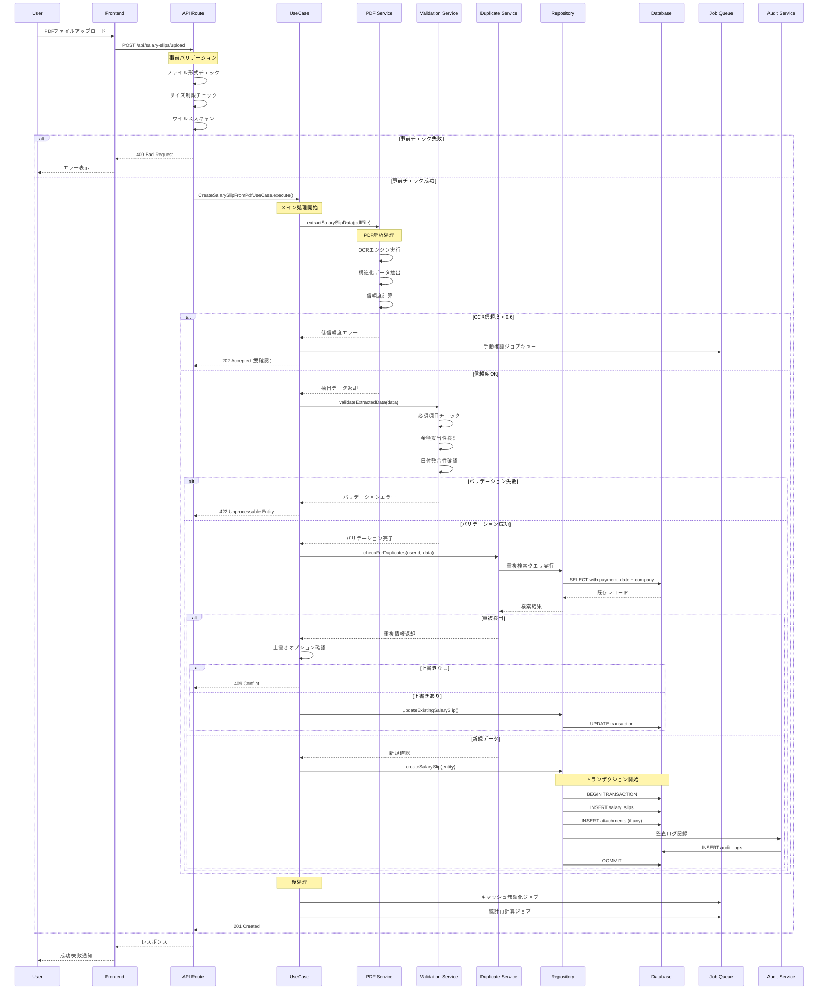
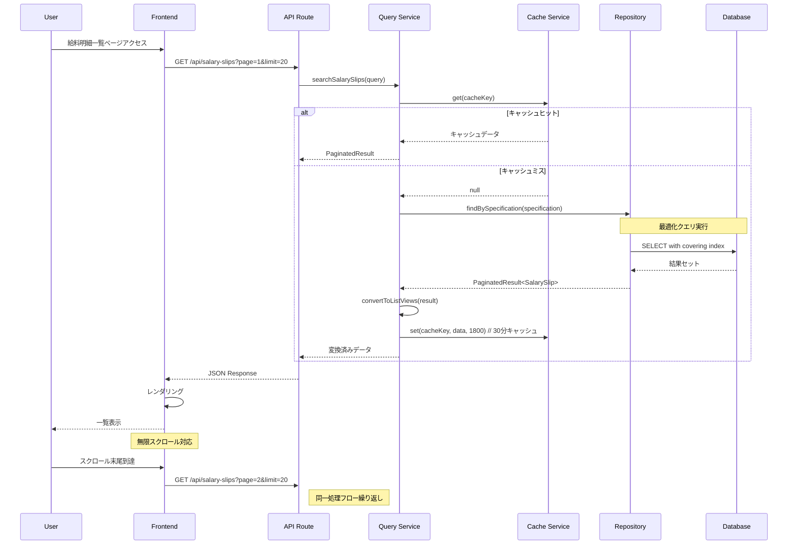
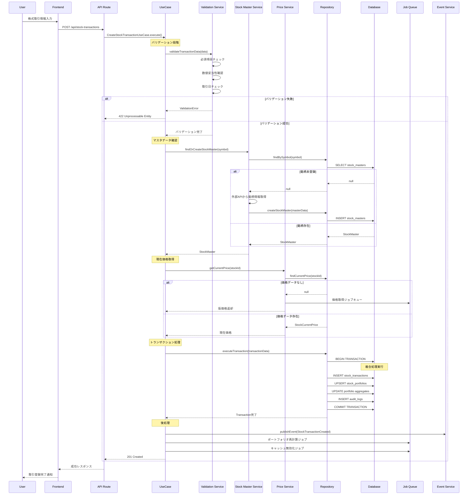
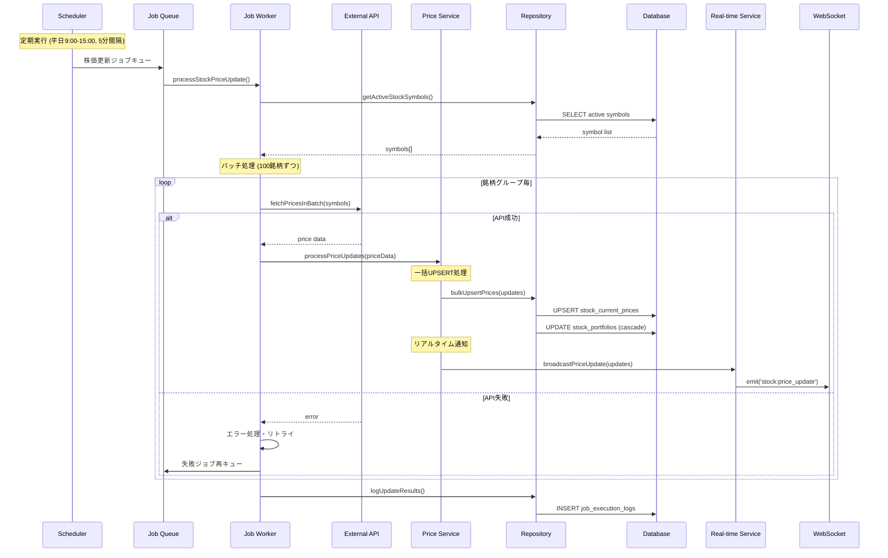
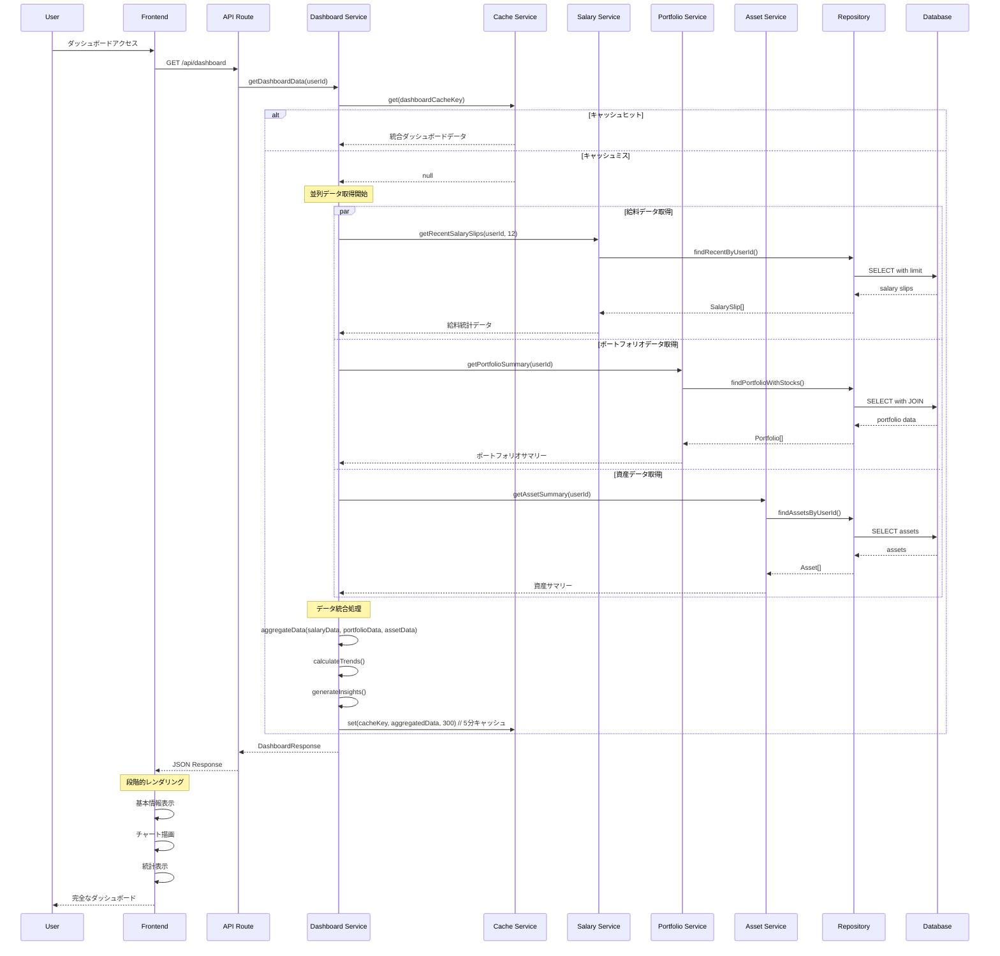
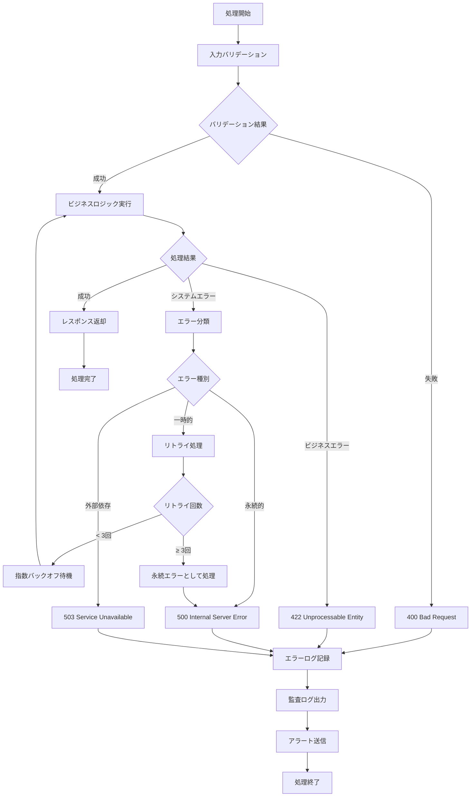

# 処理フロー詳細設計書

## 文書情報
- **作成日**: 2025-08-10
- **作成者**: エキスパートプロセスフロー設計者
- **バージョン**: 1.0.0
- **ステータス**: 詳細設計フェーズ
- **前提条件**: class-design-architect及びdatabase-detail-designerの完了

---

## 1. 処理フロー設計概要

### 1.1 設計方針

本処理フロー設計は、Feature-Sliced Design (FSD) アーキテクチャに基づく給料・資産管理システムの包括的処理フローを定義します：

| 設計原則 | 実装方法 | 品質保証 |
|---------|----------|----------|
| **エラー早期検出** | 入力検証とデータ整合性チェックの段階的実行 | 失敗の速い検知 |
| **非同期処理** | ユーザー体験を損なわない背景処理 | レスポンシブUI |
| **トランザクション整合性** | ACID特性を保証する処理単位 | データ一貫性 |
| **回復可能性** | 障害発生時の自動回復機構 | 高可用性 |
| **監査証跡** | 全処理の完全な追跡可能性 | コンプライアンス |

### 1.2 処理フロー分類

#### パフォーマンス重要度マトリクス

| 処理分類 | 頻度 | 複雑度 | レスポンス要件 | 優先度 |
|----------|------|---------|----------------|--------|
| **即座処理** | 極高 | 低 | <100ms | P0 |
| **インタラクティブ処理** | 高 | 中 | <500ms | P1 |
| **バッチ処理** | 中 | 高 | <30s | P2 |
| **バックグラウンド処理** | 低 | 極高 | 非同期 | P3 |

---

## 2. 給料明細管理処理フロー

### 2.1 PDF給料明細取り込みフロー



#### 2.1.1 詳細処理ステップ

**ステップ1: 事前バリデーション**
```typescript
async function validatePdfFile(file: File): Promise<ValidationResult> {
  const checks = await Promise.all([
    checkFileFormat(file),      // PDF形式確認
    checkFileSize(file),        // サイズ制限(10MB)
    checkFileIntegrity(file),   // ファイル破損チェック
    scanForViruses(file)        // ウイルススキャン
  ]);
  
  return {
    isValid: checks.every(check => check.passed),
    errors: checks.filter(check => !check.passed).map(check => check.error),
    warnings: checks.filter(check => check.warning).map(check => check.warning)
  };
}
```

**ステップ2: PDF解析処理**
```typescript
async function extractSalarySlipData(pdfFile: File): Promise<ExtractedData> {
  // OCRエンジン実行
  const ocrResult = await tesseractEngine.recognize(pdfFile, {
    lang: 'jpn',
    tessedit_pageseg_mode: PSM.AUTO_OSD
  });
  
  // 構造化データ抽出
  const structuredData = await dataExtractor.parse(ocrResult.text, {
    company: /会社名[:：]\s*(.+)/,
    employeeName: /氏名[:：]\s*(.+)/,
    paymentDate: /支払日[:：]\s*(\d{4})[年\/\-](\d{1,2})[月\/\-](\d{1,2})/,
    baseSalary: /基本給[:：]\s*([\d,]+)/,
    totalEarnings: /総支給額[:：]\s*([\d,]+)/,
    totalDeductions: /控除合計[:：]\s*([\d,]+)/,
    netPay: /差引支給額[:：]\s*([\d,]+)/
  });
  
  // 信頼度計算
  const confidence = calculateConfidence(structuredData, ocrResult.confidence);
  
  return {
    ...structuredData,
    confidence,
    rawOcrResult: ocrResult.text,
    processingMetadata: {
      ocrEngine: 'Tesseract 5.0',
      processingTime: Date.now() - startTime,
      pageCount: ocrResult.pages?.length || 1
    }
  };
}
```

**ステップ3: データバリデーション**
```typescript
async function validateExtractedData(data: ExtractedData): Promise<void> {
  const validations = [
    // 必須項目チェック
    {
      field: 'companyName',
      check: () => data.companyName && data.companyName.trim().length > 0,
      message: '会社名の抽出に失敗しました'
    },
    
    // 金額妥当性チェック
    {
      field: 'netPay',
      check: () => {
        const total = Number(data.totalEarnings);
        const deductions = Number(data.totalDeductions);
        const net = Number(data.netPay);
        return Math.abs((total - deductions) - net) < 100; // 100円の誤差許容
      },
      message: '計算結果に矛盾があります'
    },
    
    // 日付整合性チェック
    {
      field: 'dates',
      check: () => {
        const paymentDate = new Date(data.paymentDate);
        const periodEnd = new Date(data.targetPeriodEnd);
        return paymentDate >= periodEnd;
      },
      message: '支払日が対象期間終了日より前になっています'
    }
  ];
  
  const errors = validations
    .filter(validation => !validation.check())
    .map(validation => new ValidationError(validation.message, validation.field));
    
  if (errors.length > 0) {
    throw new AggregateValidationError('データバリデーション失敗', errors);
  }
}
```

### 2.2 給料明細一覧表示フロー



#### 2.2.1 検索最適化処理

```typescript
class SalarySlipQueryService {
  async searchSalarySlips(query: SalarySlipSearchQuery): Promise<PaginatedResult<SalarySlipListView>> {
    // キャッシュキー生成
    const cacheKey = this.buildCacheKey('search', {
      userId: query.userId,
      filters: query.filters,
      pagination: query.pagination,
      sortBy: query.sortBy
    });
    
    // L1キャッシュ確認
    let result = await this.cacheService.get<PaginatedResult<SalarySlipListView>>(cacheKey);
    if (result) {
      return result;
    }
    
    // 検索仕様構築
    const specification = this.buildSearchSpecification(query);
    
    // 最適化クエリ実行（カバリングインデックス使用）
    const dbResult = await this.repository.findBySpecification(
      query.userId,
      specification
    );
    
    // ビューモデル変換
    result = this.convertToListViews(dbResult);
    
    // キャッシュ保存
    await this.cacheService.set(cacheKey, result, 1800); // 30分
    
    return result;
  }
}
```

---

## 3. 株式ポートフォリオ管理処理フロー

### 3.1 株式取引登録フロー



#### 3.1.1 ポートフォリオ更新処理

```typescript
async function updatePortfolioOnTransaction(
  transaction: StockTransaction,
  currentPortfolio: StockPortfolio | null
): Promise<StockPortfolio> {
  
  if (!currentPortfolio) {
    // 新規ポートフォリオ作成
    return await this.createNewPortfolio(transaction);
  }
  
  // 既存ポートフォリオ更新
  const updatedPortfolio = await this.updateExistingPortfolio(
    currentPortfolio, 
    transaction
  );
  
  return updatedPortfolio;
}

private async updateExistingPortfolio(
  portfolio: StockPortfolio,
  transaction: StockTransaction
): Promise<StockPortfolio> {
  
  switch (transaction.transactionType) {
    case 'buy':
      return this.processBuyTransaction(portfolio, transaction);
    
    case 'sell':
      return this.processSellTransaction(portfolio, transaction);
      
    case 'dividend':
      return this.processDividendTransaction(portfolio, transaction);
      
    default:
      throw new Error(`Unsupported transaction type: ${transaction.transactionType}`);
  }
}

private async processBuyTransaction(
  portfolio: StockPortfolio,
  transaction: StockTransaction
): Promise<StockPortfolio> {
  
  // 加重平均取得価格計算
  const totalInvestment = portfolio.totalInvestment.plus(transaction.totalAmount);
  const totalQuantity = portfolio.quantity.plus(transaction.quantity);
  const newAveragePrice = totalInvestment.dividedBy(totalQuantity);
  
  // ポートフォリオ更新
  portfolio.updatePurchase({
    quantity: totalQuantity,
    averagePurchasePrice: newAveragePrice,
    totalInvestment,
    lastPurchaseDate: transaction.transactionDate,
    firstPurchaseDate: portfolio.firstPurchaseDate || transaction.transactionDate
  });
  
  // 現在価値と損益計算
  const currentPrice = await this.priceService.getCurrentPrice(portfolio.stockId);
  if (currentPrice) {
    portfolio.updateValuation(currentPrice);
  }
  
  return portfolio;
}
```

### 3.2 株価自動更新フロー



#### 3.2.1 価格更新最適化

```typescript
class StockPriceUpdateService {
  async processBulkPriceUpdate(symbols: string[]): Promise<UpdateResult> {
    const batchSize = 100;
    const results: UpdateResult[] = [];
    
    // バッチ並列処理
    const batches = this.createBatches(symbols, batchSize);
    const batchPromises = batches.map(batch => 
      this.processBatch(batch).catch(error => ({ error, batch }))
    );
    
    const batchResults = await Promise.allSettled(batchPromises);
    
    // 結果集約
    const successCount = batchResults
      .filter(result => result.status === 'fulfilled' && !result.value.error)
      .length;
      
    const failureCount = batchResults.length - successCount;
    
    return {
      totalProcessed: symbols.length,
      successCount: successCount * batchSize,
      failureCount: failureCount * batchSize,
      processingTime: Date.now() - startTime
    };
  }
  
  private async processBatch(symbols: string[]): Promise<BatchResult> {
    // 外部API並列呼び出し
    const pricePromises = symbols.map(symbol => 
      this.fetchStockPrice(symbol)
        .catch(error => ({ symbol, error }))
    );
    
    const priceResults = await Promise.all(pricePromises);
    
    // 成功したデータのみ処理
    const validPrices = priceResults.filter(result => !result.error);
    
    if (validPrices.length > 0) {
      // PostgreSQL UPSERT使用
      await this.repository.bulkUpsertPrices(validPrices);
      
      // 影響を受けるポートフォリオの再計算
      const affectedUsers = await this.getAffectedUsers(
        validPrices.map(p => p.symbol)
      );
      
      // 非同期でポートフォリオ更新
      await this.jobQueue.add('portfolio-recalculation', {
        userIds: affectedUsers,
        reason: 'price_update'
      });
    }
    
    return {
      processed: validPrices.length,
      errors: priceResults.filter(result => result.error)
    };
  }
}
```

---

## 4. ダッシュボード統合処理フロー

### 4.1 ダッシュボードデータ統合フロー



#### 4.1.1 データ統合処理詳細

```typescript
class DashboardService {
  async getDashboardData(userId: string): Promise<DashboardData> {
    const cacheKey = `dashboard:${userId}`;
    
    // キャッシュ確認
    const cached = await this.cache.get<DashboardData>(cacheKey);
    if (cached) {
      return cached;
    }
    
    // 並列データ取得
    const [salaryData, portfolioData, assetData, budgetData] = await Promise.all([
      this.getSalaryAnalytics(userId),
      this.getPortfolioAnalytics(userId),
      this.getAssetAnalytics(userId),
      this.getBudgetAnalytics(userId)
    ]);
    
    // データ統合
    const aggregatedData = this.aggregateData({
      salary: salaryData,
      portfolio: portfolioData,
      assets: assetData,
      budget: budgetData
    });
    
    // トレンド分析
    const trends = await this.calculateTrends(userId, aggregatedData);
    
    // インサイト生成
    const insights = this.generateInsights(aggregatedData, trends);
    
    const dashboardData: DashboardData = {
      summary: {
        totalNetWorth: this.calculateNetWorth(portfolioData, assetData),
        monthlyIncome: salaryData.currentMonth?.netPay || 0,
        portfolioValue: portfolioData.totalValue,
        portfolioGainLoss: portfolioData.totalGainLoss,
        monthlyBudgetUsage: budgetData.currentMonthUsage
      },
      trends,
      insights,
      charts: {
        incomeChart: this.buildIncomeChart(salaryData.monthlyData),
        portfolioChart: this.buildPortfolioChart(portfolioData.holdings),
        assetAllocationChart: this.buildAssetAllocationChart(assetData, portfolioData)
      },
      alerts: this.generateAlerts(aggregatedData, trends),
      lastUpdated: new Date()
    };
    
    // キャッシュ保存
    await this.cache.set(cacheKey, dashboardData, 300); // 5分
    
    return dashboardData;
  }
  
  private async calculateTrends(
    userId: string, 
    data: AggregatedData
  ): Promise<TrendAnalysis> {
    // 3ヶ月のトレンドデータ取得
    const trendData = await this.repository.getTrendData(userId, 3);
    
    return {
      incomeGrowth: this.calculateGrowthRate(
        trendData.income.current,
        trendData.income.previous
      ),
      portfolioGrowth: this.calculateGrowthRate(
        data.portfolio.totalValue,
        trendData.portfolio.previousValue
      ),
      expenseGrowth: this.calculateGrowthRate(
        trendData.expenses.current,
        trendData.expenses.previous
      ),
      savingsRate: this.calculateSavingsRate(data.salary, data.budget)
    };
  }
}
```

---

## 5. エラーハンドリング・回復処理

### 5.1 エラーハンドリング戦略



#### 5.1.1 エラー分類と処理

```typescript
enum ErrorType {
  VALIDATION = 'validation',
  BUSINESS_RULE = 'business_rule',
  EXTERNAL_API = 'external_api',
  DATABASE = 'database',
  SYSTEM = 'system',
  NETWORK = 'network'
}

class ErrorHandler {
  async handleError(error: Error, context: ProcessContext): Promise<ErrorResponse> {
    const errorType = this.classifyError(error);
    const errorId = generateErrorId();
    
    // エラーログ記録
    await this.logError(errorId, error, context, errorType);
    
    switch (errorType) {
      case ErrorType.VALIDATION:
        return this.handleValidationError(error, errorId);
        
      case ErrorType.BUSINESS_RULE:
        return this.handleBusinessRuleError(error, errorId);
        
      case ErrorType.EXTERNAL_API:
        return await this.handleExternalApiError(error, context, errorId);
        
      case ErrorType.DATABASE:
        return await this.handleDatabaseError(error, context, errorId);
        
      case ErrorType.SYSTEM:
        return this.handleSystemError(error, errorId);
        
      default:
        return this.handleUnknownError(error, errorId);
    }
  }
  
  private async handleExternalApiError(
    error: Error, 
    context: ProcessContext, 
    errorId: string
  ): Promise<ErrorResponse> {
    
    if (this.isRetryableError(error)) {
      const retryCount = context.retryCount || 0;
      
      if (retryCount < 3) {
        // 指数バックオフでリトライ
        const delay = Math.pow(2, retryCount) * 1000; // 1, 2, 4秒
        
        await this.scheduleRetry(context, delay);
        
        return {
          status: 'retry_scheduled',
          errorId,
          message: 'Processing will be retried',
          retryAfter: delay
        };
      }
    }
    
    // 最終的にサービス利用不可として処理
    return {
      status: 503,
      errorId,
      message: 'External service temporarily unavailable',
      canRetry: true
    };
  }
  
  private async handleDatabaseError(
    error: Error,
    context: ProcessContext,
    errorId: string
  ): Promise<ErrorResponse> {
    
    if (this.isTransactionError(error)) {
      // トランザクション巻き戻し
      await this.rollbackTransaction(context.transactionId);
    }
    
    if (this.isConnectionError(error)) {
      // 接続プール再初期化
      await this.reinitializeConnectionPool();
      
      return {
        status: 503,
        errorId,
        message: 'Database connection issue, please try again',
        canRetry: true
      };
    }
    
    // 一般的なDBエラー
    return {
      status: 500,
      errorId,
      message: 'Internal database error',
      canRetry: false
    };
  }
}
```

### 5.2 回復処理メカニズム

#### 5.2.1 自動回復処理

```typescript
class RecoveryService {
  async executeWithRecovery<T>(
    operation: () => Promise<T>,
    config: RecoveryConfig
  ): Promise<T> {
    
    let lastError: Error;
    
    for (let attempt = 1; attempt <= config.maxAttempts; attempt++) {
      try {
        const result = await operation();
        
        // 成功時はリカバリメトリクスを記録
        await this.recordRecoverySuccess(operation.name, attempt);
        
        return result;
        
      } catch (error) {
        lastError = error;
        
        if (attempt === config.maxAttempts) {
          // 最終試行も失敗
          await this.recordRecoveryFailure(operation.name, error, attempt);
          break;
        }
        
        if (!this.isRecoverableError(error)) {
          // 回復不可能なエラー
          await this.recordRecoveryFailure(operation.name, error, attempt);
          throw error;
        }
        
        // 回復処理実行
        await this.executeRecoveryActions(error, attempt);
        
        // バックオフ待機
        const delay = this.calculateBackoff(attempt, config.backoffStrategy);
        await this.delay(delay);
      }
    }
    
    throw lastError;
  }
  
  private async executeRecoveryActions(error: Error, attempt: number): Promise<void> {
    if (error instanceof DatabaseConnectionError) {
      await this.recoverDatabaseConnection();
    }
    
    if (error instanceof CacheConnectionError) {
      await this.recoverCacheConnection();
    }
    
    if (error instanceof ExternalAPIError) {
      await this.switchToBackupAPI();
    }
    
    // 共通回復アクション
    await this.clearTemporaryData();
    await this.refreshAuthTokens();
  }
  
  private calculateBackoff(
    attempt: number, 
    strategy: BackoffStrategy
  ): number {
    
    switch (strategy) {
      case BackoffStrategy.FIXED:
        return 1000; // 1秒固定
        
      case BackoffStrategy.LINEAR:
        return attempt * 1000; // 1, 2, 3秒
        
      case BackoffStrategy.EXPONENTIAL:
        return Math.pow(2, attempt - 1) * 1000; // 1, 2, 4, 8秒
        
      case BackoffStrategy.EXPONENTIAL_JITTER:
        const exponential = Math.pow(2, attempt - 1) * 1000;
        const jitter = Math.random() * 0.1 * exponential;
        return exponential + jitter;
        
      default:
        return 1000;
    }
  }
}
```

---

## 6. パフォーマンス最適化処理

### 6.1 非同期処理最適化

```typescript
class PerformanceOptimizer {
  async optimizeDataProcessing<T>(
    operations: Array<() => Promise<T>>,
    config: OptimizationConfig
  ): Promise<T[]> {
    
    switch (config.strategy) {
      case ProcessingStrategy.PARALLEL:
        return await this.processInParallel(operations, config);
        
      case ProcessingStrategy.BATCH:
        return await this.processInBatches(operations, config);
        
      case ProcessingStrategy.PIPELINE:
        return await this.processInPipeline(operations, config);
        
      default:
        return await this.processSequentially(operations);
    }
  }
  
  private async processInParallel<T>(
    operations: Array<() => Promise<T>>,
    config: OptimizationConfig
  ): Promise<T[]> {
    
    // 同時実行数制限
    const semaphore = new Semaphore(config.maxConcurrency || 5);
    
    const promises = operations.map(async (operation) => {
      await semaphore.acquire();
      
      try {
        return await operation();
      } finally {
        semaphore.release();
      }
    });
    
    // Promise.allSettled で一部失敗を許容
    const results = await Promise.allSettled(promises);
    
    // 成功した結果のみ抽出
    return results
      .filter(result => result.status === 'fulfilled')
      .map(result => (result as PromiseFulfilledResult<T>).value);
  }
  
  private async processInBatches<T>(
    operations: Array<() => Promise<T>>,
    config: OptimizationConfig
  ): Promise<T[]> {
    
    const batchSize = config.batchSize || 10;
    const results: T[] = [];
    
    for (let i = 0; i < operations.length; i += batchSize) {
      const batch = operations.slice(i, i + batchSize);
      const batchResults = await Promise.all(batch.map(op => op()));
      results.push(...batchResults);
      
      // バッチ間での休憩（レート制限対応）
      if (config.batchDelay && i + batchSize < operations.length) {
        await this.delay(config.batchDelay);
      }
    }
    
    return results;
  }
}
```

### 6.2 メモリ最適化

```typescript
class MemoryOptimizer {
  async processLargeDataset<T, R>(
    dataSource: AsyncIterable<T>,
    processor: (item: T) => Promise<R>,
    config: MemoryConfig
  ): Promise<R[]> {
    
    const results: R[] = [];
    const batchBuffer: T[] = [];
    
    for await (const item of dataSource) {
      batchBuffer.push(item);
      
      // バッファサイズ制限
      if (batchBuffer.length >= config.batchSize) {
        const batchResults = await this.processBatch(
          batchBuffer.splice(0, config.batchSize),
          processor
        );
        
        results.push(...batchResults);
        
        // メモリ使用量監視
        if (this.isMemoryPressureHigh()) {
          await this.performGarbageCollection();
        }
      }
    }
    
    // 残りのデータ処理
    if (batchBuffer.length > 0) {
      const batchResults = await this.processBatch(batchBuffer, processor);
      results.push(...batchResults);
    }
    
    return results;
  }
  
  private isMemoryPressureHigh(): boolean {
    const memUsage = process.memoryUsage();
    const heapUsedPercent = memUsage.heapUsed / memUsage.heapTotal;
    return heapUsedPercent > 0.8; // 80%超えで高負荷判定
  }
}
```

---

## 7. 監査・ログ処理

### 7.1 包括監査ログ処理

```typescript
class AuditService {
  async logBusinessOperation(
    operation: BusinessOperation,
    context: OperationContext
  ): Promise<void> {
    
    const auditEntry: AuditLogEntry = {
      id: generateAuditId(),
      userId: context.userId,
      entityType: operation.entityType,
      entityId: operation.entityId,
      action: operation.action,
      oldValue: operation.beforeState,
      newValue: operation.afterState,
      ipAddress: context.ipAddress,
      userAgent: context.userAgent,
      sessionId: context.sessionId,
      timestamp: new Date(),
      metadata: {
        processingTime: operation.processingTime,
        dataSourceType: operation.dataSource,
        confidence: operation.confidence,
        validationResults: operation.validationResults
      }
    };
    
    // 非同期でログ書き込み
    await this.writeAuditLog(auditEntry);
    
    // 重要操作の場合は即座通知
    if (this.isHighImpactOperation(operation)) {
      await this.sendImmediateNotification(auditEntry);
    }
  }
  
  private async writeAuditLog(entry: AuditLogEntry): Promise<void> {
    // パーティション化されたテーブルに挿入
    await this.repository.insertAuditLog(entry);
    
    // 検索用インデックス更新
    await this.searchService.indexAuditEntry(entry);
    
    // リアルタイム監視への通知
    await this.monitoringService.notifyAuditEvent(entry);
  }
}
```

---

## 8. 次のステップ

1. ✅ 主要機能の詳細処理フロー設計 (14-01_process-flow.md) ← 本書
2. → データ変換ロジック詳細設計 (14-02_data-transformation.md)
3. → 状態遷移詳細設計 (14-03_state-transition.md)

---

## 承認

| 役割 | 名前 | 日付 | 署名 |
|------|------|------|------|
| プロセスフロー設計者 | エキスパートプロセスフロー設計者 | 2025-08-10 | ✅ |
| レビュアー | - | - | [ ] |
| 承認者 | - | - | [ ] |

---

**改訂履歴**

| バージョン | 日付 | 変更内容 | 作成者 |
|-----------|------|----------|---------|
| 1.0.0 | 2025-08-10 | 初版作成 | エキスパートプロセスフロー設計者 |