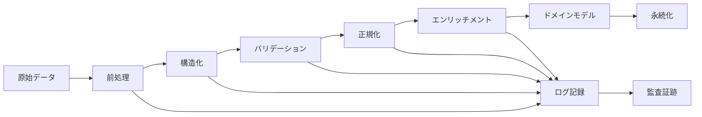

# データ変換ロジック詳細設計書

## 文書情報

- **作成日**: 2025-08-10
- **作成者**: エキスパートプロセスフロー設計者
- **バージョン**: 1.0.0
- **ステータス**: 詳細設計フェーズ
- **前提条件**: 14-01_process-flow.mdの完了

---

## 1. データ変換設計概要

### 1.1 変換戦略

本システムにおけるデータ変換は、以下の原則に基づいて設計されています：

| 原則               | 実装戦略                       | 品質保証                     |
| ------------------ | ------------------------------ | ---------------------------- |
| **型安全性**       | TypeScript厳格型チェック       | コンパイル時エラー検出       |
| **データ整合性**   | バリデーションパイプライン     | 変換前後の整合性確保         |
| **パフォーマンス** | ストリーミング処理と最適化     | 大容量データの効率処理       |
| **拡張性**         | プラグイン型変換アーキテクチャ | 新しい変換ルールの容易な追加 |
| **監査可能性**     | 変換履歴の完全追跡             | データ来歴の透明性           |

### 1.2 変換パイプライン構成



---

## 2. PDF → 構造化データ変換

### 2.1 OCR処理パイプライン

```typescript
interface PdfTransformationConfig {
	ocrEngine: 'tesseract' | 'azure-form-recognizer' | 'aws-textract';
	language: string[];
	confidence: {
		minimum: number;
		warning: number;
	};
	preprocessing: {
		denoise: boolean;
		deskew: boolean;
		enhanceContrast: boolean;
	};
}

class PdfDataTransformer {
	private config: PdfTransformationConfig;
	private logger: Logger;

	constructor(config: PdfTransformationConfig) {
		this.config = config;
		this.logger = new Logger('PdfDataTransformer');
	}

	async transformPdfToSalarySlip(
		pdfBuffer: Buffer,
		metadata: PdfMetadata
	): Promise<TransformationResult<SalarySlipData>> {
		const transformationId = generateTransformationId();
		const startTime = Date.now();

		try {
			// Step 1: PDF前処理
			const preprocessedData = await this.preprocessPdf(pdfBuffer, transformationId);

			// Step 2: OCR実行
			const ocrResult = await this.executeOcr(preprocessedData, transformationId);

			// Step 3: 構造化データ抽出
			const structuredData = await this.extractStructuredData(ocrResult, transformationId);

			// Step 4: データバリデーション
			const validatedData = await this.validateExtractedData(structuredData, transformationId);

			// Step 5: データ正規化
			const normalizedData = await this.normalizeData(validatedData, transformationId);

			// Step 6: エンリッチメント
			const enrichedData = await this.enrichData(normalizedData, metadata, transformationId);

			const processingTime = Date.now() - startTime;

			return TransformationResult.success({
				data: enrichedData,
				transformationId,
				processingTime,
				confidence: this.calculateOverallConfidence(ocrResult, validatedData),
				metadata: {
					sourceType: 'pdf',
					ocrEngine: this.config.ocrEngine,
					processingSteps: 6,
					fileSize: pdfBuffer.length
				}
			});
		} catch (error) {
			return TransformationResult.failure({
				transformationId,
				error,
				processingTime: Date.now() - startTime,
				partialData: null // 部分的な変換結果があれば含める
			});
		}
	}

	private async preprocessPdf(
		pdfBuffer: Buffer,
		transformationId: string
	): Promise<PreprocessedPdfData> {
		this.logger.info(`PDF前処理開始: ${transformationId}`);

		// PDF → 画像変換
		const images = await this.convertPdfToImages(pdfBuffer, {
			density: 300, // 300 DPI
			format: 'png',
			quality: 100
		});

		// 画像前処理（並列実行）
		const preprocessedImages = await Promise.all(
			images.map(async (image, index) => {
				let processedImage = image;

				if (this.config.preprocessing.denoise) {
					processedImage = await this.denoise(processedImage);
				}

				if (this.config.preprocessing.deskew) {
					processedImage = await this.deskew(processedImage);
				}

				if (this.config.preprocessing.enhanceContrast) {
					processedImage = await this.enhanceContrast(processedImage);
				}

				return {
					pageNumber: index + 1,
					imageData: processedImage,
					processedAt: new Date()
				};
			})
		);

		return {
			transformationId,
			pages: preprocessedImages,
			totalPages: images.length,
			preprocessingConfig: this.config.preprocessing
		};
	}

	private async executeOcr(
		preprocessedData: PreprocessedPdfData,
		transformationId: string
	): Promise<OcrResult> {
		this.logger.info(`OCR実行開始: ${transformationId}`);

		const ocrPromises = preprocessedData.pages.map(async (page) => {
			const pageStartTime = Date.now();

			const result = await this.runOcrOnPage(page.imageData, {
				language: this.config.language,
				pageSegMode: 'auto',
				engineMode: 'lstm_only'
			});

			return {
				pageNumber: page.pageNumber,
				text: result.text,
				confidence: result.confidence,
				wordDetails: result.words,
				processingTime: Date.now() - pageStartTime,
				boundingBoxes: result.boundingBoxes
			};
		});

		const pageResults = await Promise.all(ocrPromises);

		// 全ページの結果をマージ
		const combinedText = pageResults
			.sort((a, b) => a.pageNumber - b.pageNumber)
			.map((result) => result.text)
			.join('\n\n');

		const averageConfidence =
			pageResults.reduce((sum, result) => sum + result.confidence, 0) / pageResults.length;

		return {
			transformationId,
			combinedText,
			averageConfidence,
			pageResults,
			totalPages: pageResults.length,
			ocrEngine: this.config.ocrEngine
		};
	}

	private async extractStructuredData(
		ocrResult: OcrResult,
		transformationId: string
	): Promise<RawStructuredData> {
		this.logger.info(`構造化データ抽出開始: ${transformationId}`);

		const extractors = {
			companyName: new CompanyNameExtractor(),
			employeeInfo: new EmployeeInfoExtractor(),
			dateInfo: new DateInfoExtractor(),
			earningsInfo: new EarningsInfoExtractor(),
			deductionsInfo: new DeductionsInfoExtractor(),
			attendanceInfo: new AttendanceInfoExtractor()
		};

		// 並列抽出実行
		const extractionResults = await Promise.allSettled(
			Object.entries(extractors).map(async ([field, extractor]) => {
				const fieldStartTime = Date.now();

				try {
					const result = await extractor.extract(ocrResult.combinedText, {
						confidence: ocrResult.averageConfidence,
						boundingBoxes: ocrResult.pageResults.flatMap((p) => p.boundingBoxes)
					});

					return {
						field,
						success: true,
						data: result,
						confidence: result.confidence,
						processingTime: Date.now() - fieldStartTime
					};
				} catch (error) {
					return {
						field,
						success: false,
						error,
						processingTime: Date.now() - fieldStartTime
					};
				}
			})
		);

		// 結果の集約
		const extractedData: RawStructuredData = {
			transformationId,
			extractionResults: new Map(),
			overallConfidence: 0,
			extractedFields: 0,
			failedFields: 0
		};

		extractionResults.forEach((result, index) => {
			const fieldName = Object.keys(extractors)[index];

			if (result.status === 'fulfilled' && result.value.success) {
				extractedData.extractionResults.set(fieldName, result.value.data);
				extractedData.extractedFields++;
				extractedData.overallConfidence += result.value.confidence;
			} else {
				extractedData.failedFields++;
				this.logger.warn(`フィールド抽出失敗: ${fieldName}`, {
					transformationId,
					error: result.status === 'fulfilled' ? result.value.error : result.reason
				});
			}
		});

		extractedData.overallConfidence =
			extractedData.extractedFields > 0
				? extractedData.overallConfidence / extractedData.extractedFields
				: 0;

		return extractedData;
	}
}

// フィールド抽出器の実装例
class EarningsInfoExtractor implements FieldExtractor<EarningsData> {
	private patterns = {
		baseSalary: [
			/基本給[\s:：]*([0-9,]+)/g,
			/基本月給[\s:：]*([0-9,]+)/g,
			/月給[\s:：]*([0-9,]+)/g
		],
		overtimePay: [
			/残業手当[\s:：]*([0-9,]+)/g,
			/時間外手当[\s:：]*([0-9,]+)/g,
			/OT手当[\s:：]*([0-9,]+)/g
		],
		allowances: [
			/通勤手当[\s:：]*([0-9,]+)/g,
			/住宅手当[\s:：]*([0-9,]+)/g,
			/家族手当[\s:：]*([0-9,]+)/g,
			/役職手当[\s:：]*([0-9,]+)/g
		]
	};

	async extract(text: string, context: ExtractionContext): Promise<ExtractionResult<EarningsData>> {
		const earnings: EarningsData = {
			baseSalary: '0',
			overtimePay: '0',
			overtimePayOver60: '0',
			lateNightPay: '0',
			holidayWorkPay: '0',
			fixedOvertimeAllowance: '0',
			transportationAllowance: '0',
			housingAllowance: '0',
			familyAllowance: '0',
			qualificationAllowance: '0',
			expenseReimbursement: '0',
			stockPurchaseIncentive: '0',
			bonus: '0',
			otherEarnings: '0'
		};

		let totalConfidence = 0;
		let extractedFields = 0;

		// 基本給抽出
		for (const pattern of this.patterns.baseSalary) {
			const match = pattern.exec(text);
			if (match) {
				earnings.baseSalary = this.normalizeAmount(match[1]);
				totalConfidence += 0.9; // 高い信頼度
				extractedFields++;
				break;
			}
		}

		// 残業代抽出
		for (const pattern of this.patterns.overtimePay) {
			const match = pattern.exec(text);
			if (match) {
				earnings.overtimePay = this.normalizeAmount(match[1]);
				totalConfidence += 0.8;
				extractedFields++;
				break;
			}
		}

		// 各種手当の抽出
		const allowanceMatches = this.extractAllowances(text);
		allowanceMatches.forEach((value, field) => {
			if (field in earnings) {
				(earnings as any)[field] = value;
				totalConfidence += 0.7;
				extractedFields++;
			}
		});

		// 総支給額の整合性チェック
		const calculatedTotal = this.calculateTotalEarnings(earnings);
		const extractedTotal = this.extractTotalEarnings(text);

		let adjustedConfidence = extractedFields > 0 ? totalConfidence / extractedFields : 0;

		if (extractedTotal && Math.abs(calculatedTotal - parseFloat(extractedTotal)) > 1000) {
			adjustedConfidence *= 0.7; // 整合性が合わない場合は信頼度を下げる
		}

		return {
			data: earnings,
			confidence: Math.min(adjustedConfidence, 1.0),
			extractedFieldCount: extractedFields,
			validationErrors: this.validateEarnings(earnings),
			processingNotes: [
				`抽出フィールド数: ${extractedFields}`,
				`計算総額: ${calculatedTotal}`,
				extractedTotal ? `抽出総額: ${extractedTotal}` : '総額未抽出'
			]
		};
	}

	private normalizeAmount(amountStr: string): string {
		return amountStr.replace(/[,，]/g, '').trim();
	}

	private extractAllowances(text: string): Map<string, string> {
		const allowances = new Map<string, string>();

		// パターンマッチングによる各種手当の抽出
		const allowancePatterns = {
			transportationAllowance: /通勤手当[\s:：]*([0-9,]+)/g,
			housingAllowance: /住宅手当[\s:：]*([0-9,]+)/g,
			familyAllowance: /家族手当[\s:：]*([0-9,]+)/g,
			qualificationAllowance: /資格手当[\s:：]*([0-9,]+)/g
		};

		Object.entries(allowancePatterns).forEach(([field, pattern]) => {
			const match = pattern.exec(text);
			if (match) {
				allowances.set(field, this.normalizeAmount(match[1]));
			}
		});

		return allowances;
	}

	private calculateTotalEarnings(earnings: EarningsData): number {
		return Object.values(earnings)
			.map((value) => parseFloat(value) || 0)
			.reduce((sum, amount) => sum + amount, 0);
	}

	private extractTotalEarnings(text: string): string | null {
		const patterns = [
			/総支給額[\s:：]*([0-9,]+)/g,
			/支給合計[\s:：]*([0-9,]+)/g,
			/総支給[\s:：]*([0-9,]+)/g
		];

		for (const pattern of patterns) {
			const match = pattern.exec(text);
			if (match) {
				return this.normalizeAmount(match[1]);
			}
		}

		return null;
	}

	private validateEarnings(earnings: EarningsData): ValidationError[] {
		const errors: ValidationError[] = [];

		if (parseFloat(earnings.baseSalary) <= 0) {
			errors.push(new ValidationError('基本給が0以下です', 'baseSalary'));
		}

		const total = this.calculateTotalEarnings(earnings);
		if (total <= 0) {
			errors.push(new ValidationError('総支給額が0以下です', 'totalEarnings'));
		}

		return errors;
	}
}
```

### 2.2 データ正規化処理

```typescript
class DataNormalizer {
	async normalizeData<T>(
		rawData: T,
		schema: NormalizationSchema,
		context: NormalizationContext
	): Promise<NormalizedData<T>> {
		const normalizer = new SchemaBasedNormalizer<T>(schema);
		const validator = new DataValidator(schema.validationRules);

		// Step 1: 型変換
		const typeConverted = await normalizer.convertTypes(rawData);

		// Step 2: フォーマット統一
		const formatted = await normalizer.formatFields(typeConverted);

		// Step 3: データクレンジング
		const cleaned = await normalizer.cleanData(formatted);

		// Step 4: バリデーション
		const validationResult = await validator.validate(cleaned);

		if (!validationResult.isValid) {
			throw new NormalizationError('データ正規化バリデーション失敗', validationResult.errors);
		}

		// Step 5: メタデータ付加
		const normalized = await this.addMetadata(cleaned, context);

		return {
			data: normalized,
			originalData: rawData,
			transformations: normalizer.getAppliedTransformations(),
			validationResult,
			normalizedAt: new Date()
		};
	}
}

// 給料明細データ正規化スキーマ
const salarySlipNormalizationSchema: NormalizationSchema = {
	fields: {
		companyName: {
			type: 'string',
			transformations: ['trim', 'removeExtraSpaces', 'standardizeCompanyNameFormat'],
			validation: {
				required: true,
				minLength: 1,
				maxLength: 100
			}
		},

		paymentDate: {
			type: 'date',
			transformations: ['parseJapaneseDate', 'standardizeDateFormat'],
			validation: {
				required: true,
				format: 'YYYY-MM-DD'
			}
		},

		baseSalary: {
			type: 'decimal',
			transformations: ['removeCommas', 'convertToDecimal', 'validateNumericRange'],
			validation: {
				required: true,
				min: 0,
				max: 10000000,
				precision: 2
			}
		}
	},

	customTransformations: {
		standardizeCompanyNameFormat: (value: string) => {
			return value
				.replace(/株式会社/g, '(株)')
				.replace(/有限会社/g, '(有)')
				.replace(/合同会社/g, '(合)')
				.trim();
		},

		parseJapaneseDate: (value: string) => {
			// 和暦→西暦変換、各種日付フォーマット対応
			return this.parseJapaneseDateString(value);
		}
	},

	validationRules: [
		{
			name: 'salaryLogicCheck',
			rule: (data: any) => {
				const totalEarnings = parseFloat(data.totalEarnings || '0');
				const totalDeductions = parseFloat(data.totalDeductions || '0');
				const netPay = parseFloat(data.netPay || '0');

				return Math.abs(totalEarnings - totalDeductions - netPay) < 100;
			},
			message: '給与計算に論理的な矛盾があります'
		}
	]
};
```

---

## 3. 外部API → 内部データモデル変換

### 3.1 株価データ変換処理

```typescript
interface StockPriceApiResponse {
	symbol: string;
	price: number;
	change: number;
	changePercent: number;
	volume: number;
	timestamp: string;
	source: 'yahoo' | 'alpha_vantage' | 'polygon';
}

class StockPriceDataTransformer {
	private apiAdapters: Map<string, StockPriceApiAdapter>;

	constructor() {
		this.apiAdapters = new Map([
			['yahoo', new YahooFinanceAdapter()],
			['alpha_vantage', new AlphaVantageAdapter()],
			['polygon', new PolygonAdapter()]
		]);
	}

	async transformStockPriceData(
		apiResponse: StockPriceApiResponse,
		context: TransformationContext
	): Promise<StockCurrentPrice> {
		// API固有のアダプターで標準形式に変換
		const adapter = this.apiAdapters.get(apiResponse.source);
		if (!adapter) {
			throw new Error(`Unsupported API source: ${apiResponse.source}`);
		}

		const standardizedData = await adapter.normalize(apiResponse);

		// バリデーション
		await this.validateStockPriceData(standardizedData);

		// ドメインモデルに変換
		const domainModel = StockCurrentPrice.create({
			stockId: context.stockId,
			currentPrice: MoneyAmount.from(standardizedData.currentPrice),
			previousClose: MoneyAmount.from(standardizedData.previousClose),
			dayChange: MoneyAmount.from(standardizedData.dayChange),
			dayChangePercent: Percentage.from(standardizedData.dayChangePercent),
			dayHigh: MoneyAmount.from(standardizedData.dayHigh),
			dayLow: MoneyAmount.from(standardizedData.dayLow),
			volume: standardizedData.volume,
			marketTime: standardizedData.marketTime,
			dataQuality: this.assessDataQuality(standardizedData, apiResponse.source),
			sourceApi: apiResponse.source
		});

		// メタデータ付加
		domainModel.addMetadata({
			transformationId: context.transformationId,
			apiLatency: context.apiLatency,
			cacheHit: context.cacheHit,
			dataFreshness: Date.now() - standardizedData.marketTime.getTime()
		});

		return domainModel;
	}

	private async validateStockPriceData(data: StandardizedStockPriceData): Promise<void> {
		const validators = [
			new PriceRangeValidator(),
			new VolumeValidator(),
			new TimestampValidator(),
			new ConsistencyValidator()
		];

		const validationResults = await Promise.all(
			validators.map((validator) => validator.validate(data))
		);

		const errors = validationResults
			.filter((result) => !result.isValid)
			.flatMap((result) => result.errors);

		if (errors.length > 0) {
			throw new DataValidationError('株価データバリデーション失敗', errors);
		}
	}

	private assessDataQuality(data: StandardizedStockPriceData, source: string): DataQuality {
		let score = 1.0;

		// データソースによる品質係数
		const sourceQualities = {
			yahoo: 0.9,
			alpha_vantage: 0.95,
			polygon: 0.85
		};

		score *= sourceQualities[source] || 0.7;

		// データの新しさチェック
		const dataAge = Date.now() - data.marketTime.getTime();
		if (dataAge > 15 * 60 * 1000) {
			// 15分以上古い
			score *= 0.8;
		}

		// ボリュームチェック
		if (data.volume === 0) {
			score *= 0.7;
		}

		// 価格の妥当性チェック
		if (data.currentPrice <= 0 || data.dayHigh < data.dayLow) {
			score *= 0.5;
		}

		if (score >= 0.9) return 'excellent';
		if (score >= 0.8) return 'good';
		if (score >= 0.6) return 'warning';
		return 'poor';
	}
}

// Yahoo Finance API用アダプター
class YahooFinanceAdapter implements StockPriceApiAdapter {
	async normalize(response: any): Promise<StandardizedStockPriceData> {
		const quote = response.optionChain?.result?.[0]?.quote;

		if (!quote) {
			throw new Error('Invalid Yahoo Finance API response structure');
		}

		return {
			symbol: quote.symbol,
			currentPrice: quote.regularMarketPrice,
			previousClose: quote.regularMarketPreviousClose,
			dayChange: quote.regularMarketChange,
			dayChangePercent: quote.regularMarketChangePercent,
			dayHigh: quote.regularMarketDayHigh,
			dayLow: quote.regularMarketDayLow,
			volume: quote.regularMarketVolume || 0,
			marketTime: new Date(quote.regularMarketTime * 1000),
			currency: quote.currency || 'USD'
		};
	}
}
```

### 3.2 バルクデータ変換最適化

```typescript
class BulkDataTransformer {
	async transformInBatches<TInput, TOutput>(
		inputData: TInput[],
		transformer: DataTransformer<TInput, TOutput>,
		config: BulkTransformConfig
	): Promise<BulkTransformResult<TOutput>> {
		const results: TOutput[] = [];
		const errors: TransformError[] = [];
		const batchSize = config.batchSize || 100;

		// バッチ処理統計
		const stats = {
			totalItems: inputData.length,
			processedItems: 0,
			successfulTransforms: 0,
			failedTransforms: 0,
			startTime: Date.now()
		};

		for (let i = 0; i < inputData.length; i += batchSize) {
			const batch = inputData.slice(i, i + batchSize);

			try {
				const batchResult = await this.processBatch(batch, transformer, config);

				results.push(...batchResult.successes);
				errors.push(...batchResult.errors);

				stats.processedItems += batch.length;
				stats.successfulTransforms += batchResult.successes.length;
				stats.failedTransforms += batchResult.errors.length;

				// プログレス報告
				if (config.onProgress) {
					config.onProgress({
						processed: stats.processedItems,
						total: stats.totalItems,
						successRate: stats.successfulTransforms / stats.processedItems
					});
				}

				// バッチ間の休憩（レート制限対応）
				if (config.batchDelay && i + batchSize < inputData.length) {
					await this.delay(config.batchDelay);
				}
			} catch (batchError) {
				// バッチ全体が失敗した場合
				errors.push(
					new BatchTransformError(
						`Batch ${Math.floor(i / batchSize) + 1} failed completely`,
						batch,
						batchError
					)
				);

				stats.processedItems += batch.length;
				stats.failedTransforms += batch.length;
			}
		}

		const endTime = Date.now();

		return {
			results,
			errors,
			statistics: {
				...stats,
				endTime,
				processingTime: endTime - stats.startTime,
				successRate: stats.successfulTransforms / stats.totalItems,
				throughput: stats.totalItems / ((endTime - stats.startTime) / 1000)
			}
		};
	}

	private async processBatch<TInput, TOutput>(
		batch: TInput[],
		transformer: DataTransformer<TInput, TOutput>,
		config: BulkTransformConfig
	): Promise<BatchResult<TOutput>> {
		const successes: TOutput[] = [];
		const errors: TransformError[] = [];

		if (config.parallel) {
			// 並列処理
			const promises = batch.map(async (item, index) => {
				try {
					const transformed = await transformer.transform(item);
					return { success: true, data: transformed, index };
				} catch (error) {
					return { success: false, error, item, index };
				}
			});

			const results = await Promise.allSettled(promises);

			results.forEach((result, index) => {
				if (result.status === 'fulfilled') {
					if (result.value.success) {
						successes.push(result.value.data);
					} else {
						errors.push(
							new TransformError(
								`Item ${index} transformation failed`,
								result.value.item,
								result.value.error
							)
						);
					}
				} else {
					errors.push(
						new TransformError(`Item ${index} promise rejected`, batch[index], result.reason)
					);
				}
			});
		} else {
			// 順次処理
			for (let i = 0; i < batch.length; i++) {
				try {
					const transformed = await transformer.transform(batch[i]);
					successes.push(transformed);
				} catch (error) {
					errors.push(new TransformError(`Item ${i} transformation failed`, batch[i], error));
				}
			}
		}

		return { successes, errors };
	}

	private async delay(ms: number): Promise<void> {
		return new Promise((resolve) => setTimeout(resolve, ms));
	}
}
```

---

## 4. バリデーション・サニタイゼーション処理

### 4.1 多層バリデーションシステム

```typescript
interface ValidationLayer<T> {
	name: string;
	priority: number;
	validate(data: T, context: ValidationContext): Promise<ValidationResult>;
}

class LayeredValidator<T> {
	private layers: ValidationLayer<T>[] = [];

	addLayer(layer: ValidationLayer<T>): void {
		this.layers.push(layer);
		this.layers.sort((a, b) => a.priority - b.priority);
	}

	async validate(data: T, context: ValidationContext): Promise<ComprehensiveValidationResult> {
		const results: Map<string, ValidationResult> = new Map();
		const errors: ValidationError[] = [];
		const warnings: ValidationWarning[] = [];

		let currentData = data;

		for (const layer of this.layers) {
			try {
				const result = await layer.validate(currentData, context);
				results.set(layer.name, result);

				if (!result.isValid) {
					errors.push(...result.errors);

					// 致命的エラーの場合は処理中断
					if (result.isCritical) {
						break;
					}
				}

				warnings.push(...(result.warnings || []));

				// 次の層のためのデータ更新（サニタイゼーション結果）
				if (result.sanitizedData) {
					currentData = result.sanitizedData;
				}
			} catch (error) {
				errors.push(
					new ValidationError(`Validation layer '${layer.name}' failed`, 'system', error)
				);
			}
		}

		return {
			isValid: errors.length === 0,
			sanitizedData: currentData,
			layerResults: results,
			errors,
			warnings,
			validatedAt: new Date()
		};
	}
}

// 給料明細用バリデーション層
class SalarySlipSchemaValidationLayer implements ValidationLayer<SalarySlipData> {
	name = 'schema_validation';
	priority = 1;

	async validate(data: SalarySlipData, context: ValidationContext): Promise<ValidationResult> {
		const errors: ValidationError[] = [];
		const warnings: ValidationWarning[] = [];
		let sanitizedData = { ...data };

		// 必須フィールドチェック
		if (!data.companyName?.trim()) {
			errors.push(new ValidationError('会社名は必須です', 'companyName'));
		} else {
			sanitizedData.companyName = data.companyName.trim();
		}

		if (!data.employeeName?.trim()) {
			errors.push(new ValidationError('従業員名は必須です', 'employeeName'));
		} else {
			sanitizedData.employeeName = data.employeeName.trim();
		}

		// 日付バリデーション
		if (!data.paymentDate || !this.isValidDate(data.paymentDate)) {
			errors.push(new ValidationError('無効な支払日です', 'paymentDate'));
		}

		// 金額バリデーション
		const amountFields = ['baseSalary', 'totalEarnings', 'totalDeductions', 'netPay'];
		amountFields.forEach((field) => {
			const value = data[field];
			if (value == null || isNaN(Number(value)) || Number(value) < 0) {
				errors.push(new ValidationError(`無効な金額: ${field}`, field));
			} else {
				// 数値正規化
				sanitizedData[field] = Number(value).toString();
			}
		});

		return {
			isValid: errors.length === 0,
			isCritical: errors.some((e) => ['companyName', 'paymentDate'].includes(e.field)),
			errors,
			warnings,
			sanitizedData
		};
	}

	private isValidDate(date: any): boolean {
		const parsed = new Date(date);
		return !isNaN(parsed.getTime()) && parsed.getTime() > 0;
	}
}

class SalarySlipBusinessRuleValidationLayer implements ValidationLayer<SalarySlipData> {
	name = 'business_rule_validation';
	priority = 2;

	async validate(data: SalarySlipData, context: ValidationContext): Promise<ValidationResult> {
		const errors: ValidationError[] = [];
		const warnings: ValidationWarning[] = [];

		// ビジネスルール1: 総支給額の計算整合性
		const calculatedTotal = this.calculateTotalEarnings(data);
		const declaredTotal = Number(data.totalEarnings);

		if (Math.abs(calculatedTotal - declaredTotal) > 100) {
			errors.push(
				new ValidationError(
					`総支給額の計算に矛盾があります。計算値: ${calculatedTotal}, 申告値: ${declaredTotal}`,
					'totalEarnings'
				)
			);
		}

		// ビジネスルール2: 手取り額の計算整合性
		const calculatedNetPay = declaredTotal - Number(data.totalDeductions);
		const declaredNetPay = Number(data.netPay);

		if (Math.abs(calculatedNetPay - declaredNetPay) > 100) {
			errors.push(
				new ValidationError(
					`手取り額の計算に矛盾があります。計算値: ${calculatedNetPay}, 申告値: ${declaredNetPay}`,
					'netPay'
				)
			);
		}

		// ビジネスルール3: 基本給の妥当性チェック
		const baseSalary = Number(data.baseSalary);
		if (baseSalary < 150000 || baseSalary > 3000000) {
			warnings.push(
				new ValidationWarning(
					`基本給が一般的な範囲外です: ${baseSalary}円`,
					'baseSalary',
					'unusual_amount'
				)
			);
		}

		// ビジネスルール4: 支払日と対象期間の整合性
		const paymentDate = new Date(data.paymentDate);
		const periodEnd = new Date(data.targetPeriodEnd);

		if (paymentDate < periodEnd) {
			errors.push(new ValidationError('支払日が対象期間終了日より前になっています', 'paymentDate'));
		}

		// ビジネスルール5: 年間所得上限チェック
		if (declaredTotal > 2000000) {
			warnings.push(
				new ValidationWarning(
					`月額給与が高額です。年収ベースでの税務検討が必要な可能性があります`,
					'totalEarnings',
					'high_income'
				)
			);
		}

		return {
			isValid: errors.length === 0,
			isCritical: false,
			errors,
			warnings
		};
	}

	private calculateTotalEarnings(data: SalarySlipData): number {
		const earningsFields = [
			'baseSalary',
			'overtimePay',
			'overtimePayOver60',
			'lateNightPay',
			'holidayWorkPay',
			'fixedOvertimeAllowance',
			'transportationAllowance',
			'housingAllowance',
			'familyAllowance',
			'qualificationAllowance',
			'expenseReimbursement',
			'stockPurchaseIncentive',
			'bonus',
			'otherEarnings'
		];

		return earningsFields
			.map((field) => Number(data.earnings?.[field] || '0'))
			.reduce((sum, amount) => sum + amount, 0);
	}
}
```

### 4.2 サニタイゼーション処理

```typescript
class DataSanitizer {
	private sanitizers: Map<string, FieldSanitizer> = new Map([
		['string', new StringSanitizer()],
		['number', new NumberSanitizer()],
		['date', new DateSanitizer()],
		['email', new EmailSanitizer()],
		['phone', new PhoneSanitizer()]
	]);

	async sanitizeData<T>(
		data: T,
		schema: SanitizationSchema,
		context: SanitizationContext
	): Promise<SanitizationResult<T>> {
		const sanitized = { ...data };
		const appliedRules: string[] = [];
		const warnings: string[] = [];

		for (const [fieldName, fieldConfig] of Object.entries(schema.fields)) {
			const originalValue = (data as any)[fieldName];

			if (originalValue == null) {
				continue;
			}

			try {
				const sanitizer = this.sanitizers.get(fieldConfig.type);
				if (sanitizer) {
					const result = await sanitizer.sanitize(originalValue, fieldConfig);
					(sanitized as any)[fieldName] = result.sanitizedValue;
					appliedRules.push(`${fieldName}: ${result.appliedRules.join(', ')}`);
					warnings.push(...result.warnings);
				}
			} catch (error) {
				warnings.push(`Failed to sanitize field ${fieldName}: ${error.message}`);
			}
		}

		return {
			sanitizedData: sanitized,
			originalData: data,
			appliedRules,
			warnings,
			sanitizedAt: new Date()
		};
	}
}

class StringSanitizer implements FieldSanitizer {
	async sanitize(value: any, config: FieldSanitizationConfig): Promise<FieldSanitizationResult> {
		let sanitized = String(value);
		const appliedRules: string[] = [];
		const warnings: string[] = [];

		// トリム
		if (config.trim !== false) {
			const trimmed = sanitized.trim();
			if (trimmed !== sanitized) {
				sanitized = trimmed;
				appliedRules.push('trimmed');
			}
		}

		// 改行・タブの正規化
		if (config.normalizeWhitespace) {
			const normalized = sanitized.replace(/\s+/g, ' ');
			if (normalized !== sanitized) {
				sanitized = normalized;
				appliedRules.push('whitespace_normalized');
			}
		}

		// HTMLエスケープ
		if (config.escapeHtml) {
			const escaped = this.escapeHtml(sanitized);
			if (escaped !== sanitized) {
				sanitized = escaped;
				appliedRules.push('html_escaped');
			}
		}

		// 長さ制限
		if (config.maxLength && sanitized.length > config.maxLength) {
			sanitized = sanitized.substring(0, config.maxLength);
			appliedRules.push(`truncated_to_${config.maxLength}`);
			warnings.push(`String truncated from ${value.length} to ${config.maxLength} characters`);
		}

		// 禁止文字除去
		if (config.allowedChars) {
			const pattern = new RegExp(`[^${config.allowedChars}]`, 'g');
			const filtered = sanitized.replace(pattern, '');
			if (filtered !== sanitized) {
				sanitized = filtered;
				appliedRules.push('forbidden_chars_removed');
				warnings.push('Some characters were removed due to restrictions');
			}
		}

		return {
			sanitizedValue: sanitized,
			appliedRules,
			warnings
		};
	}

	private escapeHtml(text: string): string {
		const htmlEscapes = {
			'&': '&amp;',
			'<': '&lt;',
			'>': '&gt;',
			'"': '&quot;',
			"'": '&#x27;',
			'/': '&#x2F;'
		};

		return text.replace(/[&<>"'/]/g, (match) => htmlEscapes[match]);
	}
}
```

---

## 5. パフォーマンス最適化

### 5.1 ストリーミング変換処理

```typescript
import { Transform, pipeline } from 'stream';
import { promisify } from 'util';

const pipelineAsync = promisify(pipeline);

class StreamingDataTransformer {
	async transformLargeDataset<TInput, TOutput>(
		inputStream: NodeJS.ReadableStream,
		transformer: DataTransformer<TInput, TOutput>,
		options: StreamingOptions
	): Promise<TransformationSummary> {
		let processedCount = 0;
		let errorCount = 0;
		const startTime = Date.now();

		// 変換ストリーム作成
		const transformStream = new Transform({
			objectMode: true,
			highWaterMark: options.highWaterMark || 16,

			async transform(chunk: TInput, encoding, callback) {
				try {
					const transformed = await transformer.transform(chunk);
					callback(null, transformed);
					processedCount++;

					// 定期的な進捗報告
					if (processedCount % 1000 === 0 && options.onProgress) {
						options.onProgress({
							processed: processedCount,
							errors: errorCount,
							rate: processedCount / ((Date.now() - startTime) / 1000)
						});
					}
				} catch (error) {
					errorCount++;

					if (options.continueOnError) {
						// エラーログ記録して続行
						console.error(`Transformation error at item ${processedCount}:`, error);
						callback(); // エラーアイテムをスキップ
					} else {
						callback(error);
					}
				}
			}
		});

		// バッファリングストリーム（メモリ効率化）
		const bufferStream = new Transform({
			objectMode: true,

			transform(chunk, encoding, callback) {
				// バックプレッシャー制御
				const shouldContinue = this.push(chunk);
				if (!shouldContinue) {
					// 下流が詰まっている場合は待機
					this.once('drain', callback);
				} else {
					callback();
				}
			}
		});

		// 出力ストリーム
		const outputStream = options.outputStream || process.stdout;

		// パイプライン実行
		await pipelineAsync(inputStream, transformStream, bufferStream, outputStream);

		const endTime = Date.now();

		return {
			processedItems: processedCount,
			errorCount,
			processingTime: endTime - startTime,
			throughput: processedCount / ((endTime - startTime) / 1000),
			memoryUsage: process.memoryUsage()
		};
	}
}
```

### 5.2 並列変換最適化

```typescript
class ParallelDataTransformer {
	private workerPool: WorkerPool;

	constructor(maxWorkers: number = os.cpus().length) {
		this.workerPool = new WorkerPool(maxWorkers);
	}

	async transformInParallel<TInput, TOutput>(
		data: TInput[],
		transformerScript: string,
		options: ParallelTransformOptions
	): Promise<ParallelTransformResult<TOutput>> {
		const chunkSize = Math.ceil(data.length / this.workerPool.size);
		const chunks = this.chunkArray(data, chunkSize);

		const workerPromises = chunks.map(async (chunk, index) => {
			const worker = await this.workerPool.getWorker();

			try {
				const result = await worker.execute(transformerScript, {
					data: chunk,
					chunkIndex: index,
					options: options.workerOptions
				});

				return {
					chunkIndex: index,
					success: true,
					data: result.transformedData,
					statistics: result.statistics
				};
			} catch (error) {
				return {
					chunkIndex: index,
					success: false,
					error,
					processedCount: 0
				};
			} finally {
				this.workerPool.releaseWorker(worker);
			}
		});

		const chunkResults = await Promise.allSettled(workerPromises);

		// 結果のマージ
		const successfulResults: TOutput[] = [];
		const errors: TransformError[] = [];
		let totalProcessed = 0;

		chunkResults.forEach((result, index) => {
			if (result.status === 'fulfilled' && result.value.success) {
				successfulResults.push(...result.value.data);
				totalProcessed += result.value.data.length;
			} else {
				const error = result.status === 'fulfilled' ? result.value.error : result.reason;

				errors.push(new TransformError(`Chunk ${index} processing failed`, chunks[index], error));
			}
		});

		return {
			results: successfulResults,
			errors,
			totalProcessed,
			successRate: successfulResults.length / data.length,
			processingTime: Date.now() - startTime
		};
	}

	private chunkArray<T>(array: T[], chunkSize: number): T[][] {
		const chunks: T[][] = [];
		for (let i = 0; i < array.length; i += chunkSize) {
			chunks.push(array.slice(i, i + chunkSize));
		}
		return chunks;
	}
}

// ワーカープール実装
class WorkerPool {
	private workers: Worker[] = [];
	private availableWorkers: Worker[] = [];
	private waitingQueue: Array<(worker: Worker) => void> = [];

	constructor(private maxWorkers: number) {
		this.initializeWorkers();
	}

	private initializeWorkers(): void {
		for (let i = 0; i < this.maxWorkers; i++) {
			const worker = new Worker('./transformation-worker.js');
			this.workers.push(worker);
			this.availableWorkers.push(worker);
		}
	}

	async getWorker(): Promise<Worker> {
		if (this.availableWorkers.length > 0) {
			return this.availableWorkers.pop()!;
		}

		// 利用可能なワーカーがない場合は待機
		return new Promise((resolve) => {
			this.waitingQueue.push(resolve);
		});
	}

	releaseWorker(worker: Worker): void {
		if (this.waitingQueue.length > 0) {
			const resolve = this.waitingQueue.shift()!;
			resolve(worker);
		} else {
			this.availableWorkers.push(worker);
		}
	}

	get size(): number {
		return this.maxWorkers;
	}
}
```

---

## 6. 次のステップ

1. ✅ 主要機能の詳細処理フロー設計 (14-01_process-flow.md)
2. ✅ データ変換ロジック詳細設計 (14-02_data-transformation.md) ← 本書
3. → 状態遷移詳細設計 (14-03_state-transition.md)

---

## 承認

| 役割                 | 名前                             | 日付       | 署名 |
| -------------------- | -------------------------------- | ---------- | ---- |
| プロセスフロー設計者 | エキスパートプロセスフロー設計者 | 2025-08-10 | ✅   |
| レビュアー           | -                                | -          | [ ]  |
| 承認者               | -                                | -          | [ ]  |

---

**改訂履歴**

| バージョン | 日付       | 変更内容 | 作成者                           |
| ---------- | ---------- | -------- | -------------------------------- |
| 1.0.0      | 2025-08-10 | 初版作成 | エキスパートプロセスフロー設計者 |
