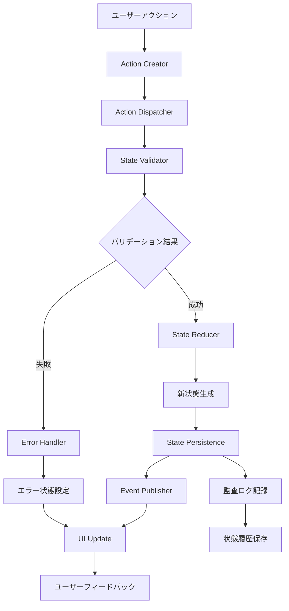
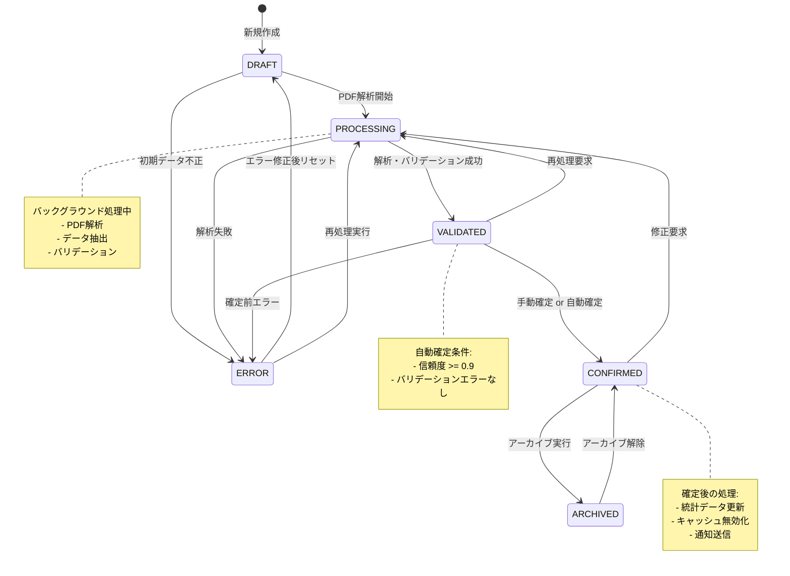
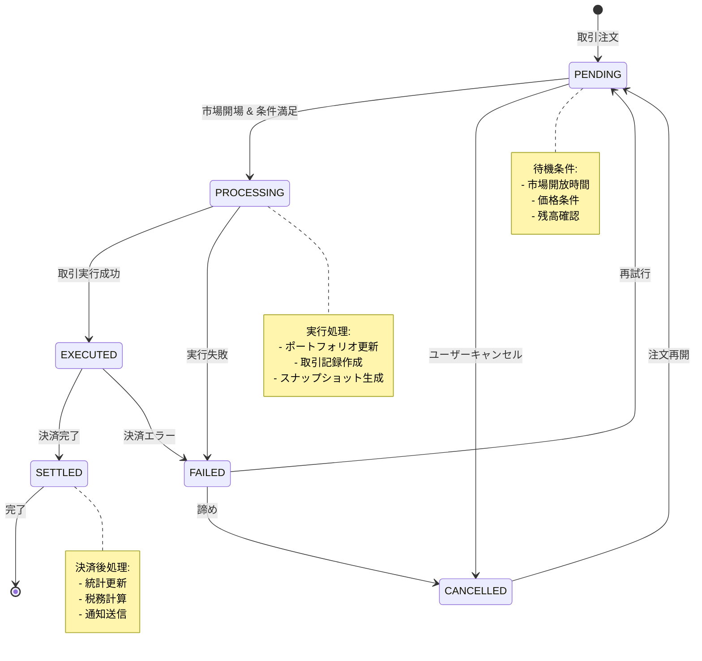
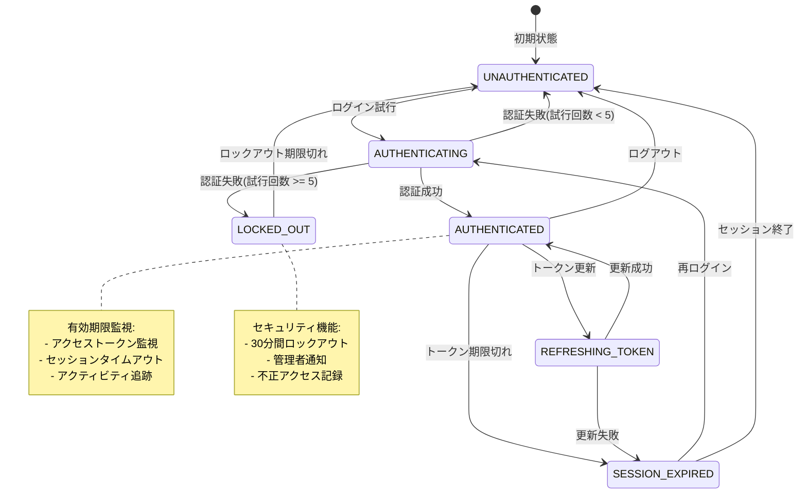

# 状態遷移詳細設計書

## 文書情報
- **作成日**: 2025-08-10
- **作成者**: エキスパートプロセスフロー設計者
- **バージョン**: 1.0.0
- **ステータス**: 詳細設計フェーズ
- **前提条件**: 14-01_process-flow.md及び14-02_data-transformation.mdの完了

---

## 1. 状態遷移設計概要

### 1.1 状態管理戦略

本システムの状態遷移は、以下の原則に基づいて設計されています：

| 原則 | 実装戦略 | 品質保証 |
|------|----------|----------|
| **状態不変性** | イミュータブルな状態変更 | 予期しない副作用の防止 |
| **単方向データフロー** | Redux/Flux パターン | 状態変更の追跡可能性 |
| **原子性** | 状態変更のトランザクション保証 | データ一貫性の確保 |
| **監査可能性** | 全状態変更の記録 | 完全な変更履歴 |
| **復旧可能性** | 状態のロールバック機能 | システム障害からの回復 |

### 1.2 状態遷移アーキテクチャ



---

## 2. 給料明細状態遷移

### 2.1 給料明細ライフサイクル状態

```typescript
enum SalarySlipStatus {
  DRAFT = 'draft',           // 下書き
  PROCESSING = 'processing', // 処理中
  VALIDATED = 'validated',   // バリデーション済み
  CONFIRMED = 'confirmed',   // 確定
  ARCHIVED = 'archived',     // アーカイブ済み
  ERROR = 'error'           // エラー状態
}

interface SalarySlipState {
  id: string;
  status: SalarySlipStatus;
  data: SalarySlipData;
  metadata: {
    createdAt: Date;
    updatedAt: Date;
    version: number;
    processingSteps: ProcessingStep[];
    confidence?: number;
    validationResults?: ValidationResult[];
  };
  transitions: {
    allowedTransitions: SalarySlipStatus[];
    lastTransition?: StateTransition;
    transitionHistory: StateTransition[];
  };
}

class SalarySlipStateMachine {
  private static readonly TRANSITION_RULES: Map<SalarySlipStatus, SalarySlipStatus[]> = new Map([
    [SalarySlipStatus.DRAFT, [SalarySlipStatus.PROCESSING, SalarySlipStatus.ERROR]],
    [SalarySlipStatus.PROCESSING, [SalarySlipStatus.VALIDATED, SalarySlipStatus.ERROR]],
    [SalarySlipStatus.VALIDATED, [SalarySlipStatus.CONFIRMED, SalarySlipStatus.PROCESSING, SalarySlipStatus.ERROR]],
    [SalarySlipStatus.CONFIRMED, [SalarySlipStatus.ARCHIVED, SalarySlipStatus.PROCESSING]],
    [SalarySlipStatus.ARCHIVED, [SalarySlipStatus.CONFIRMED]], // アーカイブ解除可能
    [SalarySlipStatus.ERROR, [SalarySlipStatus.DRAFT, SalarySlipStatus.PROCESSING]]
  ]);

  constructor(
    private readonly eventBus: EventBus,
    private readonly auditService: AuditService,
    private readonly logger: Logger
  ) {}

  async transitionTo(
    currentState: SalarySlipState,
    targetStatus: SalarySlipStatus,
    context: StateTransitionContext
  ): Promise<StateTransitionResult<SalarySlipState>> {
    
    const transitionId = generateTransitionId();
    
    try {
      // 遷移可能性チェック
      this.validateTransition(currentState.status, targetStatus);
      
      // 前提条件チェック
      await this.checkPreconditions(currentState, targetStatus, context);
      
      // 状態変更実行
      const newState = await this.executeTransition(
        currentState,
        targetStatus,
        context,
        transitionId
      );
      
      // 後処理実行
      await this.executePostTransitionActions(newState, context, transitionId);
      
      return StateTransitionResult.success(newState, transitionId);
      
    } catch (error) {
      await this.handleTransitionError(currentState, targetStatus, error, transitionId);
      return StateTransitionResult.failure(error, transitionId);
    }
  }
  
  private validateTransition(
    currentStatus: SalarySlipStatus,
    targetStatus: SalarySlipStatus
  ): void {
    
    const allowedTransitions = SalarySlipStateMachine.TRANSITION_RULES.get(currentStatus);
    
    if (!allowedTransitions?.includes(targetStatus)) {
      throw new InvalidStateTransitionError(
        `Invalid transition from ${currentStatus} to ${targetStatus}`,
        currentStatus,
        targetStatus
      );
    }
  }
  
  private async checkPreconditions(
    currentState: SalarySlipState,
    targetStatus: SalarySlipStatus,
    context: StateTransitionContext
  ): Promise<void> {
    
    switch (targetStatus) {
      case SalarySlipStatus.VALIDATED:
        await this.checkValidationPreconditions(currentState);
        break;
        
      case SalarySlipStatus.CONFIRMED:
        await this.checkConfirmationPreconditions(currentState);
        break;
        
      case SalarySlipStatus.ARCHIVED:
        await this.checkArchivePreconditions(currentState, context);
        break;
    }
  }
  
  private async checkValidationPreconditions(state: SalarySlipState): Promise<void> {
    if (!state.data.companyName?.trim()) {
      throw new PreconditionError('Company name is required for validation');
    }
    
    if (!state.data.paymentDate) {
      throw new PreconditionError('Payment date is required for validation');
    }
    
    if (!state.data.totalEarnings || Number(state.data.totalEarnings) <= 0) {
      throw new PreconditionError('Valid total earnings required for validation');
    }
  }
  
  private async checkConfirmationPreconditions(state: SalarySlipState): Promise<void> {
    if (!state.metadata.validationResults?.length) {
      throw new PreconditionError('Validation results required for confirmation');
    }
    
    const hasValidationErrors = state.metadata.validationResults.some(
      result => !result.isValid
    );
    
    if (hasValidationErrors) {
      throw new PreconditionError('Cannot confirm salary slip with validation errors');
    }
    
    // 信頼度チェック
    if (state.metadata.confidence && state.metadata.confidence < 0.7) {
      throw new PreconditionError('Confidence level too low for automatic confirmation');
    }
  }
  
  private async checkArchivePreconditions(
    state: SalarySlipState,
    context: StateTransitionContext
  ): Promise<void> {
    
    // アーカイブ期間チェック
    const monthsOld = this.calculateMonthsOld(state.data.paymentDate);
    if (monthsOld < 12) { // 12ヶ月未満はアーカイブ不可
      throw new PreconditionError('Salary slip must be at least 12 months old to archive');
    }
    
    // ユーザー権限チェック
    if (!context.user.hasPermission('archive_salary_slips')) {
      throw new PreconditionError('User does not have permission to archive salary slips');
    }
  }
  
  private async executeTransition(
    currentState: SalarySlipState,
    targetStatus: SalarySlipStatus,
    context: StateTransitionContext,
    transitionId: string
  ): Promise<SalarySlipState> {
    
    const transition: StateTransition = {
      id: transitionId,
      fromStatus: currentState.status,
      toStatus: targetStatus,
      triggeredBy: context.user.id,
      triggeredAt: new Date(),
      reason: context.reason,
      metadata: context.metadata
    };
    
    const newState: SalarySlipState = {
      ...currentState,
      status: targetStatus,
      metadata: {
        ...currentState.metadata,
        updatedAt: new Date(),
        version: currentState.metadata.version + 1
      },
      transitions: {
        allowedTransitions: SalarySlipStateMachine.TRANSITION_RULES.get(targetStatus) || [],
        lastTransition: transition,
        transitionHistory: [...currentState.transitions.transitionHistory, transition]
      }
    };
    
    // 状態固有の処理
    switch (targetStatus) {
      case SalarySlipStatus.PROCESSING:
        await this.handleProcessingTransition(newState, context);
        break;
        
      case SalarySlipStatus.VALIDATED:
        await this.handleValidationTransition(newState, context);
        break;
        
      case SalarySlipStatus.CONFIRMED:
        await this.handleConfirmationTransition(newState, context);
        break;
        
      case SalarySlipStatus.ARCHIVED:
        await this.handleArchiveTransition(newState, context);
        break;
    }
    
    return newState;
  }
  
  private async handleProcessingTransition(
    state: SalarySlipState,
    context: StateTransitionContext
  ): Promise<void> {
    
    // バックグラウンド処理ジョブをキューに追加
    await context.jobQueue.add('process-salary-slip', {
      salarySlipId: state.id,
      userId: context.user.id,
      processingOptions: context.metadata?.processingOptions
    });
    
    // 処理開始ログ
    this.logger.info(`Salary slip processing started`, {
      salarySlipId: state.id,
      userId: context.user.id
    });
  }
  
  private async handleValidationTransition(
    state: SalarySlipState,
    context: StateTransitionContext
  ): Promise<void> {
    
    // バリデーション結果をメタデータに追加
    if (context.validationResults) {
      state.metadata.validationResults = context.validationResults;
    }
    
    // 自動確定の判定
    const shouldAutoConfirm = this.shouldAutoConfirm(state);
    if (shouldAutoConfirm) {
      // 自動確定フローをトリガー
      setTimeout(() => {
        this.transitionTo(state, SalarySlipStatus.CONFIRMED, {
          ...context,
          reason: 'automatic_confirmation'
        });
      }, 5000); // 5秒後に自動確定
    }
  }
  
  private async handleConfirmationTransition(
    state: SalarySlipState,
    context: StateTransitionContext
  ): Promise<void> {
    
    // 統計データ更新をトリガー
    await context.jobQueue.add('update-salary-statistics', {
      userId: context.user.id,
      salarySlipId: state.id
    });
    
    // キャッシュ無効化
    await context.cacheService.invalidatePattern(`salary:${context.user.id}:*`);
    
    // 通知送信
    await this.sendConfirmationNotification(state, context);
  }
  
  private async handleArchiveTransition(
    state: SalarySlipState,
    context: StateTransitionContext
  ): Promise<void> {
    
    // アーカイブストレージに移動
    await context.archiveService.archiveSalarySlip(state);
    
    // 検索インデックスから除外
    await context.searchService.removeFromIndex(state.id);
    
    // データ保持ポリシーの適用
    await this.applyRetentionPolicy(state, context);
  }
  
  private shouldAutoConfirm(state: SalarySlipState): boolean {
    // 高い信頼度 && バリデーションエラーなし
    const highConfidence = (state.metadata.confidence || 0) >= 0.9;
    const noValidationErrors = state.metadata.validationResults?.every(r => r.isValid) ?? false;
    
    return highConfidence && noValidationErrors;
  }
  
  private async executePostTransitionActions(
    newState: SalarySlipState,
    context: StateTransitionContext,
    transitionId: string
  ): Promise<void> {
    
    // イベント発行
    await this.eventBus.publish(new SalarySlipStateChangedEvent({
      salarySlipId: newState.id,
      fromStatus: newState.transitions.lastTransition!.fromStatus,
      toStatus: newState.status,
      transitionId,
      userId: context.user.id,
      timestamp: new Date()
    }));
    
    // 監査ログ記録
    await this.auditService.logStateTransition({
      entityType: 'salary_slip',
      entityId: newState.id,
      userId: context.user.id,
      action: 'state_transition',
      details: {
        fromStatus: newState.transitions.lastTransition!.fromStatus,
        toStatus: newState.status,
        transitionId,
        reason: context.reason
      }
    });
  }
}
```

### 2.2 給料明細状態遷移図



---

## 3. 株式ポートフォリオ状態遷移

### 3.1 株式取引状態

```typescript
enum StockTransactionStatus {
  PENDING = 'pending',       // 保留中
  PROCESSING = 'processing', // 処理中
  EXECUTED = 'executed',     // 実行済み
  SETTLED = 'settled',       // 決済完了
  CANCELLED = 'cancelled',   // キャンセル
  FAILED = 'failed'          // 失敗
}

interface StockTransactionState {
  id: string;
  status: StockTransactionStatus;
  transaction: StockTransaction;
  portfolio: {
    before: PortfolioSnapshot;
    after?: PortfolioSnapshot;
  };
  metadata: {
    submittedAt: Date;
    executedAt?: Date;
    settledAt?: Date;
    marketConditions?: MarketCondition;
    executionPrice?: MoneyAmount;
    slippage?: number;
  };
}

class StockTransactionStateMachine {
  private static readonly TRANSITION_RULES = new Map<StockTransactionStatus, StockTransactionStatus[]>([
    [StockTransactionStatus.PENDING, [StockTransactionStatus.PROCESSING, StockTransactionStatus.CANCELLED]],
    [StockTransactionStatus.PROCESSING, [StockTransactionStatus.EXECUTED, StockTransactionStatus.FAILED]],
    [StockTransactionStatus.EXECUTED, [StockTransactionStatus.SETTLED, StockTransactionStatus.FAILED]],
    [StockTransactionStatus.SETTLED, []], // 最終状態
    [StockTransactionStatus.CANCELLED, [StockTransactionStatus.PENDING]], // 再開可能
    [StockTransactionStatus.FAILED, [StockTransactionStatus.PENDING, StockTransactionStatus.CANCELLED]]
  ]);

  async processTransaction(
    transactionState: StockTransactionState,
    context: TransactionProcessingContext
  ): Promise<StockTransactionState> {
    
    switch (transactionState.status) {
      case StockTransactionStatus.PENDING:
        return await this.processPendingTransaction(transactionState, context);
        
      case StockTransactionStatus.PROCESSING:
        return await this.executeTransaction(transactionState, context);
        
      case StockTransactionStatus.EXECUTED:
        return await this.settleTransaction(transactionState, context);
        
      default:
        throw new Error(`Cannot process transaction in status: ${transactionState.status}`);
    }
  }
  
  private async processPendingTransaction(
    state: StockTransactionState,
    context: TransactionProcessingContext
  ): Promise<StockTransactionState> {
    
    // 市場開放時間チェック
    if (!this.isMarketOpen(context.currentTime)) {
      // 市場閉場中は次の開場時間まで待機
      return this.scheduleForNextMarketOpen(state, context);
    }
    
    // ポートフォリオ残高チェック
    await this.validatePortfolioBalance(state, context);
    
    // 現在の市場価格取得
    const currentPrice = await context.priceService.getCurrentPrice(state.transaction.stockId);
    
    // 価格条件チェック
    if (this.shouldExecuteAtCurrentPrice(state.transaction, currentPrice)) {
      return this.transitionTo(state, StockTransactionStatus.PROCESSING, {
        executionPrice: currentPrice,
        marketConditions: await context.marketService.getCurrentConditions()
      });
    }
    
    return state; // 条件未満で待機継続
  }
  
  private async executeTransaction(
    state: StockTransactionState,
    context: TransactionProcessingContext
  ): Promise<StockTransactionState> {
    
    try {
      // ポートフォリオ更新処理
      const updatedPortfolio = await this.updatePortfolio(state, context);
      
      // 取引記録作成
      await context.transactionRepository.save(state.transaction);
      
      // ポートフォリオスナップショット作成
      const afterSnapshot = await this.createPortfolioSnapshot(updatedPortfolio);
      
      const executedState = {
        ...state,
        status: StockTransactionStatus.EXECUTED,
        portfolio: {
          ...state.portfolio,
          after: afterSnapshot
        },
        metadata: {
          ...state.metadata,
          executedAt: new Date(),
          executionPrice: context.executionPrice
        }
      };
      
      // 即座決済（国内株式の場合）
      if (this.isInstantSettlement(state.transaction)) {
        return this.transitionTo(executedState, StockTransactionStatus.SETTLED);
      }
      
      return executedState;
      
    } catch (error) {
      return this.transitionTo(state, StockTransactionStatus.FAILED, {
        error: error.message
      });
    }
  }
  
  private async updatePortfolio(
    state: StockTransactionState,
    context: TransactionProcessingContext
  ): Promise<StockPortfolio> {
    
    const currentPortfolio = await context.portfolioRepository.findByUserAndStock(
      state.transaction.userId,
      state.transaction.stockId
    );
    
    switch (state.transaction.transactionType) {
      case 'buy':
        return this.processBuyTransaction(currentPortfolio, state.transaction, context);
        
      case 'sell':
        return this.processSellTransaction(currentPortfolio, state.transaction, context);
        
      case 'dividend':
        return this.processDividendTransaction(currentPortfolio, state.transaction, context);
        
      default:
        throw new Error(`Unsupported transaction type: ${state.transaction.transactionType}`);
    }
  }
  
  private async processBuyTransaction(
    portfolio: StockPortfolio | null,
    transaction: StockTransaction,
    context: TransactionProcessingContext
  ): Promise<StockPortfolio> {
    
    if (!portfolio) {
      // 新規ポートフォリオ作成
      return StockPortfolio.create({
        userId: transaction.userId,
        stockId: transaction.stockId,
        quantity: transaction.quantity,
        averagePurchasePrice: transaction.pricePerShare,
        totalInvestment: transaction.totalAmount,
        firstPurchaseDate: transaction.transactionDate,
        lastPurchaseDate: transaction.transactionDate
      });
    }
    
    // 既存ポートフォリオ更新
    const newTotalInvestment = portfolio.totalInvestment.plus(transaction.totalAmount);
    const newQuantity = portfolio.quantity.plus(transaction.quantity);
    const newAveragePrice = newTotalInvestment.dividedBy(newQuantity);
    
    portfolio.updatePurchase({
      quantity: newQuantity,
      averagePurchasePrice: newAveragePrice,
      totalInvestment: newTotalInvestment,
      lastPurchaseDate: transaction.transactionDate
    });
    
    // 現在価値更新
    const currentPrice = await context.priceService.getCurrentPrice(transaction.stockId);
    if (currentPrice) {
      portfolio.updateValuation(currentPrice);
    }
    
    return portfolio;
  }
  
  private async processSellTransaction(
    portfolio: StockPortfolio | null,
    transaction: StockTransaction,
    context: TransactionProcessingContext
  ): Promise<StockPortfolio> {
    
    if (!portfolio || portfolio.quantity.lt(transaction.quantity)) {
      throw new InsufficientQuantityError(
        `Insufficient quantity for sell transaction. Available: ${portfolio?.quantity || 0}, Required: ${transaction.quantity}`
      );
    }
    
    // 売却後の数量計算
    const remainingQuantity = portfolio.quantity.minus(transaction.quantity);
    
    if (remainingQuantity.isZero()) {
      // 全売却の場合
      portfolio.markAsClosed(transaction.transactionDate);
      
      // 実現損益計算
      const realizedGainLoss = this.calculateRealizedGainLoss(
        portfolio.averagePurchasePrice,
        transaction.pricePerShare,
        transaction.quantity
      );
      
      portfolio.addRealizedGainLoss(realizedGainLoss);
      
    } else {
      // 部分売却の場合
      const soldInvestment = portfolio.averagePurchasePrice.multipliedBy(transaction.quantity);
      const remainingInvestment = portfolio.totalInvestment.minus(soldInvestment);
      
      portfolio.updateSale({
        quantity: remainingQuantity,
        totalInvestment: remainingInvestment,
        lastSaleDate: transaction.transactionDate
      });
      
      // 現在価値更新
      const currentPrice = await context.priceService.getCurrentPrice(transaction.stockId);
      if (currentPrice) {
        portfolio.updateValuation(currentPrice);
      }
    }
    
    return portfolio;
  }
}
```

### 3.2 株式取引状態遷移図



---

## 4. ユーザーセッション状態遷移

### 4.1 認証状態管理

```typescript
enum AuthenticationStatus {
  UNAUTHENTICATED = 'unauthenticated',
  AUTHENTICATING = 'authenticating',
  AUTHENTICATED = 'authenticated',
  REFRESHING_TOKEN = 'refreshing_token',
  SESSION_EXPIRED = 'session_expired',
  LOCKED_OUT = 'locked_out'
}

interface UserSessionState {
  sessionId: string;
  userId?: string;
  status: AuthenticationStatus;
  tokens: {
    accessToken?: string;
    refreshToken?: string;
    expiresAt?: Date;
  };
  security: {
    lastActivity: Date;
    loginAttempts: number;
    lockoutUntil?: Date;
    deviceInfo: DeviceInfo;
    ipAddress: string;
    location?: GeoLocation;
  };
  permissions: Permission[];
  preferences: UserPreferences;
}

class UserSessionStateMachine {
  constructor(
    private readonly tokenService: TokenService,
    private readonly securityService: SecurityService,
    private readonly auditService: AuditService
  ) {}
  
  async authenticate(
    sessionState: UserSessionState,
    credentials: AuthenticationCredentials
  ): Promise<UserSessionState> {
    
    // アカウントロックチェック
    if (this.isLockedOut(sessionState)) {
      throw new AccountLockedError('Account is temporarily locked due to too many failed attempts');
    }
    
    const newState = this.transitionTo(sessionState, AuthenticationStatus.AUTHENTICATING);
    
    try {
      // 認証実行
      const authResult = await this.securityService.authenticate(credentials);
      
      if (!authResult.success) {
        return this.handleFailedAuthentication(newState, authResult.reason);
      }
      
      // 成功時の処理
      const authenticatedState = {
        ...newState,
        status: AuthenticationStatus.AUTHENTICATED,
        userId: authResult.userId,
        tokens: {
          accessToken: authResult.accessToken,
          refreshToken: authResult.refreshToken,
          expiresAt: authResult.expiresAt
        },
        permissions: authResult.permissions,
        preferences: await this.loadUserPreferences(authResult.userId),
        security: {
          ...newState.security,
          loginAttempts: 0,
          lockoutUntil: undefined,
          lastActivity: new Date()
        }
      };
      
      // セッション永続化
      await this.persistSession(authenticatedState);
      
      // 監査ログ
      await this.auditService.logAuthentication({
        userId: authResult.userId,
        sessionId: authenticatedState.sessionId,
        success: true,
        ipAddress: authenticatedState.security.ipAddress,
        deviceInfo: authenticatedState.security.deviceInfo
      });
      
      return authenticatedState;
      
    } catch (error) {
      return this.handleAuthenticationError(newState, error);
    }
  }
  
  async refreshToken(sessionState: UserSessionState): Promise<UserSessionState> {
    if (sessionState.status !== AuthenticationStatus.AUTHENTICATED) {
      throw new Error('Cannot refresh token for non-authenticated session');
    }
    
    const refreshingState = this.transitionTo(sessionState, AuthenticationStatus.REFRESHING_TOKEN);
    
    try {
      const refreshResult = await this.tokenService.refreshAccessToken(
        sessionState.tokens.refreshToken!
      );
      
      const refreshedState = {
        ...refreshingState,
        status: AuthenticationStatus.AUTHENTICATED,
        tokens: {
          accessToken: refreshResult.accessToken,
          refreshToken: refreshResult.refreshToken || sessionState.tokens.refreshToken,
          expiresAt: refreshResult.expiresAt
        },
        security: {
          ...refreshingState.security,
          lastActivity: new Date()
        }
      };
      
      await this.persistSession(refreshedState);
      
      return refreshedState;
      
    } catch (error) {
      // リフレッシュ失敗時はセッション期限切れに
      return this.transitionTo(refreshingState, AuthenticationStatus.SESSION_EXPIRED);
    }
  }
  
  async logout(sessionState: UserSessionState): Promise<UserSessionState> {
    // トークン無効化
    if (sessionState.tokens.accessToken) {
      await this.tokenService.revokeToken(sessionState.tokens.accessToken);
    }
    
    if (sessionState.tokens.refreshToken) {
      await this.tokenService.revokeToken(sessionState.tokens.refreshToken);
    }
    
    // セッション削除
    await this.deleteSession(sessionState.sessionId);
    
    // 監査ログ
    if (sessionState.userId) {
      await this.auditService.logLogout({
        userId: sessionState.userId,
        sessionId: sessionState.sessionId,
        ipAddress: sessionState.security.ipAddress
      });
    }
    
    return {
      ...sessionState,
      status: AuthenticationStatus.UNAUTHENTICATED,
      userId: undefined,
      tokens: {},
      permissions: [],
      preferences: {}
    };
  }
  
  private handleFailedAuthentication(
    state: UserSessionState,
    reason: string
  ): UserSessionState {
    
    const newAttempts = state.security.loginAttempts + 1;
    const maxAttempts = 5;
    
    let newState = {
      ...state,
      status: AuthenticationStatus.UNAUTHENTICATED,
      security: {
        ...state.security,
        loginAttempts: newAttempts
      }
    };
    
    // ロックアウト判定
    if (newAttempts >= maxAttempts) {
      const lockoutDuration = 30 * 60 * 1000; // 30分
      newState = {
        ...newState,
        status: AuthenticationStatus.LOCKED_OUT,
        security: {
          ...newState.security,
          lockoutUntil: new Date(Date.now() + lockoutDuration)
        }
      };
    }
    
    return newState;
  }
  
  private isLockedOut(state: UserSessionState): boolean {
    return state.status === AuthenticationStatus.LOCKED_OUT &&
           state.security.lockoutUntil &&
           state.security.lockoutUntil > new Date();
  }
}
```

### 4.2 セッション状態遷移図



---

## 5. システム全体の状態同期

### 5.1 状態同期アーキテクチャ

```typescript
interface GlobalState {
  user: UserSessionState;
  salarySlips: Map<string, SalarySlipState>;
  portfolio: Map<string, StockPortfolioState>;
  dashboard: DashboardState;
  ui: UIState;
}

class StateManager {
  private state: GlobalState;
  private subscribers: Map<string, StateSubscriber[]> = new Map();
  private middleware: StateMiddleware[] = [];
  
  constructor(
    private readonly persistenceService: StatePersistenceService,
    private readonly eventBus: EventBus
  ) {
    this.state = this.initializeState();
    this.setupEventHandlers();
  }
  
  async dispatch<T>(action: StateAction<T>): Promise<void> {
    let currentAction = action;
    
    // ミドルウェア適用
    for (const middleware of this.middleware) {
      currentAction = await middleware.process(currentAction, this.state);
    }
    
    // 状態更新実行
    const newState = await this.executeAction(currentAction);
    
    // 状態変更の通知
    await this.notifyStateChange(action.type, this.state, newState);
    
    // 状態更新
    this.state = newState;
    
    // 永続化
    if (action.shouldPersist !== false) {
      await this.persistState(action.type, newState);
    }
  }
  
  subscribe<T>(stateKey: string, subscriber: StateSubscriber<T>): UnsubscribeFunction {
    if (!this.subscribers.has(stateKey)) {
      this.subscribers.set(stateKey, []);
    }
    
    this.subscribers.get(stateKey)!.push(subscriber);
    
    // 購読解除関数を返す
    return () => {
      const subscribers = this.subscribers.get(stateKey);
      if (subscribers) {
        const index = subscribers.indexOf(subscriber);
        if (index > -1) {
          subscribers.splice(index, 1);
        }
      }
    };
  }
  
  private async executeAction<T>(action: StateAction<T>): Promise<GlobalState> {
    const reducer = this.getReducer(action.type);
    return await reducer.reduce(this.state, action);
  }
  
  private async notifyStateChange<T>(
    actionType: string,
    oldState: GlobalState,
    newState: GlobalState
  ): Promise<void> {
    
    // 変更されたキーを検出
    const changedKeys = this.detectChangedKeys(oldState, newState);
    
    // 関連する購読者に通知
    const notificationPromises = changedKeys.map(async (key) => {
      const subscribers = this.subscribers.get(key) || [];
      
      await Promise.all(
        subscribers.map(subscriber =>
          subscriber.onStateChange(newState[key], oldState[key], actionType)
        )
      );
    });
    
    await Promise.allSettled(notificationPromises);
    
    // グローバルイベント発行
    await this.eventBus.publish(new StateChangedEvent({
      actionType,
      changedKeys,
      timestamp: new Date()
    }));
  }
  
  private detectChangedKeys(oldState: GlobalState, newState: GlobalState): string[] {
    const changedKeys: string[] = [];
    
    for (const [key, newValue] of Object.entries(newState)) {
      const oldValue = oldState[key];
      
      if (!this.deepEqual(oldValue, newValue)) {
        changedKeys.push(key);
      }
    }
    
    return changedKeys;
  }
  
  private deepEqual(obj1: any, obj2: any): boolean {
    if (obj1 === obj2) return true;
    
    if (obj1 instanceof Date && obj2 instanceof Date) {
      return obj1.getTime() === obj2.getTime();
    }
    
    if (!obj1 || !obj2 || (typeof obj1 !== 'object') || (typeof obj2 !== 'object')) {
      return obj1 === obj2;
    }
    
    const keys1 = Object.keys(obj1);
    const keys2 = Object.keys(obj2);
    
    if (keys1.length !== keys2.length) return false;
    
    for (const key of keys1) {
      if (!keys2.includes(key)) return false;
      if (!this.deepEqual(obj1[key], obj2[key])) return false;
    }
    
    return true;
  }
}

// ミドルウェアの実装例
class AuditMiddleware implements StateMiddleware {
  constructor(private readonly auditService: AuditService) {}
  
  async process<T>(action: StateAction<T>, currentState: GlobalState): Promise<StateAction<T>> {
    // 重要な操作の監査ログ記録
    if (this.isCriticalAction(action.type)) {
      await this.auditService.logStateAction({
        actionType: action.type,
        userId: currentState.user.userId,
        payload: action.payload,
        timestamp: new Date()
      });
    }
    
    return action;
  }
  
  private isCriticalAction(actionType: string): boolean {
    const criticalActions = [
      'CONFIRM_SALARY_SLIP',
      'EXECUTE_STOCK_TRANSACTION',
      'ARCHIVE_DATA',
      'DELETE_ENTITY'
    ];
    
    return criticalActions.includes(actionType);
  }
}

class ValidationMiddleware implements StateMiddleware {
  async process<T>(action: StateAction<T>, currentState: GlobalState): Promise<StateAction<T>> {
    // アクション実行前のバリデーション
    const validator = this.getValidator(action.type);
    
    if (validator) {
      const validationResult = await validator.validate(action, currentState);
      
      if (!validationResult.isValid) {
        throw new ActionValidationError(
          `Action validation failed: ${action.type}`,
          validationResult.errors
        );
      }
    }
    
    return action;
  }
  
  private getValidator(actionType: string): ActionValidator | null {
    // アクションタイプに応じたバリデーターを返す
    switch (actionType) {
      case 'CONFIRM_SALARY_SLIP':
        return new ConfirmSalarySlipValidator();
      case 'EXECUTE_STOCK_TRANSACTION':
        return new ExecuteStockTransactionValidator();
      default:
        return null;
    }
  }
}
```

### 5.2 リアルタイム状態同期

```typescript
class RealTimeStateSynchronizer {
  private websocketService: WebSocketService;
  private conflictResolver: StateConflictResolver;
  
  constructor(
    private readonly stateManager: StateManager,
    private readonly userService: UserService
  ) {
    this.websocketService = new WebSocketService();
    this.conflictResolver = new StateConflictResolver();
    this.setupRealTimeSync();
  }
  
  private setupRealTimeSync(): void {
    // 状態変更の監視
    this.stateManager.subscribe('*', async (newState, oldState, actionType) => {
      await this.broadcastStateChange({
        actionType,
        stateChange: this.calculateStateDelta(oldState, newState),
        timestamp: new Date(),
        userId: newState.user.userId
      });
    });
    
    // リモート状態変更の受信
    this.websocketService.onMessage('state_change', async (message) => {
      await this.handleRemoteStateChange(message);
    });
  }
  
  private async handleRemoteStateChange(message: RemoteStateChangeMessage): Promise<void> {
    try {
      // コンフリクト検出
      const conflict = await this.conflictResolver.detectConflict(
        message.stateChange,
        this.stateManager.getCurrentState()
      );
      
      if (conflict.hasConflict) {
        // コンフリクト解決
        const resolution = await this.conflictResolver.resolve(conflict);
        await this.applyResolution(resolution);
      } else {
        // コンフリクトなしの場合は直接適用
        await this.applyRemoteStateChange(message.stateChange);
      }
      
    } catch (error) {
      console.error('Failed to handle remote state change:', error);
      
      // フォールバック: サーバーから最新状態を取得
      await this.syncWithServer();
    }
  }
  
  private calculateStateDelta(oldState: any, newState: any): StateDelta {
    // 状態差分を計算
    return {
      added: this.getAddedItems(oldState, newState),
      modified: this.getModifiedItems(oldState, newState),
      deleted: this.getDeletedItems(oldState, newState)
    };
  }
  
  private async syncWithServer(): Promise<void> {
    // サーバーから最新の状態を取得して強制同期
    const serverState = await this.userService.getCurrentUserState();
    await this.stateManager.dispatch({
      type: 'FORCE_SYNC_STATE',
      payload: serverState,
      shouldPersist: true
    });
  }
}
```

---

## 6. 次のステップ

1. ✅ 主要機能の詳細処理フロー設計 (14-01_process-flow.md)
2. ✅ データ変換ロジック詳細設計 (14-02_data-transformation.md)
3. ✅ 状態遷移詳細設計 (14-03_state-transition.md) ← 本書

**処理フロー設計が完了しました。**

次は：
- error-handling-designer によるエラーハンドリング設計
- logging-design-architect によるログ設計

---

## 承認

| 役割 | 名前 | 日付 | 署名 |
|------|------|------|------|
| プロセスフロー設計者 | エキスパートプロセスフロー設計者 | 2025-08-10 | ✅ |
| レビュアー | - | - | [ ] |
| 承認者 | - | - | [ ] |

---

**改訂履歴**

| バージョン | 日付 | 変更内容 | 作成者 |
|-----------|------|----------|---------|
| 1.0.0 | 2025-08-10 | 初版作成 | エキスパートプロセスフロー設計者 |