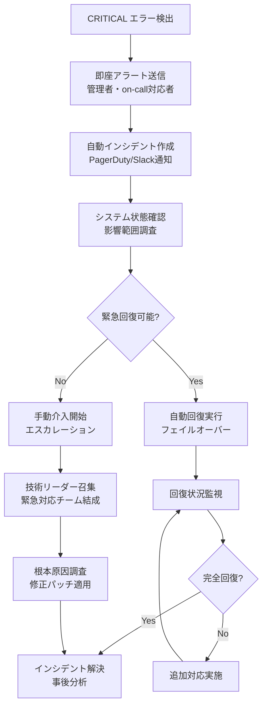
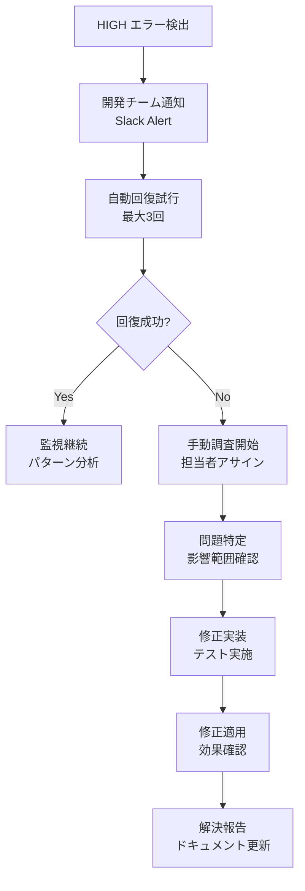
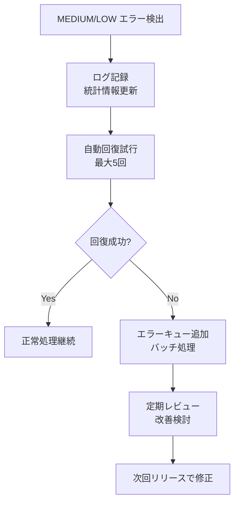

# エラー分類体系詳細定義書

## 文書情報

- **作成日**: 2025-08-10
- **作成者**: エキスパートエラーハンドリング設計アーキテクト
- **バージョン**: 1.0.0
- **ステータス**: 詳細設計フェーズ
- **前提条件**: error-handling-strategyの完了

---

## 1. エラー分類概要

### 1.1 分類軸と階層構造

本給料管理システムでは、以下の3軸でエラーを体系的に分類します：

```
エラー分類マトリクス
┌─────────────┬─────────────┬─────────────┬─────────────┬─────────────┐
│    軸       │   レベル1   │   レベル2   │   レベル3   │   レベル4   │
├─────────────┼─────────────┼─────────────┼─────────────┼─────────────┤
│ **発生源軸** │ ドメイン     │ 機能        │ サブ機能     │ 具体処理     │
│ **重要度軸** │ 緊急レベル   │ エラーレベル │ 警告レベル   │ 情報レベル   │
│ **対応軸**   │ 即座対応    │ 1時間以内   │ 1日以内     │ 次回リリース │
└─────────────┴─────────────┴─────────────┴─────────────┴─────────────┘
```

### 1.2 統一エラーコード体系

```
エラーコード形式: [DOMAIN]-[CATEGORY]-[SEVERITY]-[SEQUENCE]

例:
- SALARY-VALIDATION-MEDIUM-001: 給料明細バリデーションエラー
- PORTFOLIO-API-HIGH-015: 株式API接続エラー
- AUTH-SESSION-CRITICAL-003: セッション認証重大エラー
```

---

## 2. ドメイン別エラー分類

### 2.1 認証・認可ドメイン (AUTH)

#### AUTH-AUTHENTICATION カテゴリ

| エラーコード                       | 重要度   | エラー名                    | 発生条件             | ユーザーメッセージ                                                          | 対応方法         |
| ---------------------------------- | -------- | --------------------------- | -------------------- | --------------------------------------------------------------------------- | ---------------- |
| `AUTH-AUTHENTICATION-CRITICAL-001` | CRITICAL | AuthenticationSystemFailure | 認証システム全体停止 | 「認証システムに障害が発生しています。管理者に連絡してください」            | 即座システム復旧 |
| `AUTH-AUTHENTICATION-HIGH-001`     | HIGH     | InvalidCredentials          | ログイン情報不正     | 「メールアドレスまたはパスワードが間違っています」                          | ユーザー入力確認 |
| `AUTH-AUTHENTICATION-HIGH-002`     | HIGH     | AccountLocked               | アカウントロック状態 | 「アカウントがロックされています。{lockUntil}まで待ってからお試しください」 | 時間経過待機     |
| `AUTH-AUTHENTICATION-HIGH-003`     | HIGH     | TooManyAttempts             | ログイン試行回数超過 | 「ログイン試行回数が上限を超えました。{retryAfter}後に再度お試しください」  | レート制限待機   |
| `AUTH-AUTHENTICATION-MEDIUM-001`   | MEDIUM   | WeakPassword                | 脆弱パスワード       | 「より強力なパスワードを設定してください」                                  | パスワード変更   |
| `AUTH-AUTHENTICATION-MEDIUM-002`   | MEDIUM   | PasswordExpired             | パスワード期限切れ   | 「パスワードの有効期限が切れています。新しいパスワードを設定してください」  | パスワード更新   |

#### AUTH-AUTHORIZATION カテゴリ

| エラーコード                    | 重要度 | エラー名                | 発生条件             | ユーザーメッセージ                                                 | 対応方法       |
| ------------------------------- | ------ | ----------------------- | -------------------- | ------------------------------------------------------------------ | -------------- |
| `AUTH-AUTHORIZATION-HIGH-001`   | HIGH   | InsufficientPermissions | アクセス権限不足     | 「この機能にアクセスする権限がありません」                         | 権限確認・要求 |
| `AUTH-AUTHORIZATION-HIGH-002`   | HIGH   | ResourceAccessDenied    | リソースアクセス拒否 | 「このデータにアクセスする権限がありません」                       | 所有者確認     |
| `AUTH-AUTHORIZATION-MEDIUM-001` | MEDIUM | RoleExpired             | ロール期限切れ       | 「アクセス権限の有効期限が切れています。管理者に連絡してください」 | 権限更新       |

#### AUTH-SESSION カテゴリ

| エラーコード                | 重要度   | エラー名            | 発生条件             | ユーザーメッセージ                                                     | 対応方法             |
| --------------------------- | -------- | ------------------- | -------------------- | ---------------------------------------------------------------------- | -------------------- |
| `AUTH-SESSION-CRITICAL-001` | CRITICAL | SessionStoreFailure | セッションストア障害 | 「セッション管理に障害が発生しています」                               | セッションストア復旧 |
| `AUTH-SESSION-HIGH-001`     | HIGH     | SessionExpired      | セッション期限切れ   | 「セッションが期限切れです。再度ログインしてください」                 | 再ログイン           |
| `AUTH-SESSION-HIGH-002`     | HIGH     | InvalidSession      | セッション無効       | 「無効なセッションです。再度ログインしてください」                     | セッション再作成     |
| `AUTH-SESSION-MEDIUM-001`   | MEDIUM   | SessionConflict     | セッション競合       | 「他の場所でログインされました。継続するには再度ログインしてください」 | セッション確認       |

### 2.2 給料明細ドメイン (SALARY)

#### SALARY-VALIDATION カテゴリ

| エラーコード                   | 重要度 | エラー名             | 発生条件           | ユーザーメッセージ                                 | 対応方法       |
| ------------------------------ | ------ | -------------------- | ------------------ | -------------------------------------------------- | -------------- |
| `SALARY-VALIDATION-MEDIUM-001` | MEDIUM | RequiredFieldMissing | 必須項目未入力     | 「{fieldName}は必須項目です」                      | フィールド入力 |
| `SALARY-VALIDATION-MEDIUM-002` | MEDIUM | InvalidDateFormat    | 日付形式不正       | 「有効な日付を入力してください（例：2025-01-31）」 | 日付形式修正   |
| `SALARY-VALIDATION-MEDIUM-003` | MEDIUM | InvalidAmountFormat  | 金額形式不正       | 「有効な金額を入力してください（例：285000.00）」  | 金額形式修正   |
| `SALARY-VALIDATION-MEDIUM-004` | MEDIUM | DateRangeInvalid     | 日付範囲不正       | 「支払日は対象期間終了日以降である必要があります」 | 日付関係修正   |
| `SALARY-VALIDATION-MEDIUM-005` | MEDIUM | NegativeAmount       | 負の金額           | 「金額はマイナス値にできません」                   | 正の値入力     |
| `SALARY-VALIDATION-LOW-001`    | LOW    | OptionalFieldInvalid | オプション項目不正 | 「{fieldName}の形式を確認してください」            | 項目確認       |

#### SALARY-BUSINESS カテゴリ

| エラーコード                 | 重要度 | エラー名            | 発生条件     | ユーザーメッセージ                                       | 対応方法         |
| ---------------------------- | ------ | ------------------- | ------------ | -------------------------------------------------------- | ---------------- |
| `SALARY-BUSINESS-HIGH-001`   | HIGH   | DuplicateSalarySlip | 重複給料明細 | 「同じ期間の給料明細が既に存在します。上書きしますか？」 | 重複処理選択     |
| `SALARY-BUSINESS-HIGH-002`   | HIGH   | InvalidCalculation  | 計算不整合   | 「給与計算に不整合があります：{details}」                | 計算値確認       |
| `SALARY-BUSINESS-MEDIUM-001` | MEDIUM | InconsistentData    | データ不整合 | 「入力データに矛盾があります。確認してください」         | データ整合性確認 |
| `SALARY-BUSINESS-MEDIUM-002` | MEDIUM | PeriodOverlap       | 期間重複     | 「対象期間が既存の給料明細と重複しています」             | 期間調整         |
| `SALARY-BUSINESS-LOW-001`    | LOW    | UnusualAmount       | 異常金額     | 「通常と異なる金額です。確認してください」               | 金額確認         |

#### SALARY-PDF カテゴリ

| エラーコード            | 重要度 | エラー名                 | 発生条件           | ユーザーメッセージ                                                              | 対応方法       |
| ----------------------- | ------ | ------------------------ | ------------------ | ------------------------------------------------------------------------------- | -------------- |
| `SALARY-PDF-HIGH-001`   | HIGH   | FileCorrupted            | PDF破損            | 「PDFファイルが破損しています。別のファイルをお試しください」                   | ファイル再取得 |
| `SALARY-PDF-HIGH-002`   | HIGH   | UnsupportedFormat        | 非対応形式         | 「PDFファイル以外はサポートしていません」                                       | PDF変換        |
| `SALARY-PDF-HIGH-003`   | HIGH   | FileTooLarge             | ファイルサイズ超過 | 「ファイルサイズは10MB以下にしてください（現在：{currentSize}MB）」             | ファイル圧縮   |
| `SALARY-PDF-MEDIUM-001` | MEDIUM | OCRExtractionFailed      | OCR抽出失敗        | 「PDF内容の読み取りに失敗しました。手動で入力してください」                     | 手動入力       |
| `SALARY-PDF-MEDIUM-002` | MEDIUM | LowConfidenceExtraction  | 低信頼度抽出       | 「抽出データの精度が低いです（信頼度：{confidence}%）。内容を確認してください」 | データ確認     |
| `SALARY-PDF-MEDIUM-003` | MEDIUM | PartialExtractionFailure | 部分抽出失敗       | 「一部のデータ抽出に失敗しました：{missingFields}」                             | 不足データ入力 |
| `SALARY-PDF-LOW-001`    | LOW    | SlowProcessing           | 処理時間長         | 「処理に時間がかかっています。しばらくお待ちください」                          | 待機           |

### 2.3 株式ポートフォリオドメイン (PORTFOLIO)

#### PORTFOLIO-VALIDATION カテゴリ

| エラーコード                      | 重要度 | エラー名              | 発生条件       | ユーザーメッセージ                                  | 対応方法       |
| --------------------------------- | ------ | --------------------- | -------------- | --------------------------------------------------- | -------------- |
| `PORTFOLIO-VALIDATION-MEDIUM-001` | MEDIUM | InvalidStockSymbol    | 銘柄コード不正 | 「有効な銘柄コードを入力してください」              | 銘柄コード確認 |
| `PORTFOLIO-VALIDATION-MEDIUM-002` | MEDIUM | InvalidQuantity       | 数量不正       | 「有効な数量を入力してください（0より大きい数値）」 | 数量修正       |
| `PORTFOLIO-VALIDATION-MEDIUM-003` | MEDIUM | InvalidPrice          | 価格不正       | 「有効な価格を入力してください」                    | 価格修正       |
| `PORTFOLIO-VALIDATION-MEDIUM-004` | MEDIUM | FutureTransactionDate | 未来取引日     | 「取引日は現在日時以前にしてください」              | 日付修正       |

#### PORTFOLIO-BUSINESS カテゴリ

| エラーコード                    | 重要度 | エラー名                | 発生条件     | ユーザーメッセージ                                                                  | 対応方法       |
| ------------------------------- | ------ | ----------------------- | ------------ | ----------------------------------------------------------------------------------- | -------------- |
| `PORTFOLIO-BUSINESS-HIGH-001`   | HIGH   | InsufficientShares      | 売却数量不足 | 「売却数量（{sellQuantity}）が保有数量（{heldQuantity}）を超えています」            | 数量調整       |
| `PORTFOLIO-BUSINESS-HIGH-002`   | HIGH   | StockNotFound           | 銘柄未発見   | 「銘柄コード「{symbol}」が見つかりません」                                          | 銘柄コード確認 |
| `PORTFOLIO-BUSINESS-MEDIUM-001` | MEDIUM | UnusualPriceChange      | 異常価格変動 | 「入力価格が市場価格と大きく異なります（入力：{inputPrice}、市場：{marketPrice}）」 | 価格確認       |
| `PORTFOLIO-BUSINESS-LOW-001`    | LOW    | SmallTransactionWarning | 小額取引警告 | 「少額の取引です。手数料をご確認ください」                                          | 手数料確認     |

#### PORTFOLIO-API カテゴリ

| エラーコード                 | 重要度   | エラー名                | 発生条件            | ユーザーメッセージ                                                             | 対応方法     |
| ---------------------------- | -------- | ----------------------- | ------------------- | ------------------------------------------------------------------------------ | ------------ |
| `PORTFOLIO-API-CRITICAL-001` | CRITICAL | StockApiSystemDown      | 株価API全停止       | 「株価情報サービスに障害が発生しています」                                     | API復旧待機  |
| `PORTFOLIO-API-HIGH-001`     | HIGH     | ApiConnectionTimeout    | API接続タイムアウト | 「株価情報の取得がタイムアウトしました。しばらく待ってから再度お試しください」 | 再試行       |
| `PORTFOLIO-API-HIGH-002`     | HIGH     | ApiRateLimitExceeded    | APIレート制限       | 「株価API使用制限に達しました。{retryAfter}後に再度お試しください」            | 制限解除待機 |
| `PORTFOLIO-API-HIGH-003`     | HIGH     | ApiAuthenticationFailed | API認証失敗         | 「株価情報サービスの認証に失敗しました」                                       | API設定確認  |
| `PORTFOLIO-API-MEDIUM-001`   | MEDIUM   | StaleData               | データ遅延          | 「株価データが遅延しています（最終更新：{lastUpdate}）」                       | 遅延了承     |
| `PORTFOLIO-API-MEDIUM-002`   | MEDIUM   | PartialDataFailure      | 部分データ失敗      | 「一部銘柄の株価取得に失敗しました：{failedSymbols}」                          | 個別確認     |
| `PORTFOLIO-API-LOW-001`      | LOW      | SlowApiResponse         | API応答遅延         | 「株価情報の取得に時間がかかっています」                                       | 待機         |

### 2.4 システム・インフラドメイン (SYSTEM)

#### SYSTEM-DATABASE カテゴリ

| エラーコード                   | 重要度   | エラー名                | 発生条件           | ユーザーメッセージ                                                       | 対応方法   |
| ------------------------------ | -------- | ----------------------- | ------------------ | ------------------------------------------------------------------------ | ---------- |
| `SYSTEM-DATABASE-CRITICAL-001` | CRITICAL | DatabaseDown            | DB接続不可         | 「データベースに接続できません。しばらく待ってから再度お試しください」   | DB復旧     |
| `SYSTEM-DATABASE-CRITICAL-002` | CRITICAL | DatabaseCorruption      | DB破損             | 「データベースに異常が検出されました。管理者に連絡してください」         | DB修復     |
| `SYSTEM-DATABASE-HIGH-001`     | HIGH     | ConnectionPoolExhausted | 接続プール枯渇     | 「サーバーが混雑しています。しばらく待ってから再度お試しください」       | 接続待機   |
| `SYSTEM-DATABASE-HIGH-002`     | HIGH     | QueryTimeout            | クエリタイムアウト | 「データ取得に時間がかかりすぎています。条件を絞り込んでお試しください」 | 条件絞込み |
| `SYSTEM-DATABASE-HIGH-003`     | HIGH     | DeadlockDetected        | デッドロック検出   | 「データ処理中に競合が発生しました。再度お試しください」                 | 再試行     |
| `SYSTEM-DATABASE-MEDIUM-001`   | MEDIUM   | SlowQuery               | 低速クエリ         | 「データ取得に時間がかかっています。しばらくお待ちください」             | 待機       |

#### SYSTEM-NETWORK カテゴリ

| エラーコード                | 重要度 | エラー名          | 発生条件                 | ユーザーメッセージ                                                               | 対応方法 |
| --------------------------- | ------ | ----------------- | ------------------------ | -------------------------------------------------------------------------------- | -------- |
| `SYSTEM-NETWORK-HIGH-001`   | HIGH   | NetworkTimeout    | ネットワークタイムアウト | 「ネットワーク接続がタイムアウトしました。インターネット接続を確認してください」 | 接続確認 |
| `SYSTEM-NETWORK-HIGH-002`   | HIGH   | ConnectionRefused | 接続拒否                 | 「サーバーへの接続が拒否されました。しばらく待ってから再度お試しください」       | 再接続   |
| `SYSTEM-NETWORK-MEDIUM-001` | MEDIUM | SlowConnection    | 接続速度低下             | 「ネットワークの応答が遅くなっています」                                         | 待機     |
| `SYSTEM-NETWORK-LOW-001`    | LOW    | HighLatency       | 高レイテンシ             | 「ネットワーク遅延が発生しています」                                             | 遅延認識 |

#### SYSTEM-STORAGE カテゴリ

| エラーコード                  | 重要度   | エラー名           | 発生条件             | ユーザーメッセージ                                       | 対応方法       |
| ----------------------------- | -------- | ------------------ | -------------------- | -------------------------------------------------------- | -------------- |
| `SYSTEM-STORAGE-CRITICAL-001` | CRITICAL | StorageUnavailable | ストレージ利用不可   | 「ファイルストレージに障害が発生しています」             | ストレージ復旧 |
| `SYSTEM-STORAGE-HIGH-001`     | HIGH     | DiskSpaceLow       | ディスク容量不足     | 「ストレージ容量不足のため、ファイルを保存できません」   | 容量確保       |
| `SYSTEM-STORAGE-HIGH-002`     | HIGH     | FileAccessDenied   | ファイルアクセス拒否 | 「ファイルにアクセスできません。権限を確認してください」 | 権限確認       |
| `SYSTEM-STORAGE-MEDIUM-001`   | MEDIUM   | SlowFileOperation  | ファイル操作遅延     | 「ファイル処理に時間がかかっています」                   | 処理待機       |

---

## 3. 重要度レベル定義

### 3.1 重要度判定マトリクス

| 重要度       | 定義                                     | 影響範囲     | 対応時間         | 通知レベル           | 自動回復           |
| ------------ | ---------------------------------------- | ------------ | ---------------- | -------------------- | ------------------ |
| **CRITICAL** | システム全体停止・重大なデータ損失リスク | 全ユーザー   | 即座（15分以内） | 管理者へ即座電話通知 | 不可・手動介入必要 |
| **HIGH**     | 主要機能停止・一部ユーザー影響           | 複数ユーザー | 1時間以内        | 管理者へSlack通知    | 自動回復3回まで    |
| **MEDIUM**   | 機能制限・ユーザー体験劣化               | 個別ユーザー | 4時間以内        | 開発チームへ通知     | 自動回復5回まで    |
| **LOW**      | 軽微な問題・情報提供                     | 個別機能     | 24時間以内       | ログ記録のみ         | 自動回復無制限     |

### 3.2 重要度自動判定ルール

```typescript
// src/shared/utils/errors/severity-calculator.ts

/**
 * エラー重要度自動判定サービス
 */
export class SeverityCalculator {
	/**
	 * エラーの重要度を動的に計算
	 */
	public calculateSeverity(error: BaseError, context: ErrorSeverityContext): ErrorSeverity {
		let severityScore = this.getBaseSeverityScore(error);

		// コンテキストベースの重要度調整
		severityScore += this.adjustForContext(context);
		severityScore += this.adjustForFrequency(error.code, context);
		severityScore += this.adjustForUserImpact(context);
		severityScore += this.adjustForBusinessHours(context.timestamp);

		return this.scoreToSeverity(severityScore);
	}

	private getBaseSeverityScore(error: BaseError): number {
		// 基本重要度スコア
		const baseScores: Record<ErrorCategory, number> = {
			[ErrorCategory.AUTHENTICATION]: 80, // 認証は高重要度
			[ErrorCategory.AUTHORIZATION]: 70, // 認可も高重要度
			[ErrorCategory.DATABASE]: 75, // DB問題は高重要度
			[ErrorCategory.EXTERNAL_API]: 60, // 外部API中程度
			[ErrorCategory.FILE_PROCESSING]: 50, // ファイル処理中程度
			[ErrorCategory.VALIDATION]: 30, // バリデーション低重要度
			[ErrorCategory.NETWORK]: 65, // ネットワーク中高
			[ErrorCategory.BUSINESS_RULE]: 55, // ビジネスルール中程度
			[ErrorCategory.SYSTEM]: 85, // システム高重要度
			[ErrorCategory.UNKNOWN]: 60 // 不明中程度
		};

		return baseScores[error.category] || 50;
	}

	private adjustForContext(context: ErrorSeverityContext): number {
		let adjustment = 0;

		// 影響ユーザー数による調整
		if (context.affectedUsers > 100) adjustment += 30;
		else if (context.affectedUsers > 10) adjustment += 15;
		else if (context.affectedUsers > 1) adjustment += 5;

		// 財務影響による調整
		if (context.financialImpact === 'high') adjustment += 25;
		else if (context.financialImpact === 'medium') adjustment += 10;

		// データ損失リスクによる調整
		if (context.dataLossRisk === 'high') adjustment += 35;
		else if (context.dataLossRisk === 'medium') adjustment += 15;

		// セキュリティ影響による調整
		if (context.securityRisk === 'high') adjustment += 40;
		else if (context.securityRisk === 'medium') adjustment += 20;

		return adjustment;
	}

	private adjustForFrequency(errorCode: string, context: ErrorSeverityContext): number {
		const recentOccurrences = this.getRecentOccurrences(errorCode, context.timestamp);

		// 頻発するエラーは重要度を上げる
		if (recentOccurrences >= 10) return 20;
		if (recentOccurrences >= 5) return 10;
		if (recentOccurrences >= 3) return 5;

		return 0;
	}

	private adjustForBusinessHours(timestamp: Date): number {
		const hour = timestamp.getHours();
		const isWeekend = timestamp.getDay() === 0 || timestamp.getDay() === 6;

		// 営業時間外は重要度を下げる
		if (isWeekend || hour < 9 || hour > 18) {
			return -10;
		}

		// ピーク時間は重要度を上げる
		if (hour >= 10 && hour <= 16) {
			return 5;
		}

		return 0;
	}

	private scoreToSeverity(score: number): ErrorSeverity {
		if (score >= 90) return ErrorSeverity.CRITICAL;
		if (score >= 70) return ErrorSeverity.HIGH;
		if (score >= 40) return ErrorSeverity.MEDIUM;
		return ErrorSeverity.LOW;
	}
}

interface ErrorSeverityContext {
	timestamp: Date;
	affectedUsers: number;
	financialImpact: 'low' | 'medium' | 'high';
	dataLossRisk: 'low' | 'medium' | 'high';
	securityRisk: 'low' | 'medium' | 'high';
	businessFunction: string;
	environment: 'production' | 'staging' | 'development';
}
```

---

## 4. 対応フロー定義

### 4.1 重要度別対応フロー

#### CRITICAL レベル対応フロー



#### HIGH レベル対応フロー



#### MEDIUM/LOW レベル対応フロー



### 4.2 エスカレーション条件

| 条件                                  | エスカレーション先      | 対応時間 |
| ------------------------------------- | ----------------------- | -------- |
| CRITICAL エラーが15分以内に解決しない | CTOまたはVP Engineering | 即座     |
| HIGH エラーが1時間以内に解決しない    | テクニカルリード        | 1時間後  |
| 同一HIGH エラーが24時間で10回以上発生 | プロダクトマネージャー  | 検出時   |
| システム可用性が95%を下回る           | 経営陣レポート          | 日次     |
| セキュリティ関連エラー検出            | セキュリティチーム      | 即座     |

---

## 5. エラー統計・分析

### 5.1 エラーメトリクス定義

```typescript
// src/shared/utils/analytics/error-metrics.ts

/**
 * エラー統計・分析サービス
 */
export class ErrorAnalyticsService {
	/**
	 * エラー統計情報取得
	 */
	public async getErrorStatistics(timeRange: TimeRange): Promise<ErrorStatistics> {
		const statistics = await this.aggregateErrorData(timeRange);

		return {
			summary: {
				totalErrors: statistics.totalCount,
				errorRate: statistics.errorRate,
				mttr: statistics.meanTimeToResolution,
				availability: statistics.systemAvailability
			},

			bySeverity: {
				critical: statistics.criticalCount,
				high: statistics.highCount,
				medium: statistics.mediumCount,
				low: statistics.lowCount
			},

			byCategory: statistics.categoryBreakdown,
			byDomain: statistics.domainBreakdown,

			trends: {
				hourly: statistics.hourlyTrend,
				daily: statistics.dailyTrend,
				weekly: statistics.weeklyTrend
			},

			topErrors: statistics.mostFrequentErrors,

			userImpact: {
				affectedUsers: statistics.uniqueUsersImpacted,
				userSessions: statistics.impactedSessions,
				bounceRate: statistics.errorBounceRate
			},

			resolution: {
				autoResolved: statistics.autoResolvedCount,
				manualResolved: statistics.manualResolvedCount,
				averageResolutionTime: statistics.avgResolutionTime
			}
		};
	}

	/**
	 * エラーパターン分析
	 */
	public async analyzeErrorPatterns(timeRange: TimeRange): Promise<ErrorPatternAnalysis> {
		const patterns = await this.detectPatterns(timeRange);

		return {
			anomalies: patterns.anomalousSpikes,
			correlations: patterns.errorCorrelations,
			seasonality: patterns.seasonalPatterns,
			predictions: await this.predictErrorTrends(patterns),
			recommendations: this.generateRecommendations(patterns)
		};
	}

	/**
	 * エラー改善提案生成
	 */
	private generateRecommendations(patterns: DetectedPatterns): ErrorRecommendation[] {
		const recommendations: ErrorRecommendation[] = [];

		// 頻発エラーの改善提案
		for (const frequentError of patterns.frequentErrors) {
			if (frequentError.count > 100) {
				recommendations.push({
					type: 'prevention',
					priority: 'high',
					errorCode: frequentError.code,
					title: `${frequentError.code}の根本原因解決`,
					description: `過去${patterns.timeRange}日間で${frequentError.count}回発生`,
					suggestedActions: [
						'入力バリデーションの強化',
						'ユーザーガイダンスの改善',
						'デフォルト値の見直し'
					],
					estimatedImpact: {
						errorReduction: '80%',
						userExperienceImprovement: 'high',
						developmentEffort: 'medium'
					}
				});
			}
		}

		// パフォーマンス改善提案
		if (patterns.slowResponseErrors.length > 0) {
			recommendations.push({
				type: 'performance',
				priority: 'medium',
				title: 'レスポンス時間改善',
				description: 'タイムアウトエラーの削減',
				suggestedActions: ['クエリ最適化', 'キャッシング戦略見直し', 'インデックス追加'],
				estimatedImpact: {
					errorReduction: '60%',
					userExperienceImprovement: 'high',
					developmentEffort: 'high'
				}
			});
		}

		return recommendations;
	}
}

interface ErrorStatistics {
	summary: ErrorSummary;
	bySeverity: SeverityBreakdown;
	byCategory: CategoryBreakdown;
	byDomain: DomainBreakdown;
	trends: ErrorTrends;
	topErrors: FrequentError[];
	userImpact: UserImpactMetrics;
	resolution: ResolutionMetrics;
}

interface ErrorRecommendation {
	type: 'prevention' | 'performance' | 'monitoring' | 'process';
	priority: 'high' | 'medium' | 'low';
	errorCode?: string;
	title: string;
	description: string;
	suggestedActions: string[];
	estimatedImpact: {
		errorReduction: string;
		userExperienceImprovement: 'high' | 'medium' | 'low';
		developmentEffort: 'high' | 'medium' | 'low';
	};
}
```

### 5.2 エラー傾向分析

```typescript
// src/shared/utils/analytics/error-trend-analyzer.ts

/**
 * エラー傾向分析エンジン
 */
export class ErrorTrendAnalyzer {
	/**
	 * 時系列エラー分析
	 */
	public async analyzeTrends(
		timeRange: TimeRange,
		granularity: 'hour' | 'day' | 'week' | 'month'
	): Promise<ErrorTrendAnalysis> {
		const timeSeriesData = await this.getTimeSeriesData(timeRange, granularity);

		return {
			overall: {
				trend: this.calculateTrend(timeSeriesData.total),
				seasonality: this.detectSeasonality(timeSeriesData.total),
				volatility: this.calculateVolatility(timeSeriesData.total)
			},

			bySeverity: {
				critical: this.analyzeSeverityTrend(timeSeriesData.critical),
				high: this.analyzeSeverityTrend(timeSeriesData.high),
				medium: this.analyzeSeverityTrend(timeSeriesData.medium),
				low: this.analyzeSeverityTrend(timeSeriesData.low)
			},

			predictions: await this.generatePredictions(timeSeriesData),
			alerts: this.generateTrendAlerts(timeSeriesData)
		};
	}

	/**
	 * 予測アルゴリズム
	 */
	private async generatePredictions(data: TimeSeriesData): Promise<ErrorPrediction[]> {
		const predictions: ErrorPrediction[] = [];

		// 線形回帰による短期予測
		const linearTrend = this.calculateLinearTrend(data.total);
		predictions.push({
			type: 'linear',
			horizon: '24h',
			confidence: 0.75,
			predictedValue: linearTrend.next24h,
			upperBound: linearTrend.next24h * 1.2,
			lowerBound: linearTrend.next24h * 0.8
		});

		// 指数平滑法による中期予測
		const exponentialSmoothing = this.calculateExponentialSmoothing(data.total);
		predictions.push({
			type: 'exponential',
			horizon: '7d',
			confidence: 0.65,
			predictedValue: exponentialSmoothing.next7d,
			upperBound: exponentialSmoothing.next7d * 1.3,
			lowerBound: exponentialSmoothing.next7d * 0.7
		});

		return predictions;
	}

	/**
	 * 傾向アラート生成
	 */
	private generateTrendAlerts(data: TimeSeriesData): TrendAlert[] {
		const alerts: TrendAlert[] = [];

		// 急激な増加アラート
		const recentIncrease = this.detectSuddenIncrease(data.total);
		if (recentIncrease.detected) {
			alerts.push({
				type: 'sudden_increase',
				severity: 'high',
				message: `エラー発生率が${recentIncrease.percentage}%増加`,
				recommendation: '即座の調査を推奨',
				timeWindow: recentIncrease.timeWindow
			});
		}

		// 異常値検出
		const outliers = this.detectOutliers(data.total);
		if (outliers.length > 0) {
			alerts.push({
				type: 'outlier_detected',
				severity: 'medium',
				message: `${outliers.length}個の異常値を検出`,
				recommendation: '異常パターンの調査',
				timeWindow: '1h'
			});
		}

		return alerts;
	}
}
```

---

## 6. 次のステップ

1. ✅ エラーハンドリング戦略総合設計書（15-01_error-handling-strategy.md）
2. ✅ エラー分類体系とレベル定義書（本書）
3. → 監視・アラート・運用対応手順書（15-03_monitoring-alerting.md）

---

## 承認

| 役割                               | 名前                                           | 日付       | 署名 |
| ---------------------------------- | ---------------------------------------------- | ---------- | ---- |
| エラーハンドリング設計アーキテクト | エキスパートエラーハンドリング設計アーキテクト | 2025-08-10 | ✅   |
| レビュアー                         | -                                              | -          | [ ]  |
| 承認者                             | -                                              | -          | [ ]  |

---

**改訂履歴**

| バージョン | 日付       | 変更内容 | 作成者                                         |
| ---------- | ---------- | -------- | ---------------------------------------------- |
| 1.0.0      | 2025-08-10 | 初版作成 | エキスパートエラーハンドリング設計アーキテクト |
